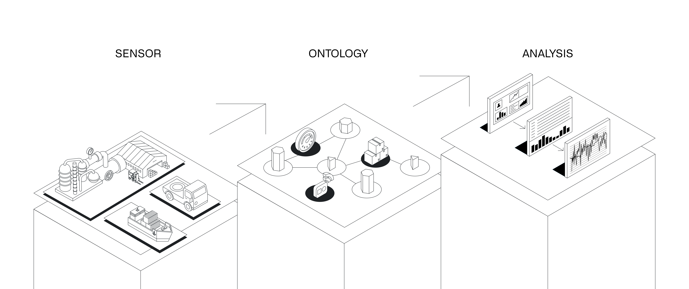
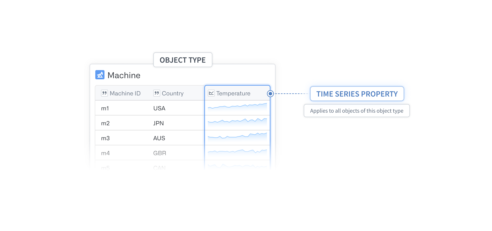
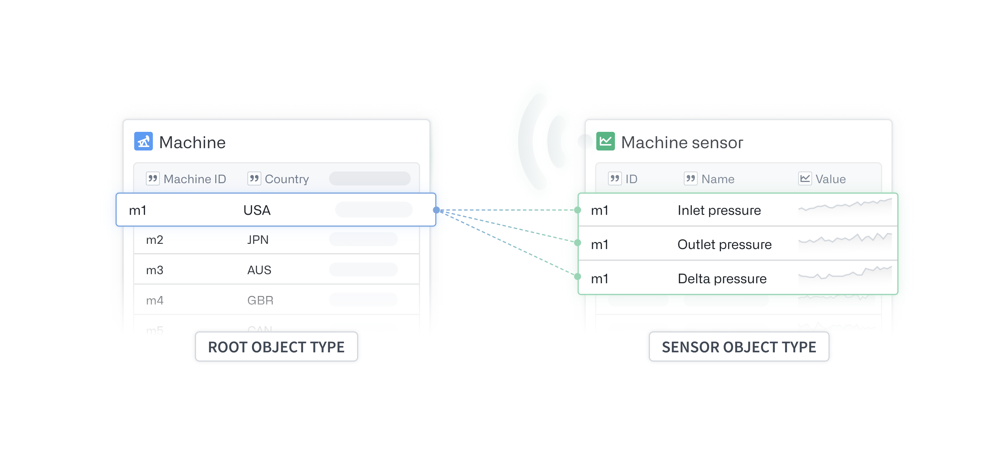
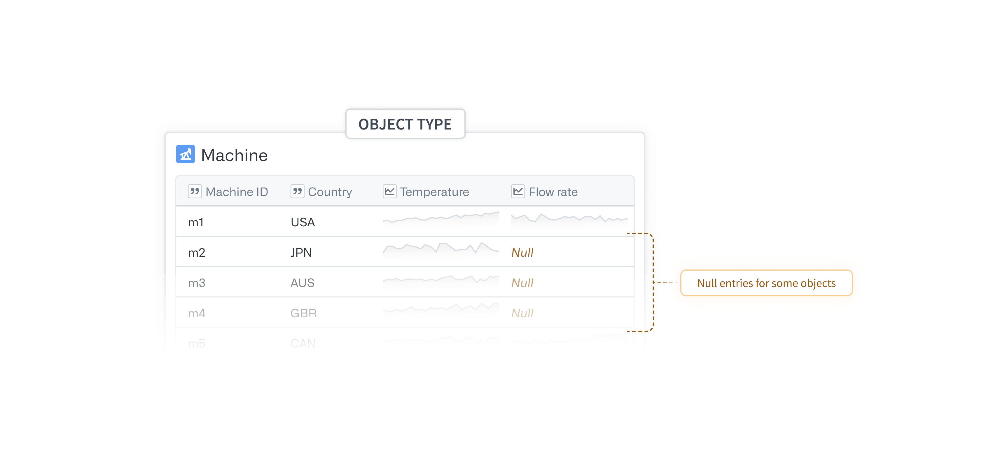
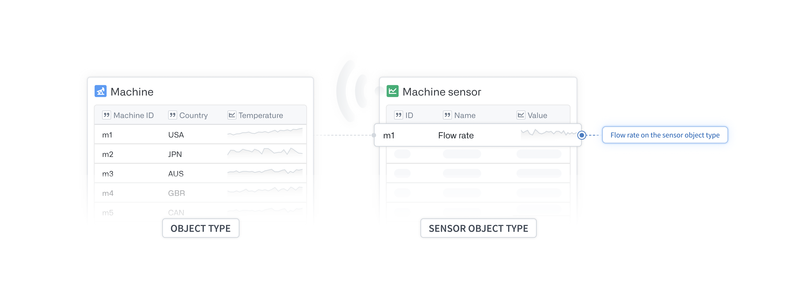

<!-- source: https://palantir.com/docs/foundry/time-series/ · mirrored 2026-08-07 from Palantir Foundry docs -->

# Time series

## What is time series data?

Time series data are a series of measurements taken over time, usually at a regular interval.

Some examples of time series data include:

* Total flights per day
* Production outputs per hour
* High frequency temperature readings at sub-second resolution

You can visualize and analyze changes that occur over time using Foundry applications like Quiver, Vertex, and Workshop. [Learn more about using time series in Foundry](/docs/foundry/time-series/time-series-usage/).

## Process overview

To use your data for time series analysis, you must set up two major components: a time series object type and a time series sync.

The [time series object type](/docs/foundry/time-series/time-series-concepts-glossary/#time-series-object-type) defines the metadata of your time series dataset and allows Foundry applications to access the underlying time series data. The [time series sync](/docs/foundry/time-series/time-series-concepts-glossary/#time-series-sync) is a resource backed by a dataset or a stream that indexes time series data and provides values for [time series properties](/docs/foundry/time-series/time-series-concepts-glossary/#time-series-property-tsp).

## Store time series in the Ontology

There are two ways to set up [time series object types](/docs/foundry/time-series/time-series-concepts-glossary/#time-series-object-type) in the Ontology. The most common method is to add a [time series property (TSP)](/docs/foundry/time-series/time-series-concepts-glossary/#time-series-property-tsp) directly to the object type. This option should be used whenever all objects of that object type have time series data for that TSP. These object types should form the basis of your analyses or operations.

Learn more about [creating a time series object type](/docs/foundry/time-series/create-or-select-ts-ot/) and [configuring TSPs](/docs/foundry/time-series/time-series-properties/).

The second, more advanced configuration option is to set up a [sensor object type](/docs/foundry/time-series/time-series-concepts-glossary/#sensor-object-type) that is linked to the root object type for which it records data. The root object type can also have other TSPs set up directly on itself, as discussed in the first option. This setup is useful when your organization has equipment with a high number of configuration options.

End-user applications throughout Foundry can fetch and display TSPs that live on an object type *or* on a linked sensor object in a unified view. If you run a search-around on an object for its linked sensor objects, you should return a set of sensors with unique sensor names. Since each sensor object is uniquely named, you can generally have a single sensor object type.

[Read more about setting up sensor object types](/docs/foundry/time-series/create-sensor-ot/).

:::callout{theme="neutral"}
In the first configuration option, you can add time series properties by adding additional **columns** to the time series object type backing dataset. In the second option, you can add more time series properties that are effectively linked to the root object type by adding additional **rows** to the time series object type backing dataset for the sensor object type.
:::

In the example below, because there are values for `Temperature` for all the machines, we should set `Temperature` as a TSP on the `Machine` object type.

Since `Flow rate` is only relevant for certain machines, we recommend placing the TSP on a sensor object type. This will help prevent numerous null entries in the [time series object type backing dataset](/docs/foundry/time-series/time-series-concepts-glossary/#time-series-object-type-backing-dataset).

### Sensor object types

Sensor object types provide flexibility to your Ontology by allowing each object of an object type to have its own set of time series data, that is, one time series per linked sensor. Some other advantages to using sensor object types include the following:

* Create a more robust [time series object type backing dataset](/docs/foundry/time-series/time-series-concepts-glossary/#time-series-object-type-backing-dataset).
* Maintain metadata, such as units or interpolation, for each specific sensor in one place.
* Link supplementary object types like alerts or annotations to the sensor object type for easier discoverability from any linked object.

For example, consider an `Equipment` object type, where each piece of `Equipment` may be either be a `Pump` or a `Reactor`. The former has a `Pressure` reading, and the latter has a `Temperature` reading. You could create separate `Pump` and `Reactor` object types, but the more generic `Equipment` object type may be a better choice. In this case, without sensor objects, `Equipment` objects would need to have two TSPs; however, only one of these would actually have time series data for a given piece of `Equipment`. As the specialization of the `Equipment` grows, you will need to manage the sensors with sensor object types to maintain legibility, that is, to not show mostly empty TSPs for each object.

When you configure a sensor object type, special metadata is applied to parts of your Ontology to indicate that this object type is a sensor and is recording data for the specified root object type. At a higher-level, frontend applications that want to load all relevant time series data for an object set perform the following actions:

* Fetch all TSPs on the object set.
* Conduct a search-around on the object set for any links with this special metadata.
* Fetch the sensor names for the linked sensor objects.

Learn more about [accessing sensor object types in Quiver](/docs/foundry/quiver/timeseries-visualize/) or [using them to create derived series](/docs/foundry/time-series/derived-series-create/).
