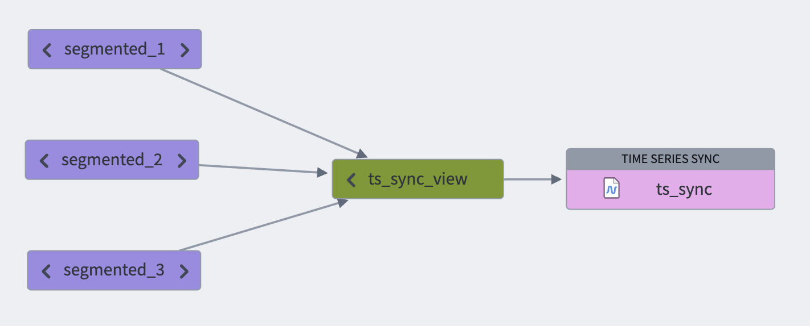
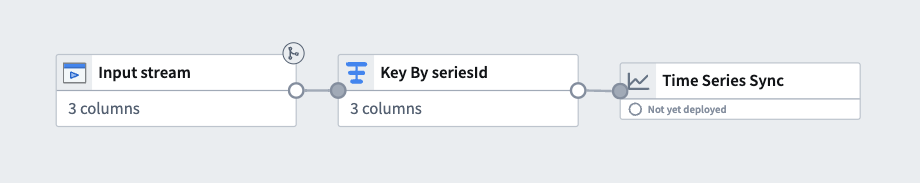
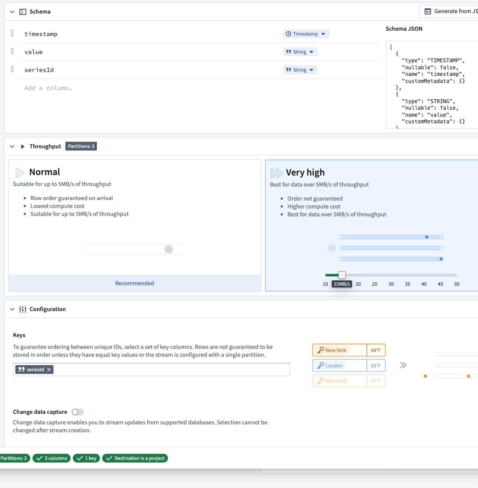
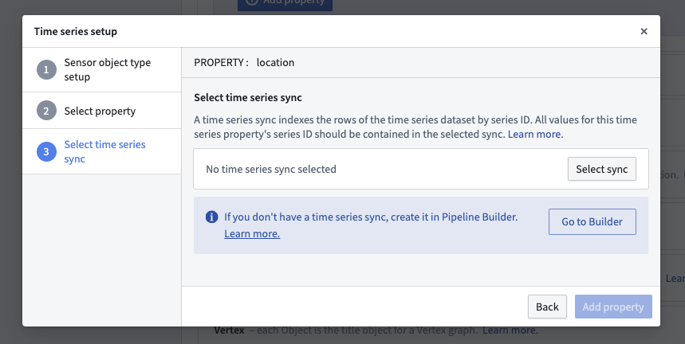

<!-- source: https://palantir.com/docs/foundry/time-series/advanced-setup/ · mirrored 2026-08-07 from Palantir Foundry docs -->

# Advanced setup

:::callout{theme="warning"}
We recommend setting up your time series pipeline using [Pipeline Builder](/docs/foundry/pipeline-builder/overview/) as explained in the [time series setup](/docs/foundry/time-series/time-series-setup/) page. Doing so will automatically apply the transform optimizations described below.

Contact your Palantir representative before proceeding with an advanced setup configuration.
:::

If you require low-level transform control or advanced functionality not yet provided by Pipeline Builder, this page describes how to manually set up your time series pipeline with [Code Repositories](/docs/foundry/code-repositories/overview/) used for data transformations.

To set up time series with Code Repositories, you must complete the following:

1. [Create and optimize the time series input data](#1-create-and-optimize-the-time-series-input-data).
2. [Set up a time series sync](#2-set-up-a-time-series-sync).
3. [Create the time series object type backing dataset](#3-create-the-time-series-object-type-backing-dataset).
4. [Set up the time series object type](#4-set-up-the-time-series-object-type).

## 1. Create and optimize the time series input data

Time series syncs can be built on top of either [datasets](/docs/foundry/data-integration/datasets/) or [streams](/docs/foundry/data-integration/streams/). This choice often depends on throughput and latency considerations. Review the [comparison of streaming and batch processes](/docs/foundry/building-pipelines/stream-vs-batch/) for a more detailed analysis.

In both cases, when you manually set up your pipeline, you must explicitly generate a time series dataset or stream that contains your formatted [time series](/docs/foundry/time-series/time-series-concepts-glossary/#time-series) data; this is required to create a time series sync. The dataset or stream must contain `Series ID`, `Value`, and `Timestamp` columns as specified in the [glossary](/docs/foundry/time-series/time-series-concepts-glossary/#time-series-sync) so that these values can be mapped in the time series sync.

### Dataset time series

Time series datasets are typically configured to build [incrementally](/docs/foundry/transforms-python/incremental-overview/) when there is live data. Incremental builds allow you to save on compute costs and achieve a much shorter latency from when raw data is ingested to when up-to-date data can be read.

:::callout{theme="neutral"}
For more information about the benefits of incremental time series builds, see the [FAQ documentation](/docs/foundry/time-series/faqs/#why-is-my-time-series-taking-a-long-time-to-load).
:::

All values for a series ID should be contained in the same dataset. Since values are fetched by their series ID, a single time series dataset can contain all values for multiple series IDs. For example:

```
+------------------------+---------------------+---------+
| series_id              | timestamp           | value   |
+------------------------+---------------------+---------+
| Machine123_temperature | 01/01/2023 12:00:00 | 100     |
| Machine123_temperature | 01/01/2023 12:01:00 | 99      |
| Machine123_temperature | 01/01/2023 12:02:00 | 101     |
| Machine463_temperature | 01/01/2023 12:00:00 | 105     |
| Machine123_pressure    | 01/01/2023 12:00:00 | 3       |
| ...                    | ...                 | ...     |
+------------------------+---------------------+---------+
```

When generating the time series dataset in code, format the dataset before writing as follows:

#### Python

```python
from transforms.api import transform, Input, Output

@transform(
    output_dataset=Output("/path/to/output/dataset"),
    input_dataset=Input("/path/to/input/dataset")
)
def my_compute_function(output_dataset, input_dataset):
    output_dataframe = (
        input_dataset
        .dataframe()
        .repartitionByRange('seriesId')
        .sortWithinPartitions('seriesId', 'timestamp')
    )

    output_dataset.write_dataframe(output_dataframe, output_format='soho')
```

#### Java

```java
package myproject.datasets;

import com.palantir.transforms.lang.java.api.Compute;
import com.palantir.transforms.lang.java.api.FoundryInput;
import com.palantir.transforms.lang.java.api.FoundryOutput;
import com.palantir.transforms.lang.java.api.Input;
import com.palantir.transforms.lang.java.api.Output;
import com.palantir.foundry.spark.api.DatasetFormatSettings;
import org.apache.spark.sql.Dataset;
import org.apache.spark.sql.Row;

import java.util.Collections;

public final class TimeSeriesWriter {
    @Compute
    public void writePartitioned(
            @Input("/path/to/input/dataset") FoundryInput inputDataset,
            @Output("/path/to/output/dataset") FoundryOutput outputDataset) {
        Dataset<Row> inputDataframe = inputDataset.asDataFrame().read();

        Dataset<Row> outputDataframe = inputDataframe
            .repartitionByRange(inputDataframe.col('seriesId'))
            .sortWithinPartitions('seriesId', 'timestamp');

        outputDataset.getDataFrameWriter(outputDataframe)
            .setFormatSettings(DatasetFormatSettings.builder()
                .format('soho')
                .build())
            .write();
    }
}
```

Running this repartition and sort will optimize your dataset for performant usage as time series. At a minimum, your dataset should also be formatted as *Soho* (as shown) for new data to be indexed to the time series database when it is [not yet projected](/docs/foundry/optimizing-pipelines/projections-advanced/#projection-builds). You should also configure the number of partitions written by [`repartitionByRange()` ↗](https://spark.apache.org/docs/latest/api/python/reference/pyspark.sql/api/pyspark.sql.DataFrame.repartitionByRange.html) to an appropriate number for your pipeline, based on the following guidance:

* Write as few partitions as possible.
* Partitions should be greater than 128 MB.
* Generally, partitions should be less than 5 billion rows.

:::callout{theme="neutral"}
The limit for the lowest number of partitions you can write is informed by writing small enough partitions that they fit on an [executor](/docs/foundry/optimizing-pipelines/spark-concepts/), but enough partitions that your job will parallelize sufficiently for the pipeline latency that you desire. Writing more partitions results in smaller partitions and faster jobs but will not be as optimal as larger partitions.
:::

#### View optimization on time series syncs

When syncing a significant volume of data, we recommend segmenting your data into smaller datasets using discrete time intervals such as hourly, daily, or weekly partitions. You can then consolidate these partitions into a unified [view](/docs/foundry/data-integration/views/) that can be synced to a time series. This approach helps ensure good performance when requesting time series data downstream in the FoundryTS library or in Quiver. The smaller datasets are ultimately consolidated into a single time series sync through the unified view.



Note that since a view contains all segmented backing datasets, it is permissible for series IDs to be distributed or staggered across backing datasets.

You can configure view optimization usage in the time series sync [advanced settings](/docs/foundry/time-series/time-series-syncs/).

Follow the steps below to configure view optimization:

1. Set up the view containing the backing series datasets.
2. Use that view as an input to the time series sync you are setting up.
3. Toggle the **Index view dataset inputs** option in the **Advanced settings** section of the time series set up dialog.

### Streaming time series

To optimize streaming time series performance, we recommend taking the following steps:

* Keying your stream using the **Series ID** column; this ensures that the platform will read from the fewest number of partitions while indexing time series data. For more information on streaming keys, see the [Streaming Keys documentation](/docs/foundry/building-pipelines/streaming-keys/).
* Setting a higher number of [partitions](/docs/foundry/data-integration/streams/#partitions), we recommend configuring at least 3 partitions for streaming time series syncs with higher throughput requirements.

:::callout{theme="warning"}
Make sure that your stream is only keyed by the **Series ID** column, and not by any other columns. This ensures optimal ordering guarantees for time series indexing.
:::

#### Streaming pipelines

We recommend setting up streaming time series syncs using [streaming pipelines](/docs/foundry/building-pipelines/streaming-overview/). You can do so by making a time series sync the output of your pipeline.

* **Key your stream using the `Series ID` column:** Create a [Key by transform](/docs/foundry/pb-functions-transform/keyByV3/) using *only* the `Series ID` column.
* **Set the number of partitions:** Customize the [streaming profile](/docs/foundry/data-integration/streaming-profiles/) under **Build settings > Advanced configuration > Number of Output Partitions**.



#### Streaming syncs

Another way to configure a streaming time series input is to [set up a streaming sync](/docs/foundry/data-connection/set-up-streaming-sync/).

* **Key your stream using the `Series ID` column:** Under **Configuration > Keys**, select the `Series ID` column.
* **Set the number of partitions:** Under **Throughput**, select **Very high** and select a value based on throughput requirements.



:::callout{theme="warning"}
If your stream has already ingested records, changing the keying or partitioning will require [resetting the stream](/docs/foundry/data-integration/reset-stream/).
:::

## 2. Set up a time series sync

If you are following the setup assistant, select **Go to Builder**.



Refer to the [create time series sync using Time Series Catalog](/docs/foundry/time-series/time-series-syncs/#create-using-time-series-catalog) documentation for more details.

Once you have created a time series sync, return to Ontology Manager and add this time series sync as a data source to the time series property. If your sync contains all of your series IDs, then you can select the same sync for the new time series properties instead of creating a new one.

Be sure to select **Save** in Ontology Manager to save your changes. If you created a new object type and this is your first time saving a change, you will need to wait until initial indexing is complete before you can analyze TSPs. Check the index status by navigating to the **Datasources** tab for the object type in Ontology Manager.

[Learn more about how you can analyze your newly configured time series data](/docs/foundry/time-series/time-series-usage/)

## 3. Create the time series object type backing dataset

You may generate the time series object type backing dataset by your preferred method, and it should conform to the schema specified [in the glossary](/docs/foundry/time-series/time-series-concepts-glossary/#time-series-object-type-backing-dataset).

To automatically generate the time series object type backing dataset, you can generate it in the same transform as your time series dataset where you can take the distinct set of series IDs and extract/map metadata from/to them. In an incremental pipeline, you can use the [merge and append](/docs/foundry/transforms-python-spark/incremental-examples/#merge-and-append) pattern to achieve this.

## 4. Set up the time series object type

Follow the [standard process](/docs/foundry/object-link-types/create-object-type/) to create an object type on your time series object type backing dataset. It is also possible to generate the object type directly from the dataset by selecting **All actions** > **Create object type** in the [dataset preview](/docs/foundry/dataset-preview/overview/). When creating the object type, configure it for time series by specifying which properties should be [time series properties](/docs/foundry/time-series/time-series-properties/).
