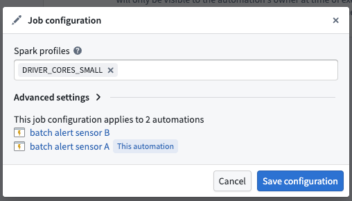
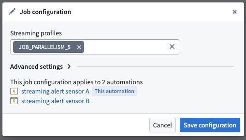
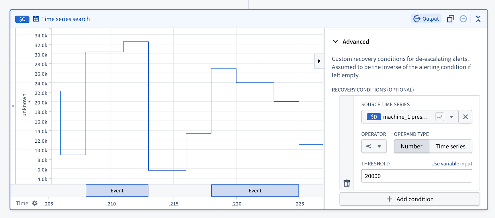

<!-- source: https://palantir.com/docs/foundry/time-series/alerting-additional-configurations/ · mirrored 2026-08-07 from Palantir Foundry docs -->

# Time series alerting: Additional configurations

This page explains the additional configuration options for time series alerting automations, including both batch and streaming alerting.

Time series alerting configurations are organized into two categories:

* **Job-level configurations:** Apply to all time series alerting automations that write to the same alert object type. Multiple automations can share the same evaluation job, and these configuration changes will affect all automations.
* **Monitor-level configurations:** Apply only to the specific automation being configured.

## Job-level configurations

Job-level configurations affect all time series alerting automations that share the same evaluation job (that is, automations that write to the same alert object type). To access job-level configuration settings, navigate to the **Overview** page of your saved automation and select **View Configuration** in the **Time series evaluation status** section. This opens the **Job Configuration** dialog where you can adjust various settings.

### Batch job configuration

#### Spark profiles

Batch alerting jobs run as Spark jobs. You can modify the [Spark profiles](/docs/foundry/optimizing-pipelines/spark-profiles-reference/) by entering the profile name(s) in the **Spark profiles** field.

#### Fail job on any failure

If toggled on, the entire job will fail if any of the automations fail. This can be used to ensure that the job does not proceed if any of the automations fail. We recommend toggling this off so that the job can continue to make progress, even if some automations encounter issues. For more information on monitoring your automation's health and performance, review our documentation on [monitoring and observability](/docs/foundry/time-series/alerting-overview/#monitoring-and-observability).

#### Default lookback window

The default lookback window defines how far back the automation will search when incrementally running your search. We recommend setting this window to be the maximum of any time windows you define in the underlying series of the search (for example, the time window of a rolling aggregate series). Keep in mind that increasing the default lookback window may result in longer latencies when evaluating alerts, as more historical data needs to be processed. If your default lookback window is too large, Foundry will only "look back" 50 [transactions](/docs/foundry/data-integration/datasets/#transactions).

#### First job run read limit

This sets the maximum number of [transactions](/docs/foundry/data-integration/datasets/#transactions) to read from each input the first time the output dataset is built. This is a temporary override that will only apply to the first job run and will not be respected in subsequent runs.

#### Job timeout in hours

The maximum time in hours the job is allowed to run. If not provided, the default value of 1 hour will be used.

### Streaming job configuration

#### Streaming profiles

Streaming alerting jobs run as Flink jobs. You can modify the [Flink profiles](/docs/foundry/data-integration/streaming-profiles/) to adjust resource allocation and performance settings for your streaming alerting job.

#### Fail job on any failure

If toggled on, the entire job will fail if any of the automations fail. This can be used to ensure that the job does not proceed if any of the automations fail. We recommend toggling this off so that the job can continue to make progress, even if some automations encounter issues. For more information on monitoring your automation's health and performance, review our documentation on [monitoring and observability](/docs/foundry/time-series/alerting-overview/#monitoring-and-observability).

#### Ontology polling interval override

Streaming alerting jobs regularly poll the ontology for updates to entities referenced in automation logic. The polling frequency affects both cost and responsiveness to ontology updates. A longer polling interval reduces cost but increases the time before ontology updates are reflected in alerting logic. In particular, linked series aggregations and linked object property parameters may perform more expensive ontology queries.

#### Allowed lateness override

To ensure alerts remain consistent once they trigger, streaming alerting processes time series data in timestamp order and drops out-of-order points that are too far in the past or future. The **Allowed lateness override** setting defines the time interval in which points are buffered and submitted for logic evaluation. Out-of-order points with event times that fall outside this window will be dropped.

The value entered in this setting (in seconds) dictates the minimum latency of alerts, since logic is evaluated only when buffered points are submitted. A larger allowed lateness window increases buffering time and alert latency, while a smaller window reduces latency but may drop more legitimate late-arriving points. Note that having multiple time series inputs and multiple partitions may contribute to disorder as these are ingested in parallel. The default allowed lateness value is 5 seconds.

#### Excluded time series syncs

By default, all streaming time series syncs associated with the root object type are discovered and become inputs to the streaming alerting job. The **Excluded time series syncs** configuration allows you to remove time series syncs that are not used by your alerting logic evaluation, which may help improve job performance.

:::callout{theme="warning"}
Avoid frequently changing this configuration. Excluding or adding back a time series sync requires a job restart to take effect, which causes several minutes of downtime for all monitors associated with the job.
:::

## Monitor-level configurations

Monitor-level configurations apply only to the specific time series alerting automation being configured and do not affect other automations.

### Streaming monitor configuration

#### Custom recovery condition

By default, alert events recover when the alerting condition is no longer met. The **custom recovery condition** feature allows you to define asymmetrical alerting and recovery conditions, providing more control over when alerts are resolved. For example, a common use case is to reduce the noise from flapping alerts that rapidly trigger and recover when values fluctuate around a threshold.

