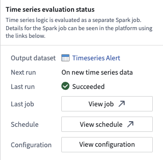
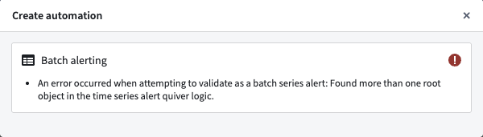

<!-- source: https://palantir.com/docs/foundry/time-series/alerting-common-questions/ · mirrored 2026-08-07 from Palantir Foundry docs -->

# FAQ

## Does the automation check the entire time series every time, or only new data?

As mentioned on the [overview page](/docs/foundry/time-series/alerting-overview/), your automation maps to an evaluation job. The first time this job runs, it will attempt to check the entire time series for alerts. From then on, it will only check for alerts on new data. This means that if you add an automation to an existing job, historical data will not be processed. In other words, expanding the scope on an existing automation or creating a new automation that writes to an existing alerting object type will only generate alerts on time series data that comes in after you make this change.

## Is there a way to force an automation to check the entire time series if the job it maps to has already run?

This is not currently possible. Contact Palantir Support for assistance if your use case requires running an automation that maps to an existing job on historical data.

## How often will my automation run?

As mentioned on the [overview page](/docs/foundry/time-series/alerting-overview/), your automation maps to an evaluation job. The job execution frequency depends on the alerting type you selected:

* **Batch alerting:** By default, the job runs whenever there is new data in the datasets backing the time series used in your alerting logic. However, you can put your automation on a time-based [schedule](/docs/foundry/data-integration/schedules/) if you prefer.
* **Streaming alerting:** The job runs continuously and evaluates logic as soon as new data points arrive in the streams backing your time series. This provides low-latency alerting with results typically available within seconds of data ingestion.

## What is the difference between time series alerting automations and [time series Foundry Rules](/docs/foundry/foundry-rules/timeseries-concepts/)?

We expect the runtime and cost of the evaluation of these automations to be lower than Foundry Rules for the majority of workflows because we compute incrementally as the time series data updates. Foundry Rules runs against the full time series every time.

## Which Quiver cards are supported in time series alerting logic?

The following [Quiver cards](/docs/foundry/quiver/cards-index-time-series/) are supported in time series alerting logic:

* Time series search
* Object time series property
* Filter time series
* Derivative
* Sample
* Segment statistics (not supported for streaming time series alerts)
* Time series formula
* Combine time series
* Periodic aggregate
* Rolling aggregate
* Relative time series
* Bollinger bands
* Time series bounds
* Shift time series
* Shift date/time
* Linked series aggregation
* Numeric parameter
* String parameter
* Date/time parameter
* Date/time range parameter
* Duration unit parameter
* Boolean parameter
* Linked object property parameter

## Why did I receive an error about needing a single root object type?

If you receive an error for not having a single root object type, you likely used two different objects for comparison. For example, you may have pulled the `Inlet pressure` property on `Machine 1` and compared it with the `Outlet pressure` from `Machine 2` instead of comparing two properties on the `Machine 1` root object type. To create a time series alerting automation, you will need to start from a *single* root object instance.

Review the [requirements for setting up a time series alerting automation](/docs/foundry/time-series/alerting-overview/#requirements) to learn why time series alerting automations must be generated from the perspective of a root object.

## Can I apply the same time series alerting template to different objects?

Yes. The logic and conditions are templatized so results can be identified from the perspective of any object with the same object type. By default, the alerting logic will be applied to all objects within the starting root object type. Learn more about applying a filter to [limit the scope of your automation](/docs/foundry/time-series/alerting-setup/#7-modify-the-automation-scope-optional).

## Can I use time series backed by streams?

Yes. However, the automations will not run directly on top of the streaming data but rather on top of the [archive dataset](/docs/foundry/building-pipelines/streaming-compute-usage/). This incurs at least 10 extra minutes of latency since archive jobs run every 10 minutes.

:::callout{theme="neutral"}
[Streaming alerting](/docs/foundry/time-series/alerting-overview/#streaming-alerting) allows for time series alerts to be run directly on streams, providing low-latency alerting with end-to-end latency on the order of seconds.
:::

## What happens to an alert that is ongoing when the logic runs?

An alert that is ongoing will be generated in the output object type. You can tell that it is ongoing by the fact that its end timestamp is empty.

## What happens to historical alerts when the logic changes?

Historical alerts will not be recomputed. After the logic change happens, new events will be identified using the new logic.

## What happens to ongoing alerts when the logic changes?

If the new alert logic for a given root object indicates that that object is in a normal state, the alert will be resolved. If the new alert logic indicates that that object is in an alerting state, the alert will remain open.

## Can I modify the configuration of my evaluation job?

For detailed steps on configuring your evaluation job, [review our guide](/docs/foundry/time-series/alerting-additional-configurations/). Note that job configuration changes apply to all time series alerting automations that write to the same alert object type, as multiple automations can share the same evaluation job.

## Why is my streaming alerting job not emitting events?

Streaming alerting may encounter issues due to data quality, job configuration, or upstream ingestion problems. Below are common issues and how to address them:

### Out-of-order points

To ensure alerts remain consistent once they trigger, streaming alerting drops out-of-order points that are too far in the past or future. Verify that your input data is ingested in monotonically increasing timestamp order. You can configure the tolerance for late-arriving data using the [**Allowed lateness override** setting](/docs/foundry/time-series/alerting-additional-configurations/#allowed-lateness-override).

### Duplicate timestamps

Points within the same time window that have duplicate timestamps resolve in a non-deterministic manner. This may account for discrepancies when compared with an equivalent Quiver analysis of the same logic.

### Upstream ingestion issues

Streaming alerting performance depends on healthy upstream data ingestion. Use [stream monitoring](/docs/foundry/data-integration/stream-monitoring/) to verify that the streams ingesting your source data are healthy and processing data without issues.

### Monitoring job health and evaluation status

If your streaming alerting job is not running or is failing to evaluate, you will not receive alert events. For more information on monitoring your automation's health and performance, review our documentation on [monitoring and observability](/docs/foundry/time-series/alerting-overview/#monitoring-and-observability).

## How can I reduce costs for streaming alerting jobs?

**Reduce Ontology polling:**
Review the [Ontology polling configuration](/docs/foundry/time-series/alerting-additional-configurations/#ontology-polling-interval-override) section in the additional configurations guide.

**Narrow the object set scope:**
Limit your automation object set scope to the minimum set of objects necessary for monitoring. A smaller object set reduces computational overhead and associated costs. Review the section on [modifying the automation scope](/docs/foundry/time-series/alerting-setup/#7-modify-the-automation-scope-optional) for guidance on filtering your object set.
