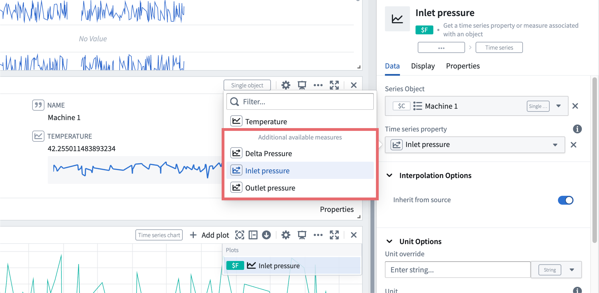
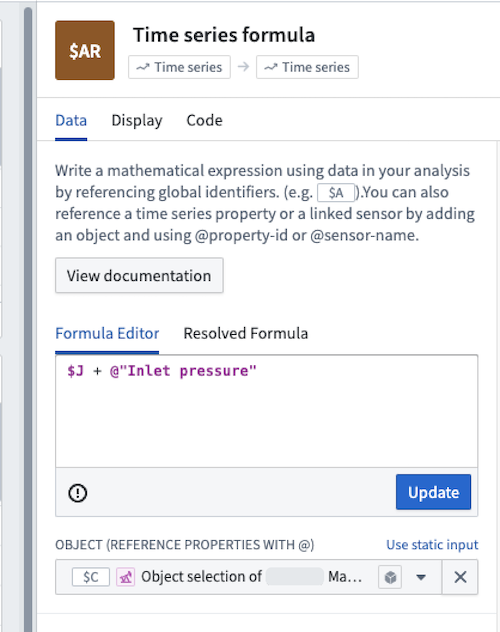

<!-- source: https://palantir.com/docs/foundry/time-series/alerting-overview/ · mirrored 2026-08-07 from Palantir Foundry docs -->

# Time series alerting

Time series alerting is a way to generate alerts, or "events", when time series data meets user-specified criteria. You can identify periods of interest within the time series data using Quiver's [time series search](/docs/foundry/quiver/card-time-series-search/) card. The logic behind this time series search is saved and replicated across objects of the same type using [Automate](/docs/foundry/automate/overview/). When the automation runs, any newly identified time intervals are output as objects in an alerting object type.

The alerting object type can store alert data from one or many configured automations, though it relates to exactly one evaluation job. Therefore, one job can relate to many automations. A job is a Spark or Flink job and can be viewed in the [Builds application](/docs/foundry/data-integration/application-reference/#builds). Specifically, the job outputs a dataset or stream that backs the alerting object type, where each row is an alert update.

## Alerting types

The platform supports alerting for both [batch](#batch-alerting) and [streaming](#streaming-alerting) time series.

### Batch alerting

Batch alerting runs a [Spark](/docs/foundry/optimizing-pipelines/spark-concepts/#spark-concepts) job which incrementally reads and computes time series logic based on the configured rules to generate alerts.
New alerts are only generated when new time series data arrives in the form of a dataset transaction. This means the end-to-end latency of receiving an alert is equivalent to the latency of data ingestion into the Foundry platform plus the job runtime.
Batch alerting supports reading from both datasets and streams.
In the case of streams however, data is read from the [archive](/docs/foundry/data-integration/streams/#cold-buffer) which adds an additional 10 minutes of latency.

:::callout{theme="warning"}
Batch alerting attempts to incrementally read the tail of data to reduce computation costs and reduce latency. However this can lead
to discrepancies with results from Quiver for certain interpolation settings or stateful operations. As a general rule, the less stateful your rules, the fewer discrepancies you will encounter.
:::

### Streaming alerting

Streaming alerting runs a [Flink](/docs/foundry/data-integration/flink-streaming/#flink-fundamentals) job which incrementally reads and computes time series logic based on the configured rules to generate alerts.
This computation happens pointwise as new points for relevant time series comes in. This means the end-to-end latency of a streaming alert should be on the order of seconds after ingesting into the Foundry platform.

:::callout{theme="warning"}
Streaming alerting only supports streaming inputs. If there are non-stream-backed time series syncs in your logic, the streaming alerting job will fail to resolve those alerts.
:::

:::callout{theme="neutral"}
Streaming alerts on stateful logic may require a "warm-up" period. For example, a 12-hour rolling aggregate will require ~12 hours of points before emitting results.
:::

## Monitoring and observability

You can monitor the health and performance of your time series alerting automations through the Automate application. To ensure your streaming alerting automation is running successfully, check both the evaluation job status and the automation execution history:

* **Check job status:** Navigate to the **Time series evaluation status** section on your automation's overview page. Verify that the job is running and healthy with no errors or warnings.

* **Review evaluation history:** Navigate to your automation in the [Automate application](/docs/foundry/automate/overview/) and select the **History** tab. The **History** tab displays recent evaluation runs, timestamps, and status indicators showing whether evaluations succeeded or failed. If evaluations are failing, review the detailed error messages to identify the root cause.

## Requirements

The sections below explain the requirements you must follow while creating time series alerts:

### Time series object types

A time series ontology is a prerequisite for creating time series alerts. Time series alerts are created against and stored on *time series object types*, either **time series properties on root object types** or **sensor objects**. Review the [time series Ontology documentation](/docs/foundry/time-series/time-series-overview/#store-time-series-in-the-ontology) for more information.

### Logic requirements

Time series alerting logic management is powered by Quiver. Most Quiver time series operations are supported in time series alerting; review the full list of [supported operations](/docs/foundry/time-series/alerting-common-questions/#which-quiver-cards-are-supported-in-time-series-alerting-logic) for time series alerting logic.

Time series alerts can be authored through both Quiver and Automate, but edited only in Automate. We recommend doing initial exploratory analysis through Quiver to figure out what alerting rules to write, and any further management through the Automate app. Alternatively, if you already know which rules you want, you can use Automate to write simple rules with a streamlined interface.

Time series alerting logic must contain a single *root object*. Time series properties on the root object and sensor objects linked to the root object can be used in the logic. For more information about the difference between root and sensor object types, review the [time series object types](/docs/foundry/time-series/time-series-overview/#store-time-series-in-the-ontology) documentation.

For example, the **Object time series property card** in Quiver allows the selection of time series properties on the current object type as well as time series data on its sensor object types:

Aside from time series properties, property references are only templated if they are directly referenced in a **Time series formula** card using the `@` symbol:

### Automation

Time series alerting is integrated directly into Automate. Time series alerts output to an `Alert` object type on which you can optionally configure effects, which can be [actions](/docs/foundry/automate/effect-actions/) or [notifications](/docs/foundry/automate/effect-notification/). Effects can be omitted if further pipelining on the generated alerts is more desirable.
For more information on Automate-specific configurations, see the [documentation on getting started with Automate](/docs/foundry/automate/getting-started/).

### Permission requirements

To create a time series alerting automation, you need [object type edit permissions](/docs/foundry/object-permissioning/ontology-permissions-legacy/#create-new-resources-with-ontology-roles) on the object type to which you are binding the alert. To view an existing automation, you need view permissions on that same object type.

## Considerations

Time series alerting automations are intended to be used to monitor healthy data for anomalous events. Time series alerting automations are *not* designed to check whether data pipelines meet expectations in terms of volume, quality, and so on. For these cases, we recommend using [Data Health](/docs/foundry/health-checks/overview/) or [stream monitoring](/docs/foundry/data-integration/stream-monitoring/#time-series).
