<!-- source: https://palantir.com/docs/foundry/time-series/alerting-setup/ · mirrored 2026-08-07 from Palantir Foundry docs -->

# Set up time series alerting

This page will walk you through creating a time series alerting automation that identifies time periods when the pressure loss for machines on a hypothetical `Machine` root object type is above 120 kPa.

## 1. Create a new time series condition in Automate

In the [Automate application](/docs/foundry/automate/overview/), create a new automation and add a `Time series` condition to the automation.

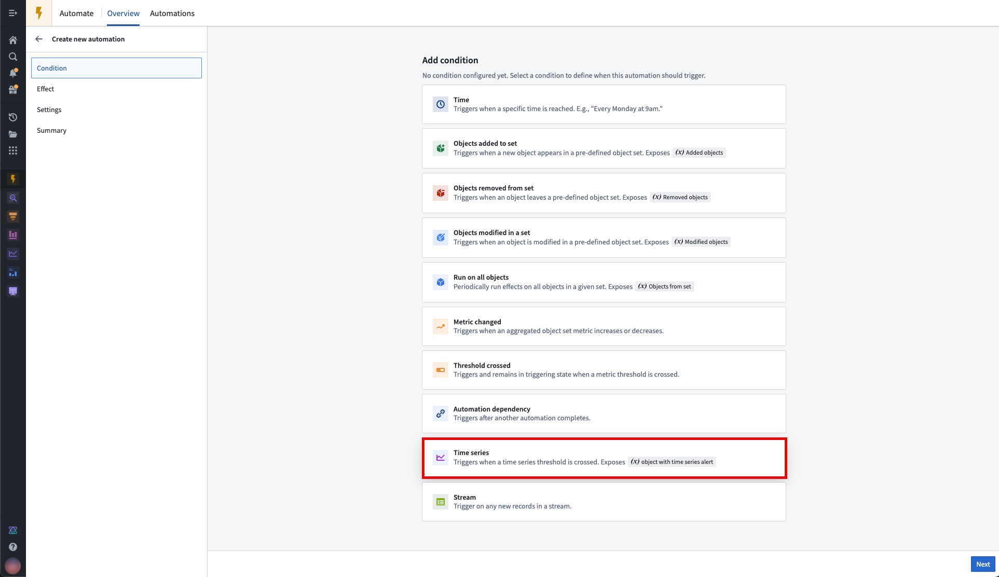

From the time series condition overview page, define the time series logic and scope of the automation by selecting **Create logic**.

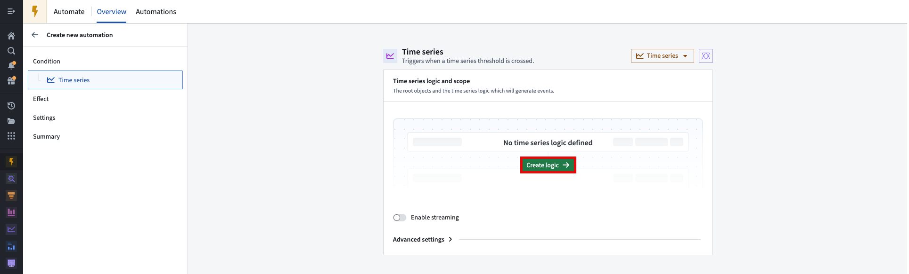

### Select time series alert output type

When setting up a time series alert, you can choose the alert output type to control the latency of alerting:

* **Batch alerting:** Inputs and outputs are updated on each deploy of inputs. Use this to create alerts that are sent out periodically.
* **Streaming alerting:** Inputs and outputs are updated continuously as new data is made available. Use this to create alerts that are sent out with low latency.

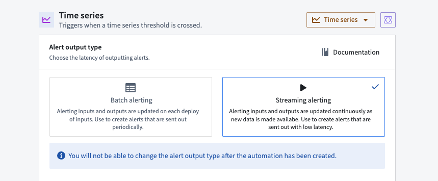

:::callout{theme="warning"}
You will not be able to change the alert output type after the automation has been created.
:::

## 2. Select time series alert object type

Now, you need to choose an object type where new events will be added as objects. From the edit view of the time series condition page, navigate to the **Select time series alert object type** section. If you do not already have an object type that supports time series alerting automations, choose to **Create new object type**. You must have permissions to perform [Marketplace](/docs/foundry/marketplace/overview/) installations and create object types with backing datasets to create new object types. Additionally, your object type and the time series alerting automation must be stored in the same Project.

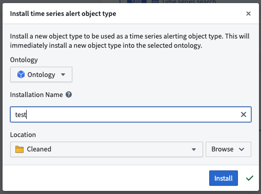

If you create a new object type, you must wait for it to fully index into the Ontology before you can proceed with setting up your automation. We recommend waiting up to ten minutes.

An existing object type can be used if it has properties with the following type classes:

* `timeseries:alert_event_id`
* `timeseries:automation_rid`
* `timeseries:automation_version`
* `timeseries:root_object_pk`
* `timeseries:root_object_type_api_name`
* `timeseries:start_time`
* `timeseries:end_time`
* `timeseries:generation_time`
* `timeseries:event_start_cause` (streaming only)
* `timeseries:event_end_cause` (streaming only)
* `timeseries:template_rid` (streaming only)
* `timeseries:template_version` (streaming only)

## 3. Select a root object type

Upon opening the time series logic editor, you will be prompted to select the relevant object type from which to create alerts. In this example, we will select the `Machine` object type. Select **Get started** to continue.

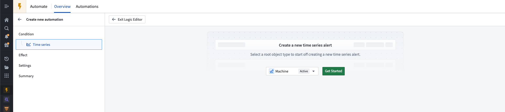

A skeleton time series logic path will then be populated, including a starting card of the path (**Object time series property** card), and the required output card (**Time series search** card). A default object of the given object type will be set at the top of the path. You can change this object to another object of the given object type. In this example, we are previewing the `Machine 1` object.

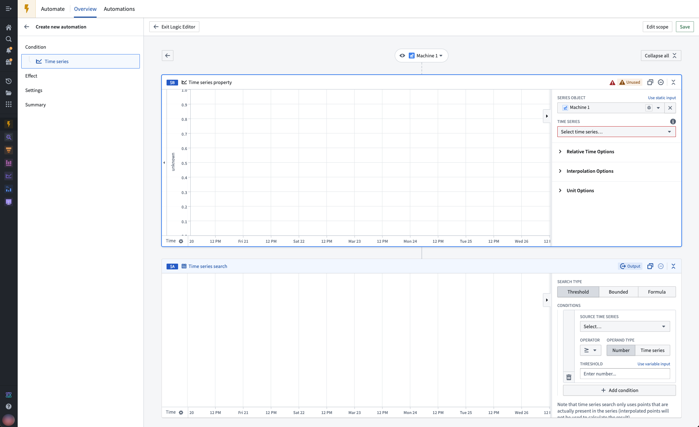

:::callout{theme="neutral"}
The preview object is only used as an example to visualize the time series transformations in the logic editor, and does not affect which objects the time series alert will evaluate on.
:::

## 4. Select time series properties as inputs

In our example below, the `Machine` object type has two time series properties (TSPs): `Inlet pressure` and `Outlet pressure`. Add your desired TSPs to the logic path with the **Object time series property** card. These TSPs will become the inputs to our calculations in the next step.

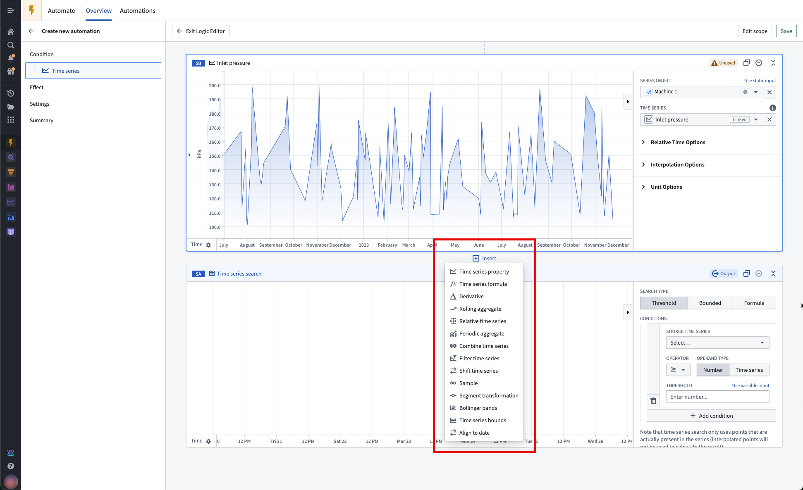

:::callout{theme="neutral"}
You can add new cards to the logic path by hovering between two cards, selecting **Insert**, and choosing the card you would like to add.
:::

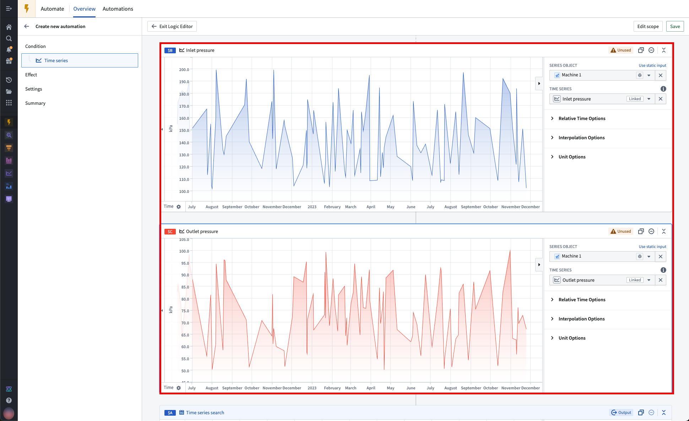

:::callout{theme="neutral"}
Both raw and derived series can be used as inputs to time series alerting automations.
:::

## 5. Apply time series transforms (optional)

A wide range of [Quiver](/docs/foundry/quiver/overview/) time series transforms are supported, such as derivatives and rolling averages. See the full list of [supported operations](/docs/foundry/time-series/alerting-common-questions/#which-quiver-cards-are-supported-in-time-series-alerting-logic).

In our example, we will use a **Time series formula** card to add a transformation that calculates the difference between the inlet and outlet pressure of the `Machine 1` object.

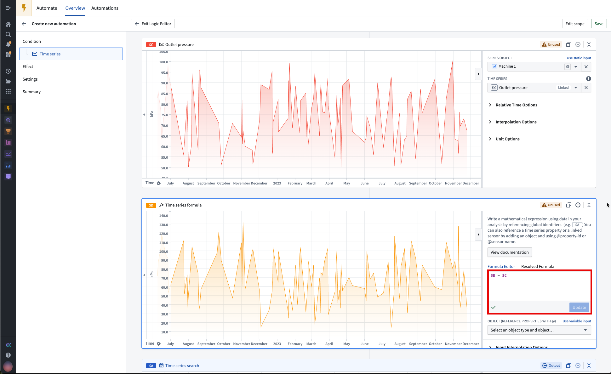

## 6. Apply a time series search

Connect your final transform to the output [**Time series search** card](/docs/foundry/quiver/card-time-series-search/) in the path to identify periods of interest in a time series. In our example, we will identify periods when the change in pressure was greater than 120 kPa.

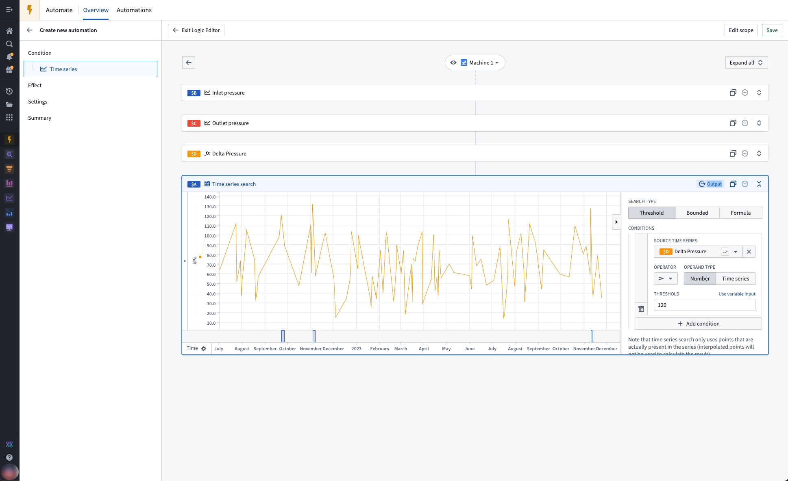

:::callout{theme="neutral"}
Currently, time series alerting automations only support basic time series searches. Automations **cannot be saved** if any of the following configurations are used:

* The **Multi** time series search formula type
* Multiple conditions (use `&&` or `||` in one condition instead)

The following configurations will be **ignored** in automations:

* The **Defined** search time range
* Maximum durations
* Minimum durations for batch alerting. However, minimum durations *are* supported in streaming alerting.
:::

## 7. Modify the automation scope (optional)

By default, the time series search logic will be applied to all objects in the selected root object type. In our example, the pressure drop of 10 machines will be analyzed. You can preview the logic on a different root object by selecting the dropdown menu at the top of the logic tree.

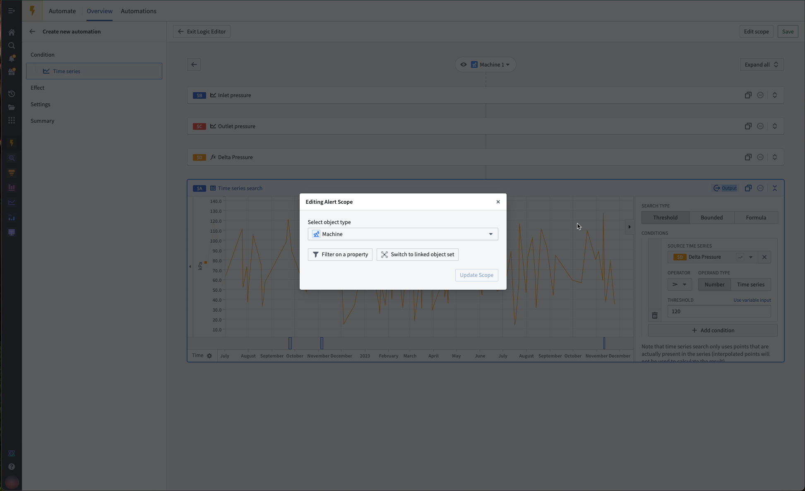

To limit the scope of your automation, select **Edit scope**. Remember to also select **Update Scope** after adding your filter.

## 8. Save the time series search logic as an automation

For additional configuration options, review our [additional time series alerting configurations documentation](/docs/foundry/time-series/alerting-additional-configurations/#default-lookback-window).

Select **Save** in the upper right of the path. You will then be redirected back to the main time series condition page and shown the summary of the time series logic and scope you just defined.

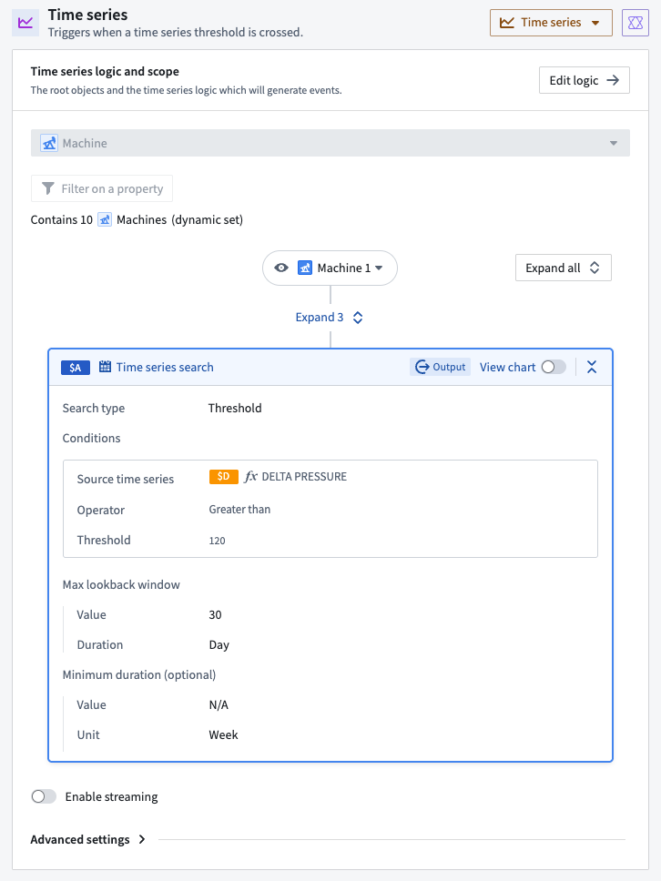

## 9. Modify evaluation frequency as desired

As mentioned in the [overview documentation](/docs/foundry/time-series/alerting-overview/), the time series alert object type can store alerts from one or many automations. This object type relates to exactly one evaluation job. Therefore, one job can relate to many automations. A job is a Spark (batch alerting) or Flink (streaming alerting) job and can be viewed in the [Builds application](/docs/foundry/data-integration/application-reference/#builds). Specifically, the job outputs a dataset or stream which backs the alert object type, where each row is an alert.

The job execution behavior depends on the alerting type you selected:

* **Batch alerting:** By default, the job runs whenever there is new data in the datasets backing the time series used in your alerting logic. However, after you save your automation, you can put the evaluation job on a time-based [schedule](/docs/foundry/data-integration/schedules/) if you prefer.
* **Streaming alerting:** The job runs continuously on a schedule to process streaming data as it arrives, providing low-latency alerting.

The evaluation frequency mentioned at this stage in the automation setup is **not** the same as the evaluation job schedule. The evaluation frequency defines how often the automation will trigger any included [effects](/docs/foundry/automate/effect-actions/). As effects are optional, it is possible that this evaluation frequency will have no effect on your automation.

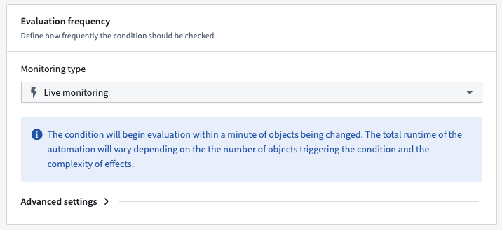

## 10. Modify remaining fields as desired

The automation can be saved without any [effects](/docs/foundry/automate/effect-actions/) or [custom settings](/docs/foundry/automate/automation-administrators/). Modify any of the remaining configuration sections as desired and select **Next** until you reach the **Summary** page.

## 11. Create your automation

Name your automation and select a save location. Your automation must be saved in the same Project as your selected alerting object type. Fix any issues highlighted in the **Security settings** section. Finally, choose **Create automation**.
