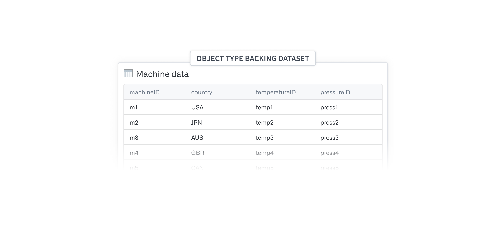
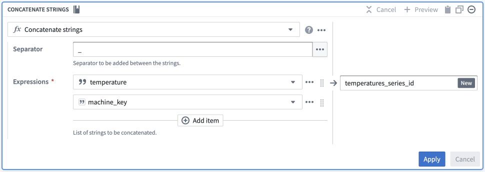
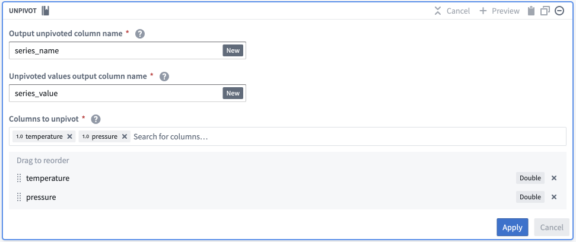
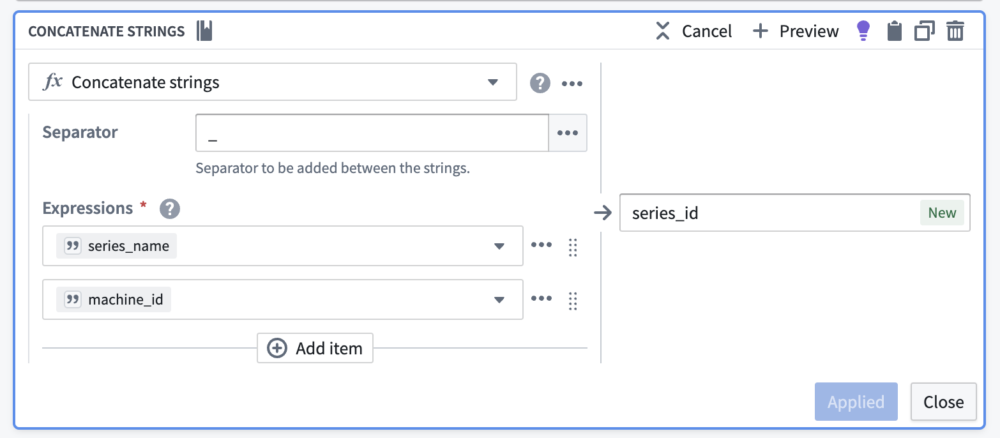
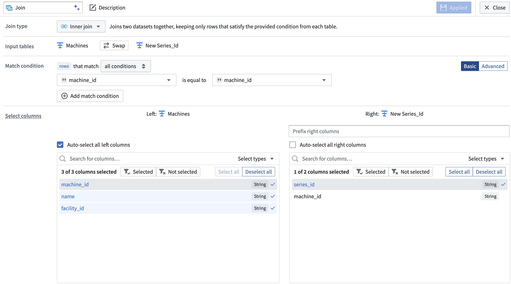
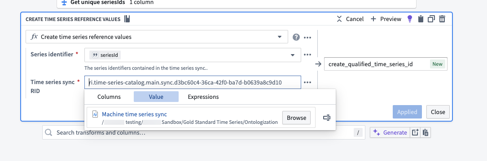
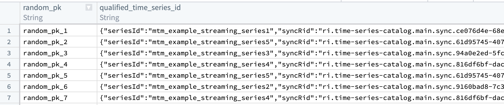

<!-- source: https://palantir.com/docs/foundry/time-series/create-or-select-ts-ot/ · mirrored 2026-08-07 from Palantir Foundry docs -->

# Create or select a time series object type

To add [time series properties](/docs/foundry/time-series/time-series-concepts-glossary/#time-series-property-tsp) to an existing object type, follow the **Choose existing object type** path in the setup assistant. Proceed to the section on how to [set up time series properties](/docs/foundry/time-series/time-series-properties/#time-series-property-setup) for next steps.

To create a new object type, you must first have a [time series object type backing dataset](/docs/foundry/time-series/time-series-concepts-glossary/). If you do not already have a dataset matching this desired schema, then you will need to create one in [Pipeline Builder](/docs/foundry/pipeline-builder/overview/).

While it is possible to create a new object type as an [ontology output in Pipeline Builder](/docs/foundry/pipeline-builder/outputs-add-ontology-output/), we recommend creating the time series object type backing dataset in Pipeline Builder and then following the setup assistant to create the new object type. Follow the steps below to prepare the dataset in Pipeline Builder.

## Prepare time series object type backing dataset

Before creating a new time series object type, you must first have a time series object type backing dataset. The following instructions describe how to create a time series object type backing dataset in Pipeline Builder.

1. First, focus on creating a dataset where each row represents a single object for the new object type. This dataset needs a primary key column that can be used to uniquely identify an object and a column for each non-time-series [property](/docs/foundry/ontology/core-concepts/#property) on an object.
2. Next, allow this object type backing dataset to support time series by adding a [series ID](/docs/foundry/time-series/time-series-concepts-glossary/#series-id) for each [time series property](/docs/foundry/time-series/time-series-concepts-glossary/#time-series-property-tsp). You will likely add this through one of the following transformations in Pipeline Builder, depending on the shape of your data:

* [Your time series data for different measurement/sensor types are stored in different datasets and you want to manually create new series ID columns.](#multiple-datasets-manual-creation-of-new-series-id-columns)
* [You have a single dataset for all measurements and/or a large number of series.](#single-dataset-or-large-number-of-series)
* [You have multiple datasets for a single measurement/sensor type.](#multiple-datasets-for-a-single-measurement-type)

### Multiple datasets (manual creation of new series ID columns)

Start with the dataset containing information about the objects (for example, the Machine information in the image below):

1. Add a `Concatenate strings` transformation in [Pipeline Builder](/docs/foundry/pipeline-builder/transforms-transform-data/).
   1. Pick a common separator, such as an underscore (`_`).
   2. Configure your expressions:
      1. Enter a **Value** type input, and set this value to be the name of your series (for example, `temperature`).
      2. Enter a **Column** type input, and set this to be your primary/object key.
2. Name this new column to easily identify it as the series ID for this specific series (for example, `temperature` or `temperature_series_id`).   
      

### Single dataset or large number of series

Avoid manually creating each new series ID column by creating a dataset that has each series name as a column name via a join. Once you have this single dataset, follow these instructions:

1. Add an `Unpivot` transformation.
   1. Set **Output unpivoted column name** as `series_name`.
   2. Set **Unpivoted values output column name** as `series_value`.
   3. In the **Columns to unpivot** field, pick all columns with a series name.   
         

2. Add a `concatenate strings` transformation to generate the series ID.
   1. Pick a common separator, such as an underscore (`_`).
   2. Configure your expressions:
      1. Enter `series_name` as the first input.
      2. Enter the object key as the second input (`machine_id` in the screenshot below).

3. Name this new output `series_id`.   
      

4. Join the series ID columns back to your object type backing dataset on the object key (`machine_id` in the screenshot below). The backing dataset of your new time series object type now has the `series_id` you created in addition to other object type metadata.   
      

### Multiple datasets for a single measurement type

:::callout{theme="warning"}
Your object type must be in [Object Storage v2](/docs/foundry/object-backend/overview/#object-storage-v2-architecture) to back a time series property with multiple time series syncs.
:::

Since sensor data is often powered by multiple data sources, it can be challenging to normalize and transform all sensor data within one dataset. Sometimes, it is not possible to do this because some sensors hold categorical data and others contain numerical data; different data types cannot exist within one [time series sync](/docs/foundry/time-series/time-series-concepts-glossary/#time-series-sync). To avoid the need to transform and unify all sensor data into one time series dataset, you can link a [time series property](/docs/foundry/time-series/time-series-concepts-glossary/#time-series-property-tsp) to multiple time series syncs. To do this, you must have a column of [qualified series IDs](/docs/foundry/time-series/time-series-concepts-glossary/#qualified-series-id) on your object type backing dataset. Create a qualified series ID by following the steps below. Note that you will need to [create your time series sync](/docs/foundry/time-series/time-series-syncs/) before following these steps.

1. Add the backing data for each of the time series syncs that back your time series property to your pipeline by selecting **Add data** in Pipeline Builder.

2. For each of your time series sync datasets, select only the series ID column and deduplicate the resulting single-column dataset.

3. Add a `Create time series reference values` transformation. Use the series ID column as the **Series identifier** and select the appropriate time series sync as the **Time series sync RID**. Name the new column `qualified_time_series_id` or similar.   
      

4. [Join](/docs/foundry/pipeline-builder/transforms-join-data/) the qualified series ID column back to your object type backing dataset. This step requires that the series IDs in your object type backing dataset are unique.

The resulting dataset should look like the example below.  The `seriesId` corresponds to the series identifier in the sync dataset, and the `syncRid` corresponds to the RID of the sync that stores that series.

## Create a new time series object type

Once you have prepared your time series object type backing dataset, follow the path in the setup assistant to **Create a new object type**. This path will redirect you to the [Ontology Manager object creation setup assistant](/docs/foundry/object-link-types/create-object-type/) where you will select the new dataset as your backing datasource. Upon completion of the assistant dialog, you will be ready to [set up time series properties](/docs/foundry/time-series/time-series-properties/#time-series-property-setup).

:::callout{theme="warning"}
If you launch the object creation setup assistant directly from the Ontology Manager home page (that is, not from the time series setup assistant), the assistant will not redirect you to the new object type’s **Capabilities** tab upon completion.
:::
