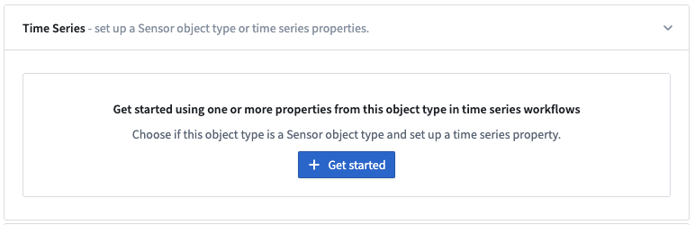
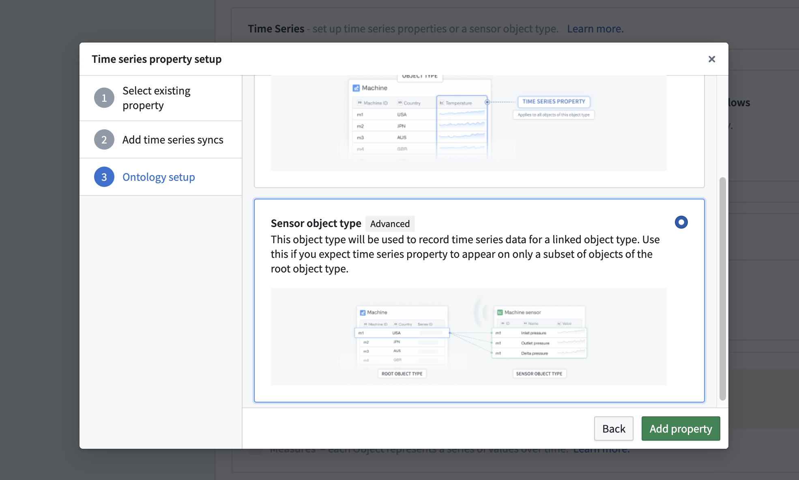
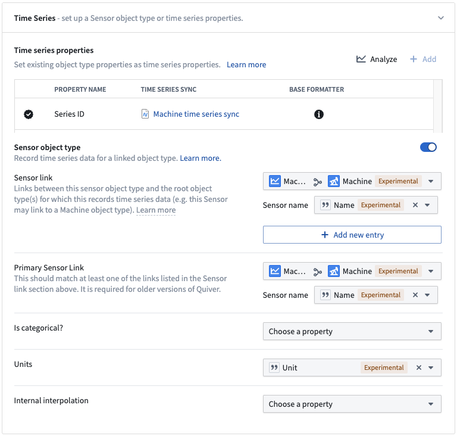
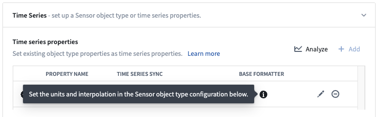
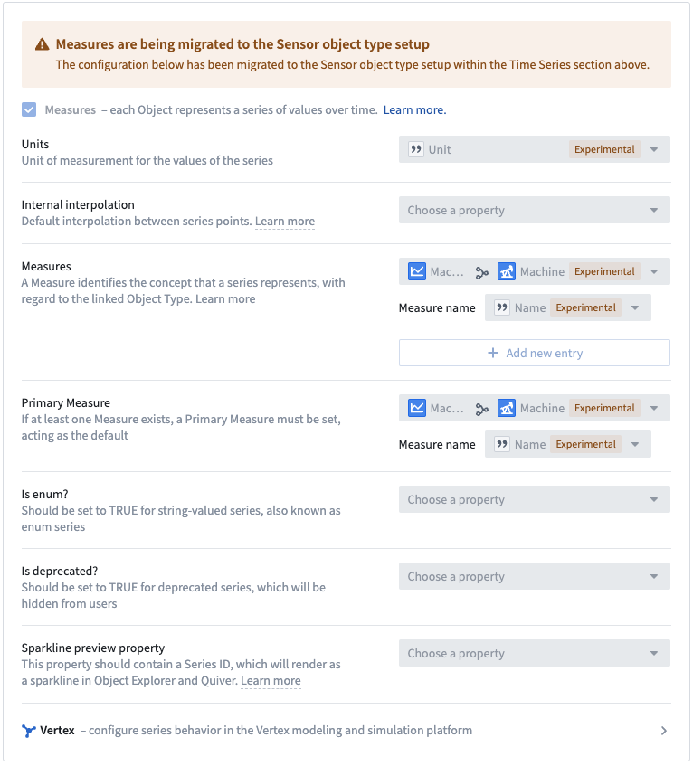
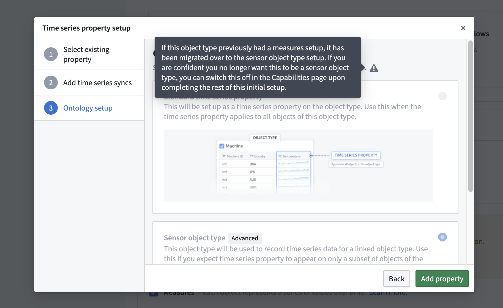
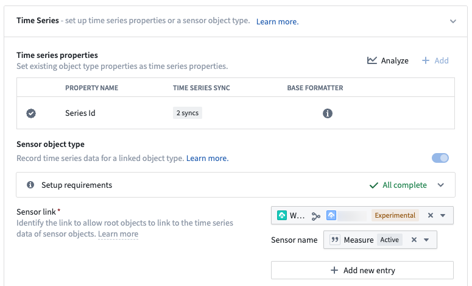

<!-- source: https://palantir.com/docs/foundry/time-series/create-sensor-ot/ · mirrored 2026-08-07 from Palantir Foundry docs -->

# Sensor object type setup

This page contains instructions on how to set up and configure a sensor object type.

:::callout{theme="neutral" title="Sensor objects or TSP"}
If you expect time series data to appear on only a subset of objects of a given object type, you should proceed with creating sensor objects linked back to those root object types. However, if you expect time series data to appear for (nearly) all objects of a given object type, you should add a TSP directly on that object type. Learn more about these setup options in the [time series documentation](/docs/foundry/time-series/time-series-overview/#store-time-series-in-the-ontology).
:::

## Prerequisites: Time series object type backing dataset

To begin, follow the instructions for [creating a new time series object type](/docs/foundry/time-series/create-or-select-ts-ot/#prepare-time-series-object-type-backing-dataset). Your time series object type backing dataset should have the following schema:

| Column | Type | Description |
| --- | --- | --- |
| Primary key | `String` | *\[Required]* A primary key for each row. |
| Series ID | `String` | *\[Required]* A [series ID](/docs/foundry/time-series/time-series-concepts-glossary/#series-id) for the sole TSP. Note that if your sensor object type is backed by multiple time series syncs, you will need a [qualified series ID](/docs/foundry/time-series/time-series-concepts-glossary/#qualified-series-id). TSPs cannot be a primary key or title property.|
| Sensor name | `String` | *\[Required]* A name identifying what the time series data for a given sensor object represents. The sensor names of all sensor objects linked to a single root object must be unique. |
| Foreign key | `String` | *\[Required]* A foreign key used to link the sensor object type to a root object type. The primary key may serve this purpose, but at least one link type is required for a sensor object type. |
| Is categorical | `Boolean` | *\[Required if the TSP is backed by multiple syncs of both numerical and categorical types]* A Boolean value of `true` indicates a given sensor object has categorical time series data, otherwise the data are assumed to be numerical. If you are migrating from the Measures setup, this was previously referred to as `is_enum`. |
| Units | `String` | *\[Optional]* The unit which should be displayed for a given sensor object. |
| Internal interpolation | `String` | *\[Optional]* The internal interpolation which should be used for a given sensor object. |

## Set up sensor object type

In the **Capabilities** page of the Ontology Manager, select **Get started** within the **Time series** section.

Follow the first two steps in the dialog to [set up your TSP](/docs/foundry/time-series/time-series-properties/). In the last step of the **Time series setup** dialog, choose the **Sensor object type** option:

## Sensor object type configuration options

Upon adding the property, you will see an expanded **Sensor object type configuration** section beneath the **Time series properties** table with the following configuration options:

* Sensor link *(required)*
  * You must select at least one link type which links this sensor object type to a root object type for which this records time series data.
  * You must also select the property containing the Sensor name for this link type.
* Primary sensor link *(required if present)*
  * This will only appear if you still have old versions of Quiver accessible in your Foundry instance.
  * If this appears, you must select a link type and sensor name to match one of your configured entries under the Sensor link section above.
* Is categorical? *(required if the TSP is backed by multiple syncs of different types)*
  * If your TSP is backed by multiple syncs which are a mix of both numerical and categorical syncs, you must select a boolean property used to indicate whether a sensor object has categorical time series data.
* Units *(optional, recommended)*
  * Optionally select a property which contains the units for each sensor object’s time series data.
* Internal interpolation *(optional)*
  * Optionally select a property which contains the type of internal interpolation which should be used for each sensor object’s time series data.
  * Valid values are:
    * `LINEAR`: Linearly interpolate between the two points. Only applicable to numerical time series.
    * `NEAREST`: Take the value of the nearest point.
    * `PREVIOUS`: Take the value of the previous point.
    * `NEXT`: Take the value of the next point.
    * `NONE`: Never interpolate.

:::callout{theme="warning"}
The units and interpolation for sensor object types should be set in the sensor object type configuration section rather than through the base formatter.

:::

## Migrate from Measures

If you see the warning shown below in the **Capabilities** page of an object type in Ontology Manager, this object type was previously configured as a [Measure](/docs/foundry/time-series/faqs/#what-are-measures-when-should-they-be-used). Measures are being deprecated. You can use sensor object types in similar workflows instead.

Your object type may already be fully or partially migrated to a sensor object type. If you see a **Get started** button in the **Time Series** section of the **Capabilities** page in Ontology Manager, your Measure has not been migrated. To migrate your Measure to a sensor object type, follow the steps below. If you see a green check mark followed by **All complete** in the **Sensor object type** portion of this section, your object type is fully migrated. An example is included at the bottom of this page. If your setup doesn't match either of these descriptions, you are partially migrated. Follow the onscreen prompts to complete your migration.

:::callout{theme="warning"}
We do not recommend migrating unless you are confident that you know which time series syncs back your Measure. If you are unsure of which time series syncs back your Measure but still want to migrate, contact Palantir Support.
:::

1. Determine which time series sync(s) back your Measure. If you have multiple time series syncs backing your Measure, you will need to generate a qualified series ID. Learn more about [setting up a qualified series ID](/docs/foundry/time-series/create-or-select-ts-ot/#multiple-datasets-for-a-single-measurement-type).
2. In Measure object types, the series ID column was likely used as the primary key. This is not allowed for sensor object types, since TSPs cannot be used as primary keys. Depending on the column used as the primary key, you have the following options:
   * **Option 1:** If you can use a column that is not the series ID as a primary key, no further action is necessary.
   * **Option 2:** If you were using the series ID column as the primary key for your Measure, you will need to create a new column to use as the primary key.
     * The easiest way to create this column is to open the Pipeline Builder pipeline or Code Repository where the backing dataset was generated and create a column that is a duplicate of the series ID.
     * **Note:** Any non-time series property without duplicates can be used as the primary key. Use what makes the most sense for your use case.
   * **Option 3:** If you had to reformat your series ID column because your Measure is backed by more than one time series sync, you can use the column that was formerly your series ID as your primary key as long as it is a unique identifier.
3. Open the Measure in Ontology Manager and open the **Capabilities** page. Select **Get started** and fill out the flow [as described above](#set-up-sensor-object-type). Note that the **Sensor object type** toggle should be on, and many of the selections may already be filled in for you.

Don't forget to save your changes to the Ontology. At the end of your setup, you should see a green check mark followed by **All complete** in the **Sensor object type** portion of the **Time Series** section in the **Capabilities** page in Ontology Manager. An example is shown below:

