<!-- source: https://palantir.com/docs/foundry/time-series/derived-series-create/ · mirrored 2026-08-07 from Palantir Foundry docs -->

# Create derived series

Create derived series from the [Time Series Catalog application](/docs/foundry/time-series/time-series-time-series-catalog/). From the starting page of the Time Series Catalog, select **Derived series** from the top left corner. From the next page, select **+ New derived series** from the top right corner. Follow the steps below to continue creating your derived series.

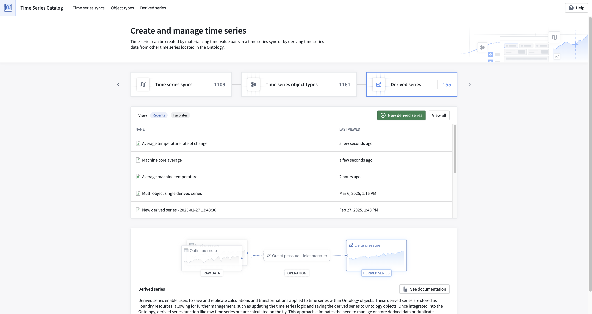

## 1. Select derived series type

Select whether you would like to configure a **templated** or **single** derived series. Templated derived series should be used when you are deriving a new time series that would benefit all objects of a given type. Single derived series should be used when you want to construct a derivation that relies on many objects.

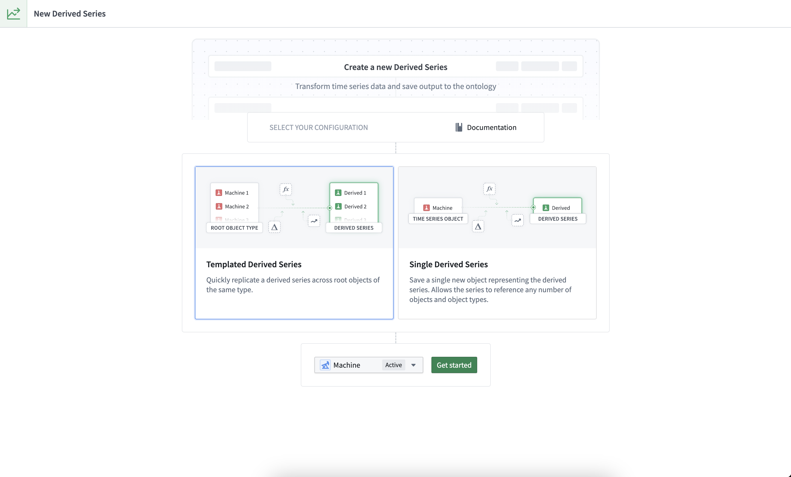

For templated derived series, after selecting a root object type you will be brought to the logic view with a single preview object of the specified type selected. You can update the preview root object at the top of the page.

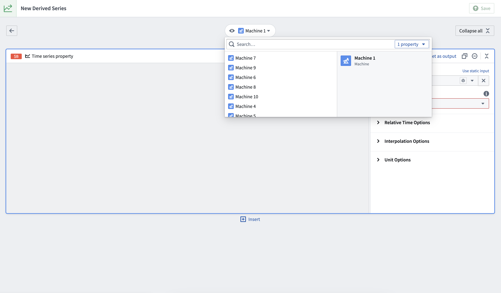

For single derived series, you will be prompted to select starting objects for your logic. Note that single derived series *do not* have a preview object as there could be many objects involved in the logic.

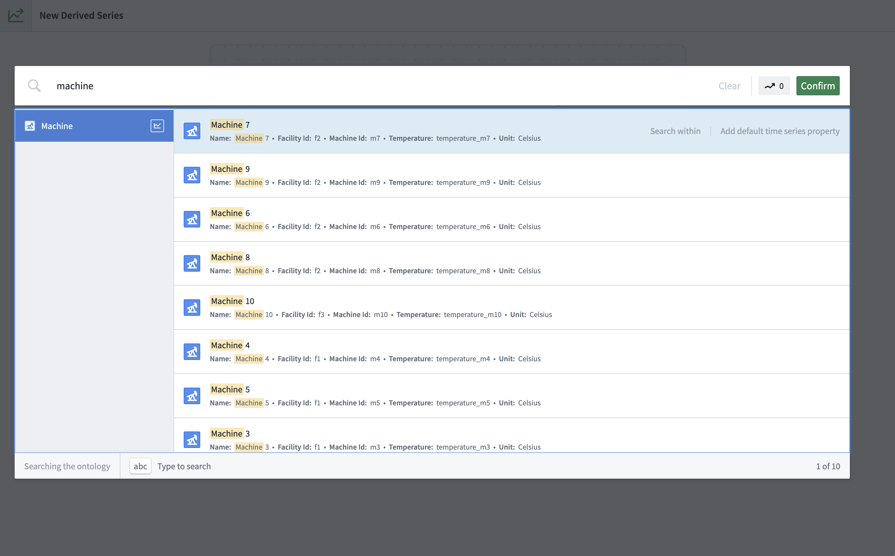

After confirming, you will be directed to the logic view with a **Time series property** card for each selected object.

## 2. Add time series data

Use the **Time series property** card to select time series from objects for templated and single derived series.

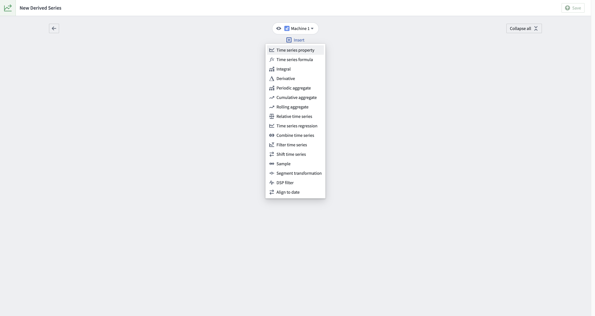

This card allows you to select time series properties on the object as well as any linked sensors if they exist.

Remember, templated derived series must operate on a single root object; the Time Series Catalog interface will prevent you from adding more than one object to the logic when creating a templated derived series.

When creating or editing single derived series, you can add more data at any time from the logic view by using the **Add time series data** option from the top right corner. Alternatively, select **Insert** above or below a card and choose **+ Add time series data**.

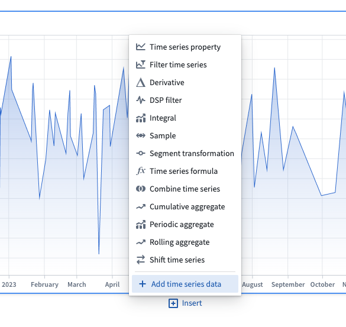

After confirming the time series object(s) in the pop-up window, a **Time series property** card will be created for each selected object.

## 3. Apply transforms

Apply relevant transforms to your time series by inserting new cards.

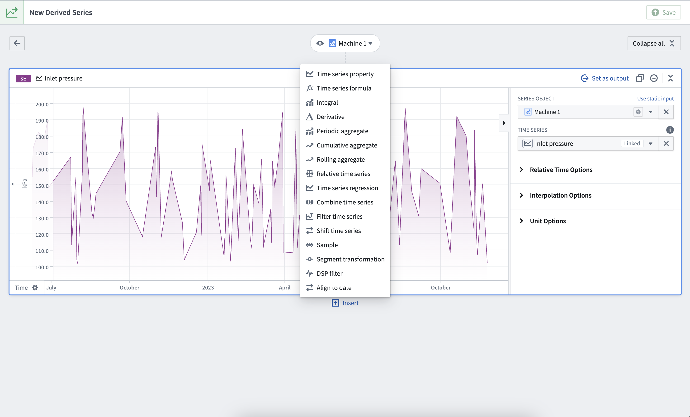

For example, to calculate pressure loss on a hypothetical `Machine` object type with `Inlet pressure` and `Outlet pressure` sensors, add the following cards:

1. A **Time series property** card with `Inlet pressure` selected
2. A **Time series property** card with `Outlet pressure` selected
3. A **Time series formula** card calculating `$E - $G`, assuming identifier `$E` is `Inlet pressure` and `$G` is `Outlet pressure`. Identifiers are located in the top left of every card.

## 4. Select output

Once your derivation is complete, select the final transform as the logic output by choosing **Set as output** from the top right of the card header.

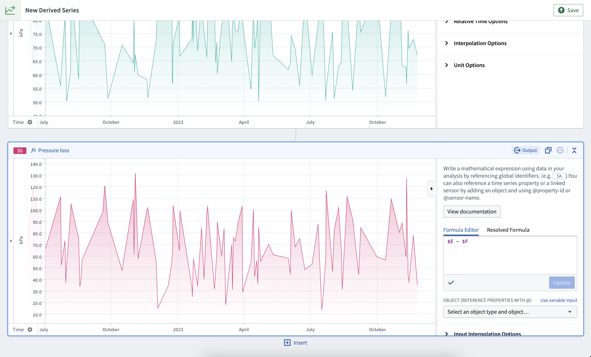

## 5. Save

Once you are satisfied with your logic, select **Save** from the top right of the page.

## 6. Configure Ontology saving options

Select **Automatic** Ontology saving to save the derived series directly to the Ontology.

:::callout{theme="neutral"}
Automatic Ontology saving is only supported for sensor object types. You can choose to configure automatic Ontology saving after creation; however, you will not be able to change your selected object type. After creating a derived series that requires manual saving, follow the [documentation](/docs/foundry/time-series/manual-ontology-saving/) to successfully save references to the Ontology.
:::

Select an object type that will bind to the derived series. For templated derived series, this can be either the [root object type](/docs/foundry/time-series/time-series-concepts-glossary/#time-series-object-type) from which you created the derived series logic, or any of its [linked sensor object types](/docs/foundry/time-series/time-series-concepts-glossary/#sensor-object-type). For single derived series, any root object type or sensor object type may be selected.

This bound object type is the only object type from which the derived series can be resolved. You will not be able to change the bound object type after saving.

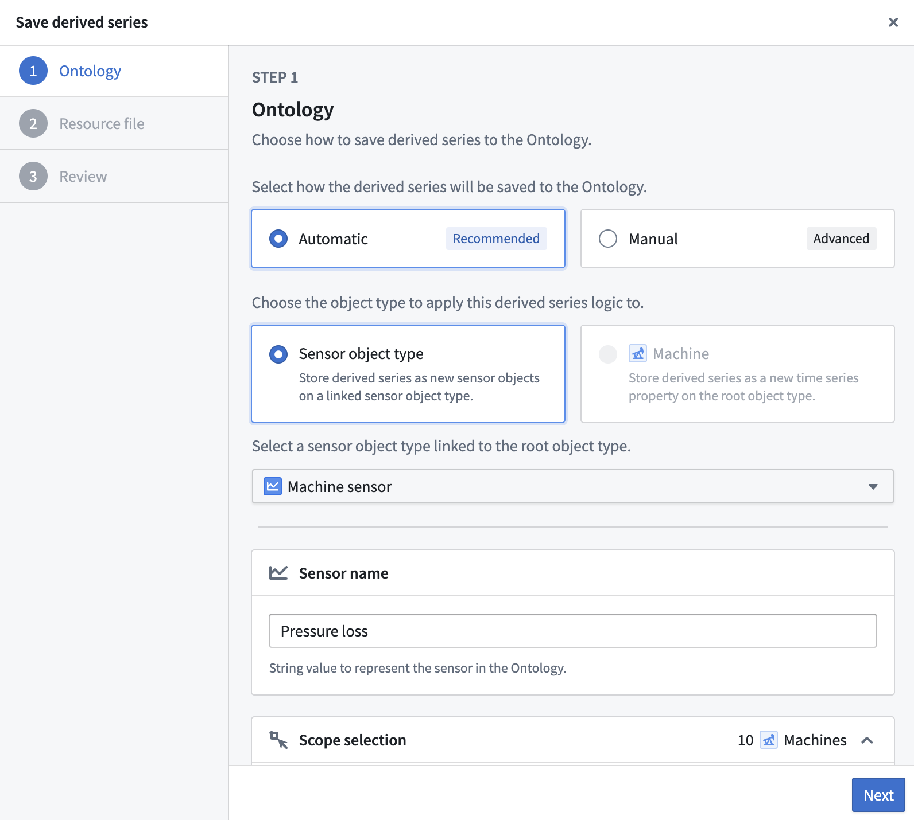

Continue setting up automatic Ontology saving by configuring the sensor name, scope, property mapping, and Action types.

**Sensor name:** Provide a sensor name to identify the derived series once it is saved to the Ontology. This value will be included in the property mapping.

**Scope selection:** Templated derived series must provide a root object scope. This scope allows you to select which root objects you want to save this derived series for. One sensor object will be created for each selected root object. Currently, scope selection has a limit of 5000 objects.

**Property mapping:** The property mapping provides values for sensor object properties. These values will be used across all created sensor objects. Currently, only string or Boolean values are supported. Most sensor object properties are automatically mapped.

**Action types:** Automatic Ontology saving leverages Actions to save the derived series to the Ontology. As a prerequisite for this, you must have the `Create object`, `Modify object`, and `Delete object` Action types configured for the object type. Learn more about setting Action types for automatic Ontology saving in the [derived series requirements](/docs/foundry/time-series/derived-series-overview/#action-type-requirements-for-automatic-ontology-saving) documentation.

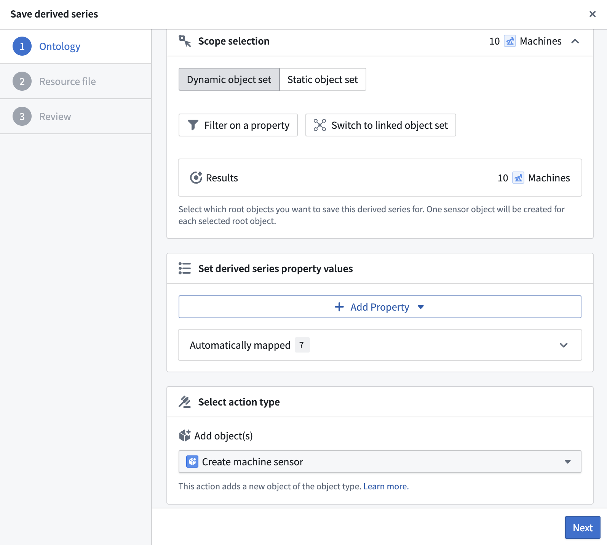

For guidance on where to store the derived series, review the time series [Ontology setup documentation](/docs/foundry/time-series/time-series-overview/#store-time-series-in-the-ontology).

## 7. Select a resource location

Choose a name and folder location to save the resulting derived series resource.

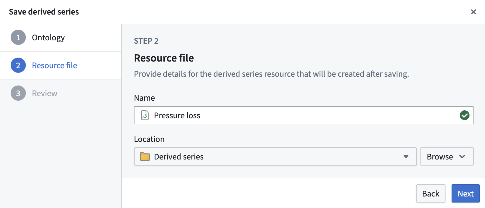

## 8. Review

Finally, review the Ontology output and resource location information and optionally provide a version description before saving.

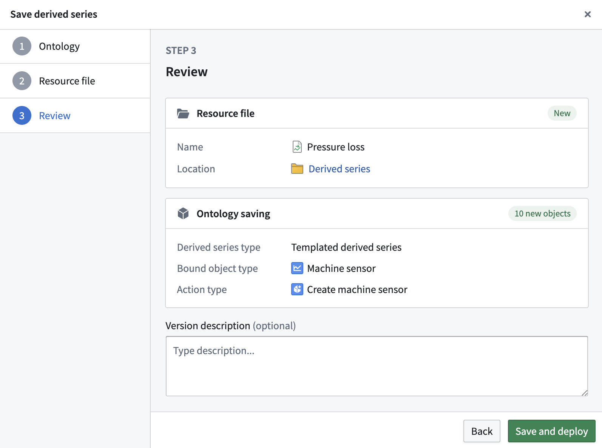

After saving the derived series, any future changes must be made from the [derived series management page](/docs/foundry/time-series/manage-derived-series/).

:::callout{theme="warning"}
Deleting a derived series resource *does not* delete the associated objects added to the Ontology. Before deleting the derived series resource, first [delete the derived series from the Ontology](/docs/foundry/time-series/manage-derived-series/#delete-from-ontology).
:::

# Advanced: Create derived series in Quiver

Derived series can also be created directly from a [Quiver](/docs/foundry/quiver/overview/) analysis.

Select any time series card and view the **Derived series options** configuration, then select **Create derived series**.

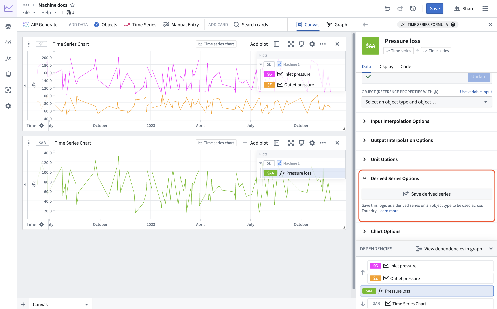

The save dialog is similar to the Time Series Catalog creation dialog, but you must select the type of derived series you are attempting to configure. You will not be able to select the templated option if the derived series operates on multiple objects.

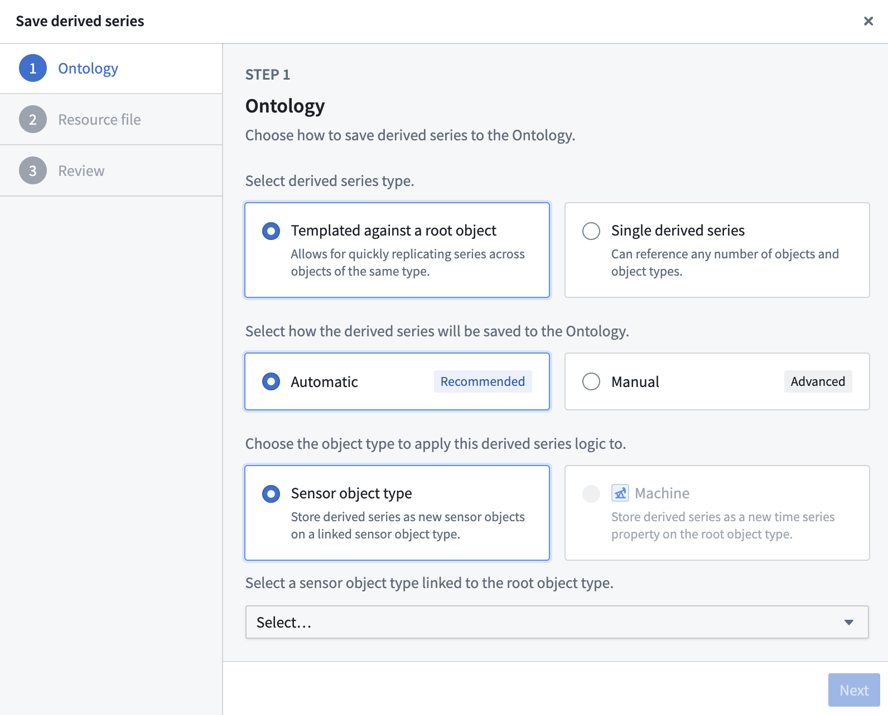

Derived series created from Quiver analyses will not be associated with its *source* analysis after creation; all future management of the derived series must happen in the [derived series management page](/docs/foundry/time-series/manage-derived-series/).

We recommend using the Time Series Catalog to create derived series since not all Quiver operations are supported in derived series.
