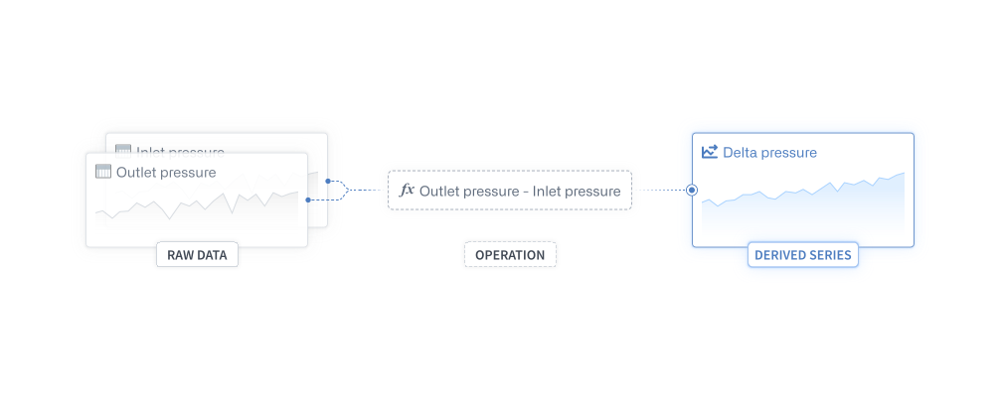
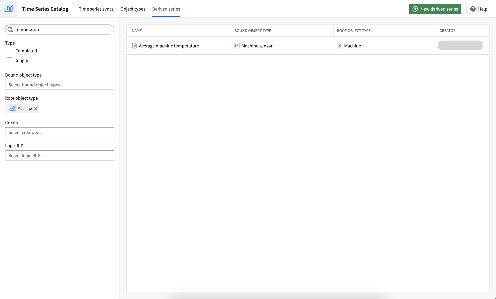
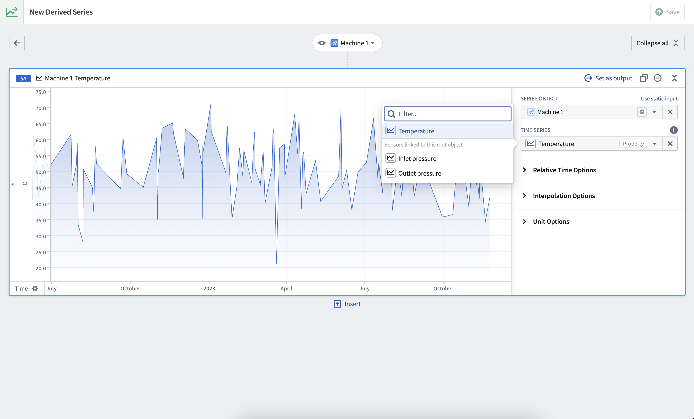
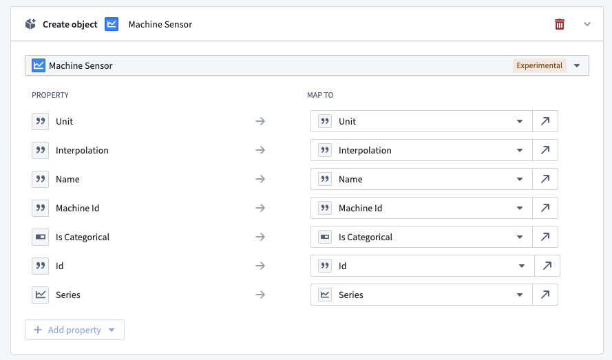
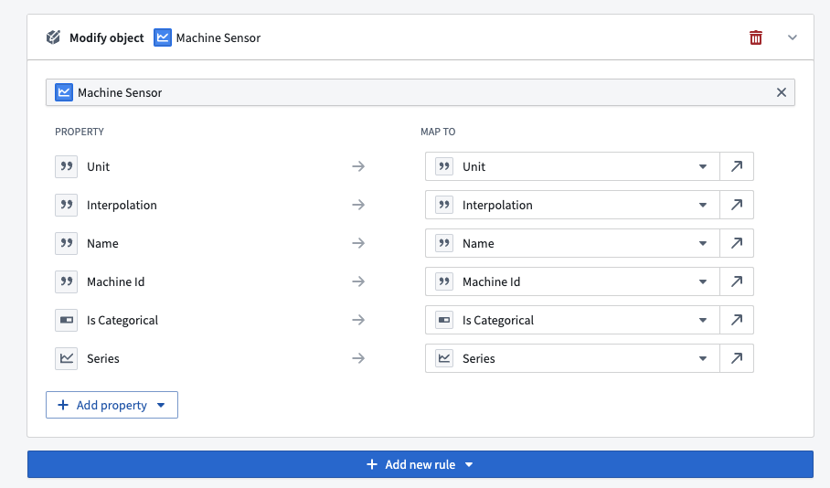
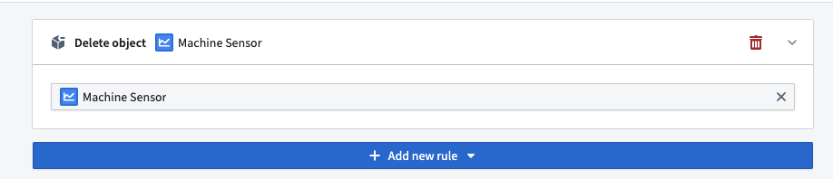

<!-- source: https://palantir.com/docs/foundry/time-series/derived-series-overview/ · mirrored 2026-08-07 from Palantir Foundry docs -->

# Derived series

Derived series allow users to save and replicate calculations and transformations applied to time series in the Ontology. By saving this data as Palantir resources, derived series can be shared and saved back to the Ontology as time series properties. Once in the Ontology, derived series behave like any other time series property but are calculated on the fly, eliminating the need to manage or store derived data or duplicate those calculations across the platform.

Explore, create, and manage derived series from the **Derived series** tab of the [Time Series Catalog](/docs/foundry/time-series/time-series-time-series-catalog/).

## Derived series types

Derived series can either be **templated** or **single**.

### Templated derived series

Templated derived series are templated against a root object type and, therefore, must operate on a single root object. Templated derived series are powerful in that they allow you to quickly replicate logic across all objects of a given type. For example, if many hypothetical `Machine` objects have a temperature sensor, templated derived series would enable you to quickly create a rolling average temperature sensor on `Machines`.

### Single derived series

Single derived series are not meant to be templated and can operate on many objects. Single derived series allow you to create logic that is not constrained to all inputs coming from one object.

## Requirements

The sections below explain the requirements you must follow while creating derived series.

### Time series object types

A time series Ontology is a prerequisite for creating derived series. Derived series are created against and stored on *time series object types*, either **time series properties on root object types** or **sensor objects**. Review the [time series Ontology documentation](/docs/foundry/time-series/time-series-overview/#store-time-series-in-the-ontology) for more information.

### Logic requirements

Derived series logic management is powered by Quiver. Most Quiver time series operations are supported in derived series; review the full list of [supported operations](/docs/foundry/time-series/derived-series-common-questions/#which-quiver-cards-are-supported-in-derived-series-logic) for derived series logic.

#### Logic for templated derived series

Templated derived series logic must contain *a single root object*. Time series properties on the root object and sensor objects linked to the root object can be used in the logic. Learn more about [time series object types](/docs/foundry/time-series/time-series-overview/#store-time-series-in-the-ontology) for clarity between root and sensor object types.

Time series properties and linked sensor objects can be accessed from a root object using the **Time series property** card.

In this example, both the `Temperature` time series property on `Machine 1` and the `Inlet` and `Outlet pressure` sensors linked to `Machine 1` are accessible.

#### Single derived series

Single derived series logic can contain any number of sensor or root objects as long as they all live in the same Ontology.

### Permission requirements

To save a derived series, [object type edit permissions](/docs/foundry/object-permissioning/ontology-permissions-legacy/#create-new-resources-with-ontology-roles) are required on the bound object type.

## Automatic saving requirements

Derived series bound to sensor object types can be [*automatically* saved](/docs/foundry/time-series/derived-series-create/#6-configure-ontology-saving-options) to the Ontology using Action types. Derived series automatic saving arranges Ontology Action edits to manage associated sensor objects based on what is requested to be in the Ontology. Derived series can also be [*manually* saved to the Ontology](/docs/foundry/time-series/manual-ontology-saving/).

### Sensor object type requirements for automatic Ontology saving

1. The primary key of a sensor object type that is used for automatic saving to the Ontology must be of type `String`.
2. The sensor object type must be stored with [Object Storage v2](/docs/foundry/object-backend/overview/#object-storage-v2-architecture); this is required for Actions to write to time series properties.
3. The sensor object type must have edits enabled.
4. For templated derived series, there must be a single [one-to-many cardinality link](/docs/foundry/object-link-types/create-link-type/#configure-a-new-link-type) between the root object type and sensor object type, with the root object type on the "one" side.

### Action type requirements for automatic Ontology saving

If any of the following requirements are not met, you will not be able to select the Action type for automatic Ontology writes:

1. Each Action type must have a single rule.
2. The Action type parameters must not use constraints that limit what values can be provided. Similarly, the Action type parameters must not use overrides that result in a value constraint.
3. The Action type should not have unused parameters. If a parameter is unused, it cannot be configured as required.
4. Properties that are not provided a value are considered unmapped. Parameters for unmapped sensor object properties must be configured as "not required". For templated derived series, foreign key properties on the sensor object type that are not for the root object type are always unmapped.
5. The Action type submission criteria must not use parameter-based conditions.

You must create three separate Action types: create, modify, and delete. The rules for these Action type are listed below.

##### `Create object` Action type

**Rule:** Each property type uses a parameter of the same type and edits all properties of the object type. If you are using Ontology Manager to configure an Action type, you must manually create a string parameter for your primary key from the **Form** tab to the left.

##### `Modify object` Action type

**Rule:** Similar to the `Create object` Action type, the `Modify object` Action type should use parameters that are the same type as the associated property types and should edit all properties besides the primary key.

##### `Delete object` Action type

**Rule:** Configure the `Delete object` Action type to delete a sensor object type. No further property or parameter configuration is required.

Learn more about [creating derived series](/docs/foundry/time-series/derived-series-create/) in the next section.

### Permission requirements

To use automatic Ontology saving, you must satisfy the [submission criteria](/docs/foundry/action-types/submission-criteria/) for the Action types.

Additionally, you must be able to view the objects of both the root object type and the sensor object type. Use caution when using automatic saving on object types backed by restricted views as the Ontology status of a derived series is calculated against the objects that a user can view. For templated derived series, a user should have access to the entirety of the root object scope as well as its associated sensor objects. Similarly, a single derived series should only be updated by a user that can view the associated single sensor object.
