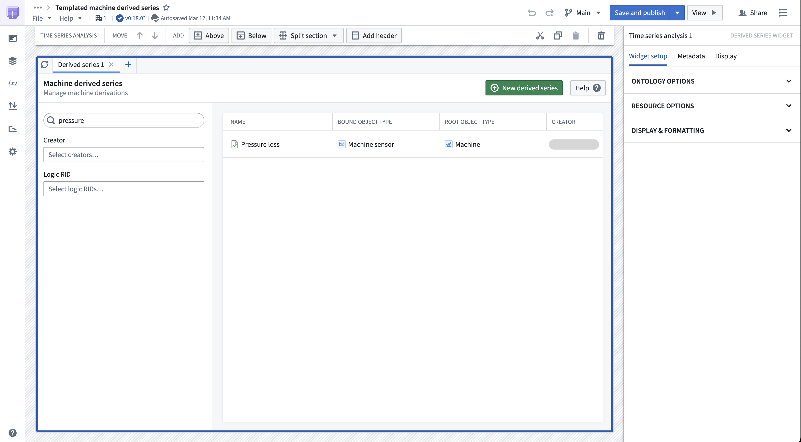
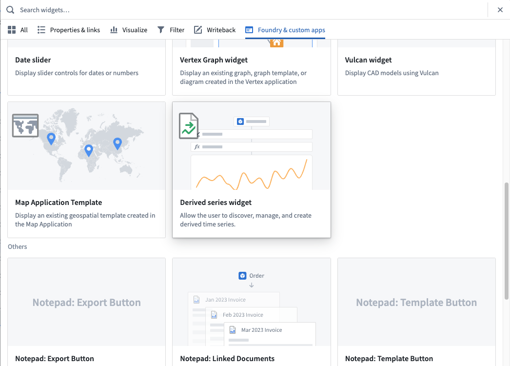
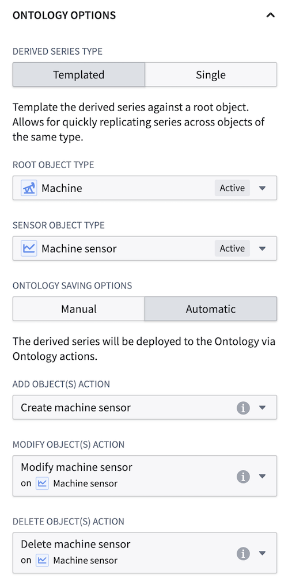
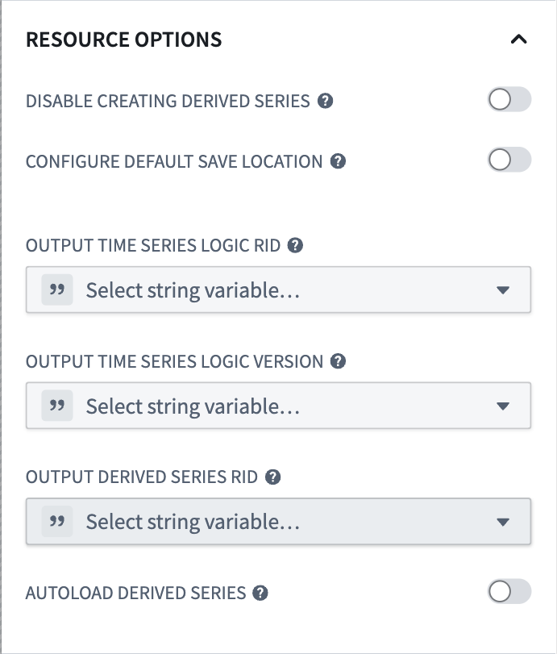
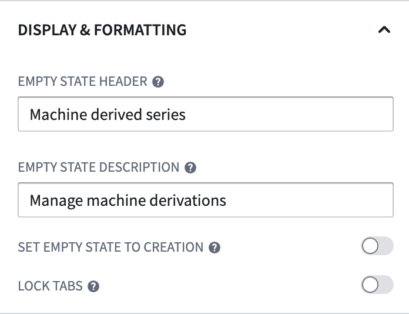

<!-- source: https://palantir.com/docs/foundry/time-series/derived-series-widget/ · mirrored 2026-08-07 from Palantir Foundry docs -->

# Embed derived series in a Workshop module

You can bundle the creation, management, and discovery of derived into a [Workshop module](/docs/foundry/workshop/overview/) through the Derived Series widget.

The Derived Series widget offers a user-friendly platform for managing derived series, focusing on constructing the time series logic. With the Derived Series widget, users can view a simplified version of derived series management options rather than the advanced configurations used in the [standard creation flow](/docs/foundry/time-series/derived-series-create/).

## Widget configuration

You can configure a Derived Series widget to construct either [single or templated derived series](/docs/foundry/time-series/derived-series-overview/#derived-series-types) against a predefined time series Ontology. You can also configure the widget to support [automatic Ontology saving](/docs/foundry/time-series/derived-series-create/#6-configure-ontology-saving-options) of derived series bound to a sensor object type by supplying previously-created Action types. As part of the saving configuration, you can specify a destination folder where the resulting derived series will be saved. Additional configuration options include the customization of header text for the widget.

## Restrictions

The derived series widget only supports creating derived series bound to a sensor object type. Furthermore, a derived series widget will only display derived series that match the derived series type and time series object types specified in the widget configuration. For example, templated derived series against the `Facility` root object type will not display in a widget configured for a templated derived series against the `Machine` root object type.

## Construct the widget

In Workshop, select **Add widget**, then choose **Derived series widget** from the menu.

### Ontology options

The Ontology options section of the configuration specifies how the derived series created and managed within the widget interacts with the Ontology.

#### Derived series type

Determine the type of derived series to be viewed and/or created within the widget. Review our [derived series type](/docs/foundry/time-series/derived-series-overview/#derived-series-types) documentation to understand the differences.

#### Time series object types

Specify the underlying time series object types of the derived series to be viewed and/or created within the widget. for templated derived series, this consists of a root object type and a sensor object type. For single derived series, only a sensor object type needs to be provided.

#### Ontology saving options

Determine whether the widget will use automatic or manual Ontology saving. If using automatic saving then you must also supply Action types for modifying sensor object types. Review the [derived series Action type requirements](/docs/foundry/time-series/derived-series-overview/#action-type-requirements-for-automatic-ontology-saving) for more details. Note that the widget will only let you configure derived series using the specified saving method.

### Resource options

The resource options section of the widget configuration specifies the relationship between the widget and involved derived series resources.

#### Disable creating derived series

If enabled, the widget will only allow users to view existing derived series. Users will not be able to create new derived series.

#### Configure default save location

Configure a save location (folder or Project) for the derived series resource. You can also choose the **Don't allow users to choose save location** sub-configuration to enforce that the specified save location is the *only* place a derived series can be saved.

#### Output time series logic RID

Configure a Workshop variable that stores the resource identifier (RID) of the time series logic being displayed by the widget.

#### Output time series logic version

Configure a Workshop variable that stores the version of the time series logic being displayed by the widget.

#### Output derived series RID

Configure a Workshop variable that stores the RID of the derived series resource being displayed by the widget.

#### Autoload derived series

Configure a Workshop variable dictating which derived series to show in the widget on initial load. This variable must be a string list and is expected to contain derived series RIDs. Note that the loaded derived series will error if they do not meet the [restriction](/docs/foundry/time-series/derived-series-widget/#restrictions) requirements.

### Display and formatting

This section allows you to configure how the widget is shown to the user.

#### Empty state header

If provided, the empty state header value is the title shown in the header of the widget when viewing the default state of a new tab in the widget.

#### Empty state description

If provided, the empty state description is shown under the empty state header.

#### Set empty state to creation

If enabled, the widget will default to showing the creation flow instead of the derived series discovery page when a new tab is created.

#### Lock tabs

If enabled, this settings prevents users from modifying the tabs of the widget. This could be useful when applied with the autoload derived series configuration to show users a predefined list of derived series, for example.
