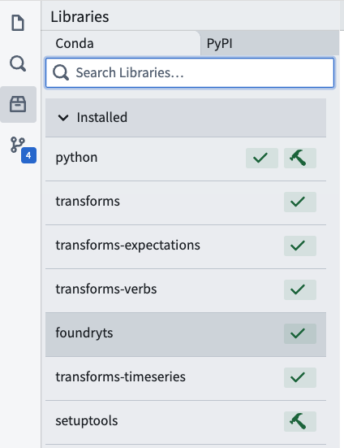
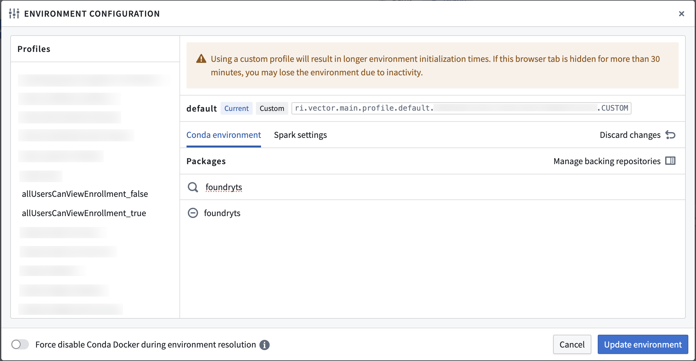
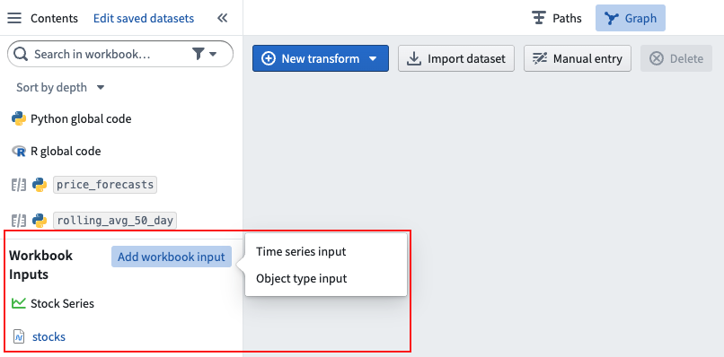
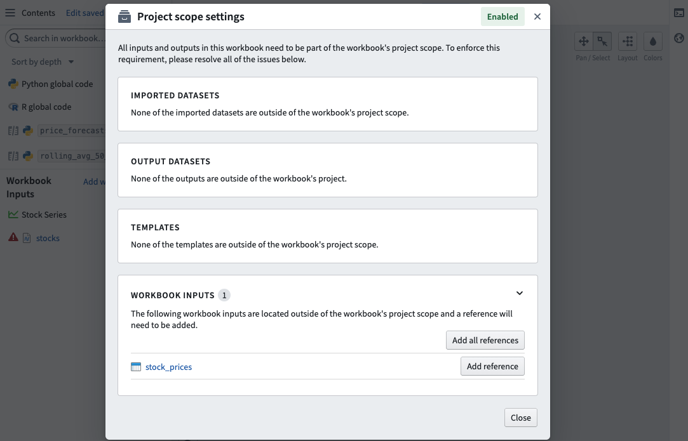
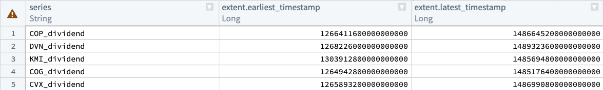

<!-- source: https://palantir.com/docs/foundry/time-series/foundryts/ · mirrored 2026-08-07 from Palantir Foundry docs -->

# Work with time series in FoundryTS

FoundryTS is a Python library for running queries against time series data such as filtering time series directly or from attached ontology properties. The FoundryTS library integrates with [Code Repositories](/docs/foundry/code-repositories/overview/) and [Code Workbook](/docs/foundry/code-workbook/overview/).

Review the [FoundryTS API reference](/docs/foundry/foundryts/overview/) for more details.

:::callout{theme="neutral"}
Note that the output of using the FoundryTS library in a transform will be a dataset. If you want to output a new time series, you should create a dataset with the schema required for a time series, then use that dataset to back a new time series using the Time Series Catalog or Pipeline Builder.
:::

## Get started in Code Repositories

To begin, ensure you have already [set up a Python code repository](/docs/foundry/transforms-python/getting-started/#set-up-a-python-code-repository).

Add the `foundryts`, `transforms-timeseries`, and `transforms-objects` libraries to your repository using the **Libraries** pane.



Then, follow the instructions below to import the object types being queried into the repository and update Project references:

1. Go to the **Resources** tab in the repository.
2. Select **Ontology**.
3. Add your object type.

### Import resources

Project references grant FoundryTS access to resources outside of your project. This section walks you through the resources you need to import if they live outside of your project.

If you access your series by time series properties, you must import the following resource:

* The dataset backing the object type

If you access your series by series IDs or a search query, you must import the following resources:

* The time series sync (The RID of this resource looks like: ri.time-series-catalog.main.sync.<UUID>)
* The dataset backing the time series sync

## Get started in Code Workbook

In a code workbook, add the `foundryts` package to your environment by selecting **Environment** from the upper right toolbar, then **Configure environment**.

Under **Conda environment**, select **Customize profile** and search for and add **foundryts**. Select **Update environment** to save your changes.



Learn more about [environment configuration](/docs/foundry/code-workbook/environment-overview/) in Code Workbook.

### Set up workbook inputs

Any queried object types (accessed by time series properties) or time series catalog syncs (accessed by series ID or a search query) must be added as workbook inputs from the left **Contents** panel.



The object types or time series catalog syncs added as workbook inputs must also be imported into the same Project as the workbook, including their backing datasets. Not doing so will cause errors when executing transforms written with foundryts. If any workbook inputs are not in the Project scope, they will be surfaced in the **Project scope settings** dialog found in the settings dropdown menu in the top right of the workbook toolbar.



## Example: Stock data

In this example, we start with the `Stock series` object type with the `Ticker name` property. Our objective is to find all the series in the `Technology` sector and compute their time ranges.

Start by defining the input and output of your transform. We declare the `Stock series` object type as an object input and the time series sync as a time series input.

```python
@transform(
    output=Output("/Users/jdoe/foundryts-test-technology-sector"),
    ts=TimeSeriesInput('ri.time-series-catalog.main.sync.6bdbda27-29...'),
    objects=ObjectInput(
        object_type_rid='ri.ontology.main.object-type.4168ed49-00...',
        ontology_rid='ri.ontology.main.ontology.00000000-00...',
        ontology_branch_rid='ri.ontology.main.branch.00000000-00...'
    )
)
```

Now, we define the transform function and initialize an instance of FoundryTS. Note that this function takes the object type, time series sync, and output as arguments.

```python
def compute(ctx, ts, objects, output):
    fts = FoundryTS()
```

Next we search for `timeseries-demo-stock-series` objects in the `Technology` sector. For each search result, we map the series to its time extent (the timestamps of the earliest and latest points).

```python
    search_result = fts.search.series(
        (ontology('sector') == 'Technology'),
        object_types=['timeseries-demo-stock-series']
    ).map(F.time_extent())
```

Finally, we write the dataframe to our output dataset.

```python
    df = search_result.to_dataframe()
    output.write_dataframe(df)
```

Putting it all together, the completed transform looks like the following. Note that you only need to reference your input time series in the transform decorator, because the FoundryTS() function will automatically use it as context:

```python
from transforms.api import transform, Output
from transforms.timeseries import TimeSeriesInput
from foundryts import FoundryTS
from foundryts.search import ontology
import foundryts.functions as F
from transforms.objects import ObjectInput


@transform(
    output=Output("/Users/jdoe/foundryts-test-technology-sector"),
    ts=TimeSeriesInput('ri.time-series-catalog.main.sync.6bdbda27-29...'),
    objects=ObjectInput(
        object_type_rid='ri.ontology.main.object-type.4168ed49-00...',
        ontology_rid='ri.ontology.main.ontology.00000000-00...',
        ontology_branch_rid='ri.ontology.main.branch.00000000-00...'
    )
)
def compute(ctx, ts, objects, output):
    fts = FoundryTS()

    search_result = fts.search.series(
        (ontology('sector') == 'Technology'),
        object_types=['timeseries-demo-stock-series']
    ).map(F.time_extent())

    df = search_result.to_dataframe()
    output.write_dataframe(df)
```

The output dataset looks like the following:


