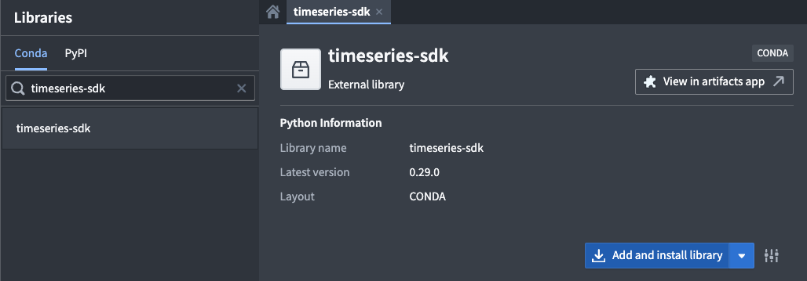
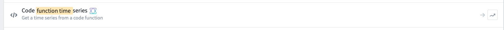
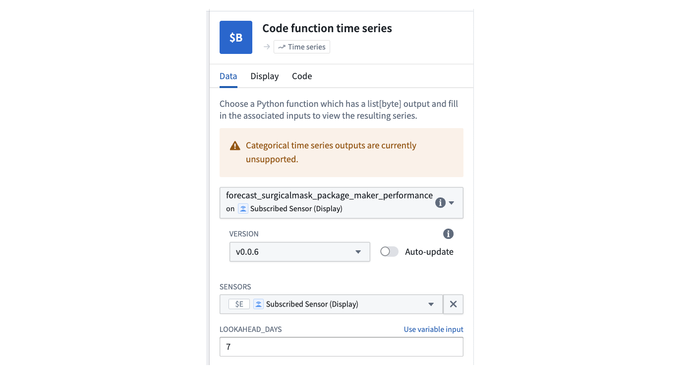
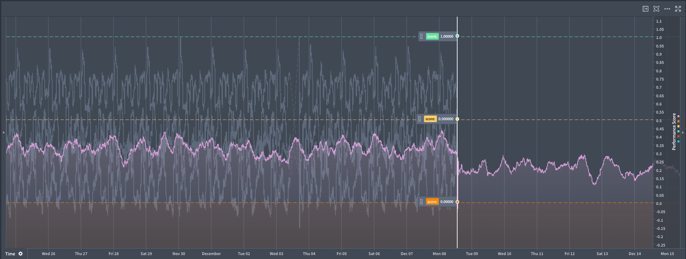

<!-- source: https://palantir.com/docs/foundry/time-series/function-backed-time-series-getting-started/ · mirrored 2026-08-07 from Palantir Foundry docs -->

# Getting started with function-backed time series

This guide will help you get started with creating a function-backed time series that can be used in Quiver analyses to enable real-time forecasting workflows.

## Prerequisites

To set up function-backed time series, you need the following resources:

* A Foundry function that returns a numeric time series using the time series SDK.
* A tagged version of that function to reference in Quiver.

## Set up a function-backed time series in Quiver

1. **Install the time series SDK:** In Code Repositories, add the `timeseries-sdk` library to your code repository using the **Libraries** tab. <br><br>
    <br><br>
2. **Write a Python function:** Create a function that returns a serialized pandas DataFrame with the following columns:

   * **`timestamp`:** A pandas timestamp.
   * **`value`:** A numeric value, for example int32 or float.

   The time series SDK provides a library for serializing a pandas DataFrame as shown in the example below.

```python
from functions.api import function
from timeseries_sdk.types import TimeSeries
from ontology_sdk.ontology.objects import Machine
import pandas as pd

@function
def performance_prophet_forecast(
    machine: Machine,
    periods: int = 96,      # number of future steps
    freq: str = "15min",    # sampling frequency
) -> list[bytes]:
    """
    Forecast a machine's performance_score using Prophet.
    """
    from prophet import Prophet

    # Retrieve performance score data (columns: timestamp, value)
    df = machine.performance_score.to_pandas(all_time=True)

    if df.empty:
        return TimeSeries.serialize(pd.DataFrame(columns=["timestamp", "value"]))

    # Prepare the data for Prophet
    df = df.rename(columns={"timestamp": "ds", "value": "y"}).sort_values("ds")
    model = Prophet().fit(df)

    # Create future data frame for forecast
    future = model.make_future_dataframe(periods=periods, freq=freq, include_history=True)
    forecast = model.predict(future)

    # Format the forecast output
    out = forecast[["ds", "yhat"]].rename(columns={"ds": "timestamp", "yhat": "value"})
    return TimeSeries.serialize(out)
```

3. **Publish the function:** Publish your function and tag a version.

4. **Use the function in Quiver:**
   * Add a **Code function time series card**. <br><br>
      <br><br>
   * Select your function, choose the correct version, and configure its inputs. <br><br>
      <br><br>
   * Optionally, add another instance of the card to compare multiple scenarios side-by-side.


