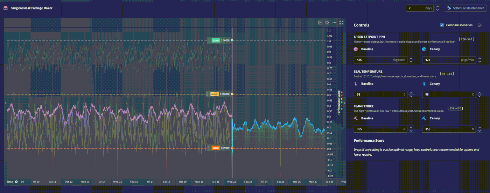

<!-- source: https://palantir.com/docs/foundry/time-series/function-backed-time-series-overview/ · mirrored 2026-08-07 from Palantir Foundry docs -->

# Function-backed time series

:::callout{theme="neutral" title="Beta"}
Function-backed time series are in the [beta](/docs/foundry/platform-overview/development-life-cycle/) phase of development and may not be available on your enrollment. Functionality may change during active development. Contact Palantir Support to request access to Function-backed time series.
:::

Function-backed time series enable you to generate and transform numeric time series using Python logic defined in a [function](/docs/foundry/functions/overview/). Foundry treats the function's output as a time series without the need to define a time series sync.

## Capabilities

* **Custom analytics:** Write Python functions that generate numeric time series. Use any libraries, such as statsmodels or Prophet, or use proprietary code to perform advanced analytics.
* **Direct integration in Foundry:** Leverage function outputs directly in Quiver and apply operations such as resampling, formulas, joins, and time series search while ensuring compatibility and composability.
* **On-demand data access:** Easily incorporate data from external APIs or services without pre-materializing data to enable rapid prototyping and dynamic analysis.
* **Parameterized scenarios:** Pass custom inputs such as control settings or forecast horizons to compare multiple generated series side by side.
* **Scalable production workflow:** Benefit from built-in result caching and streaming execution for handling large outputs while keeping interactions responsive.

In the example below, a function-backed time series is used in a Workshop module to compute weekly forecasts in real-time. An operator is able to simulate different scenarios for how changing a machine's controls affects the predicted performance forecast.



## How it works

Function-backed time series require a Python Foundry function that returns a serialized numeric time series. When you query data, Quiver invokes your function with the specified parameters, dynamically generating the time series at query time. This output is then treated as a first-class time series within Foundry, allowing you to apply further operations and visualizations.

This integration makes it easy to incorporate custom models and on-the-fly analytics into your dashboards, enabling flexible and modular time series workflows.

## Example use cases

* **Forecasting and simulation:** Generate forecasts using the libraries of your choice, such as Prophet or statsmodels, or use models built in Foundry to analyze future trends and perform scenario planning.
* **Multivariate analysis:** Combine outputs from several sensors or metrics to enable comprehensive time series analysis.
* **Rapid model iteration:** Quickly iterate on custom models without managing intermediate datasets or data pipelines.

## Example: Use Prophet for forecasting

The example below demonstrates how to use [Prophet ↗](https://pypi.org/project/prophet/) with function-backed time series for forecasting.

```python
from functions.api import function
from timeseries_sdk.types import TimeSeries
from ontology_sdk.ontology.objects import Machine
from prophet import Prophet

@function
def performance_prophet_forecast(
    machine: Machine,
    periods: int = 96,      # number of future steps
    freq: str = "15min",    # sampling frequency
) -> list[bytes]:
    """
    Forecast a machine's performance_score using Prophet.
    """
    df = machine.performance_score.to_pandas(all_time=True)
    if df.empty:
        return TimeSeries.serialize(df)

    df = df.rename(columns={"timestamp": "ds", "value": "y"}).sort_values("ds")
    model = Prophet().fit(df)
    future = model.make_future_dataframe(periods=periods, freq=freq, include_history=True)
    forecast = model.predict(future)
    out = forecast[["ds", "yhat"]].rename(columns={"ds": "timestamp", "yhat": "value"})
    return TimeSeries.serialize(out)
```
