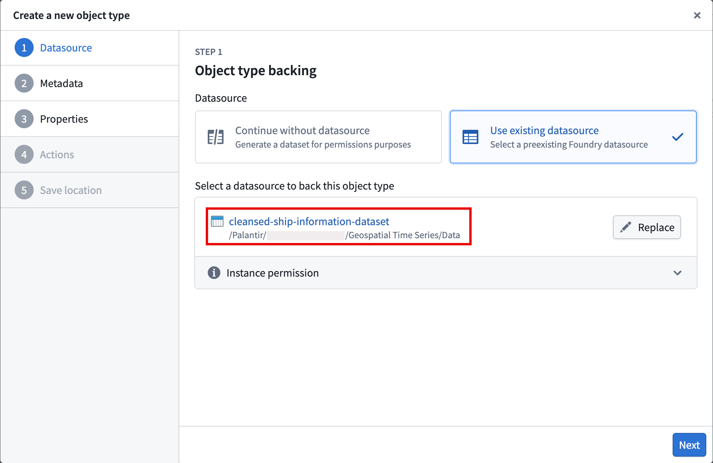
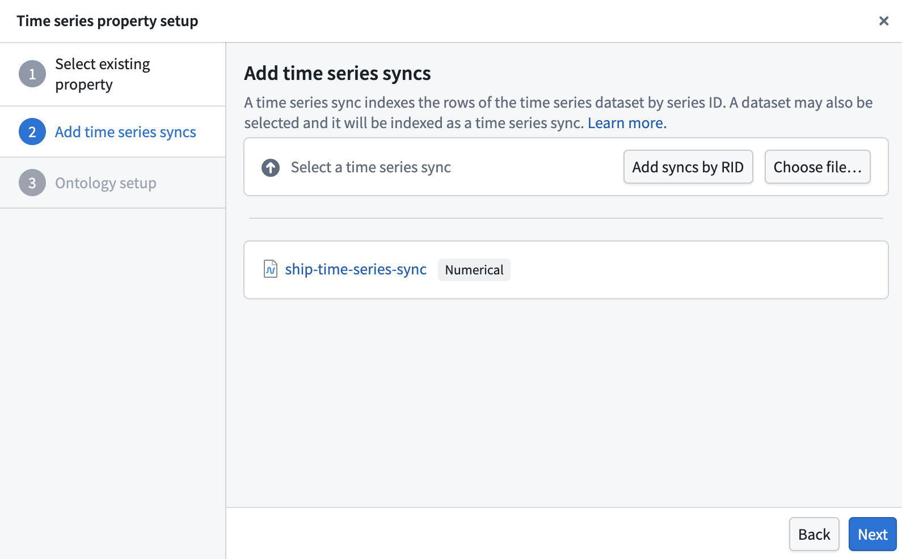
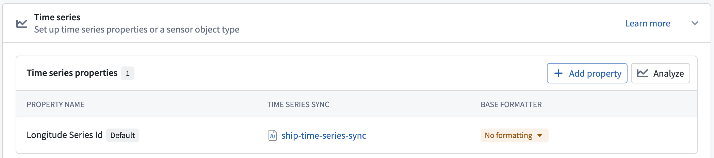
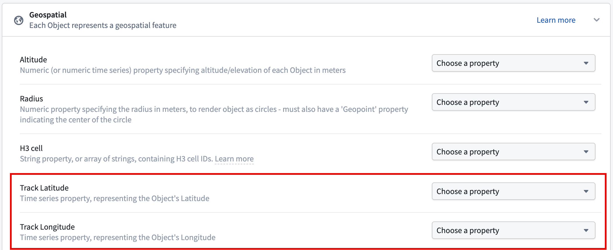

<!-- source: https://palantir.com/docs/foundry/time-series/geospatial-time-series-ontology/ · mirrored 2026-08-07 from Palantir Foundry docs -->

# Add time series properties and configure geospatial capabilities with Ontology Manager

:::callout{theme="neutral"}
This guidance references the documentation for [setting up a time series property on a time series object type](/docs/foundry/time-series/time-series-properties/). While you can add as many time series properties to the object type as necessary, this tutorial guides you through the process of adding two to your object type based on the `latitude` and `longitude` columns on the `Ship` object type's [backing dataset created in Pipeline Builder](/docs/foundry/time-series/geospatial-time-series-pipeline/).
:::

At the end of this guide, your `Ship` object type will have two time series properties (`Latitude Series` and `Longitude Series`) and geospatial track capabilities configured to visualize ship movement on a [Foundry map](/docs/foundry/map/overview/).

## Part I: Create a `Ship` object type in Ontology Manager

Follow the instructions below to create a new `Ship` object type in your Ontology with your [transformed data](/docs/foundry/time-series/geospatial-time-series-pipeline/#3-create-the-object-backing-dataset) as the backing dataset:

1. Navigate to [Ontology Manager](/docs/foundry/ontology-manager/overview/) and select **New** > **Object type** from the top right corner of your screen.
2. Select **Use existing datasource** in the **Create a new object type** pop-up window and choose your transformed dataset.

3. Select **Next** and set `Ship` as the object type's **Name** before optionally entering a **Description**. After providing a name and description, choose **Next**.
4. Set the `Ship Id` property as the **Primary key** and **Title** for the object type.
5. Select your [action types](/docs/foundry/action-types/overview/) to generate, and optionally restrict who can submit the actions.
6. Select a project to save the object type and generate action types to before you choose **Create**.

After you select **Create**, Foundry closes the **Create a new object type** window and directs you to your object type's overview page in Ontology Manager, where you can configure its time series properties.

## Part II: Configure the time series properties on the `Ship` object type

1. Select the **Capabilities** tab on the left side of your screen beneath **Observability**.
2. Select the **Time series** panel before choosing **Get started** to launch the **Time series property setup** pop-up window.
3. Choose `Longitude Series Id` from the **Object type property** dropdown menu and select **Next**.
4. Select **Choose file...** to locate the [time series sync you created in Pipeline Builder](/docs/foundry/time-series/geospatial-time-series-pipeline/#part-ii-create-the-time-series-sync) before choosing **Next**.

5. Choose **Standard time series property** in the **Ontology setup** section of the pop-up window before selecting **Add property**.

After you select **Add property**, Foundry closes the **Time series property setup** pop-up window and directs you back to the **Time series** section of the **Capabilities** panel. Next, select **Add property** and repeat steps 2–5 above for the `Latitude Series Id` property.

Once you finish setting up the `Latitude Series Id` property, **Save** your changes to the Ontology.

## Part III: Ensure each time series property represents a geospatial feature

In the **Capabilities** tab, scroll down to and select the **Geospatial** panel. Next, set your `Latitude Series Id` and `Longitude Series Id` properties as the **Track Latitude** and **Track Longitude** properties, respectively, before saving your changes to the Ontology.

Now that the time series properties and geospatial capabilities are configured, you will next [visualize ship tracks on a map](/docs/foundry/time-series/geospatial-time-series-use-case-map/).
