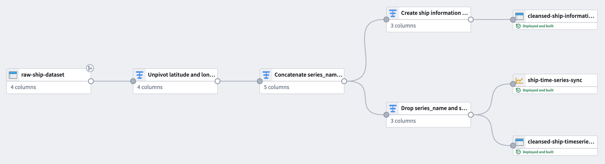
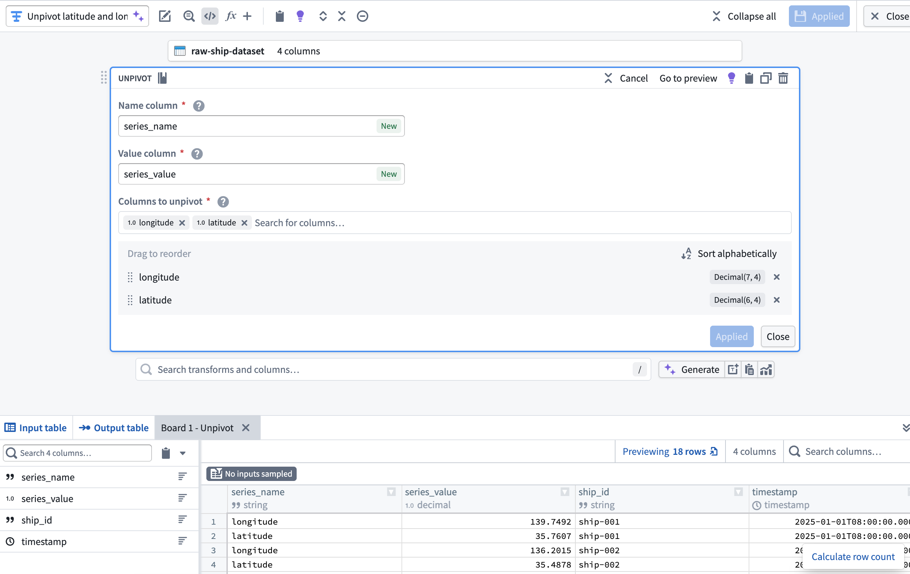
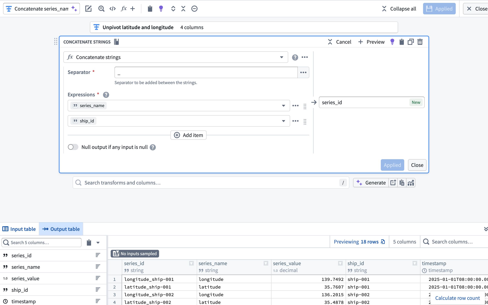
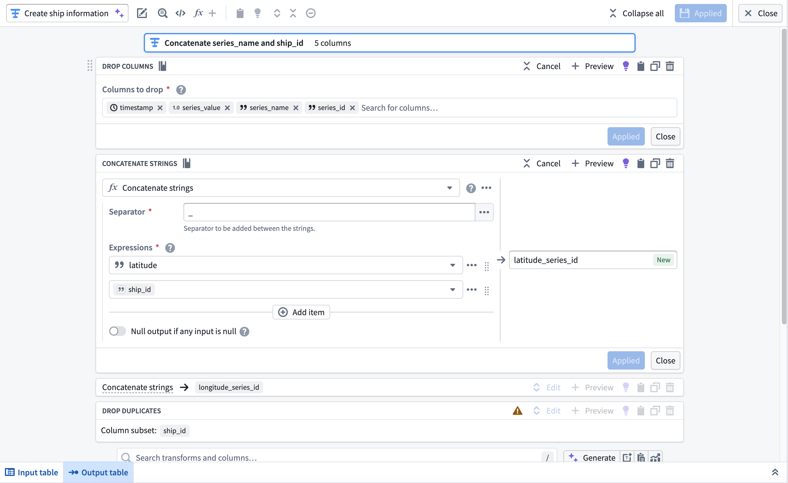
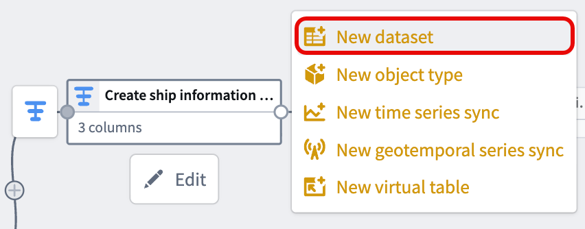
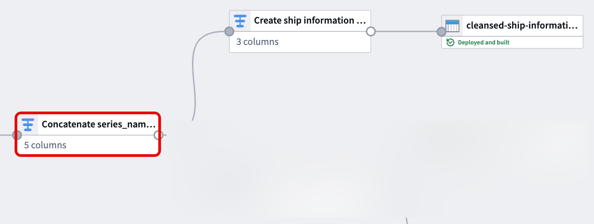
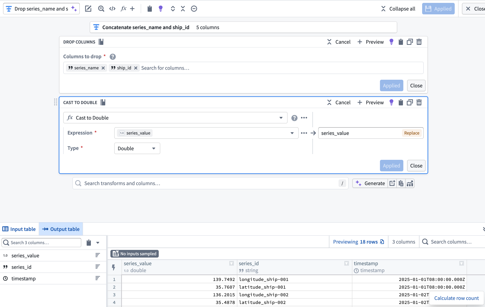
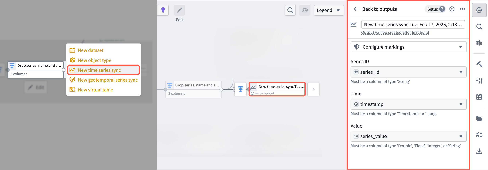
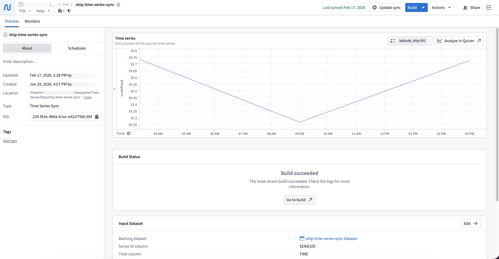

<!-- source: https://palantir.com/docs/foundry/time-series/geospatial-time-series-pipeline/ · mirrored 2026-08-07 from Palantir Foundry docs -->

# Create geospatial time series properties with Pipeline Builder

The pipeline you create in [Pipeline Builder](/docs/foundry/pipeline-builder/overview/) with this guide will generate [time series data](/docs/foundry/time-series/time-series-concepts-glossary/#time-series-object-type-backing-dataset) from raw location updates and prepare the object backing dataset with series ID references. This data will back a [time series sync](/docs/foundry/time-series/time-series-concepts-glossary/#time-series-sync) to associate with [time series properties](/docs/foundry/time-series/time-series-concepts-glossary/#time-series-property-tsp) on the `Ship` object type.

The notional raw location dataset used in this example includes the following columns:

* **ship\_id:** `string` | A unique identifier for each ship.
* **timestamp:** `timestamp` | The time at which the location was recorded.
* **longitude:** `double` | The longitude of the ship at the recorded time.
* **latitude:** `double` | The latitude of the ship at the recorded time.

You can copy the raw data below and import it as a dataset in Foundry before adding it to a new pipeline in Pipeline Builder:

<table>
  <thead>
    <tr>
      <th>ship_id</th>
      <th>timestamp</th>
      <th>longitude</th>
      <th>latitude</th>
    </tr>
  </thead>
  <tbody>
    <tr>
      <td>ship-001</td>
      <td>2025-01-01 08:00:00</td>
      <td>139.7492</td>
      <td>35.7607</td>
    </tr>
    <tr>
      <td>ship-001</td>
      <td>2025-01-01 14:00:00</td>
      <td>140.0097</td>
      <td>35.2652</td>
    </tr>
    <tr>
      <td>ship-001</td>
      <td>2025-01-01 20:00:00</td>
      <td>139.5932</td>
      <td>35.7231</td>
    </tr>
    <tr>
      <td>ship-002</td>
      <td>2025-01-02 08:00:00</td>
      <td>135.7609</td>
      <td>35.1223</td>
    </tr>
    <tr>
      <td>ship-002</td>
      <td>2025-01-02 14:00:00</td>
      <td>135.9821</td>
      <td>35.3055</td>
    </tr>
    <tr>
      <td>ship-002</td>
      <td>2025-01-02 20:00:00</td>
      <td>136.2015</td>
      <td>35.4878</td>
    </tr>
  </tbody>
</table>

## Part I: Transform time series data

Using the raw location dataset, apply the following transforms in Pipeline Builder to create a time series sync-compatible dataset.

### 1. Unpivot latitude and longitude columns

Since the dataset contains both latitude and longitude as separate columns, use an **Unpivot** transform to merge them into a single value column. This is necessary to match the [required schema for a time series sync](/docs/foundry/time-series/time-series-syncs/). With the dataset added to your pipeline, add a transform node to **Unpivot** the `latitude` and `longitude` columns into a new `series_name` **Name column** and `series_value` **Value column**.

### 2. Create a `series_id` column using the Concatenate strings transform

Next, add a transform node to concatenate the `series_name` and `ship_id` columns to create a new `series_id` column using the **Concatenate strings** transform.

### 3. Create the object backing dataset

Next, you will use the **Drop columns**, **Concatenate strings**, and **Drop duplicates** transforms to create the `Ship` object type's backing dataset. After you complete these transformations in your pipeline, your dataset will contain the following schema and values:

<table>
  <thead>
    <tr>
      <th>longitude_series_id</th>
      <th>latitude_series_id</th>
      <th>ship_id</th>
    </tr>
  </thead>
  <tbody>
    <tr>
      <td>longitude_ship-001</td>
      <td>latitude_ship-001</td>
      <td>ship-001</td>
    </tr>
    <tr>
      <td>longitude_ship-002</td>
      <td>latitude_ship-002</td>
      <td>ship-002</td>
    </tr>
  </tbody>
</table>

Add a transform node and apply the transforms listed above.

* **Drop columns:** Drop the `timestamp`, `series_value`, `series_name`, and `series_id` columns.
* **Concatenate strings:** Use an underscore as the **Separator** to concatenate the `latitude` and `longitude` columns with `ship_id` in separate transform blocks.
* **Drop duplicates:** Drop the `ship_id` column after it is used in the concatenation with `latitude` and `longitude`.

After you configure the transforms, navigate back to your pipeline's canvas and choose **Add output** > **New dataset** from the newly created transform node to output a dataset to back the object type.

Give your dataset a descriptive name, such as `cleansed-ship-information-dataset`. Select **Save** in the top ribbon and **Deploy** your pipeline to create the dataset.

### 4. Drop `ship_id` and `series_name` before casting `series_value` to `Double`

With your object type's backing dataset created, navigate back to the transform node you created in [step two](#2-create-a-series_id-column-using-the-concatenate-strings-transform) to create your time series sync.

Now that the `series_id` and `series_value` columns are derived from and supersede the `ship_id` and `series_name`, add a transform node to drop `ship_id` and `series_name` then cast `series_value` to type `Double`. This enables you to output a time series sync from your cleansed dataset which will back **Track Latitude** and **Track Longitude** properties on a [track object](/docs/foundry/map/integrate-objects/#track-objects).

## Part II: Create the time series sync

:::callout{theme="neutral"}
You can reference similar instructions in the [time series properties use case tutorial](/docs/foundry/time-series/time-series-properties-use-case-pipeline/#part-ii-create-the-time-series-sync). However, the instructions below provide guidance specific to this `Ship` geospatial object type example.
:::

To output a time series sync from your cleansed dataset, select the final transform node on your pipeline's canvas and choose **Add output** > **New time series sync**. Next, populate the **Series ID**, **Time**, and **Value** options in the **Pipeline Outputs** drawer that renders on the right side of your pipeline with your cleansed dataset's `series_id`, `timestamp`, and `series_value` columns. Save and deploy your pipeline to create a time series sync.

:::callout{theme="neutral"}
You can choose to output a new *dataset* instead of a time series sync. However, outputting a time series sync in Pipeline Builder will save you a step during the [Ontology configuration phase](/docs/foundry/time-series/geospatial-time-series-ontology/).
:::

Foundry saves your newly created time series sync in the same [Compass folder](/docs/foundry/compass/overview/) as your pipeline.

With your time series sync created, you can now create and configure an [object type in your Ontology that contains the time series sync as time series properties](/docs/foundry/time-series/geospatial-time-series-ontology/).
