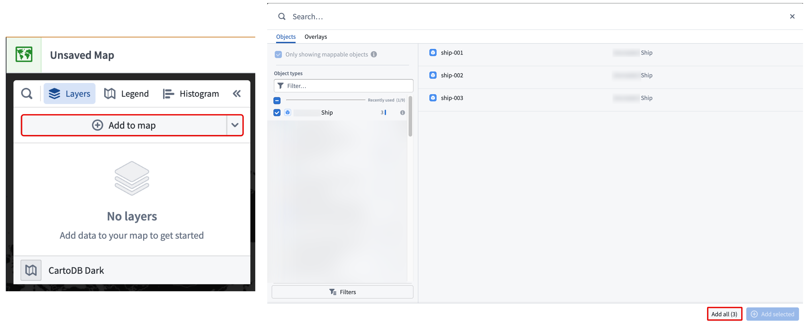
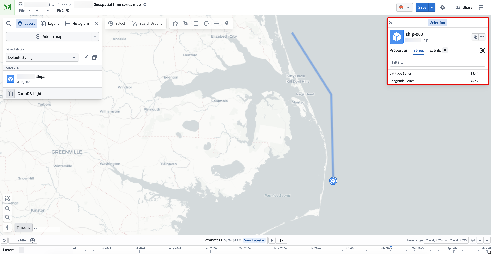
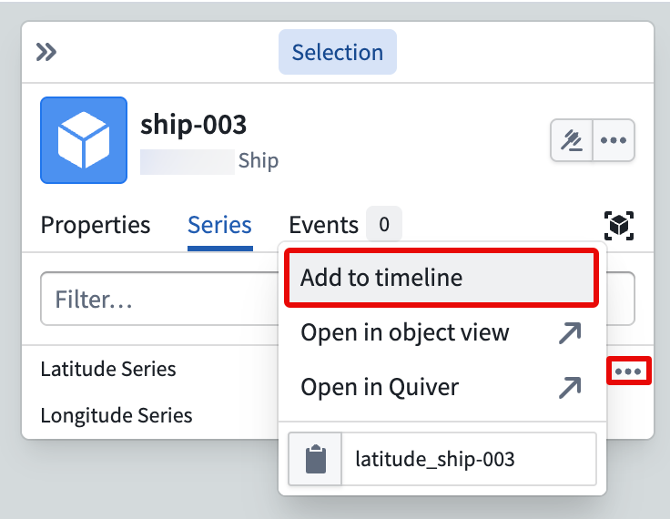
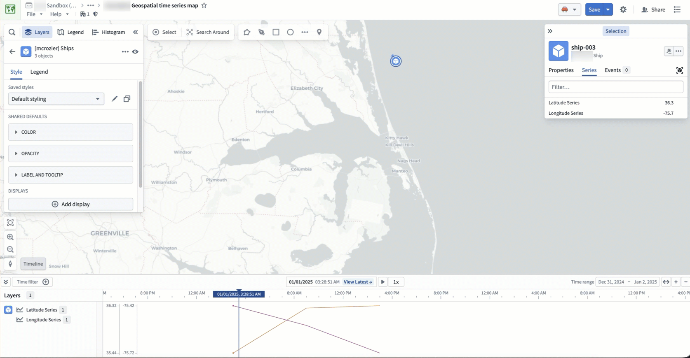

<!-- source: https://palantir.com/docs/foundry/time-series/geospatial-time-series-use-case-map/ · mirrored 2026-08-07 from Palantir Foundry docs -->

# Visualize geospatial time series objects on a map

Now that the `Ship` object type has time series properties and geospatial track capabilities configured in [Ontology Manager](/docs/foundry/ontology-manager/overview/), you can visualize ship tracks on a [map](/docs/foundry/map/overview/). The map you create will contain your `Ship` object type's objects as well as their location history as [track geometries](/docs/foundry/map/visualize-tracks/).

## Part I: Add `Ship` objects to a new map

1. Navigate to your project folder and create a new map.
2. Select **Add to map** in the **Layers** tab of the left panel.
3. Search for your `Ship` object type in the search bar or select it from the **Object types** list in the **Objects** panel.
4. Choose to **Add all** objects to your map from the bottom right corner.

Your ship objects with geospatial data will render on the map, displaying their track geometry. Choose an object to launch the **Selection** panel on the right side of your map, where you can [take actions on the object and configure its styling](/docs/foundry/map/selection/#selection-panel).

:::callout{theme="neutral"}
You can learn more about [visualizing tracks](/docs/foundry/map/visualize-tracks/) and [configuring track geometry](/docs/foundry/map/integrate-objects/) in the Map application's existing documentation.
:::

## Part II: Add an object's time series properties to the map's timeline

With a `Ship` object open in the **Series** tab of the **Selection** panel, hover over and select the ellipsis (**...**) icon on the right side of your `Latitude Series` and `Longitude Series` properties and choose **Add to timeline**. This enables you to view your time series properties on your map's [timeline](/docs/foundry/map/time-series/#interact-with-time-series-in-the-timeline-beta).

Select, hold, and drag your cursor along the timeline to observe the ship's position update on the map in real time.

[Learn more about interacting with time and temporal data on your map.](/docs/foundry/map/time-overview/)
