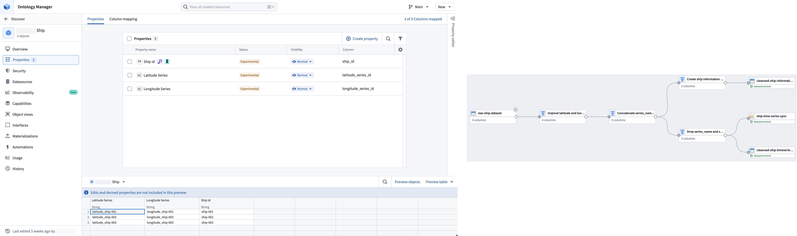

<!-- source: https://palantir.com/docs/foundry/time-series/geospatial-time-series-use-case/ · mirrored 2026-08-07 from Palantir Foundry docs -->

# Geospatial time series use case

Geospatial time series properties on objects enable you to track the location of entities over time. Review the [geospatial documentation](/docs/foundry/geospatial/faq/#when-should-i-use-geotemporal-series-instead-of-time-series-to-display-geospatial-data) to decide if a [geotemporal series](/docs/foundry/geospatial/types-of-geospatial-and-geotemporal-data/#geotemporal-series) or time series set up is right for your use case.

This documentation walks you through the steps to prepare time series data in Pipeline Builder, configure objects in Ontology Manager, and visualize entity tracks on a [map](/docs/foundry/map/overview/) using an example `Ship` object type. The `Ship` object type has two backing datasets containing information about each individual ship, such as its `Ship Id`, and location updates over time expressed as latitude and longitude values with timestamps.

The following guides will lead you through the steps to create objects with geospatial time series data and visualize them on a [map](/docs/foundry/map/overview/):

1. [Use Pipeline Builder to prepare time series and object backing data](/docs/foundry/time-series/geospatial-time-series-pipeline/)
2. [Add time series properties and configure geospatial capabilities with Ontology Manager](/docs/foundry/time-series/geospatial-time-series-ontology/)
3. [Visualize a ship's tracks on a map](/docs/foundry/time-series/geospatial-time-series-use-case-map/)
