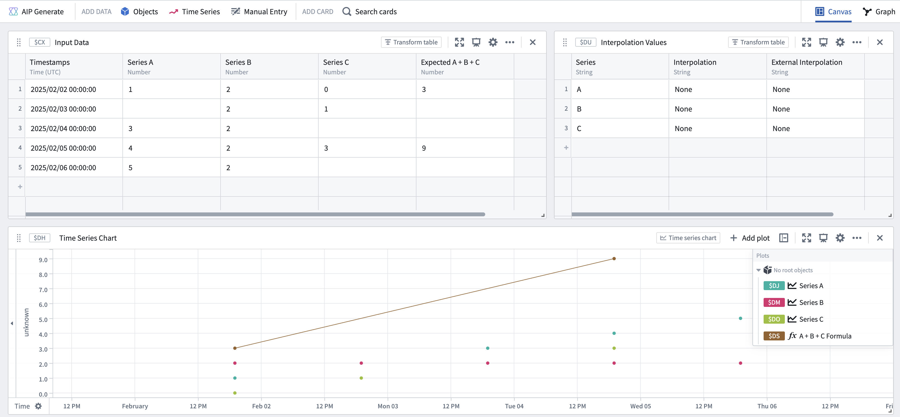
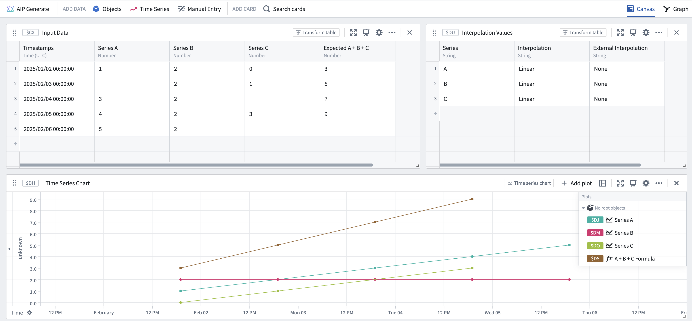
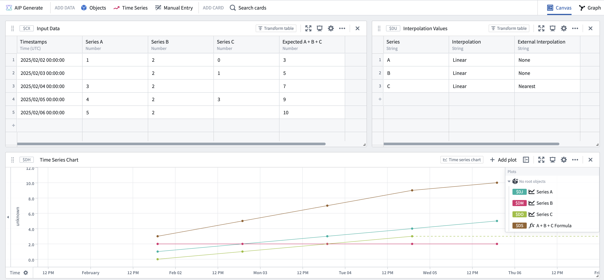
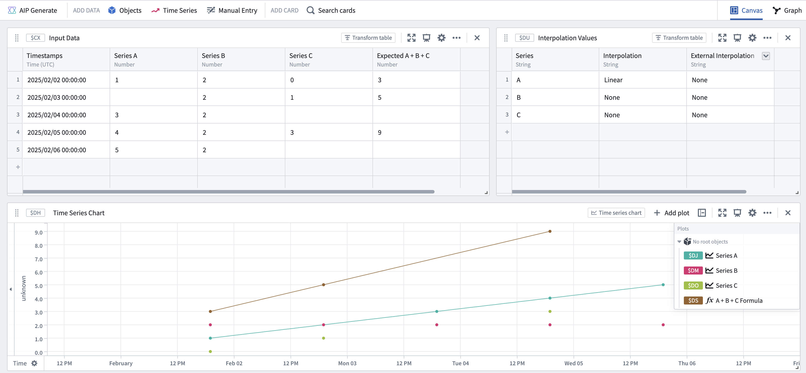

<!-- source: https://palantir.com/docs/foundry/time-series/interpolation-overview/ · mirrored 2026-08-07 from Palantir Foundry docs -->

# Interpolation in time series

This page explains how interpolation is used for time series in the Palantir platform and how to customize these settings for your use cases.

## What is interpolation?

Interpolation is a technique commonly used in time series analysis to estimate missing values between known data points. By using the existing data points, interpolation allows for a continuous and complete representation of the time series, even in the absence of recorded measurements at certain times.

## Types of interpolation

The internal interpolation options available in the Palantir platform are:

* `LINEAR`: Infers a value by drawing a straight line between the previous and next known data points. Only applicable to numerical time series.
* `NEAREST`: Takes the value of the nearest point.
* `PREVIOUS`: Takes the value of the previous point.
* `NEXT`: Takes the value of the next point.
* `NONE`: Does not infer any value if there is no point at that timestamp.

For external interpolation (before the first point or after the last point), the valid settings are:

* `NEAREST`: Takes the value of the nearest point.
* `NONE`: Does not infer any value if there is no point at that timestamp.

A series has a *defined* interpolation if its internal interpolation is something other than `NONE`.

## Specifying interpolation

For a time series property in the ontology, you can specify a desired internal interpolation for your series using [time series formatting](/docs/foundry/time-series/time-series-properties/#time-series-formatting). By default, numeric time series use `LINEAR` interpolation and categorical series use `PREVIOUS`.

## The role of interpolation in time series calculations

When combining multiple series, the points that are used to build the output series are dependent on the respective interpolations of the input series. If all the series have a defined interpolation, then the resulting series will be created out of the *union* of all the points from all series. This means that even if only one series had a point at a certain timestamp, interpolation will be used to determine what the value of all the other series are at that timestamp before actually performing the relevant join.

However, if one or more of the series do not have defined interpolations, then the operation will only iterate over the set of points created by the *intersection* of all such input series.

For example, assume you have three time series `A`, `B`, and `C`, in which none of `A`, `B`, or `C` have interpolation defined.

| Timestamps | Series A | Series B | Series C | Expected A + B + C |
|---|---|---|---|---|
| 2025/02/02 00:00:00 | 1 | 2 | 0 | 3 |
| 2025/02/03 00:00:00 |  | 2 | 1 |  |
| 2025/02/04 00:00:00 | 3 | 2 |  |  |
| 2025/02/05 00:00:00 | 4 | 2 | 3 | 9 |
| 2025/02/06 00:00:00 | 5 | 2 |   |   |

If none of the series have interpolation defined, then the result of joining them will only be computed over the timestamps where all series have defined points. In this case, joining (by adding the series together) would only occur at the first and fourth point:

If all the series have interpolation defined, the resulting series would look as follows:

However, since the last point of series `C` is before the last point of either series `A` or `B`, and series `C` does not have any external interpolation (before the first point or after the last point) set, no value can be computed for the last timestamp. Adding `NEAREST` external interpolation to series `C` results in the following:

Finally, assume a mixed scenario in which series `A` has interpolation defined, but series `B` and `C` do not. The set of time stamps in the output series is determined by taking the intersection of the series which have no interpolation defined, giving the following result:

