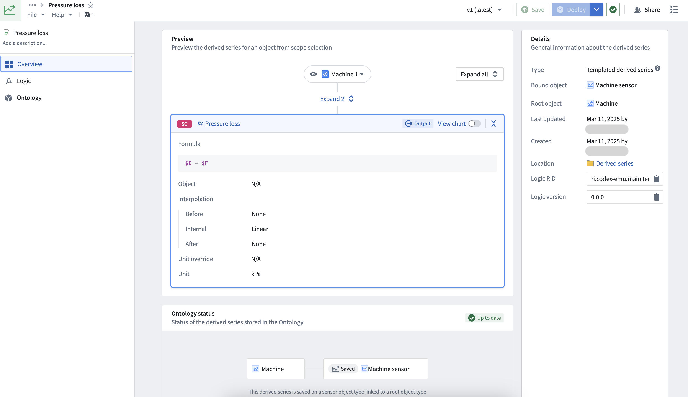
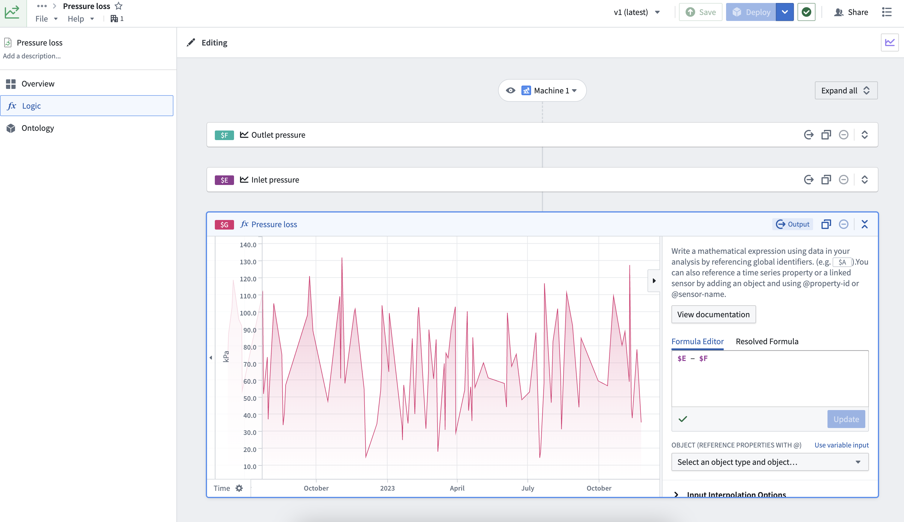
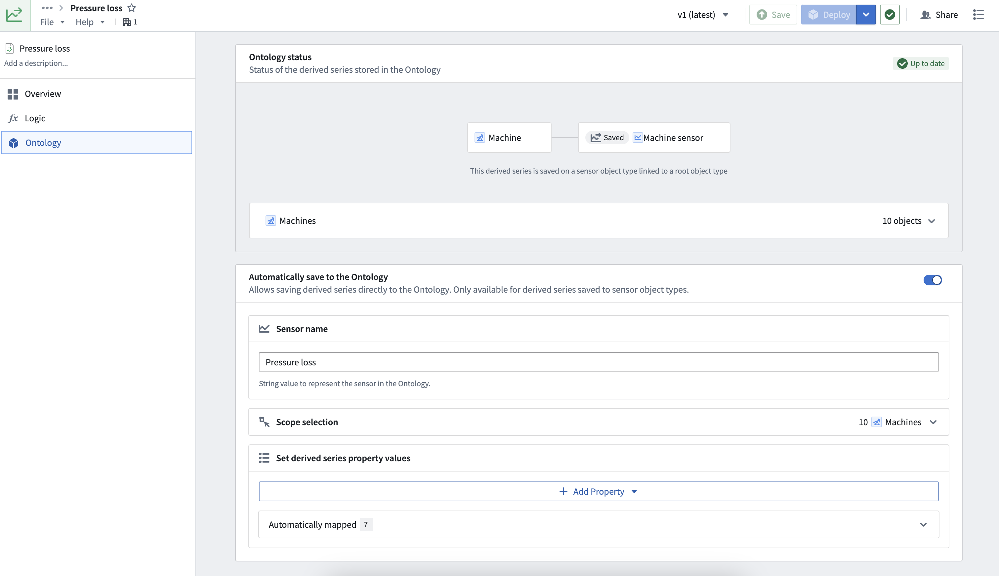
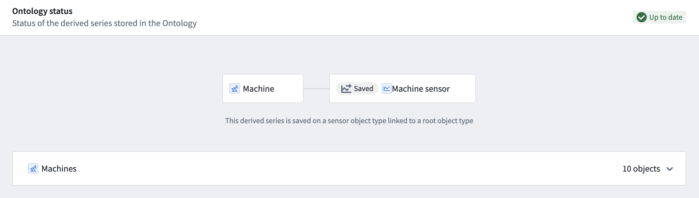
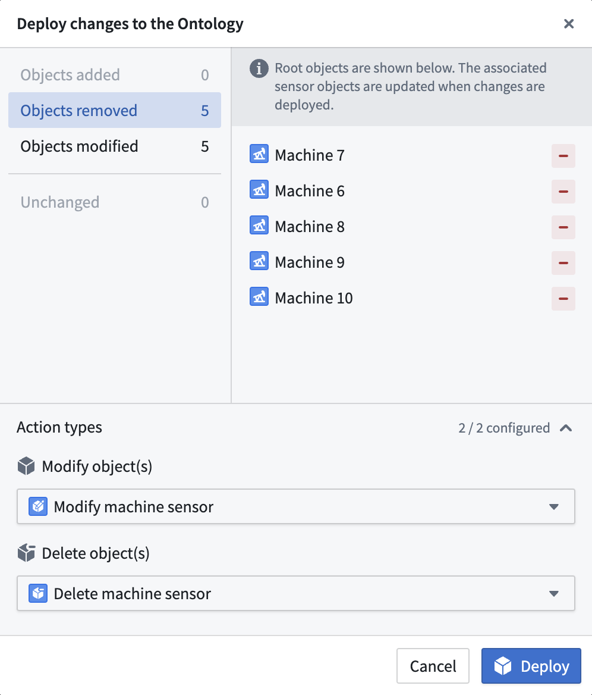
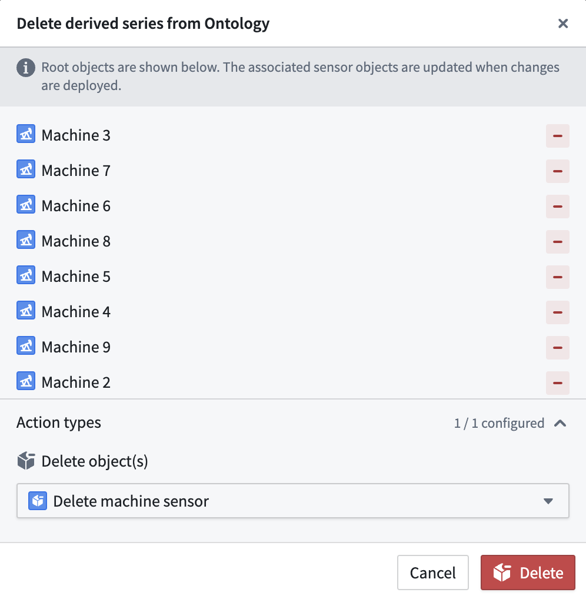

<!-- source: https://palantir.com/docs/foundry/time-series/manage-derived-series/ · mirrored 2026-08-07 from Palantir Foundry docs -->

# Manage derived series

After [creating a derived series](/docs/foundry/time-series/derived-series-create/) from the Time Series Catalog, you will be redirected to the management page for the derived series. The page represents both the generated Palantir resource and the codex template used to perform the derived series calculations. You can also navigate to this page from the platform file system.

The management page comprises the following three primary tabs.

## Overview

The **Overview** tab allows users to preview their logic, Ontology setup, and general derived series details.

Select the **title** or **description** texts to edit the title and description used in Quiver analyses and other applications. Select **Save** in the top right to review the changes and update the derived series display information.

## Logic

The **Logic** tab can be used to view and edit the derived series logic. Modify the time series cards inline to edit the logic. Select **Save** in the top toolbar to persist changes.

:::callout{theme="neutral"}
If the derived series is manually saved to the Ontology, saved changes to logic will immediately take effect unless the derived series is pinned to a particular version in the Ontology. See the [manual saving documentation](/docs/foundry/time-series/manual-ontology-saving/#2-bind-derived-series-to-an-object-type-in-the-ontology) to learn how to use a pinned version. Derived series objects created using automatic saving always reference a particular version.
:::

## Ontology

The **Ontology** tab is used to manage [automatic saving](/docs/foundry/time-series/derived-series-create/#6-configure-ontology-saving-options) Ontology options for a derived series. Options for automatic saving include a sensor name, a root object scope for templated derived series, and a property mapping.

Changes to the object scope must be saved and deployed. Select **Save** in the top toolbar to review and save scope changes. Once saved, select **Deploy** in the toolbar for the changes to be deployed to the Ontology.

### Ontology status

The Ontology status of a derived series indicates whether the derived series is up to date based on the current requested logic version and Ontology options.

For example, the following image shows the Ontology status card for an up-to-date templated derived series with a root object scope containing ten objects:

If a derived series is out of date with respect to what is requested be in the Ontology, then the status will indicate that the derived series is out of date and must be redeployed.

To update a derived series with respect to its Ontology options, you must **Deploy** the latest version to the Ontology. Select **Deploy** to view what must be updated in the Ontology for the derived series objects to match what is expected based on the Ontology options.

The following image shows a deploy dialog for an out-of-date templated derived series. You will be prompted to supply Action types for each associated update type. For example, to remove objects you must supply an Action type that deletes objects of the bound sensor object type.

The Ontology status and deploy dialog are similar for single derived series, though single derived series will always expect *only one object* to exist in the Ontology.

The following examples describe out-of-date derived series:

1. The derived series was just updated, but the existing objects in the Ontology no longer reference the latest logic.
2. In a templated derived series, a dynamic root object scope captures more objects after already being defined against all current objects. For example, if a root object scope is "all `Machines`" and a new `Machine` is added after deploying the derived series, then the derived series would expect that a sensor object exists for this new `Machine`. Since the original scope did not capture this new `Machine` object, the derived series is now out of date.

### Delete from Ontology

To delete sensor objects created by a derived series from the Ontology, select the dropdown arrow to the right of the **Deploy** button and choose **Delete from Ontology**. You will be prompted to supply an Action type for deleting the sensor objects.

