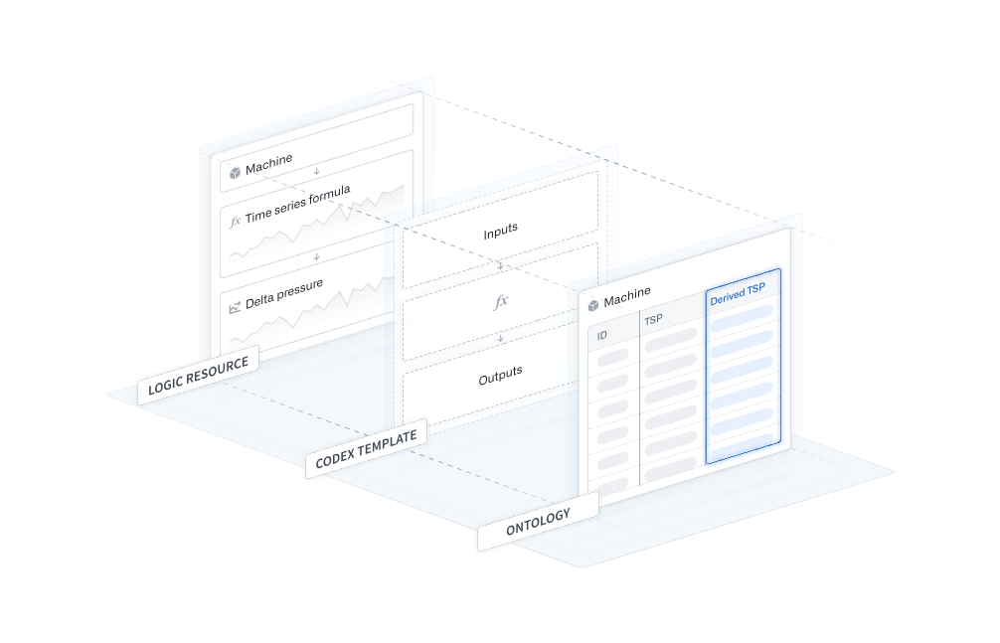
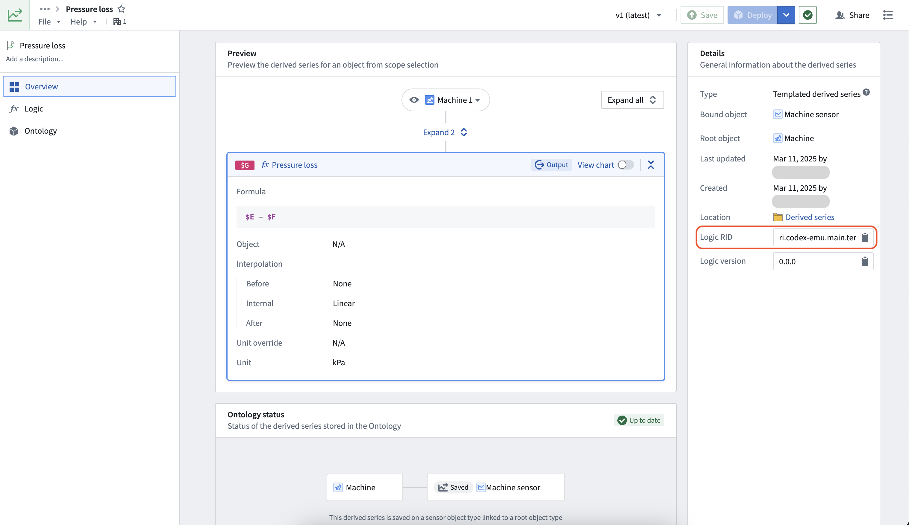
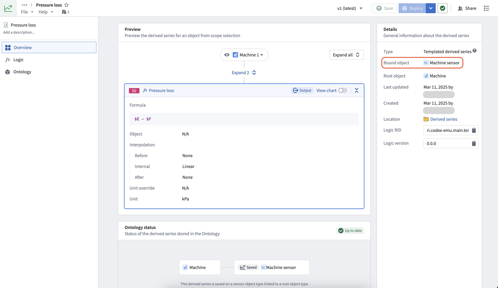
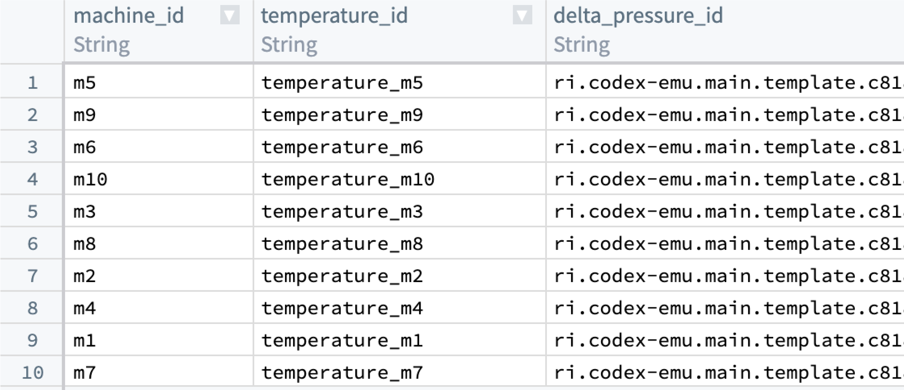
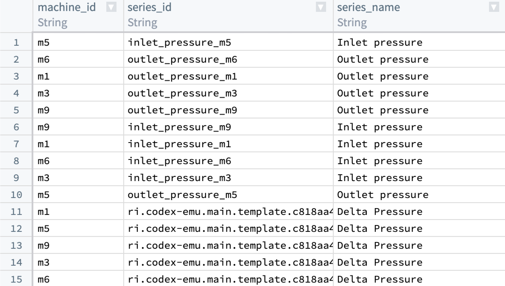

<!-- source: https://palantir.com/docs/foundry/time-series/manual-ontology-saving/ · mirrored 2026-08-07 from Palantir Foundry docs -->

# Manually save derived series to the Ontology

:::callout{theme="neutral"}
If you selected the option to [automatically save your derived series](/docs/foundry/time-series/derived-series-create/#6-configure-ontology-saving-options) to the Ontology in the creation dialog, this part of the setup is not required.
:::

The [derived series creation documentation](/docs/foundry/time-series/derived-series-create/) describes the process of preparing the **logic resource** used to manage the derived series. The **codex template** is a translation of the logic resource into a templated format that allows the logic to be resolved across any root object as long as it has the correct inputs.

Using the steps below, we can manually add the derived series to the Ontology by adding references to the templated logic on the time series property of the bound object type. Once added to the Ontology, the derived series will behave just like a raw time series and can be used across Palantir applications.



## 1. Access the codex template RID

Codex templates are hidden Palantir resources used to store templated derived series logic. You will need to find the codex template RID of your derived series before proceeding.

First, find your derived series resource. You can search for it by name, or locate the folder you specified in the [**Save derived series** dialog](/docs/foundry/time-series/derived-series-create/#7-select-a-resource-location). Open the **Overview** tab to view the [derived series management page](/docs/foundry/time-series/manage-derived-series/).

Copy the **Logic RID** from the **Derived series details** section.



## 2. Bind derived series to an object type in the Ontology

The bound object type is displayed in the **Details** section on the right of the [derived series management page](/docs/foundry/time-series/manage-derived-series/).



:::callout{theme="warning"}
The bound object type specified during derived series setup is the *only* object type from which the derived series template can be resolved.
:::

Derived series use [time series properties](/docs/foundry/time-series/time-series-properties/) (TSPs) the same as *raw* time series. However, instead of a series ID, the resource identifier (RID) of the codex template is used as the time series property value. For example:

```
ri.codex-emu.main.template.8da5f759-4b...
```

If you prefer to reference a specific version of logic, your TSP value should instead look like the following:

```
{"templateRid":"ri.codex-emu.main.template.8da5f759-4b...","templateVersion":"0.0.x"}
```

Review the options below, and choose whether to bind the derived series to a root or sensor object type.

### Option 1: Bind to a root object type

To bind a derived series to the root object type, create a new string type column (or use an existing column) in the root object type's backing data source and populate it with the codex template RID. In the example below, the `Delta pressure` derived series template RID is added across ten machines.



Navigate to Ontology Manager, and map the column containing the new codex template RIDs to a time series property (if it is not already mapped). Review how to [set up time series properties](/docs/foundry/time-series/time-series-properties/) for more information.

### Option 2: Bind to a sensor object type

You must create one sensor object for every root object to which this derived series will apply.

Enter the codex template RID into a column that backs the TSP of the bound object type’s backing data source. In our example, rows 1 through 10 refer to raw series IDs while rows 11 through 15 refer to a derived series through a codex template RID. In the example below, five sensor objects containing the `Delta pressure` derived series template RID are added.



## Derived series property data sources

Currently, data sources for derived series do not need to be listed in the containing time series properties data sources.

:::callout{theme="warning"}
Even if a time series property only references derived series, the time series property must still list a data source. As a workaround, any time series sync of the desired type can be used. Review how to [create a time series sync](/docs/foundry/time-series/time-series-syncs/) for more details.
:::
