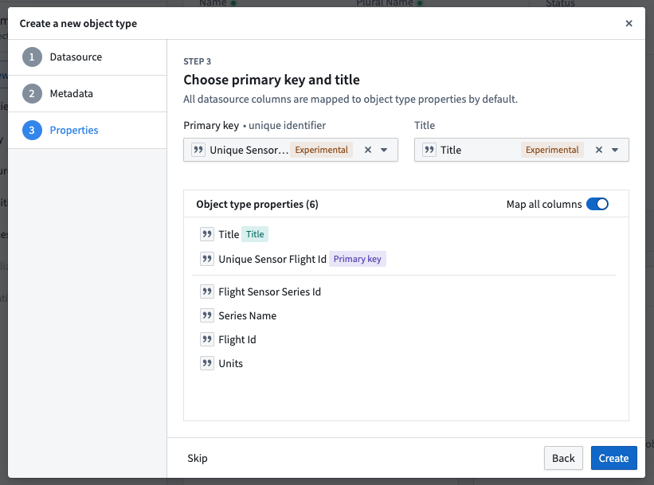
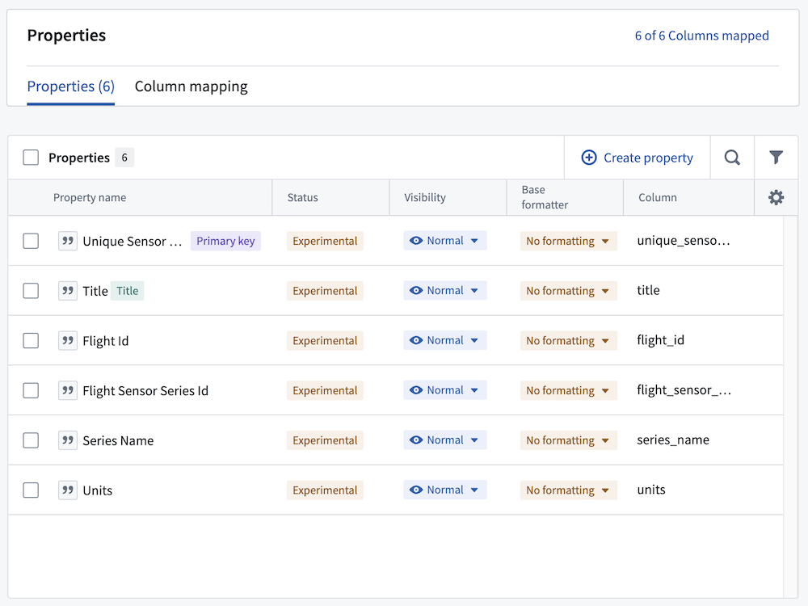
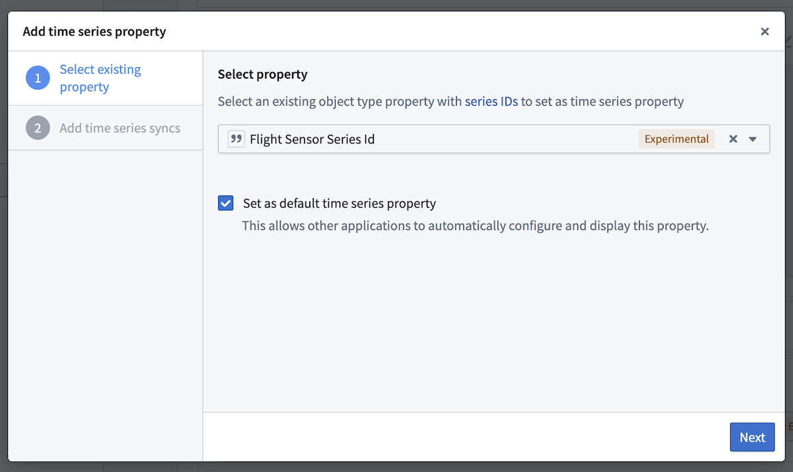
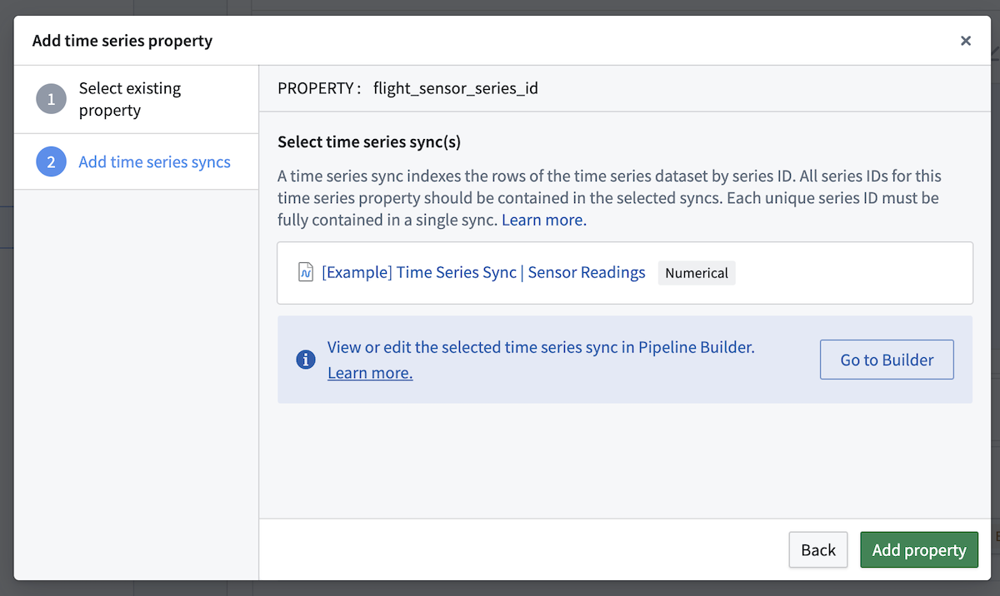
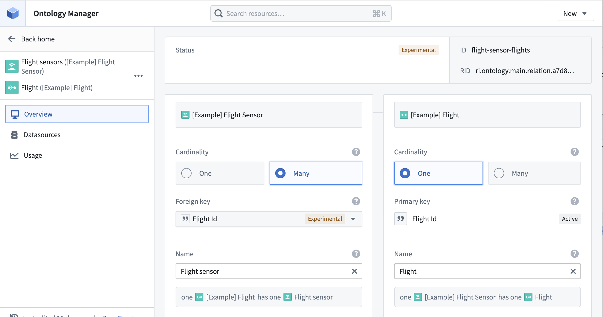
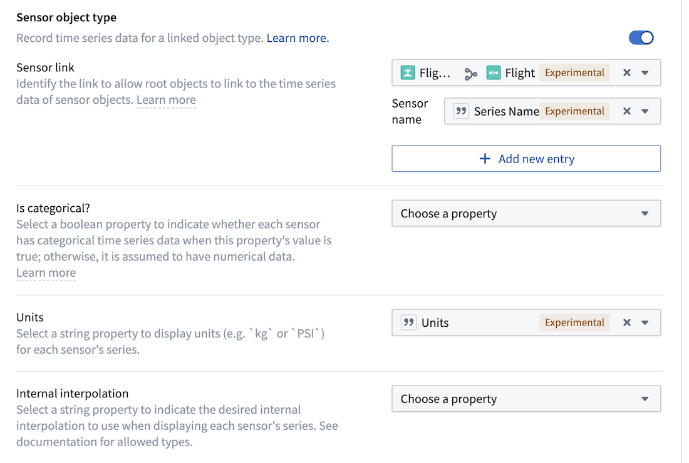

<!-- source: https://palantir.com/docs/foundry/time-series/sensor-object-end-to-end-ontology/ · mirrored 2026-08-07 from Palantir Foundry docs -->

# Create sensor object types with Ontology Manager

This guidance explains how to use Ontology Manager to create a sensor object type and link it to a root object type. Once you complete the steps below, you will be able to interact with a sensor object type in the platform. In this example, you will create a `Flight Sensor` object type and link it to a `Flight` root object type.

## Part I: Create the sensor object type

1. Navigate to Ontology Manager, and select **Object types** from the left side panel.
2. From the upper right corner of the screen, select [**New object type**](/docs/foundry/object-link-types/create-object-type/#create-a-new-object-type-with-the-helper).
3. In the configuration dialog that appears, configure your object type metadata.
4. In the **Properties** step, choose to back the object type with the `[Example] Sensors` dataset that you created with the [sensor data pipeline](/docs/foundry/time-series/sensor-object-end-to-end-pipeline/).
5. Then, in the **Property** field, select the string type `unique_sensor_flight_id` property to use as the primary key. You can also select **Sync all columns from datasource** or **Map all columns** if either of those options is available.
6. Choose the `Title` column as the title property, which allows the `Flight Sensor` object types to appear across the application with human-readable names.

7. Depending on your version of the platform you may see options to configure permissions and actions for the `Flight Sensor` object type. Our example does not require additional permissions or action configuration.

8. Once you have progressed through all the steps in the dialog, select **Create**.

From the **Properties** tab of the new `[Example] Sensors` object type, the properties should appear as in the screenshot below:

## Part II: Configure the time series property for the sensor object type

1. Navigate to the `[Example] Flight Sensor` object type in Ontology Manager and select the **Capabilities** tab from the left side panel.
2. From the **Time series property** section select **+ Add**.
3. Select the existing `Flight Sensor Series Id` property as the time series property, then select **Set as default time series property** so that it automatically appears in Quiver.

4. Select the time series sync that you created [in Pipeline Builder](/docs/foundry/time-series/sensor-object-end-to-end-pipeline/). In our example, it is called `[Example] Time Series Sync | Sensor Readings`.

5. Select **Add property** to save the time series property configuration.

## Part III: Link the sensor object type to a root object type

Add a link between the `[Example] Flight Sensor` and `[Example] Flight` object types using the steps below.

1. From the `[Example] Flight Sensor` view in Ontology Manager, select the **New** dropdown menu and choose **Link type**
2. On the left side of the link, choose the `[Example] Flight Sensor` object type. On the right, choose the `[Example] Flight` object type.
3. Set the cardinality for the left `Flight Sensor` object type as **Many**, and the right `Flight` object type as **One**, meaning the `Flight` object type has a one to many relationship to the `Flight Sensor` object type.
4. Set the `flight_id` column as a foreign key to the `Flight Sensor` object type, which will set `flight_id` as the primary key for the `Flight` object type.

Learn more about [link types](/docs/foundry/object-link-types/link-types-overview/).

## Part IV: Configure the sensor object type

In the time series section, ensure that the sensor object type toggle is on. Set up the `Sensor link` to use the recently created `Flight` to `Flight Sensor` link.

1. Set the **link** name as the `Series Name` column. Applications will surface the sensor object data under this series name.

2. Configure  **units** by selecting the **Units** dropdown menu in the sensor object type setup.

**Is categorical** and **Internal interpolation** can be inferred from properties on the sensor object type, but they are not required for this use case. **Is categorical** is only needed when it is important to delineate categorical time series values from numeric time series values.

**Internal interpolation** is used to enable applications like Quiver to infer series values between adjacent data points. Review our [Quiver documentation on interpolation](/docs/foundry/quiver/timeseries-visualize/) for more information.

3. Choose to **Save** the edits to the object type from upper right corner of the screen to view the changes in the Ontology and throughout the platform.

Now, you are ready to use the `Flight Sensor` and `Flight` object types in an operational context. Proceed in the documentation to learn how to [use sensor object type time series data in Workshop and Quiver](/docs/foundry/time-series/time-series-properties-use-case-operational/).

:::callout{theme="neutral"}
Configuration for **Is enum?** is not required for our example use case. `Is deprecated` and `Sparkline preview` properties should be ignored.
:::
