<!-- source: https://palantir.com/docs/foundry/time-series/sensor-object-end-to-end-operational/ · mirrored 2026-08-07 from Palantir Foundry docs -->

# Use sensor object type time series data in Workshop and Quiver

To start using sensor object type time series data, open the **Flight Sensor Data** module in Workshop. You can find the module using the platform [Quicksearch](/docs/foundry/compass/quicksearch/) feature. This example module will be a reference for you as you configure your own Workshop module using sensor object type time series data.

By the end of this guide, our module will enable you to filter down flights by departure time and airport. From there, the [Object Table widget](/docs/foundry/workshop/widgets-object-table/) will display a list of flights you can select to view the linked sensor object time series data.

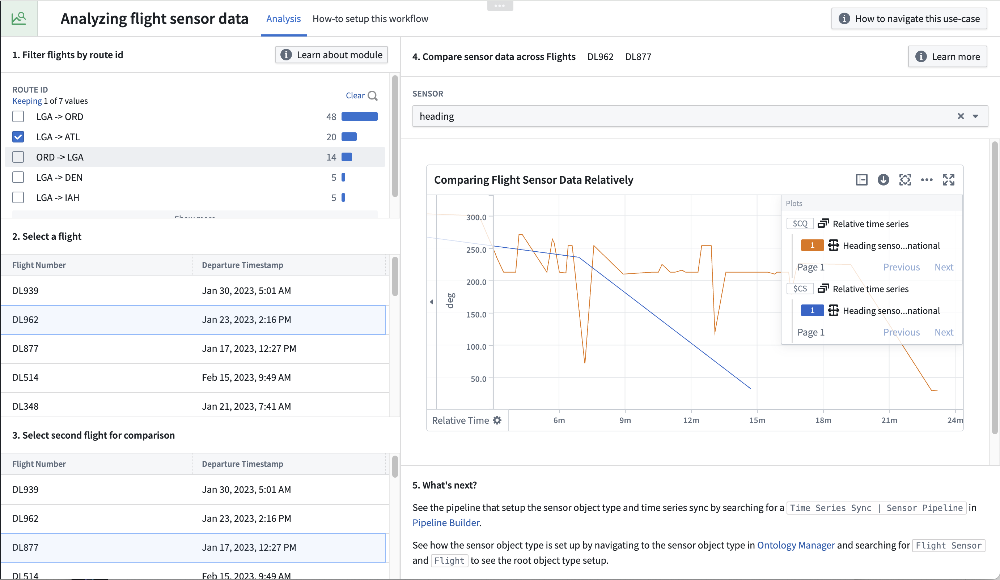

## Part I: Set up initial widgets in a Workshop module

The [Map](/docs/foundry/workshop/widgets-map/), [Object Table](/docs/foundry/workshop/widgets-object-table/), and [Filter](/docs/foundry/workshop/widgets-filter-list/) widgets of the module are standard Workshop features. Follow the steps below to configure these widgets before adding time series-specific widgets to the module.

### Filter flights by route ID

The [Filter List widget](/docs/foundry/workshop/widgets-filter-list/) should take the `Flight` object set and apply filters based on `route id`.

1. In your Workshop module, choose to **+ Add widget**, then select the Filter List widget.
2. In the right side configuration of the Filter List widget, create a new variable for the **Object set Input** and name it "Filter flights by route id". The **Starting object set** should use the `Flights with linked flight sensors` object type variable.

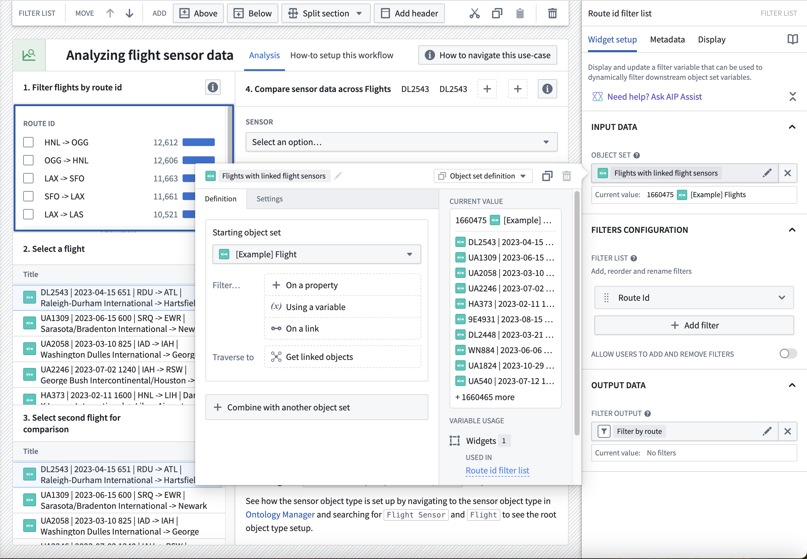

3. Add the `Route Id` property by selecting **+ Add filter**.
4. Move down to the **Filter output** field to find a filter output that was already created for you. Give it a descriptive name like "Flights filtered by route id"; no other configuration is required.

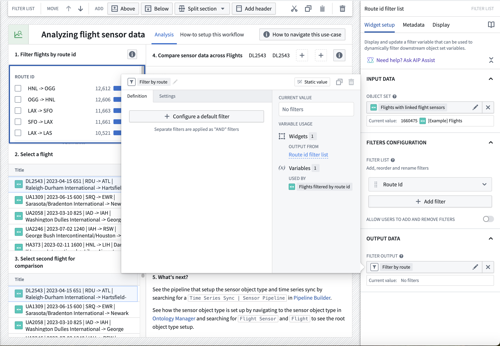

### Configure Object Table widgets to select flights for comparison

1. In your Workshop module, choose to **+ Add widget**, then select the Object Table widget.
2. In the configuration panel on the right in the **Input Data** dropdown menu, choose **+ New object set variable**.
3. Name the variable `Flights filtered by route id`.
4. Select the **Starting object set** and choose the existing variable `Flights with linked flight sensors`.
5. Select the filter **Using a variable**, and select the `Filter by route` variable.

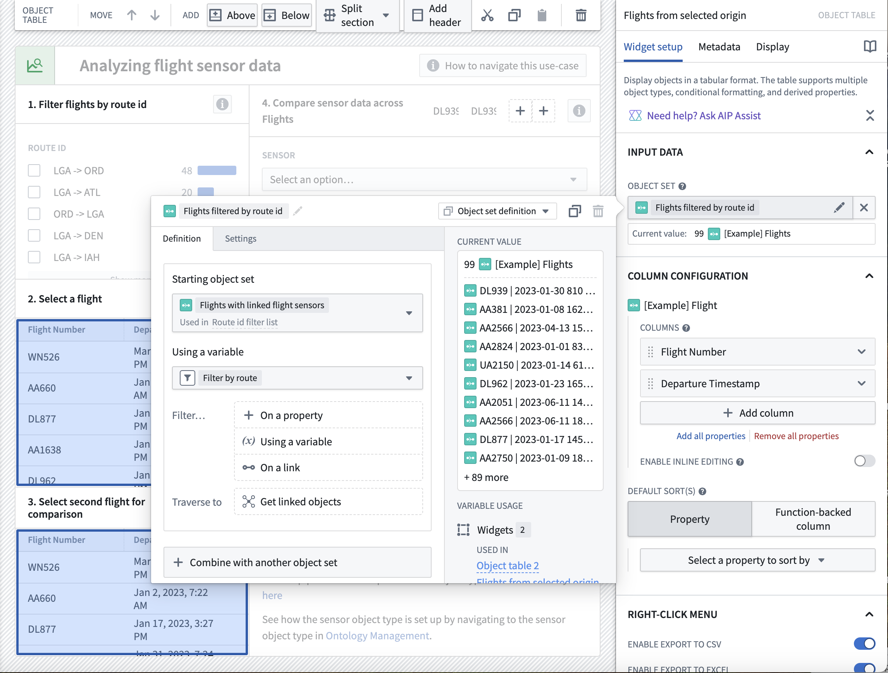

6. Select **+ Add column**, then **Departure timestamp** from the dropdown menu.
7. Scroll down to the **Selection** section and toggle on the **Enable active selection** option. This will configure an output of the selected object of the table.
8. Create a new variable from the **Active object** dropdown menu by selecting **New object set variable**. Rename the variable `Selected flight from table 1`. No other configuration is needed.

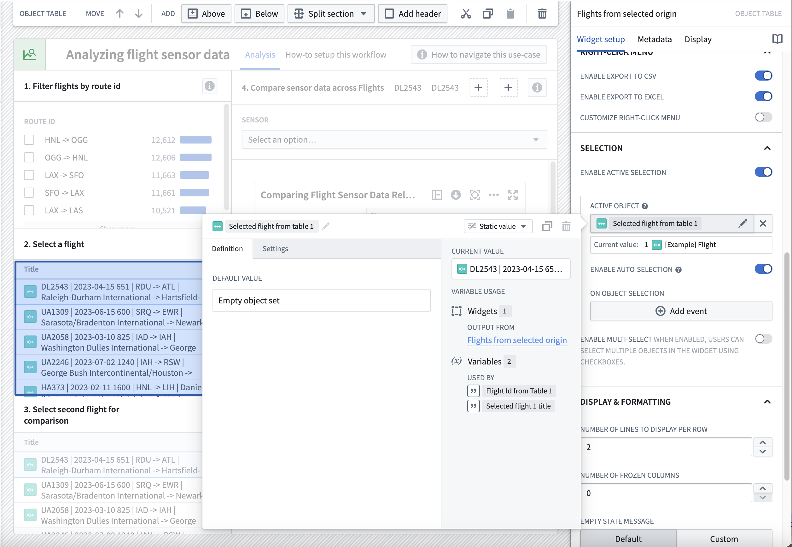

9. Repeat this process for a second table widget that takes in the `Flights filtered by route id` you created in steps 3-5 and create an output variable called `Selected flight from table 2`.

## Part II: Add sensor object type time series data from a root object type

### Create sensor name selector

Create a dropdown menu of desired series names to pass into the Quiver dashboard that you will create in later steps.

1. In your Workshop module, choose to **+ Add widget**, then select the String Selector widget.
2. In the widget configuration panel under **Option Generation**, select **+ Add Selector option**
3. Add options for `heading`, `vertical_speed`, `speed` and any other sensor name that you would like to display.

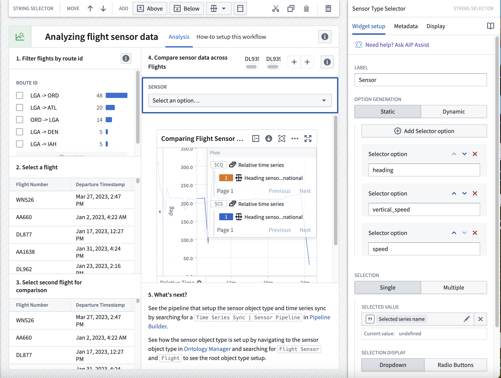

4. In the **Selection** section dropdown menu, choose the `Selected series name` variable.
5. Keep the default **Dropdown** option for the **Selection Display** configuration.

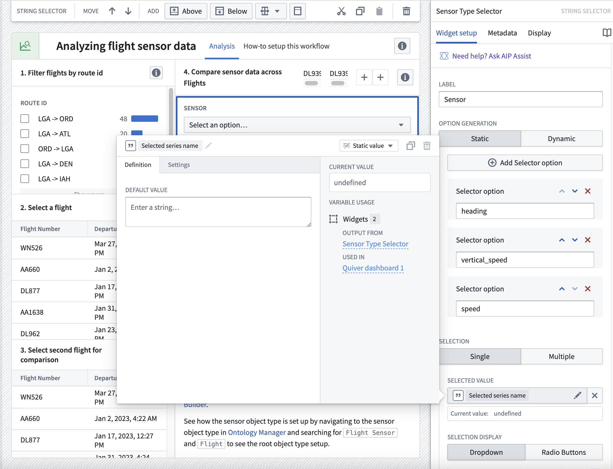

### Create flight ID variables

Now, you will create two variables representing the flight IDs of the flights selected from both the left and right tables. Each variable is a string backed by the `Flight Id` property from both the `Selected flight from table 1` and `Selected flight from table 2` variables configured in the Object Table widgets. You will pass these variables into the Quiver dashboard.

1. Navigate to the **Variables** from the left side of the Workshop module, and select **+** to add a new variable.
2. From the dropdown menu, select **String**.
3. From the next dropdown menu, select **Object property**.

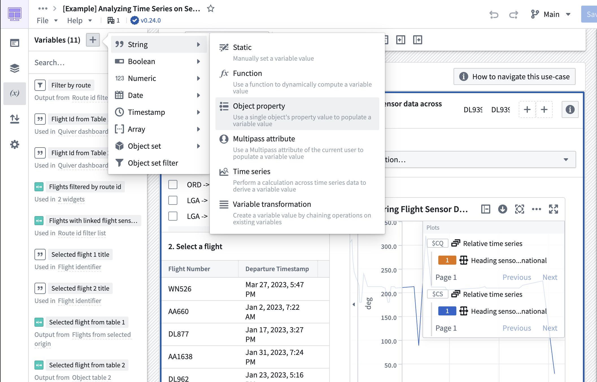

1. Choose the `Selected Flight from Table` variable as the object set with a single option, then the `Flight Id` as the property for the `Selected Flight Id` variable.

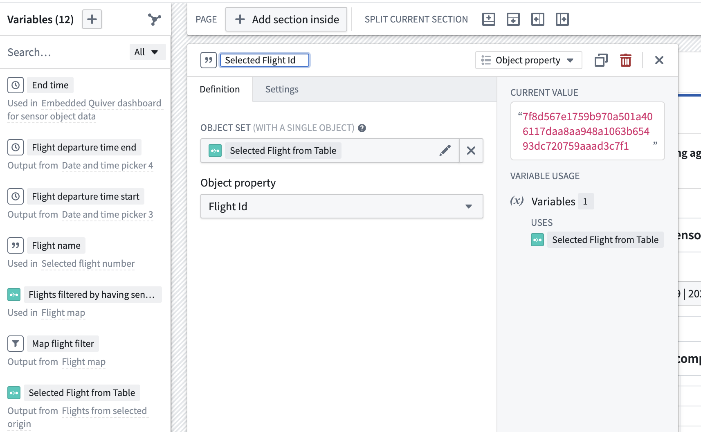

## Part III: Create a Quiver dashboard

The following guidances assumes a basic knowledge of navigating Quiver. To learn more about general Quiver functionality, review [our documentation](/docs/foundry/quiver/getting-started/).

This Workshop module contains an [embedded Quiver dashboard](/docs/foundry/quiver/dashboards-overview/). Follow the instructions below to set up the time series chart and metric card shown in the dashboard.

### 1. Create a Quiver analysis using the `Flight Sensor` object type

#### Use the Flight Sensor object set

Create a [new Quiver analysis](/docs/foundry/quiver/getting-started/) with the `Flight Sensor` object type set by selecting **Objects** from the top menu bar and searching for `Flight Sensor` object type. Select **Add object set** to add the object set table to the canvas.

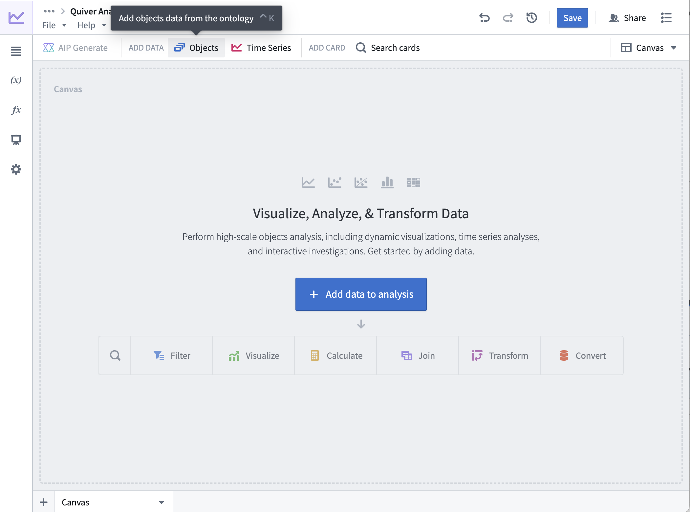

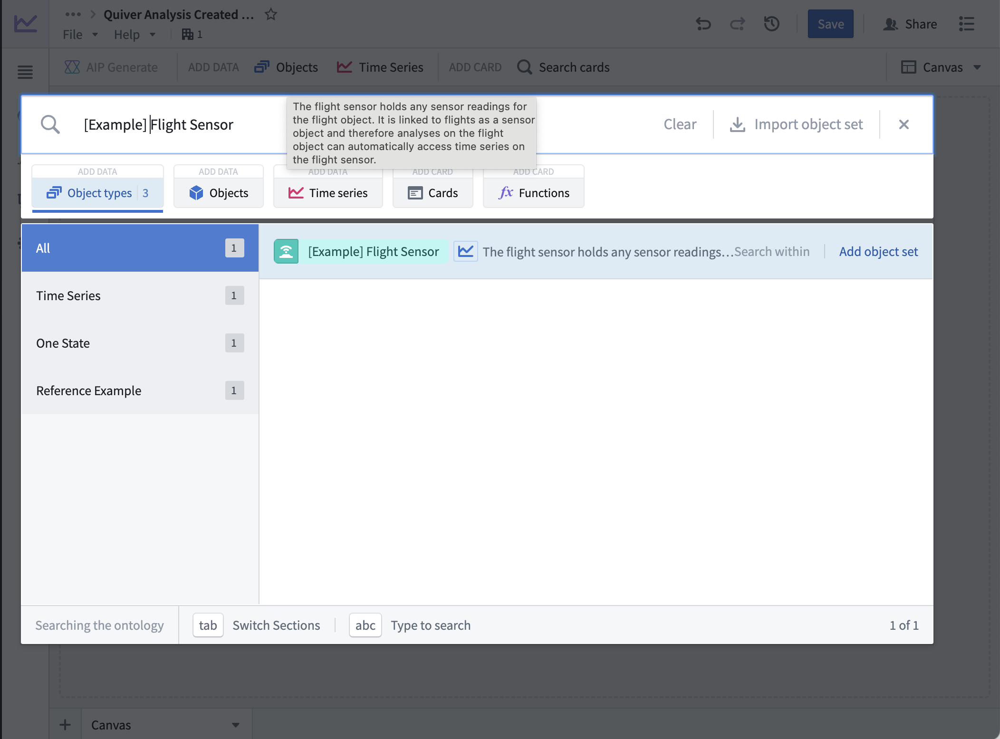

#### Add two string parameters for the flight IDs

1. From the left side of the screen, select the **(x)** to open the **Parameters** configuration.
2. Select **+** to add a parameter, then select **String** from the dropdown menu. The string parameter will represent the flight ID, and you will retrieve `Flight Sensor` objects with that `flight_id` property.
3. Rename the string parameter to "Flight Id" for easier tracking.
4. Repeat steps 1-3 for the second flight ID, and label it "Flight Id 2".

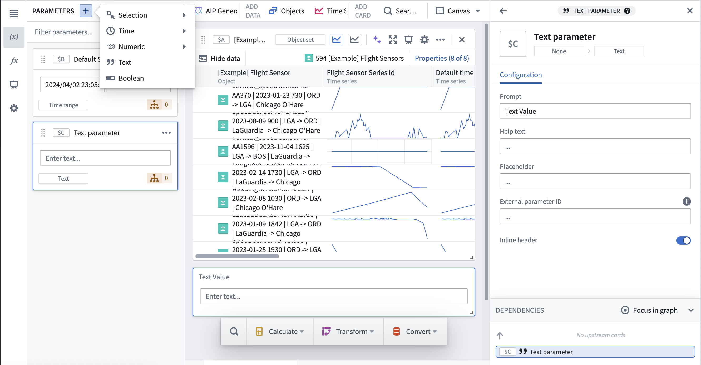

#### Add a string parameter for the sensor name

1. Navigate to the left side of the screen.
2. Select **+** to add a parameter, then select **String** from the dropdown menu. The string parameter will represent the sensor name, and you will filter the `Flight Sensor` objects matching the sensor name passed in from the Workshop module.
3. Rename the string parameter to "Sensor name" for easier tracking.

#### Add object set filters for all parameters

1. Hover over the `Flight Sensor` object set table to show the **Search** menu, or select **Search cards** to add a filter object set card. This card will filter the sensor objects by the selected `flight id`. Review our [object set filters documentation](/docs/foundry/quiver/objects-filter/) for more information.

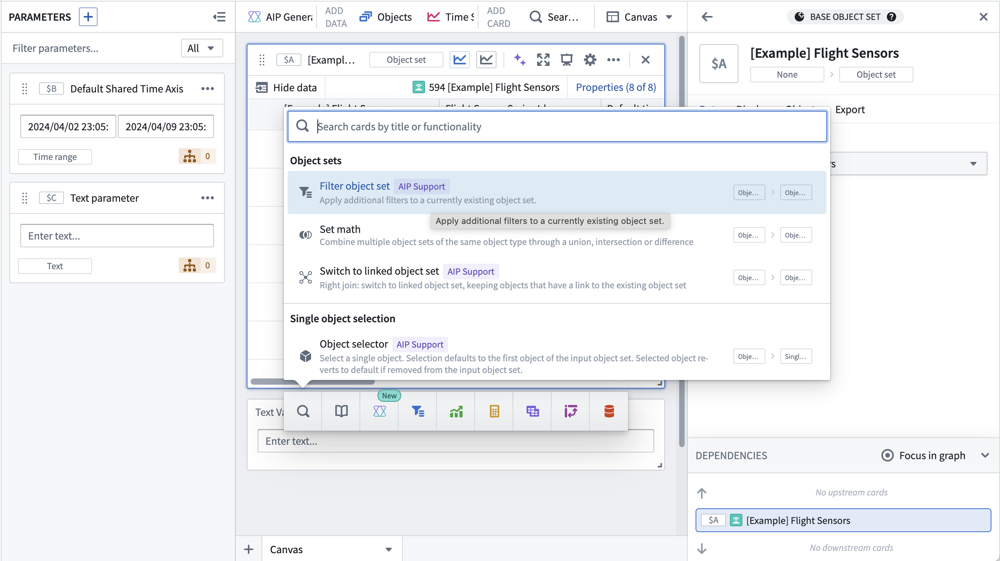

2. Add a filter by selecting **Add a filter to limit your resulting object set**, then selecting the option for **...where flight id is**.

3. Select the **String** variable in the dropdown menu, and select the `Flight Id 1` string parameter you made in the previous step.

4. Add another filter by selecting **Add a filter to limit your resulting object set**, then select the option for **...where series name is**.

5. Choose **is(exact match)** from the dropdown menu, then select the **String** variable.

6. Select the `Sensor name` string parameter that you created earlier.

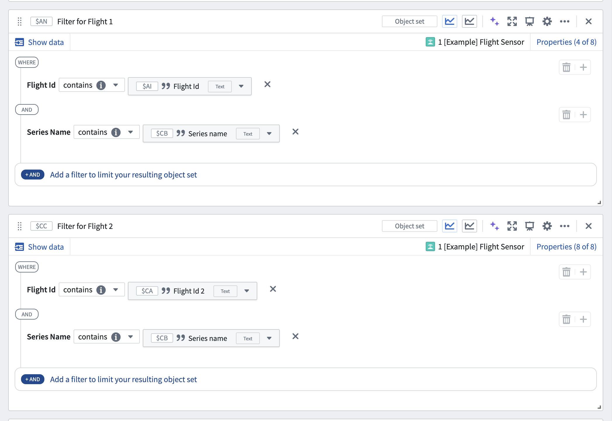

#### Add a grouped time series plot of flight IDs

1. Hover over the filter object set card to show the **Search** menu, or select **Search cards** to add a grouped time series plot. This will plot all the time series properties on the object and put them on a plot. In this case, you would expect this grouped time series plot to only contain one time series for one sensor object.

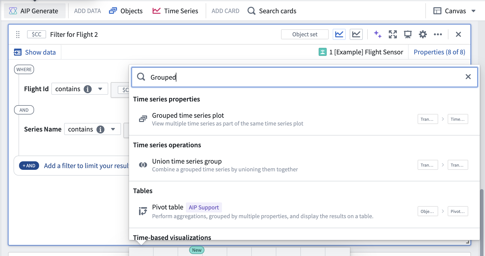

2. Hover over the time series plot configuration to find the **Configure plot** icon and open the configuration panel.
3. Under **Batch Time Series Options**, find the **Time series column** dropdown menu and select **Default time series property**. This will ensure that the plots show up with the object name instead of the name of the series ID column.

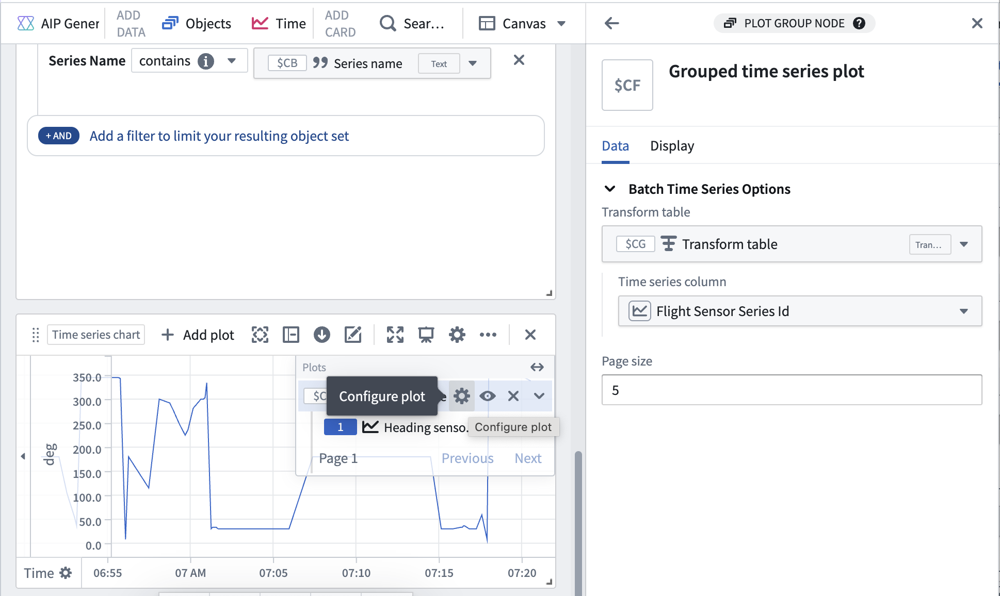

4. Repeat these steps for the filter card created for the `Flight Id 2` parameter. You should then have two separate charts for grouped time series.

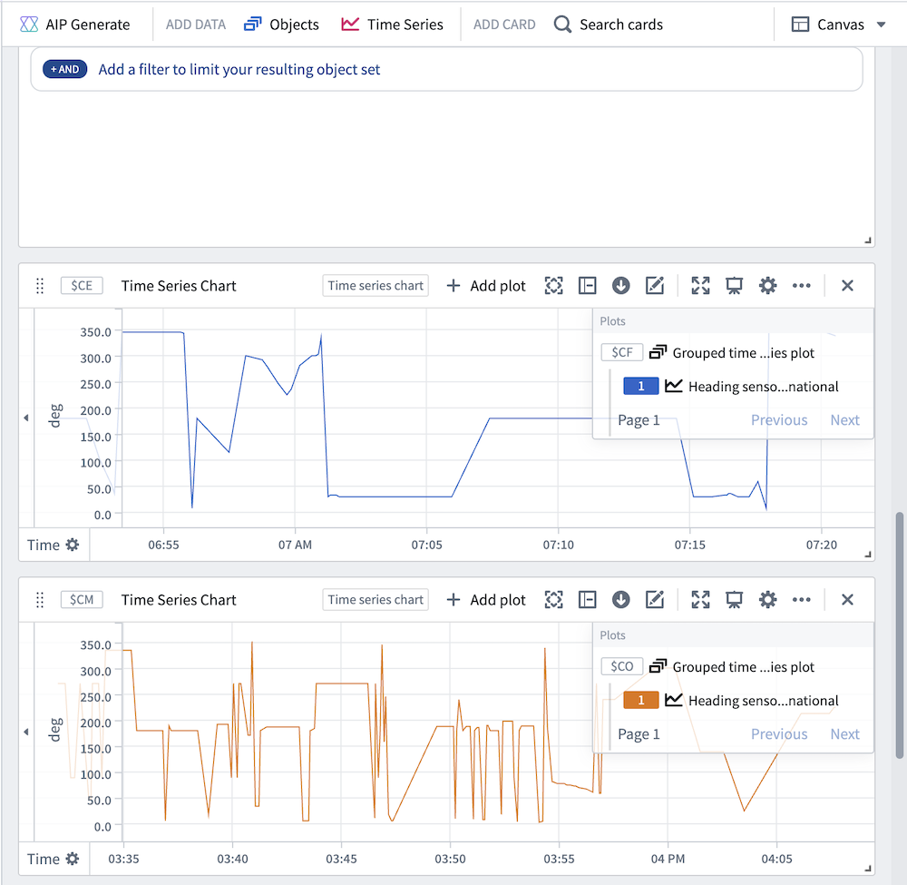

#### Overlay plots and add relative time shift

1. Select the grouped time series plot to access the quick actions menu.
2. Select **Transform** and search for a **Relative time series** card.

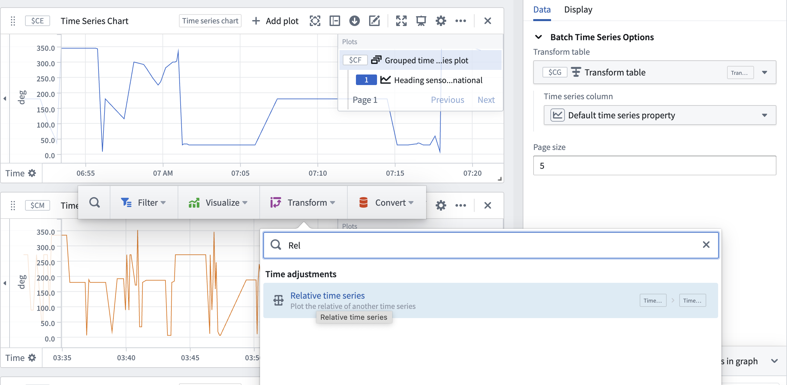

3. Repeat for the second grouped time series plot.
4. Then, in the second grouped time series plot, select the **Configure plot** option and navigate to the **Display** tab of the configuration panel.
5. Under **Colors**, select a color to differentiate it from the previous plot. In this example, orange is selected to optimize for visual contrast with blue.

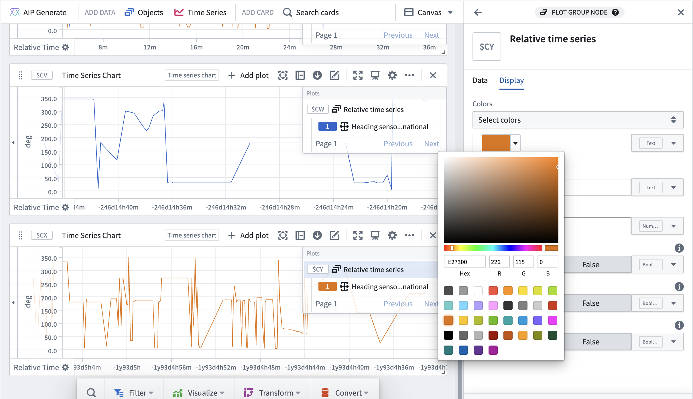

6. Select one of the grouped time series plots and drag it onto the other plot to condense into one chart. You may notice plots seem to disappear. You will need to make the plots use the correct extents to appear together.

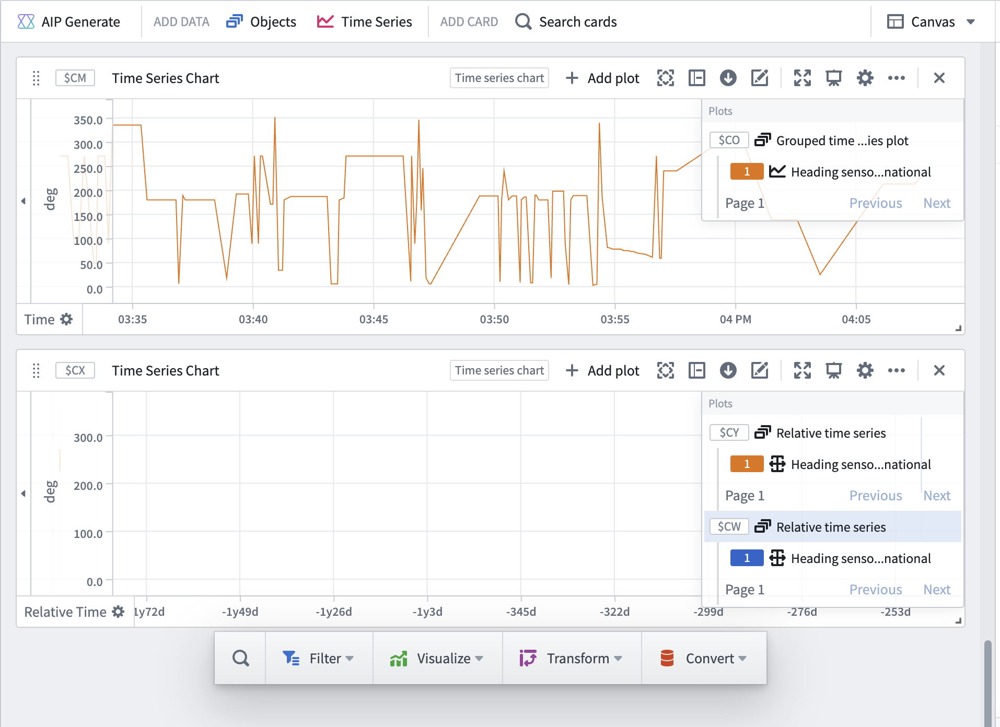

7. Select the plot configuration for the **Relative time series** card. Under  **Relative Time Options**, toggle on the **Use source extent** setting. Ensure that the **Relative to** dropdown menu is set to **Start**.

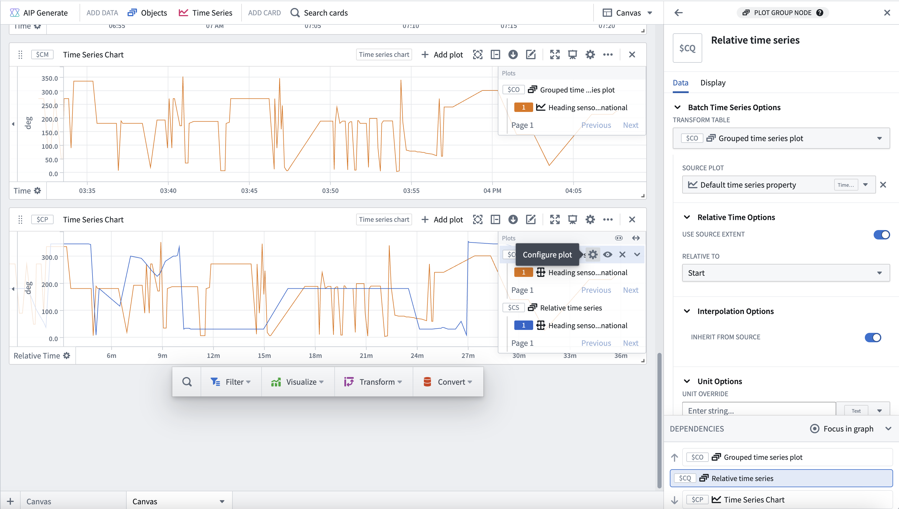

#### Add charts to new dashboard

1. Choose to **+ Create new dashboard** from the **Dashboards** tab to the left.
2. Add the time series chart by selecting **Add to new dashboard** from the respective cards.

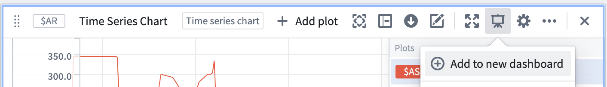

### 2. Configure the new dashboard

Navigate to the dashboard by selecting **View dashboard**, or access it from the **Dashboard** tab on the left side of your screen.

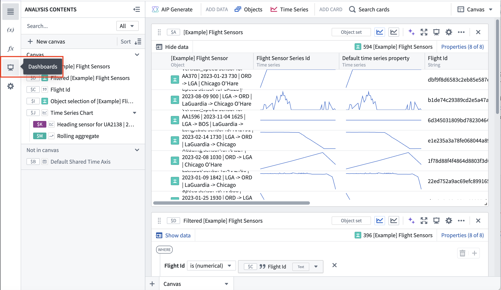

#### Resize and name the cards

Make sure the object selection card is at the top of the dashboard and rename the widgets to a useful name. For example, "Select an object" and "Flight sensor rolling 10 minute aggregate".

#### Add a string input to the dashboard

Select the **Settings** cog in the dashboard to open the dashboard configuration panel and add the following string inputs:

* Input for `Flight Id 1`.
* Input for `Flight Id 2`.
* Input for `Sensor name`.

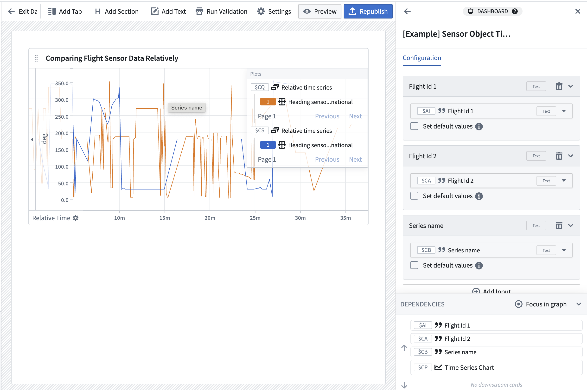

#### Publish dashboard

Rename your dashboard so that it is easily searchable from the Workshop module. In this example, the dashboard is named `[Example] Sensor Object Time Series Data | Flight Sensor Reading Comparison`.

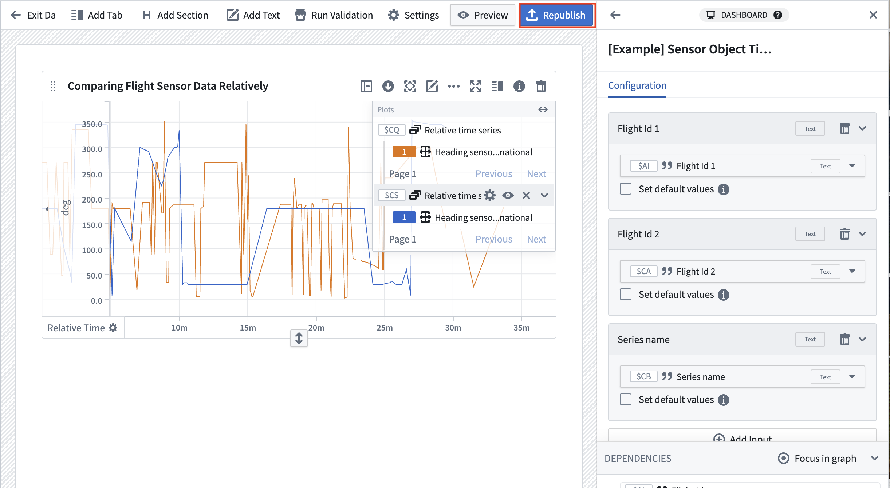

Review our [Quiver dashboard documentation](/docs/foundry/quiver/dashboards-overview/) for more information on how to create and customize a Quiver dashboard.

## Part IV: Embed your dashboard in Workshop

1. Return to the [Workshop module](#part-i-set-up-initial-widgets-in-a-workshop-module) you created earlier in this guide.
2. Choose to add a Quiver Dashboard widget, then select your new dashboard.

If necessary, you can navigate back to the dashboard and start an analysis by editing the Workshop module, selecting the configuration of the Quiver dashboard widget, and choosing to view the Quiver dashboard. Then select **Edit** to view the backing analysis.

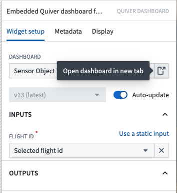

Review [our documentation](/docs/foundry/quiver/dashboards-workshop/) for more information on how to customize a Quiver dashboard in Workshop.
