<!-- source: https://palantir.com/docs/foundry/time-series/sensor-object-end-to-end-pipeline/ · mirrored 2026-08-07 from Palantir Foundry docs -->

# Create sensor object type data in Pipeline Builder

The pipeline you create with this guide will transform an imported flight sensor reading dataset to create a sensor object type backing dataset, then transform the sensor readings to a time series format to create a time series sync output. This data will then be used to create a sensor object type to use in the platform. The final pipeline at the end of this guide should look like the image below:

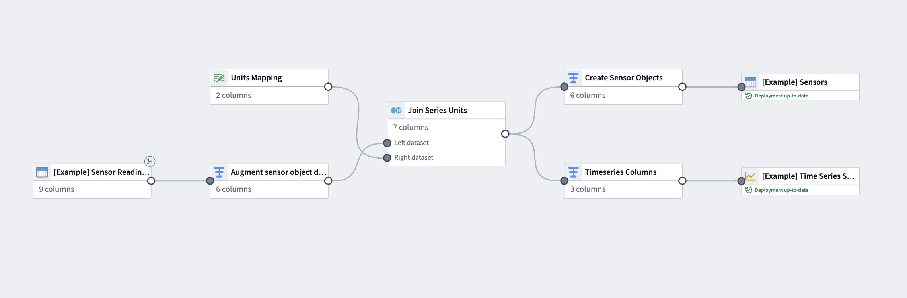

The example provided in this use case shows one way to transform sensor data from a source dataset. Though sensor readings come in different shapes with a large variety of possible schemas, our example uses a common schema; each row represents singular sensor readings for multiple sensors (for example, speed or altitude) that are tied to a flight (and, therefore, a `flight_ID` to serve as a foreign key to the `Flight` object).

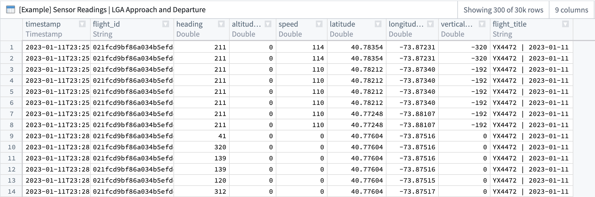

| timestamp        | flight\_id     | heading | altitude | speed | latitude | longitude | vertical\_speed | flight\_ title |
| ---------------- | ------------- | ------- | -------- | ----- | -------- | --------- | -------------- | ------------- |
| 2023-01-11T23... | 021fcdbsd ... | 211     | 134      | 50    | 40.78354 | -73.87231 | -320           | YX4472...     |

This guide assumes a basic understanding of Pipeline Builder. Review our [Pipeline Builder documentation](/docs/foundry/pipeline-builder/overview/) for information on general pipeline guidance. This use case example also assumes that the flight sensor reading data has already been [imported into a pipeline](/docs/foundry/pipeline-builder/datasets-add/).

## Part I: Enrich sensor reading data

Once the sensor reading dataset is added to a new pipeline, you will need to add some metadata.

### 1. Apply transforms to reformat sensor readings

From the sensor reading dataset, apply transforms using the steps below.

#### Unpivot data to merge series values

Since this dataset contains time series data in different columns, you must use an unpivot transform to merge it into one value column so the data can match the required schema for a time series sync, as shown below:

* **series ID:** `string` | The series ID for the set of timestamp and value pairs referred to by a TSP, which must match the TSP's series ID.
* **timestamp:** `timestamp` or `long` | The time at which the quantity is measured.
* **value:** `integer`, `float`, `double`, `string` | The value of the quantity at the point that it is measured. A string type indicates a categorical time series; each categorical time series can have, at most, 10,000 unique variants.

The unpivot transform shown below places values for both `altitude` and `speed` into the same `series_value` column. Those original column names are outputs to the new `series_name` column so that parent root objects can identify what each sensor represents (`altitude`, for example).

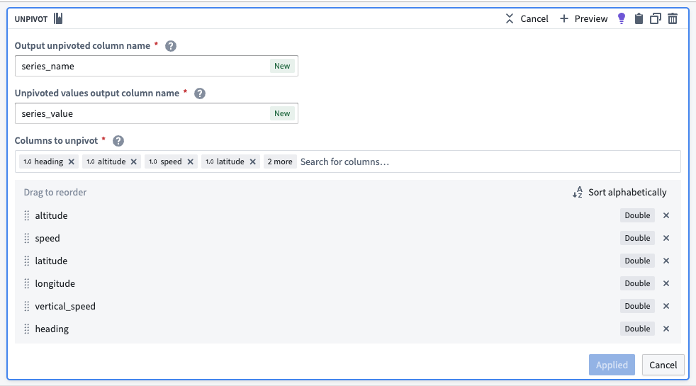

The transformed dataset should preview with the new `series_value` and `series_id` columns:

| series\_name | series\_value | timestamp        | flight\_id    | flight\_ title |
| ---------   | ------------ | ---------------- | ------------ | ------------- |
| altitude    | 134          | 2023-01-11T23... | 021fcdbsd... | YX4472...     |
| speed       | 114.00       | 2023-01-11T23... | 021fcdbsd... | YX4472...     |

#### Concatenate primary keys to create the series ID

Now, you can use the concatenate strings transform to create the series ID (the identifier for the associated time series values). Use the transform to combine the `series_name` (what each sensor represents) with the primary key of each object.

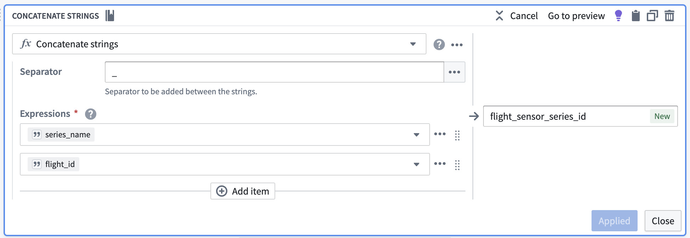

| flight\_sensor\_series\_id | series\_name | series\_value | timestamp        | flight\_id    | flight\_ title |
| ----------------------- | ---------   | ------------ | ---------------- | ------------ | ------------- |
| altitude\_021fcdbsd...   | altitude    | 134          | 2023-01-11T23... | 021fcdbsd... | YX4472...     |
| speed\_021fcdbsd...      | speed       | 114.00       | 2023-01-11T23... | 021fcdbsd... | YX4472...     |

#### Remove null values

Apply a filter transform to remove any rows containing `null` values that will not be used in our time series calculations.

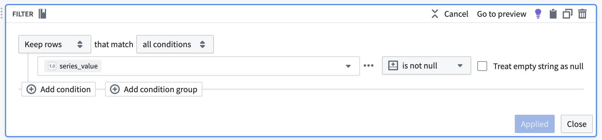

### 2. Add units to the dataset

#### Manually upload a units dataset

Since the original example sensor reading dataset does not include units, you must add a generated dataset to map units to the series name. From the upper left corner of the Pipeline Builder graph, select **Add data**, then **Enter data manually**. Create a column called `series_name` and another called `units`. If necessary, you can repeat this step for internal interpolation (though it is not required for our example).

**Internal interpolation** is used to enable [Quiver](/docs/foundry/quiver/overview/) to infer series values between adjacent data points. An internal interpolation column would provide a property for the ontology to save the interpolation settings per sensor object. Quiver will rely on that property when visualizing the time series data. Review [our documentation on interpolation](/docs/foundry/quiver/timeseries-visualize/) for more information.

:::callout{theme="neutral"}
Some sensor reading datasets do include units; in these cases, you can skip this step and proceed with [creating a sensor object type backing dataset](#3-concatenate-strings-to-create-title-properties-for-objects).
:::

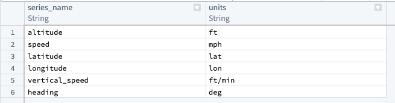

#### Create a join to combine the units and sensor datasets

Using the join board, create a join that combines data from the units and sensor datasets. Be sure the following configuration are set:

* Add a **Left join** and match by `series_name`.
* Auto-select columns from the left dataset.
* Select only the `units` column as the right column.

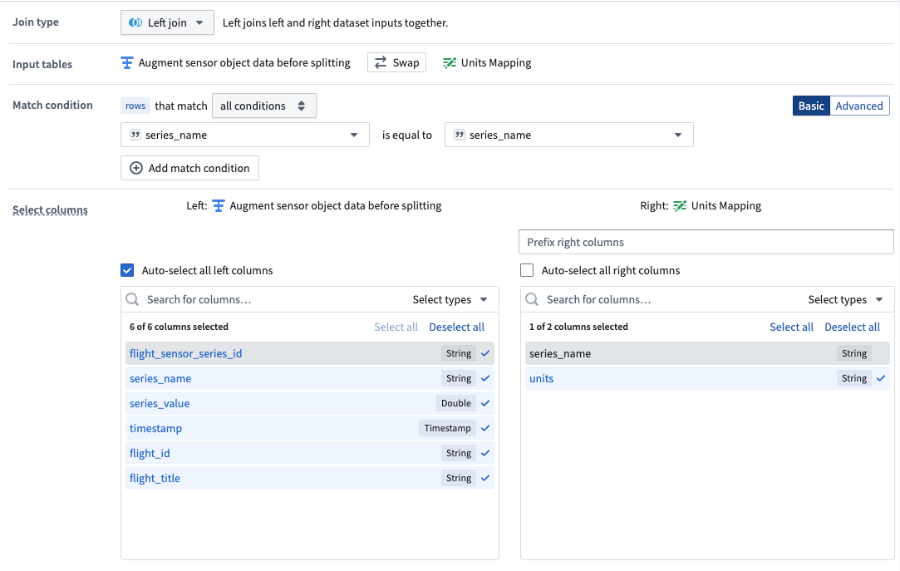

The data should preview with the new `units` column, as shown below:

| flight\_sensor\_series\_id | series\_name | series\_value | timestamp        | flight\_id    | flight\_ title | units |
| ----------------------- | ---------   | ------------ | ---------------- | ------------ | ------------- | ----- |
| altitude\_021fcdbsd...   | altitude    | 134          | 2023-01-11T23... | 021fcdbsd... | YX4472...     | ft    |
| altitude\_021fcdbsd...   | altitude    | 155          | 2023-01-11T23... | 021fcdbsd... | YX4472...     | ft    |
| speed\_021fcdbsd...      | speed       | 114.00       | 2023-01-11T23... | 021fcdbsd... | YX4472...     | mph   |
| speed\_021fcdbsd...      | speed       | 135.00       | 2023-01-11T23... | 021fcdbsd... | YX4472...     | mph   |

## Part II: Create a sensor object type backing dataset

Now, you are ready to create the sensor object type. Follow the steps below to apply transforms to the join output to create a dataset that will ultimately back the sensor object type.

### 1. Drop duplicates to create one row per sensor

A sensor object represents one, and only one, collection of related time series data (the `altitude` for a particular flight, for example). Since each related time series collection is uniquely identified by a `flight_sensor_series_id`, you can assume that keeping only one row per unique flight sensor series ID corresponds to exactly one sensor object. Using a drop duplicates transform on the generated `flight_sensor_series_id`, you can create one row per sensor object. You will remove the rest of the series data (timestamp and value) in a later step.

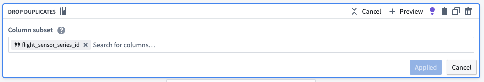

The dataset should look as follows:

| flight\_sensor\_series\_id | series\_name | series\_value | timestamp        | flight\_id    | flight\_ title | units |
| ----------------------- | ---------   | ------------ | ---------------- | ------------ | ------------- | ----- |
| altitude\_021fcdbsd...   | altitude    | 134          | 2023-01-11T23... | 021fcdbsd... | YX4472...     | ft    |
| speed\_021fcdbsd...      | speed       | 114.00       | 2023-01-11T23... | 021fcdbsd... | YX4472...     | mph   |

### 2. Hash the series ID to create a primary key

Since each sensor object must be uniquely identifiable, you must create a primary key for each one using the hash sha256 transform. You could reuse the `series_id` since it should be unique across all of these sensor objects, but hashing is a more direct indicator that the `series_id` should only be used as a unique identifier.

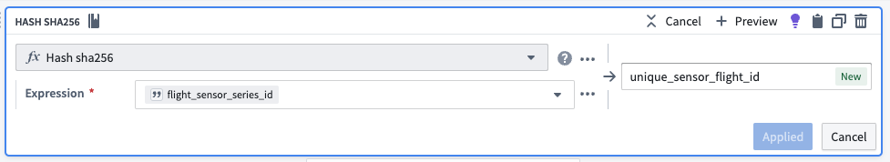

The dataset should preview as follows:

| unique\_sensor\_flight\_id  | flight\_sensor\_series\_id | series\_name | series\_value | timestamp        | flight\_id    | flight\_ title | units |
| ------------------------ | ----------------------- | ---------   | ------------ | ---------------- | ------------ | ------------- | ----- |
| 2492af5a2fe62c78ad8d...  | altitude\_021fcdbsd...   | altitude    | 134.00       | 2023-01-11T23... | 021fcdbsd... | YX4472...     | ft    |
| ec4808668f4b48cc5104...  | altitude\_011794756...   | altitude    | 0.0000       | 2023-01-22T17... | 011794756... | UA1878...     | ft    |

### 3. Concatenate strings to create title properties for objects

Now, you should create human-readable title properties for our sensor objects using the concatenate strings transform. Even though the sensor objects will embed into the object view of another `Flight` object, creating a dedicated name for a sensor object will make it more intuitive for users to build and analyze sensors for use in the platform.

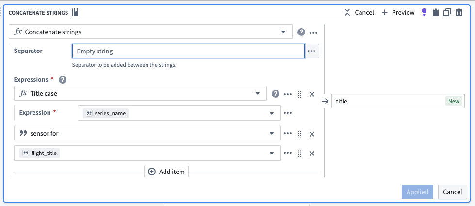

The dataset should preview as follows:

| title                         | unique\_sensor\_flight\_id  | flight\_sensor\_series\_id | series\_name | series\_value | timestamp        | flight\_id    | flight\_ title | units |
| ----------------------------- | ------------------------ | ----------------------- | ---------   | ------------ | ---------------- | ------------ | ------------- | ----- |
| Altitude sensor for YX4472... | 2492af5a2fe62c78ad8d...  | altitude\_021fcdbsd...   | altitude    | 134.00       | 2023-01-11T23... | 021fcdbsd... | YX4472...     | ft    |
| Altitude sensor for UA1878... | ec4808668f4b48cc5104...  | altitude\_011794756...   | altitude    | 0.0000       | 2023-01-22T17... | 011794756... | UA1878...     | ft    |

### 4. Drop unnecessary columns

Since our sensor objects only represent the sensors themselves, you can remove the remaining `series_value` and `timestamp` columns with a drop columns transform. Those columns are represented on the time series property and will be linked to the sensor in the Ontology based on the `flight_sensor_series` value. Additionally, you will drop the `flight_title` column since it is not needed for our sensor object types.

You will keep the `flight_id` so that sensor objects (`Flight Sensors`) can be linked to their root object (`Flights`).

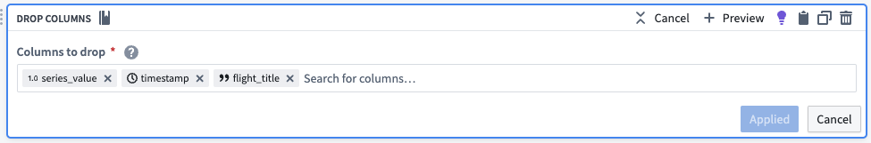

The dataset should preview as follows:

| title                         | unique\_sensor\_flight\_id  | flight\_sensor\_series\_id | series\_name | flight\_id    | units |
| ----------------------------- | ------------------------ | ----------------------- | ---------   | ------------ | ----- |
| Altitude sensor for YX4472... | 2492af5a2fe62c78ad8d...  | altitude\_021fcdbsd...   | altitude    | 021fcdbsd... | ft    |
| Altitude sensor for UA1878... | ec4808668f4b48cc5104...  | altitude\_011794756...   | altitude    | 011794756... | ft    |

### 5. Add a dataset output to back sensor object type

Select `Add output` and then select `Add dataset`. The resulting dataset should mirror the schema created in the transform. Any newer changes may require updating the schema in the resulting dataset.

## Part III: Create the sensor object type time series sync

### 1. Transform the sensor readings to a time series sync format

Using the select columns transform, you will only keep the columns that are required for the time series sync: `series_id`, `timestamp`, and `value`. The backing dataset will hold values for all sensors, regardless of what they are measuring (both `altitude` and `speed`, for example). You can use the generated `flight_sensor_series_id` for the `series_id` as a unique identifier for a particular set of sensor data. For example, Flight A445B from LGA to LAX will have a linked sensor object for `speed` that will hold the sensor data for speed on that flight. Similarly, it will also have a linked sensor object for `altitude`.

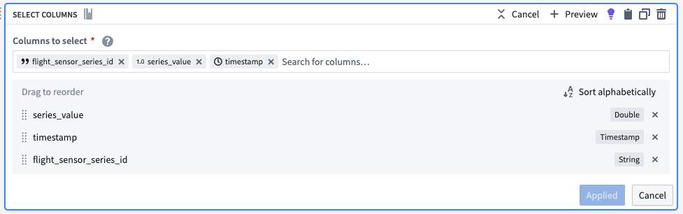

The dataset output should preview as follows:

| flight\_sensor\_series\_id | series\_value | timestamp        |
| ----------------------- | ------------ | ---------------- |
| altitude\_021fcdbsd...   | 134.00       | 2023-01-11T23... |
| altitude\_011794756...   | 0.0000       | 2023-01-22T17... |

## Part III: Create the time series sync

### 1. Configure the time series sync

Now, create a [time series sync](/docs/foundry/time-series/time-series-concepts-glossary/#time-series-sync) by selecting **Add** from the pipeline output section to the right of the screen. Then, select **Time series sync**. Fill out the necessary data for the new time series sync, with the following considerations:

* Select the `flight_sensor_series_id` column for the [**Series ID**](/docs/foundry/time-series/time-series-concepts-glossary/#series-id) field.
* Add the created `timestamp` column in the **Time** field.
* Add `series_value` to the **Value** field.

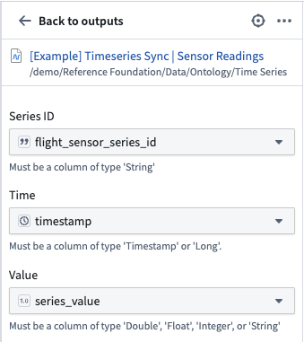

Now, [save and build](/docs/foundry/pipeline-builder/outputs-deliver-pipeline/#save) the pipeline. The outputs will be created in the same folder as the pipeline.

### 2. Use a time series sync to add properties to sensor object types

Now that you created a pipeline with a time series sync, you are ready to use the sync to add time series properties to sensor object types. Move on to our documentation for [adding time series properties to sensor object types](/docs/foundry/time-series/sensor-object-end-to-end-ontology/) for more guidance.
