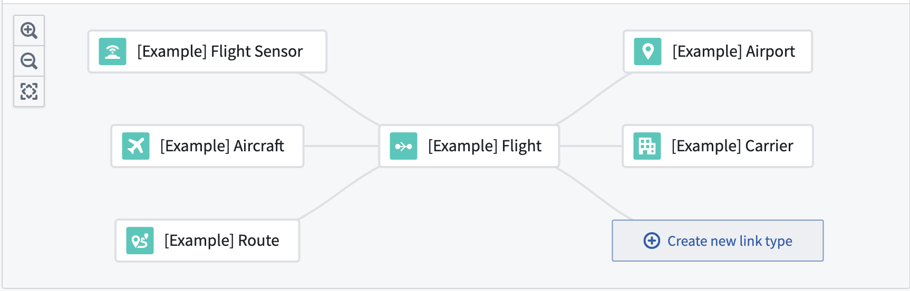
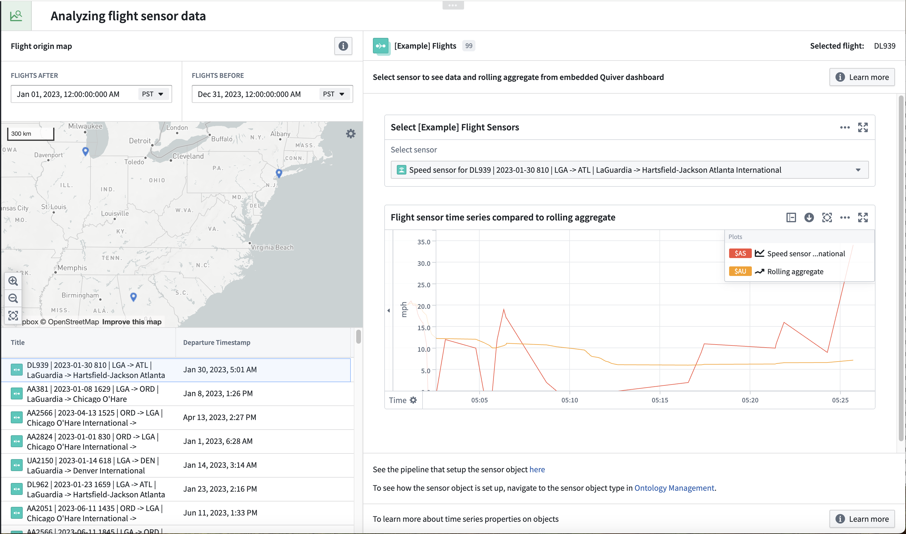

<!-- source: https://palantir.com/docs/foundry/time-series/sensor-object-end-to-end/ · mirrored 2026-08-07 from Palantir Foundry docs -->

# Sensor object types use case

[Sensor object types](/docs/foundry/time-series/time-series-concepts-glossary/#sensor-object-type) are a more advanced configuration of time series data where the sensor object holds the sensor data for its linked parent (also referred to as a root object). Review the time series [documentation](/docs/foundry/time-series/time-series-overview/#store-time-series-in-the-ontology) to decide if a time series property set up or sensor object type configuration is right for your use case.

This documentation will walk through the various steps to write a pipeline in Pipeline Builder, set up sensor object types in Ontology Manager, and create a Quiver dashboard and Workshop module using an example aviation ontology and the power of time series in Foundry.

The aviation ontology is made up of example `Flight`, `Carrier`, `Route`, `Airport`, and `Flight Sensor` object types. A `Flight` is linked to `Aircraft`, `Flight Sensor`, `Route`, `Airport`, and `Carrier` objects through the `flight_id` foreign key on those objects.

The aviation ontology comes from a reference ontology of notional data, and it may not be available for your enrollment. Regardless of the availability for your enrollment, these examples built using this reference ontology will serve as a reference as you create your own pipelines, object types, and Workshop modules using sensor object types.

The Workshop module that you will produce using the guide will allow you to view and interact with flight sensor time series data for a selected flight.

The following guides will lead you through the steps to create and support this Workshop module:

1. [Create sensor object type data in Pipeline Builder](/docs/foundry/time-series/sensor-object-end-to-end-pipeline/)
2. [Create sensor object types with Ontology Manager](/docs/foundry/time-series/sensor-object-end-to-end-ontology/)
3. [Use sensor object type time series data in Workshop and Quiver](/docs/foundry/time-series/sensor-object-end-to-end-operational/)
