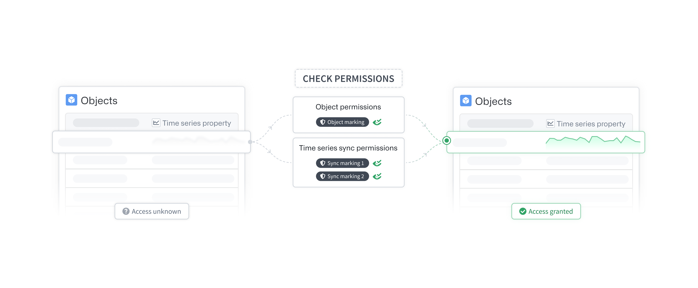
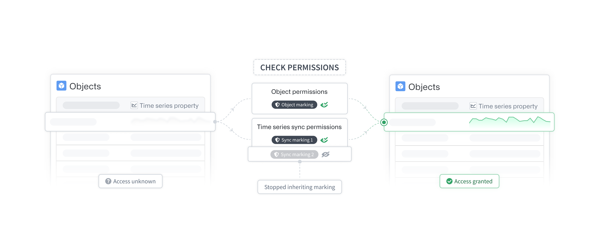
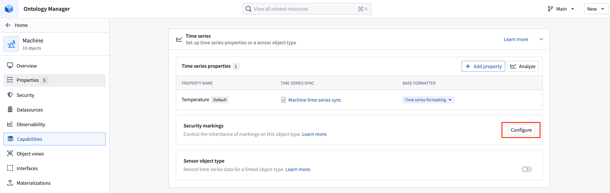

<!-- source: https://palantir.com/docs/foundry/time-series/time-series-permissions/ · mirrored 2026-08-07 from Palantir Foundry docs -->

# Time series permissions

The following permissions and access are required to use time series in the platform.

## Time series property permissions

To view a [time series property](/docs/foundry/time-series/time-series-properties/) on a given object, you must have access to both that object and the time series property’s backing data sources.

### Object permissions

A user must have access to the specific object (typically the backing data source row) and the property (typically the backing data source providing that property). This requirement is not specific to time series properties; all object properties follow this scheme. Review our documentation on [managing object security](/docs/foundry/object-permissioning/managing-object-security/) for more information.

### Time series property backing data source permissions

Time series *properties* reference time series *data* in time series *syncs*. These time series syncs must be listed as backing data sources on the [time series property](/docs/foundry/time-series/time-series-properties/) itself.  To view a time series property, you must satisfy the access requirements for **all** of its backing data sources. Learn more in the [section below](#granular-time-series-property-permissions).

#### Time series sync permissions

The [time series sync](/docs/foundry/time-series/time-series-syncs/) will inherit all of the markings from its input dataset. To view a time series sync, appropriate permissions are required on the input dataset’s markings.

## Granular time series property permissions

At Palantir, granular access of objects and their properties are configured through a combination of restricted views (permission rows) and different data sources (permission columns through MDOs). Time series properties differ from other properties in that they also reference time series syncs. Because time series syncs cannot be backed by restricted views, they cannot have granular permissions.

As an alternative to granular permissions on time series syncs, we recommend setting very strict markings on the input dataset of the time series sync that only allow a select set of individuals to directly view it. Then, stop inheriting these markings in the **Capabilities** tab in [Ontology Manager](/docs/foundry/ontology-manager/overview/). If a marking is no longer being inherited, permissions on that marking will not be required to view the time series when accessing it through a time series property. Once all the markings on the backing time series syncs are severed, time series property permissions become identical to all other standard property permissions; if you have access to the object and property, you can view the property value. Review our documentation on [managing object security](/docs/foundry/object-permissioning/managing-object-security/) for more information.

### Time series sync markings

Time series syncs inherit all markings of their input dataset. To view the time series sync, you must satisfy all of the view requirements of these markings. If you choose to stop inheriting markings on the time series sync, then the permissions on these time series sync markings will no longer be required when loading the time series through a time series property (that is, when viewing time series through an object).

This configuration only bypasses the time series sync’s markings requirement when loading a time series through an object’s time series property. You will still be required to satisfy these markings for direct access to the time series sync.

Configure time series sync security markings in the **Time series** section of the **Capabilities tab** in [Ontology Manager](/docs/foundry/ontology-manager/overview/).

Review the [markings](/docs/foundry/security/markings/) documentation for more information on using markings.

:::callout{theme="warning"}
This is an advanced configuration. Use caution when severing the markings on a time series sync. Access to the time series data through time series properties will depend solely on the property and object permissions.
:::

### Restricted view object type data source

To view a time series property, you must have access to both the object and the backing data sources of the time series property. Once the markings have been severed on the backing time series syncs, you can permission the time series through the object type's granular permissions.

Granular access to objects can be controlled using a restricted view as the object’s backing data source. The restricted view will dictate which objects a user can access. Learn more about [managing object security](/docs/foundry/object-permissioning/managing-object-security/).
