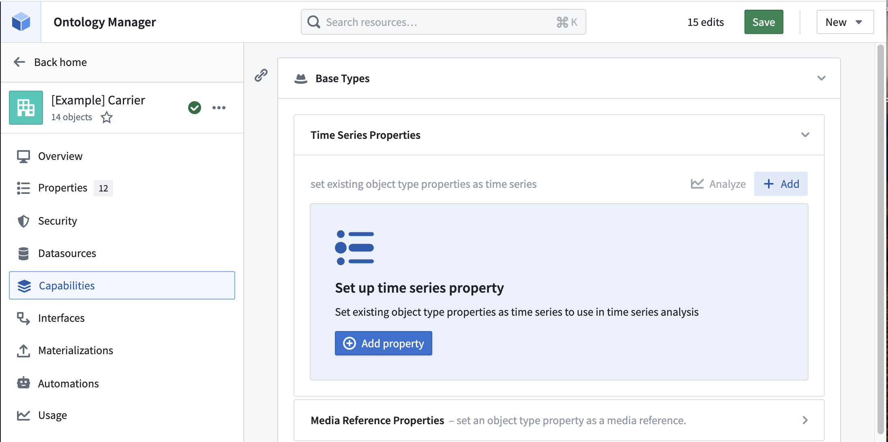
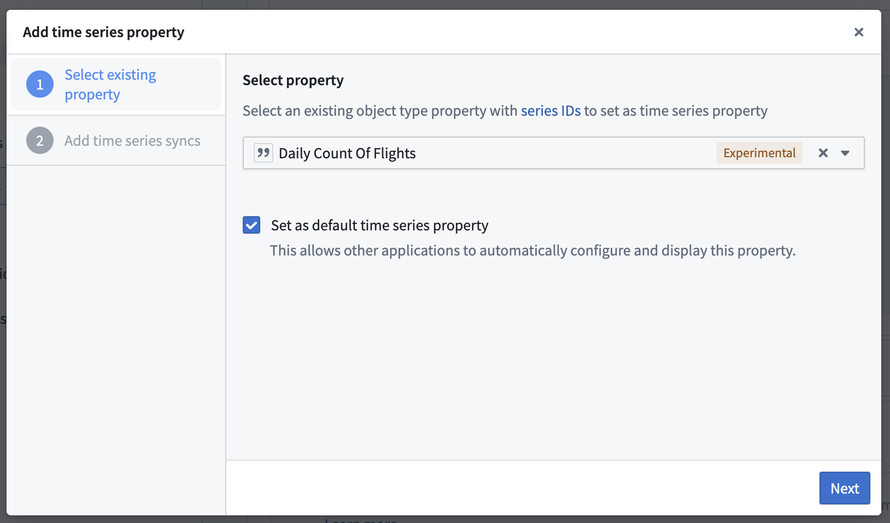
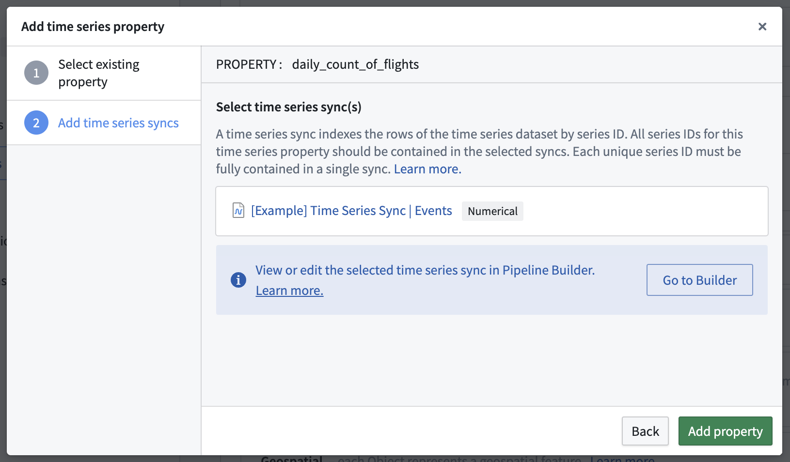

<!-- source: https://palantir.com/docs/foundry/time-series/time-series-properties-use-case-ontology/ · mirrored 2026-08-07 from Palantir Foundry docs -->

# Add time series properties to objects with Ontology Manager

This guidance references the documentation for [setting up a time series property on a time series object type](/docs/foundry/time-series/time-series-properties/). You can add as many time series properties to the object type as necessary, with the assumption that a time series set will always be associated with each object. Review our documentation to understand whether to choose a [time series object type or a sensor object type](/docs/foundry/time-series/time-series-overview/#store-time-series-in-the-ontology).

You must repeat the steps below for both the `Route` and `Airport` object types. At the end of this guide, the `Carrier`, `Route`,  and `Airport` object types will each have three time series properties for `Daily Count of Flights`, `Daily Average Arrival Delay` and `Daily Average Departure Delay`.

1. Navigate to the `Carrier` object type in Ontology Manager and select the **Capabilities** tab.
2. From the **Time series property** section select **+ Add**.

3. Select the existing `Daily Count of Flights` property as the time series property, then select **Set as default time series property** so that it automatically appears in Quiver.

4. Select the time series sync that you created [in Pipeline Builder](/docs/foundry/time-series/time-series-properties-use-case-pipeline/). In our example, it is called `[Example] Time Series Sync | Event Pipeline`.

5. Repeat this process for the `Daily Average Arrival Delay` and `Daily Average Departure Delay` time series properties.

Now that the time series properties have been added to the object types, we are ready to use the time series properties in an operational context. Proceed in the documentation to learn how to [use time series properties on objects in Workshop and Quiver](/docs/foundry/time-series/time-series-properties-use-case-operational/)
