<!-- source: https://palantir.com/docs/foundry/time-series/time-series-properties-use-case-pipeline/ · mirrored 2026-08-07 from Palantir Foundry docs -->

# Create time series data with Pipeline Builder

The pipeline you will create with this guide will generate [time series data](/docs/foundry/time-series/time-series-concepts-glossary/#time-series-object-type-backing-dataset) that backs a [time series sync](/docs/foundry/time-series/time-series-concepts-glossary/#time-series-sync) to associate with [time series properties](/docs/foundry/time-series/time-series-concepts-glossary/#time-series-property-tsp) on the `Carrier`, `Route`, and `Airport` object types to create new [time series objects](/docs/foundry/time-series/time-series-concepts-glossary/#time-series-object-type). This pipeline involves a more complex set up than standard mappings from time series datasets to time series properties, as we will make calculations on non-time series data to generate time series data. Review our [Pipeline Builder documentation](/docs/foundry/pipeline-builder/overview/) for information on general pipeline guidance.

The flight dataset we are working with includes the following columns that we will use to create time series properties:

* **flight\_id:** `string` | A unique string to identify the flight and every row in the dataset.
* **date:** `date` | The date the flight took place.
* **destination\_airport\_id:** `string` | The string to identify the destination airport.
* **airline\_id:** `string` | The ID of the airline carrier.
* **origin\_airport\_id:** `string` | The ID of the origin airport.
* **dep\_delay:** `integer` | The number of minutes the departure was delayed.
* **arr\_delay:** `integer` | The number of minutes the arrival was delayed.
* **route\_id:** `string`| A unique string to identify the route.

The pipeline at the end of this guide will look like this:

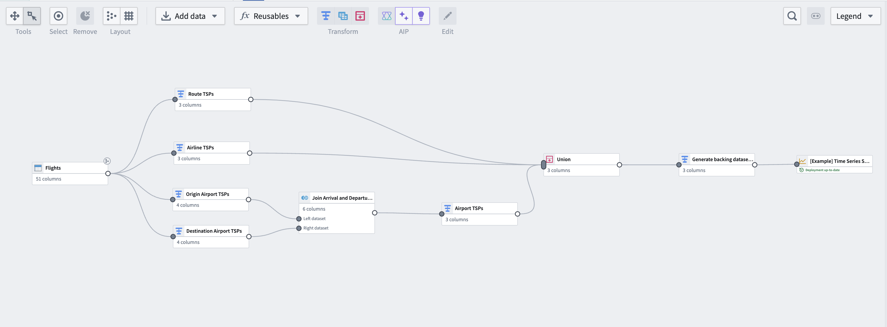

## Part I: Generate time series data

Using the same flights dataset that is used to back the `Flights`object type, we can perform some aggregation transformations and generate time series data based on flight metrics. Note that this step is not necessary if you have time series data coming into Foundry from a historian or edge sensor. You can move on to [generate a time series sync](#part-ii-create-the-time-series-sync).

### 1. Apply transforms to `Carrier` and `Route` object types

From the flights dataset, apply transforms using the steps below. You will do this for both the `Carrier` and `Route` object types.

#### Aggregate the data

Use the aggregate transform to group by date and ID of the object, (in this case, using the `route_id` for the `Route` object type; you will separately need to do the same using `airline_id` for the `Carrier` object type), and calculate average arrival delays, average departure delays, and daily flight counts.

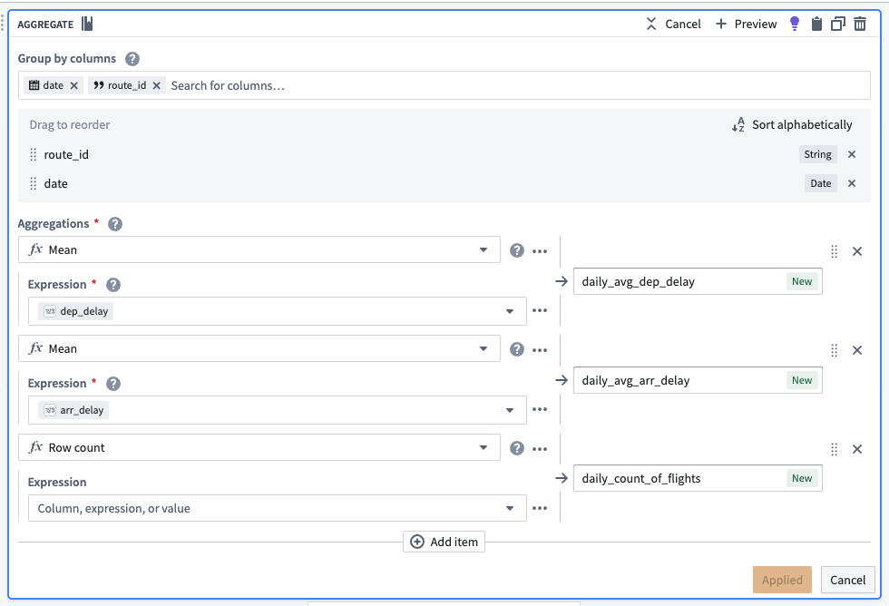

After aggregating, the dataset should preview with the following schema:

| route\_id   | date       | daily\_avg\_dep\_delay | daily\_avg\_arr\_delay | daily\_count\_of\_flights |
| --------   | ---------- | ------------------- | ------------------- | ---------------------- |
| ATL -> SFO | 2023-06-12 | 33.4545454545450000 | 40.0000000000000000 | 11                     |
| ATL -> FLL | 2023-08-24 | 29.7272727272720000 | 19.4090909090909100 | 22                     |
| ATL -> TVC | 2023-07-05 | -8.0000000000000000 | -8.0000000000000000 | 1                      |

#### Cast to a new data type

To use this new data as a time series, we must create a timestamp type column. To do this, use the cast transform to cast the `date` column to a timestamp type column. We will also soon apply an unpivot transform to merge `daily_avg_dep_delay`, `daily_avg_arr_delay`, and `daily_count_of_flights` values into one column. Since this function requires that all values be of the same data type, we must also cast our daily count of flights metric to a double type (the same data type as the average delay metrics).

#### Unpivot to merge time series values

Since this dataset contains time series data in different columns, we must use an unpivot transform to merge it into one value column so the data can match the required schema for a time series sync, as shown below:

* **series ID:** `string` | The series ID for the set of timestamp and value pairs referred to by a TSP, which must match the TSP's series ID.
* **timestamp:** `timestamp` or `long` | The time at which the quantity is measured.
* **value:** `integer`, `float`, `double`, `string` | The value of the quantity at the point that it is measured. A string type indicates a categorical time series; each categorical time series can have, at most, 10,000 unique variants.

The unpivot transform shown below places values for `daily_avg_dep_delay`, `daily_avg_arr_delay`, and `daily_count_of_flights` into the same `series_value` column. Those original column names are outputs to the new `series_name` column that will be used in the `series_id`.

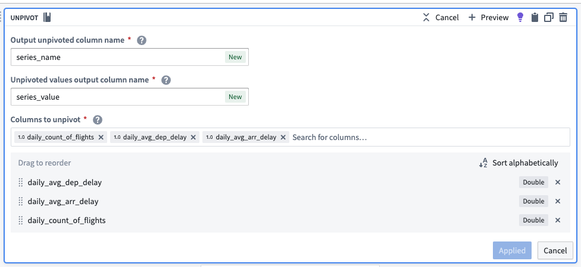

The dataset schema should now appear as follows:

| series\_name            | series\_value        | route\_id   | date                     |
| ---------------------- | ------------------- | ---------- | ------------------------ |
| daily\_avg\_dep\_delay    | 33.4545454545450000 | ATL -> SFO | 2023-06-12T00:00:00.000Z |
| daily\_avg\_arr\_delay    | 40.0000000000000000 | ATL -> SFO | 2023-06-12T00:00:00.000Z |
| daily\_count\_of\_flights | 11.0000000000000000 | ATL -> SFO | 2023-06-12T00:00:00.000Z |

#### Concatenate string values to create the series ID

Now, we can use the concatenate strings transform to create the series ID (the identifier for the associated time series values). Use the transform to combine the `series_name` (what each sensor represents) with the primary key of each object.

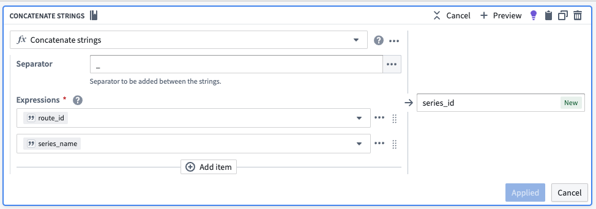

| series\_id                        | series\_name            | series\_value        | route\_id   | date                     |
| -------------------------------- | ---------------------- | ------------------- | --------   | ------------------------ |
| CMH -> IAH\_daily\_avg\_dep\_delay   | daily\_avg\_dep\_delay    | 33.4545454545450000 | ATL -> SFO | 2023-06-12T00:00:00.000Z |
| CMH -> IAH\_daily\_avg\_arr\_delay   | daily\_avg\_arr\_delay    | 40.0000000000000000 | ATL -> SFO | 2023-06-12T00:00:00.000Z |
| CMH -> IAH\_daily\_count\_of\_flights| daily\_count\_of\_flights | 11.0000000000000000 | ATL -> SFO | 2023-06-12T00:00:00.000Z |

#### Select necessary columns

Using the select columns transform, we will only keep the columns that are required for the time series sync: `series_id`, `series_value`, and `date`. The flights backing dataset will hold time series values for all series, regardless of what they are measuring. Repeat this for the `airline_carrier_id` column (from the flights dataset).

| series\_id                        | series\_value        | date                     |
| -------------------------------- | ------------------- | ------------------------ |
| CMH -> IAH\_daily\_avg\_dep\_delay   | 33.4545454545450000 | 2023-06-12T00:00:00.000Z |
| CMH -> IAH\_daily\_avg\_arr\_delay   | 40.0000000000000000 | 2023-06-12T00:00:00.000Z |
| CMH -> IAH\_daily\_count\_of\_flights| 11.0000000000000000 | 2023-06-12T00:00:00.000Z |

### 2. Add a transform to aggregate and generate data for origin and destination airports

Now, you must repeat the aggregate and cast transform steps for both origin airports and destination airports.

#### Aggregate for the number of flights per day per route

Use the aggregate transform to group by `date` and `origin_airport_id`, then calculate the average arrival and departure times. The total number of rows in each group is equivalent to the number of flights per day per route.

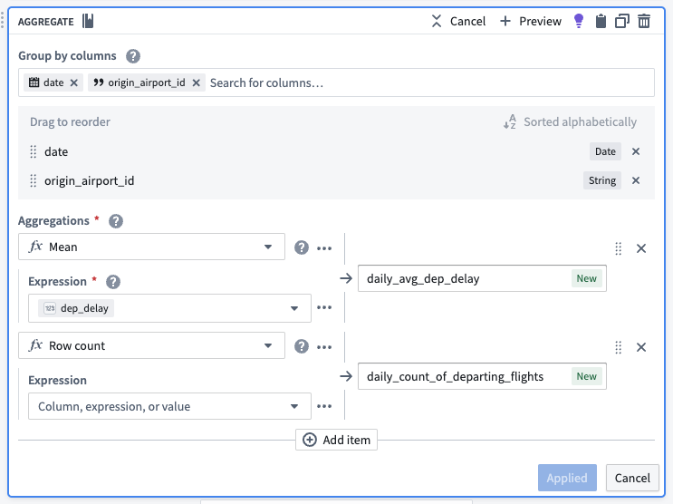

| date       | origin\_airport\_id | daily\_avg\_dep\_delay | daily\_count\_of\_departing\_flights |
| ---------- | ----------------- | ------------------- | -------------------------------- |
| 2023-07-02 | 10299             | 9.34375000000000000 | 33                               |
| 2023-09-06 | 10431             | -2.3333333333333333 | 6                                |
| 2023-01-12 | 10620             | -7.0000000000000000 | 2                                |

#### Cast to timestamp

To use this new data as a time series, we must create a timestamp column. To do this, use the cast transform to cast the `date` column to a timestamp type column.

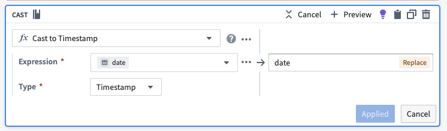

### 3. Create a join to combine destination and origin airports

Using the join board, create a left join that combines data from the destination airport and origin airport, resulting in complete time series properties for airport data. Be sure the following configuration are set for your join:

* Match the date and `origin_airport_id` to the `dest_airport_id`.
* Auto-select columns from the left dataset.
* As the right columns, select the two that represent daily average delay and the daily count of flights.

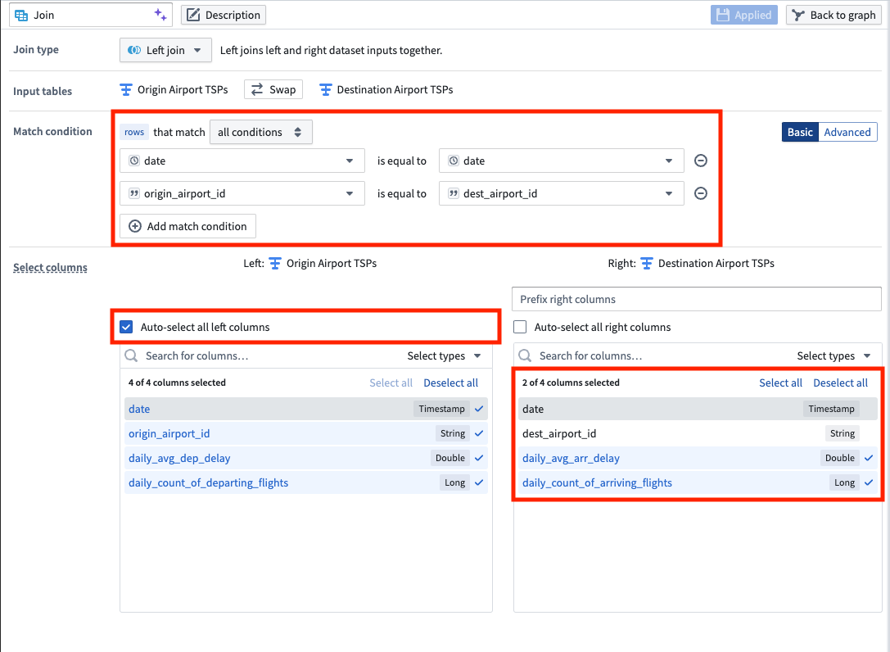

| date       | origin\_airport\_id | daily\_avg\_dep\_delay | daily\_count\_of\_departing\_flights | daily\_avg\_arr\_delay | daily\_count\_of\_arriving\_flights |
| ---------- | ----------------- | ------------------- | -------------------------------- | ------------------- | ------------------------------- |
| 2023-07-02 | 10299             | 9.34375000000000000 | 33                               | 18.5294117647058840 | 34                              |
| 2023-09-06 | 10431             | -2.3333333333333333 | 6                                | -8.0000000000000000 | 6                               |
| 2023-01-12 | 10620             | -7.0000000000000000 | 2                                | 56.5000000000000000 | 2                               |

### 4. Apply transforms to format data for a time series sync

#### Rename column

Now that we joined the origin airport data with the destination airport data, we have both arrival and departure metrics for all airports. We no longer need to differentiate origin from destination, so we can use the rename columns transform to change `origin_airport_id` to simply `airport_id`.

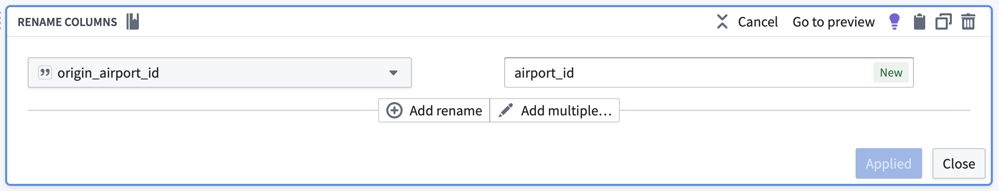

The data should preview as follows with the renamed column:

| date       | airport\_id | daily\_avg\_dep\_delay | daily\_count\_of\_departing\_flights | daily\_avg\_arr\_delay | daily\_count\_of\_arriving\_flights |
| ---------- | ---------- | ------------------- | -------------------------------- | ------------------- | ------------------------------- |
| 2023-07-02 | 10299      | 9.34375000000000000 | 33                               | 18.5294117647058840 | 34                              |
| 2023-09-06 | 10431      | -2.3333333333333333 | 6                                | -8.0000000000000000 | 6                               |
| 2023-01-12 | 10620      | -7.0000000000000000 | 2                                | 56.5000000000000000 | 2                               |

#### Cast to double

We will soon apply an unpivot transform. This function requires that all values be of the same data type, so we must use the cast transform board again to cast our daily count of flights metrics to a double data type so they are the same type as the average delay metrics.

#### Add flight numbers

To calculate the full daily flight count, we will use the add numbers transform to add together the daily count of arriving flights and the daily count of departing flights, as shown below.

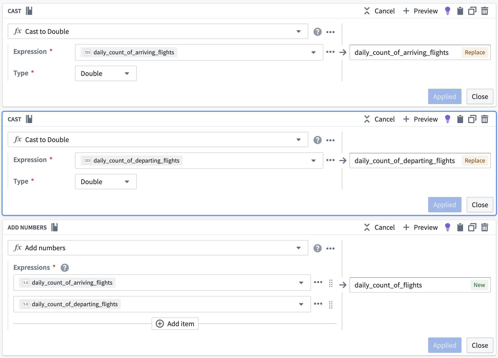

| daily\_count\_of\_flights | date       | airport\_id | daily\_avg\_dep\_delay | daily\_count\_of\_departing\_flights | daily\_avg\_arr\_delay | daily\_count\_of\_arriving\_flights |
| ---------------------- | ---------- | ---------- | ------------------- | -------------------------------- | ------------------- | ------------------------------- |
| 77                     | 2023-07-02 | 10299      | 9.34375000000000000 | 33                               | 18.5294117647058840 | 34                              |
| 12                     | 2023-09-06 | 10431      | -2.3333333333333333 | 6                                | -8.0000000000000000 | 6                               |
| 4                      | 2023-01-12 | 10620      | -7.0000000000000000 | 2                                | 56.5000000000000000 | 2                               |

#### Unpivot to merge series values

Since this dataset contains time series data in different columns, we must use an unpivot transform to merge it into one value column so the data can match the required schema for a time series sync, as shown below:

* **series ID:** `string` | The series ID for the set of timestamp and value pairs referred to by a TSP, which must match the TSP's series ID.
* **timestamp:** `timestamp` or `long` | The time at which the quantity is measured.
* **value:** `integer`, `float`, `double`, `string` | The value of the quantity at the point that it is measured. A string type indicates a categorical time series; each categorical time series can have, at most, 10,000 unique variants.

The unpivot transform shown below places values for `daily_avg_dep_delay`, `daily_avg_arr_delay`, and `daily_count_of_flights` into the same `series_value` column. Those original column names are outputs to the new `series_name` column that will be used in the series ID.

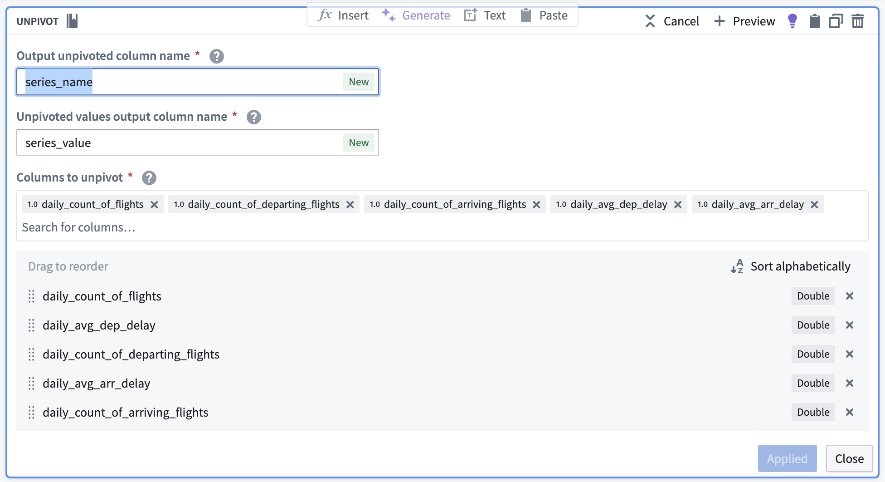

The data should preview with the following schema:

| series\_name                      | series\_value        | date                     | airport\_id |
| -------------------------------- | ------------------- | ------------------------ | ---------- |
| daily\_count\_of\_flights           | 77                  | 2023-07-02T00:00:00.000Z | 10299      |
| daily\_avg\_dep\_delay              | 9.34375000000000000 | 2023-07-02T00:00:00.000Z | 10299      |
| daily\_avg\_arr\_delay              | 18.5294117647058840 | 2023-07-02T00:00:00.000Z | 10299      |

#### Concatenate string values to create the series ID

Now, we can use the concatenate strings transform to create the series ID (the identifier for the associated time series values). Use the transform to combine the `series_name` (what each sensor represents) with the primary key of the `Airport` object (`airport_id`).

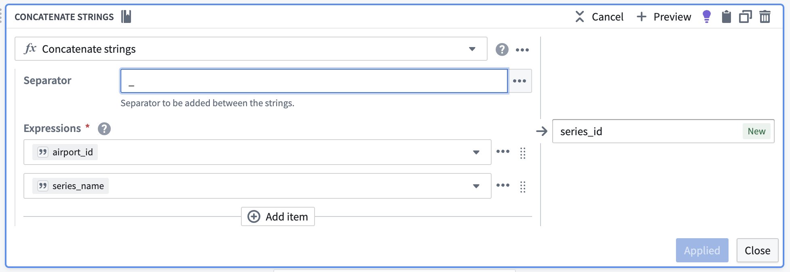

| series\_id                    | series\_name                      | series\_value        | date                     | airport\_id |
| ---------------------------- | -------------------------------- | ------------------- | ------------------------ | ---------- |
| 12099\_daily\_count\_of\_flights | daily\_count\_of\_flights           | 77                  | 2023-07-02T00:00:00.000Z | 10299      |
| 12099\_daily\_avg\_dep\_delay    | daily\_avg\_dep\_delay              | 9.34375000000000000 | 2023-07-02T00:00:00.000Z | 10299      |
| 12099\_daily\_avg\_arr\_delay    | daily\_avg\_arr\_delay              | 18.5294117647058840 | 2023-07-02T00:00:00.000Z | 10299      |

#### Select necessary columns

Using the select columns transform, we will only keep the columns that are required for the time series sync: `series_id`, `series_value`, and `date`. The flights backing dataset will hold time series values for all series, regardless of what they are measuring.

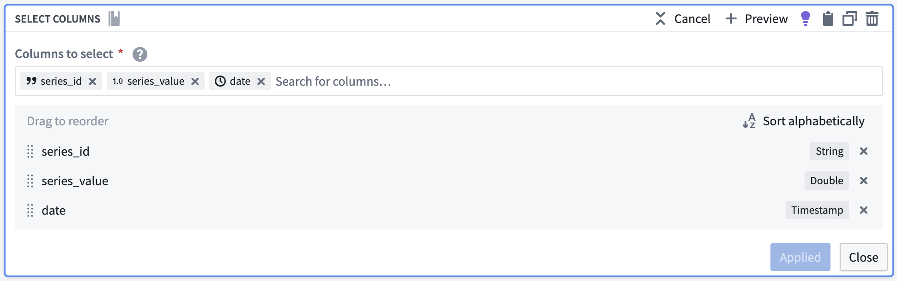

The resulting dataset should look as follows:

| series\_id                    | series\_value        | date                     |
| ---------------------------- | ------------------- | ------------------------ |
| 12099\_daily\_count\_of\_flights | 77                  | 2023-07-02T00:00:00.000Z |
| 12099\_daily\_avg\_dep\_delay    | 9.34375000000000000 | 2023-07-02T00:00:00.000Z |
| 12099\_daily\_avg\_arr\_delay    | 18.5294117647058840 | 2023-07-02T00:00:00.000Z |

### 5. Union the time series properties into a backing dataset

Create a union with the type `Union by name`, using the transforms representing the `Carrier`, `Route`, and `Airport` time series properties.

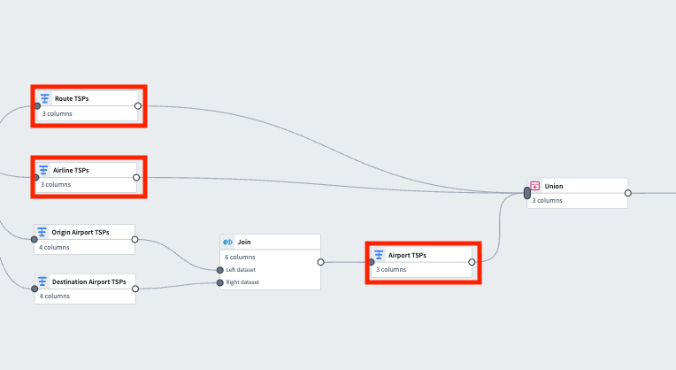

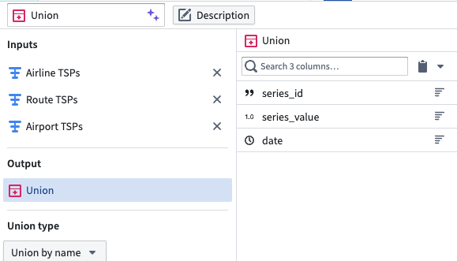

| series\_id                      | series\_value        | date                     |
| ------------------------------ | ------------------- | ------------------------ |
| 12099\_daily\_count\_of\_flights   | 77                  | 2023-07-02T00:00:00.000Z |
| 12099\_daily\_avg\_dep\_delay      | 9.34375000000000000 | 2023-07-02T00:00:00.000Z |
| 12099\_daily\_avg\_arr\_delay      | 18.5294117647058840 | 2023-07-02T00:00:00.000Z |
| CMH -> IAH\_daily\_avg\_dep\_delay | -8.0000000000000000 | 2023-03-21T00:00:00.000Z |
| 20304\_daily\_avg\_arr\_delay      | 9.12500000000000000 | 2023-08-13T00:00:00.000Z |

## Part II: Create the time series sync

### 1. Remove null values

Apply a filter transform on the resulting dataset to remove any `null` values.

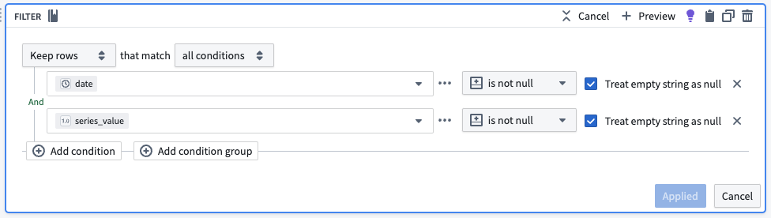

### 2. Configure the time series sync

Now, create a [time series sync](/docs/foundry/time-series/time-series-concepts-glossary/#time-series-sync) by selecting **Add** from the pipeline output section to the right of the screen. Then, select **Time series sync**. Fill out the necessary data for the new time series sync, with the following considerations:

* The title “\[Example] Time series sync | Events” will correspond to the resulting resource in your Palantir filesystem folder.
* Select the `series_id` column for the [**Series ID**](/docs/foundry/time-series/time-series-concepts-glossary/#series-id) field.
* Add the created `date` timestamp column in the **Time** field.
* Add `series_value` to the **Value** field.

Now, [save and build](/docs/foundry/pipeline-builder/outputs-deliver-pipeline/#save) the pipeline. The output will be created in the same folder as the pipeline.

### 3. Use a time series sync to add properties to object types

Now that you created a pipeline with a time series sync, you are ready to use the sync to add time series properties to the `Route`, `Carrier` and `Airport` object types. Move on to our documentation for [adding time series properties to object types](/docs/foundry/time-series/time-series-properties-use-case-ontology/) for more guidance.
