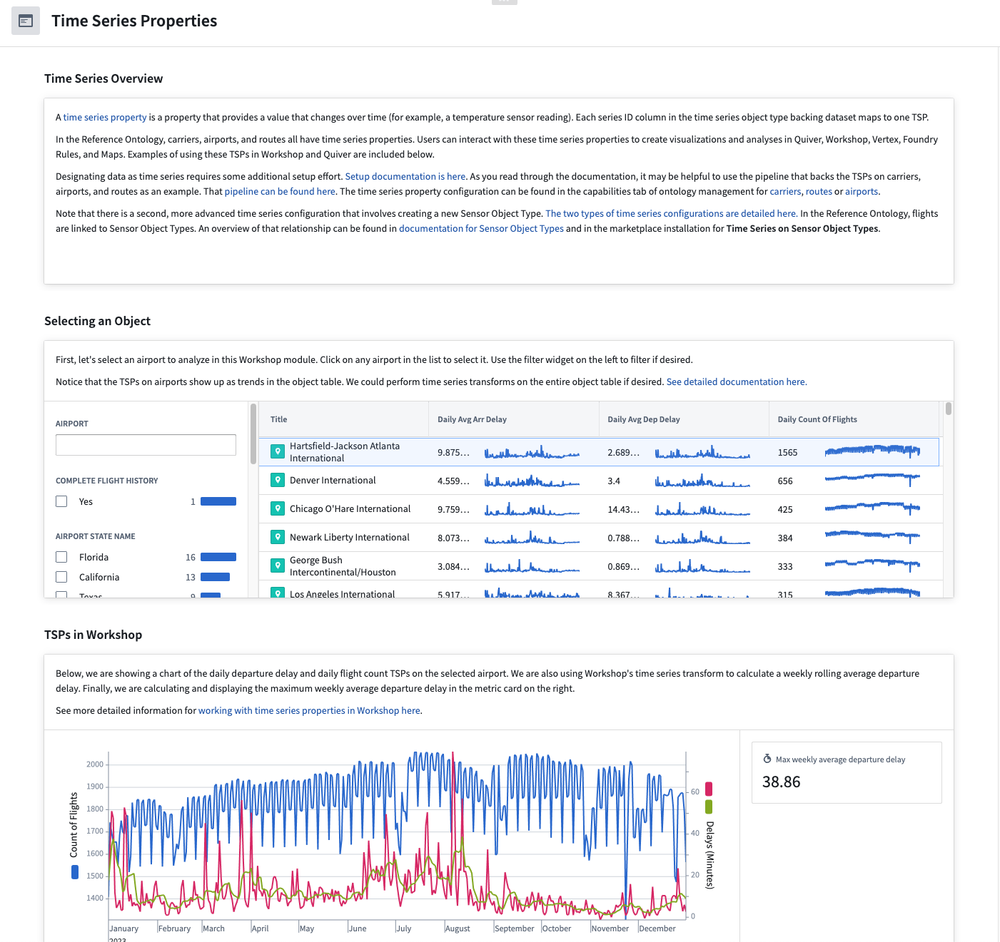

<!-- source: https://palantir.com/docs/foundry/time-series/time-series-properties-use-case/ · mirrored 2026-08-07 from Palantir Foundry docs -->

# Time series properties use case

Time series properties on objects enable powerful analytical workflows. This documentation will walk through the various steps to write a pipeline in Pipeline Builder, set up objects in Ontology Manager, and create a Quiver dashboard and Workshop module using an example aviation ontology and the power of time series in Foundry.

The aviation ontology is made up of example `Flight`, `Carrier`, `Route`, `Airport`, and `Flight Sensor` object types. A `Flight` is linked to `Aircraft`, `Flight Sensor`, `Route`, `Airport`, and `Carrier` objects through the `flight_id` foreign key on those objects.

The aviation ontology comes from a reference ontology using open-source data that may not be available for your enrollment. Regardless of the availability for your enrollment, these examples built using this example ontology will serve as a reference as you create your own pipelines, object types, and Workshop modules with time series properties.

The Workshop module that you will produce using the guide will allow you to use and view time series properties on `Carrier`, `Route`, and `Airport` objects using flight data.

The following guides will lead you through the steps to create and support this Workshop module:

1. [Use Pipeline Builder to generate time series properties from a 'Flight' object set](/docs/foundry/time-series/time-series-properties-use-case-pipeline/)
2. [Add time series properties to aviation objects](/docs/foundry/time-series/time-series-properties-use-case-ontology/)
3. [Use time series properties on aviation objects in Workshop and Quiver](/docs/foundry/time-series/time-series-properties-use-case-operational/)
