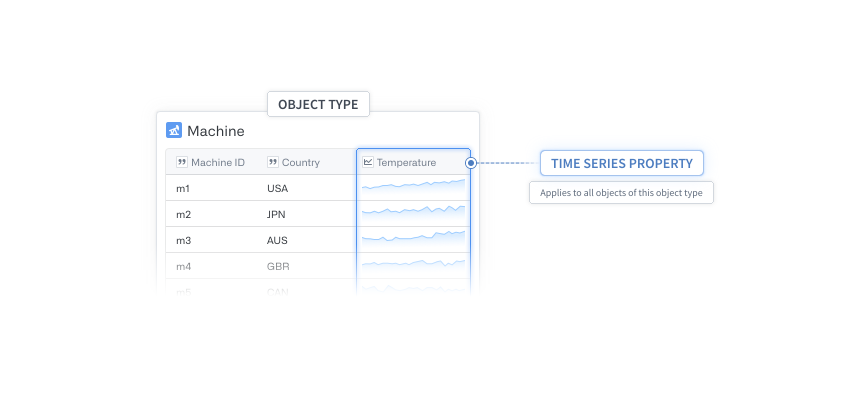
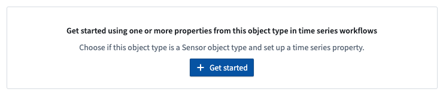
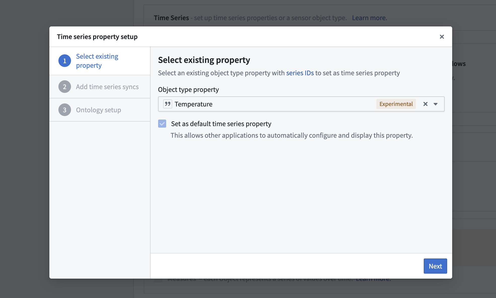
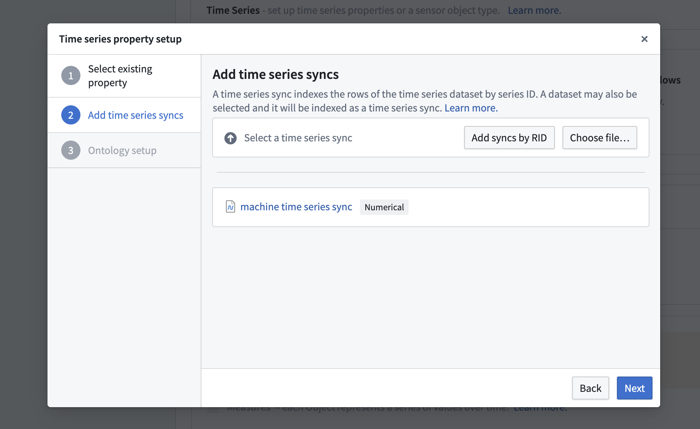
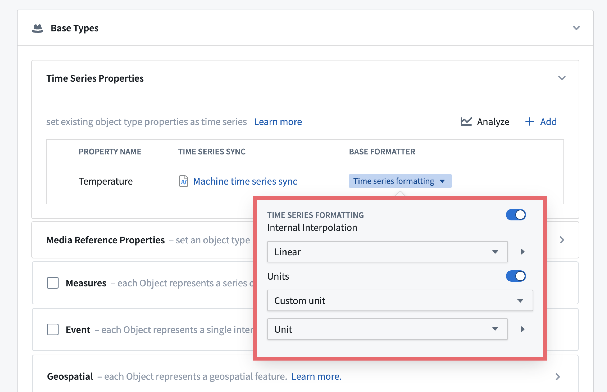
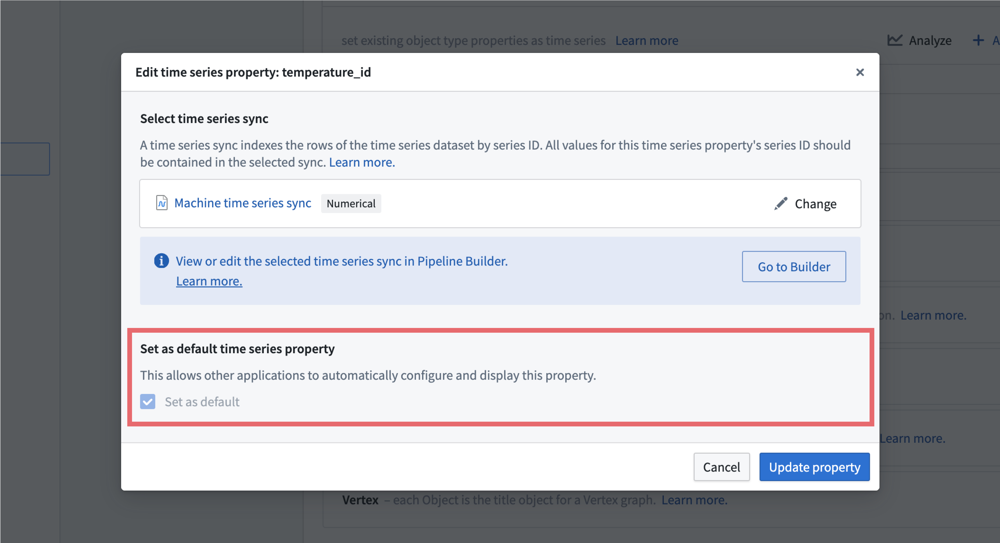
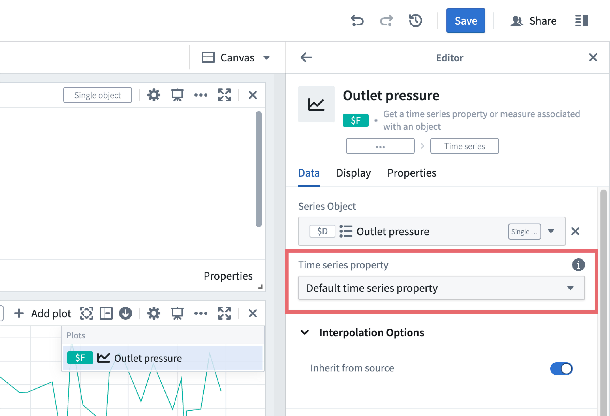

<!-- source: https://palantir.com/docs/foundry/time-series/time-series-properties/ · mirrored 2026-08-07 from Palantir Foundry docs -->

# Time series properties (TSPs)

A [time series property (TSP)](/docs/foundry/time-series/time-series-concepts-glossary/#time-series-property-tsp) is a property that enables the usage of time series data in Foundry applications. Review how to [use time series](/docs/foundry/time-series/time-series-usage/) for more details.

When viewing a time series property, the value will be displayed as a plot of the associated time series values. For example, the example below shows a `temperature_id` time series property, visualized using the underlying time series data in [Quiver](/docs/foundry/quiver/overview/).

## Time series property setup

For a guided walkthrough of the following steps, use the time series setup assistant in the platform. Launch the setup assistant by navigating directly to `https://<domain>/workspace/ontology/home/overview/time-series-setup`, or by navigating to a [dataset preview](/docs/foundry/dataset-preview/overview/) containing a timestamp column and selecting **Set up time series** from the **Analyze data** action menu.

For more guidance on setting up time series object types, see the documentation on [how to create or select a time series object type](/docs/foundry/time-series/create-or-select-ts-ot/).

Time series properties are configured within the **Capabilities** tab of the [Ontology Manager](/docs/foundry/ontology-manager/overview/) application. If you are following along with the setup assistant, you will automatically be directed to the **Capabilities** tab after creating a new object type or choosing an existing one. If the object type already has time series properties configured, you will see them displayed in a table view where you can also add or delete time series properties.

If there are no existing time series properties on the object type, you will be guided through adding one.

To add a time series property, select **Get started**. This will launch a dialog to guide you through the following steps:

1. **Select property:** Select a `string` property that contains the series IDs, then select **Next**.

:::callout{theme="warning"}
The primary key property of an object type cannot be selected as the time series property.
:::

2. **Select time series sync(s):** Select a time series sync if one already exists, or follow the instructions to [create a new time series sync](/docs/foundry/time-series/time-series-syncs/). You can select multiple time series syncs by continuing to select **+Choose file**. If you are backing your TSP with multiple time series syncs, you will need to use [qualified series IDs](/docs/foundry/time-series/time-series-concepts-glossary/#qualified-series-id).

3. **Determine object type:** Decide if this object type is a [sensor object type](/docs/foundry/time-series/time-series-concepts-glossary/#sensor-object-type).

:::callout{theme="neutral"}
If you want to add or modify time series properties but have closed the setup assistant, you can resume your progress with either of the following:

* Navigate to your object type in Ontology Manager and then to the **Capabilities** tab in the panel to the left.
* Relaunch the setup assistant by navigating directly to `https://<domain>/workspace/ontology/home/overview/time-series-setup` or navigate to a [dataset preview](/docs/foundry/dataset-preview/overview/) containing a `timestamp` column, and select **Set up time series** from the **Analyze data** action menu.
:::

## Time series formatting

Time series formatting allows setting the desired internal interpolation and units of the time series. Applications like Quiver will respect the provided interpolation and unit values.

The unit and interpolation formatting can point to other `string` properties on this object type for more granular control (for example, if each time series contained in the time series property has different units and or interpolation). If granular control is not required, both interpolation and units have a set of standard values to choose from.

The internal interpolation and units for sensor object types are configured in the [sensor object configuration section](/docs/foundry/time-series/create-sensor-ot/) section.

:::callout{theme="neutral"}
The units provided in the time series formatter are mainly used for visual display purposes. For example, as an axis label on plots in Quiver.
:::

## Default time series property

An object type can have one time series property designated as the default time series property. When configuring the first time series property for an object type, that property will be set as the default time series property.

In some applications, the default time series property is displayed without additional user intervention. In Quiver, for example, the object property time series card points to the default time series property unless otherwise specified.

The single time series property of a sensor object type must be a default time series property. Review how to [set up a sensor object type](/docs/foundry/time-series/create-sensor-ot/) for more details.
