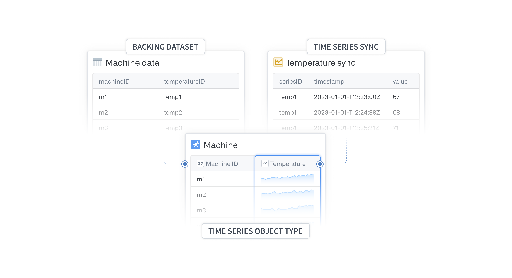
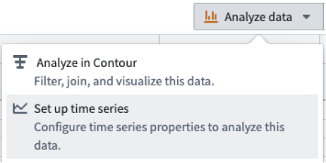
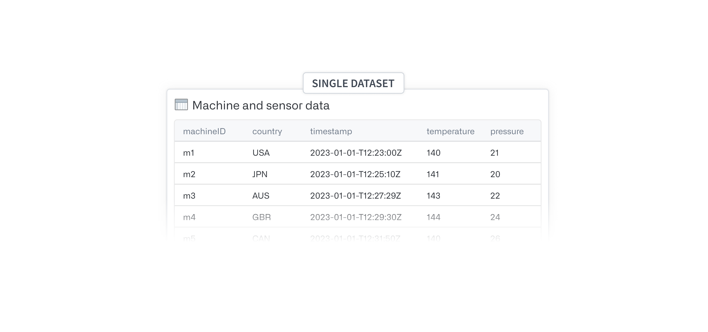
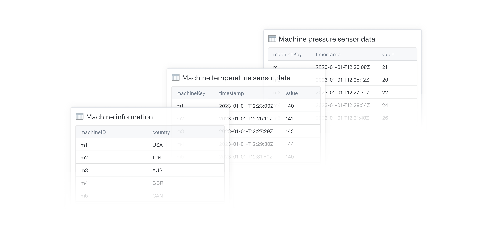

<!-- source: https://palantir.com/docs/foundry/time-series/time-series-setup/ · mirrored 2026-08-07 from Palantir Foundry docs -->

# Setup

The following document is intended to guide you through the process of creating and configuring time series object types and properties for analysis in Foundry applications.

:::callout{theme="warning"}
Review and understand the two options available for [setting up time series in the Ontology](/docs/foundry/time-series/time-series-overview/#store-time-series-in-the-ontology) before proceeding with your setup. If you have already started the setup process but are not sure where you left off, review the [Setup checkpoints](#setup-checkpoints) section below to understand where to resume your progress.
:::

## Get started

Before you can start setting up time series object types and properties that can be used for analysis, you will need one or more datasets in Foundry containing your [time series](/docs/foundry/time-series/time-series-concepts-glossary/#time-series). If you have multiple datasets, all values for a series should be contained within the same dataset. See [Setup Checkpoints](#setup-checkpoints) for examples of common starting points.

To begin, navigate to a [dataset preview](/docs/foundry/dataset-preview/overview/) containing a timestamp column, and select **Set up time series** from the **Analyze data** action menu.

This will launch an overview that will take you to our time series setup assistant. The following documentation will provide more in-depth explanations of any data transformations that may be required as the assistant walks you through the following process.

:::callout{theme="neutral"}
You can also launch the setup assistant by navigating directly to `https://<domain>/workspace/ontology/home/overview/time-series-setup`
:::

## Setup checkpoints

Use the following decision tree to identify your starting point or resume progress through the time series setup process.

* Is your raw time series data in Foundry yet?
  * **No:** Use [Data Connection](/docs/foundry/data-connection/overview/) to sync your data into Foundry.
* Does your raw time series data have a timestamp column of only type timestamp?
  * **No:** Edit the schema in Dataset app
* Does your raw data look like the examples below?
  * A single dataset containing an object key, timestamp column, and multiple columns each with a value for that point in time.   
       

  * A dataset containing information about the objects plus multiple datasets each containing a key, timestamp column, and value for a single series.   
       

  * **No:** You may want to transform your data to have a similar schema to one of these examples. If not, you may still be able to proceed, but you will need to know how to transform the data yourself to produce a valid [time series object type backing dataset](/docs/foundry/time-series/time-series-concepts-glossary/#time-series-object-type-backing-dataset) and [time series sync](/docs/foundry/time-series/time-series-concepts-glossary/#time-series-sync).
* How do I launch the setup assistant?
  * View a time series dataset (that is, a dataset with a timestamp column) and select **Set up time series** from under the **Analyze data** action menu (see [Get started](#get-started)). This will present the walkthrough dialog followed by our setup assistant.   
       

  * Alternatively, launch the setup assistant directly by navigating directly to `https://<domain>/workspace/ontology/home/overview/time-series-setup`
* Does your object type already exist?
  * **Yes:** Launch the setup assistant and select **Choose existing object**.
  * **No:** Launch the setup assistant and select **Create new object type**.
* Do you have an object type backing dataset?
  * **Yes:** Select it in the **Create new object type** dialog.
  * **No:** Navigate to Pipeline Builder and transform data from a common shape to that of a time series object type backing dataset (see [Create or select a time series object type](/docs/foundry/time-series/create-or-select-ts-ot/)).
* Have you added time series properties (TSPs) to your object type?
  * **Yes:** You are ready to use the time series object type. See [Use time series in Foundry](/docs/foundry/time-series/time-series-usage/) for different ways you can use time series in Foundry applications.
  * **No:** See [Configure time series properties](/docs/foundry/time-series/time-series-properties/#time-series-property-setup) for next steps.
* Do you have a time series sync?
  * **Yes:** Finish [configuring time series properties](/docs/foundry/time-series/time-series-properties/#time-series-property-setup) and select your sync in the second step of the dialog.
  * **No:** Follow the instructions for creating a time series sync under [Configure time series properties](/docs/foundry/time-series/time-series-properties/#time-series-property-setup).
    * Ensure the series ID of the time series sync matches the series ID of the object type backing dataset
* How do I use the time series properties I just set up?
  * See [Use time series in Foundry](/docs/foundry/time-series/time-series-usage/) to explore ways you can analyze time series in Foundry.
