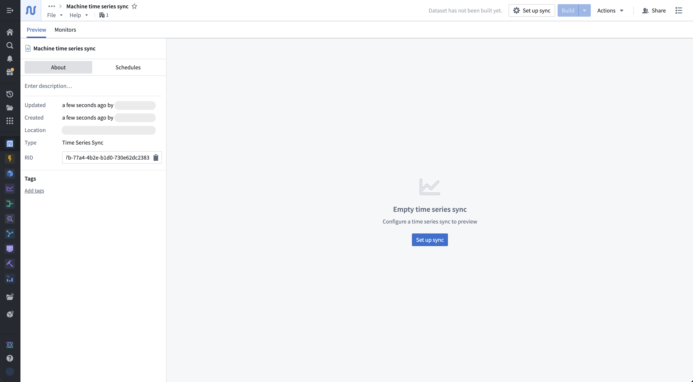
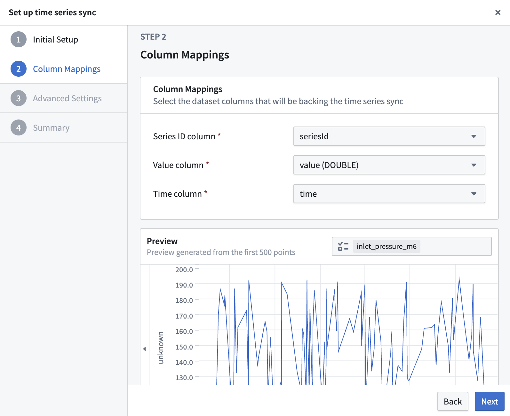
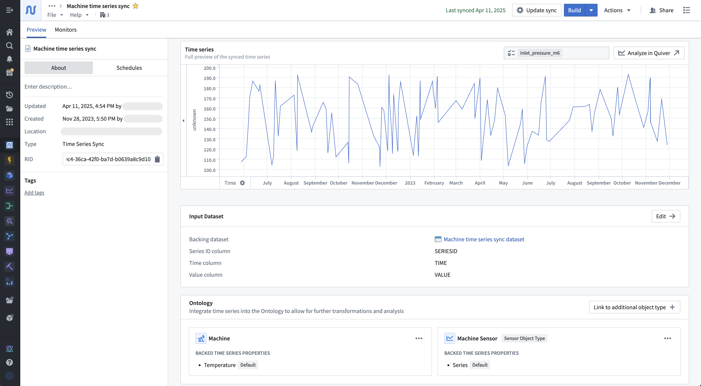
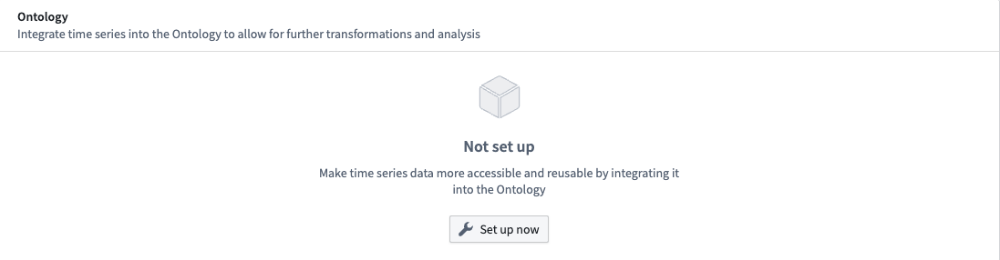
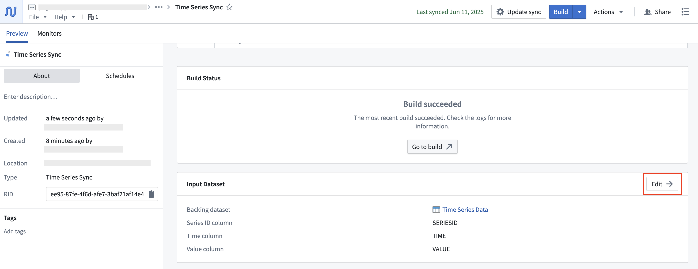
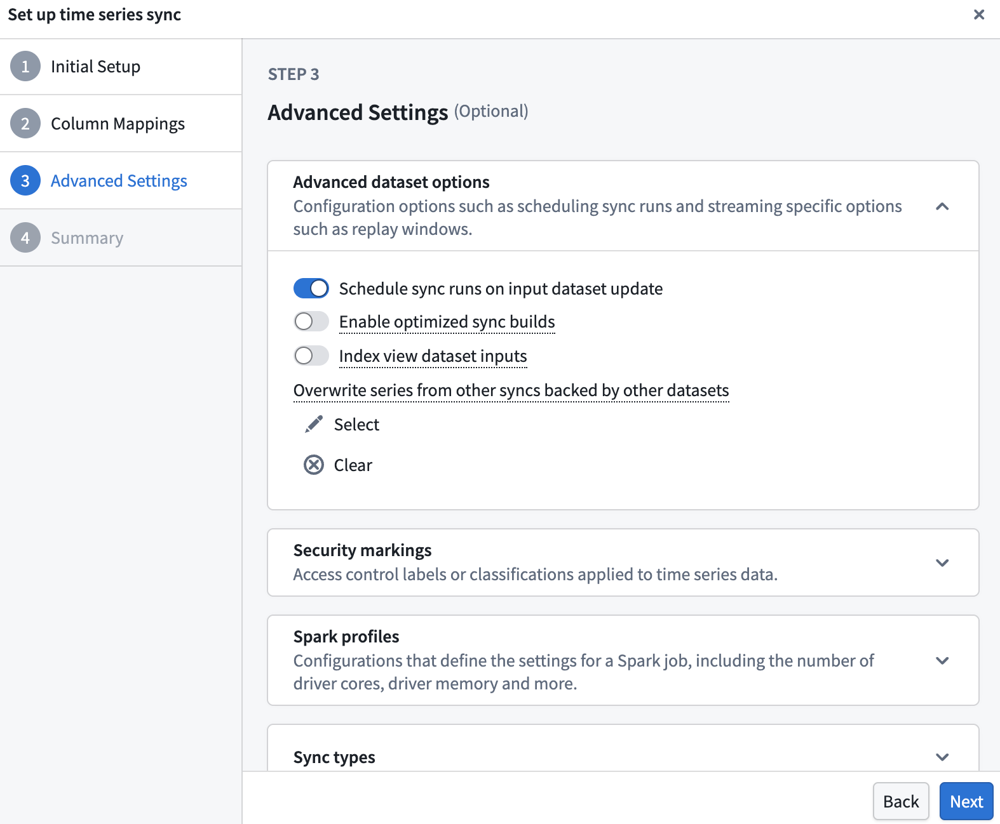
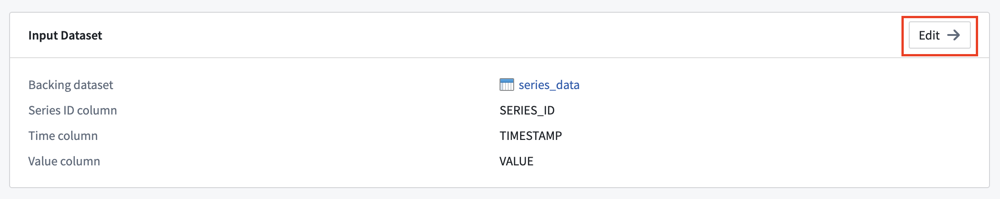

<!-- source: https://palantir.com/docs/foundry/time-series/time-series-syncs/ · mirrored 2026-08-07 from Palantir Foundry docs -->

# Time series syncs

Time series syncs hold time-value pairs associated with any number of time series (keyed by `seriesIds`), enabling performant indexing on each series and associated time-value pairs. Time series syncs are backed by [datasets](/docs/foundry/data-integration/datasets/) or [streams](/docs/foundry/data-integration/streams/) and are the backing data sources for time series properties. You can also [use time series for geospatial entity tracking](/docs/foundry/time-series/geospatial-time-series-use-case/) when your data contains latitude and longitude measurements recorded at different timestamps.

:::callout{theme="neutral"}
Review the [geospatial and geotemporal documentation](/docs/foundry/geospatial/faq/) to learn more about when to use [geotemporal series](/docs/foundry/geospatial/types-of-geospatial-and-geotemporal-data/#geotemporal-series) instead of time series.
:::

When Foundry resolves a time series property on a given object time series property, the `seriesId` contained in the property’s value will be searched for within that property’s data sources and its associated time series data will be returned.

When you create a time series sync, there will be a [projection](/docs/foundry/time-series/faqs/#what-is-the-time-series-projection) created for the dataset that is being synced; projections are used to optimize the queries made when fetching your time series data.

Time series syncs require the following columns:

1. **seriesId:** The identifier of a series (`string`).
2. **timestamp:** The time the associated value occurred (`timestamp` or `long`).
   * For long typed time columns, the units must be specified. Available units include seconds, milliseconds, microseconds or nanoseconds.
3. **value:** The value of the series at a given timestamp (`double`, `integer`, `float` or `string`).
4. **Ingestion time:** (optional): The time at which the streaming data points were ingested (`timestamp`).

:::callout{theme="warning"}
If a time series property is backed by more than one time series sync, the `seriesIds` in the property values must be fully contained within a single time series sync.
:::

:::callout{theme="warning"}
The size of the transforms profile required for the [projection](/docs/foundry/time-series/faqs/#what-is-the-time-series-projection) built when creating a time series sync scales with the size of the input dataset. For datasets larger than 10 TB, we recommend splitting your dataset up into multiple datasets, partitioned by series identifier, then creating syncs off of these smaller datasets. Alternatively, you can use a [view optimization](/docs/foundry/time-series/advanced-setup/#view-optimization-on-time-series-syncs) that can be configured in the advanced settings of your time series sync.
:::

## Create a time series sync

### Create using Time Series Catalog

Navigate to the [Time Series Catalog](/docs/foundry/time-series/time-series-time-series-catalog/) and select **New time series sync**. You will be prompted to choose a location to save your sync; this location must be in a [Project](/docs/foundry/compass/move-and-share-resources/) that contains your time series dataset or imports your time series dataset as a reference. Select **Set up sync** to configure the time series sync.

Select your time series dataset as the input, then complete the mapping of your dataset columns to the time series sync's **Series ID**, **Value**, and **Timestamp**. If your **Timestamp** column is a `Long` type,  specify if it is a `SECONDS`, `MILLISECONDS`, `MICROSECONDS`, or `NANOSECONDS` unit. Use the preview to ensure time series data is appearing correctly.

You can optionally configure [advanced settings](#time-series-sync-advanced-settings). In most cases, the default values are recommended.

When you are finished, select **Save and build** in the final dialog step.

### Create using Pipeline Builder

Pipeline Builder supports creating time series syncs. Review the [Pipeline Builder](/docs/foundry/pipeline-builder/overview/) documentation for guidance on adding data, creating transforms, and setting sync targets.

Navigate to Pipeline Builder and create a new pipeline.

1. Import your [time series data](/docs/foundry/time-series/time-series-concepts-glossary/#time-series) and apply the necessary transforms so that your data has the necessary columns to be a time series sync.

2. Once your data has been transformed to contain the required columns, create a [time series sync target](/docs/foundry/pipeline-builder/outputs-overview/#time-series-syncs).

3. Next, configure the column mappings.

4. Deploy the pipeline to create and build the time series sync. This will create both the backing dataset and the time series sync.

## Manage a time series sync

Open a time series sync resource for advanced configuration and exploration. Explore all available time series syncs using the [Time Series Catalog](/docs/foundry/time-series/time-series-time-series-catalog/).

The **Preview** tab allows you to view the series identifier data that is contained with a sync. You can also view metadata about the resource, such as the [time series properties](/docs/foundry/time-series/time-series-properties/) of which it is a datasource. The **Monitors** tab displays various metrics for the checkpoint dataset of streaming time series syncs by default.

If the time series sync is not the datasource for any time series properties, then you have the option to follow the Ontology setup guide. Select **Set up now** in the **Ontology** section to initiate the setup guide. The setup guide will walk you through either choosing an existing object type or an automated flow creating a new object type to add a time series property to.

Select **Update sync** to configure the column mapping and advanced settings.

### Time series sync advanced settings

This section describes the advanced settings that can be configured for time series syncs, and how these settings can be used for maintenance. You can find the advanced settings in the configuration options of your created sync, whether you set it up using Time Series Catalog or Pipeline Builder. You can access advanced settings during sync creation by proceeding to the third section of the wizard, or after sync creation by editing the sync.

You will find the advanced settings as the third step in the pop-up wizard:

Advanced settings can be accessed during time series sync creation, and after creation by editing a time series sync. During sync creation, navigate to the **Advanced settings** section of the creation wizard. After creation, you can access the wizard by selecting the **Edit** option shown below when viewing the sync in Time Series Catalog.

#### Advanced dataset options

##### Schedule sync runs on input dataset update

By default, the sync will be scheduled to build when the input time series dataset updates. We recommend this setting to ensure your time series data is kept up-to-date.

##### Enable optimized sync builds

We **highly recommend** enabling this option if you will only use [time series properties](/docs/foundry/time-series/time-series-properties/) or [qualified series IDs](/docs/foundry/time-series/time-series-concepts-glossary/#qualified-series-id) to access series in this sync, as this will speed up sync builds, use less disk space, and will not require the series IDs to be globally unique.

##### Index view dataset inputs

This option is recommended for syncs on [views](/docs/foundry/data-integration/views/), unions of multiple datasets, that contain a large quantity of time series data (~10 TB+), but comprise few backing datasets (less than 10).

When selected, the resulting sync will index the view's backing datasets into the time series database, rather than the view itself. This will also transparently generate [projections](/docs/foundry/time-series/faqs/#what-is-the-time-series-projection) on the datasets that make up the view. As mentioned, this option is recommended for large [canonical datasets](/docs/foundry/optimizing-pipelines/projections-advanced/). You can configure this in the [advanced set up](/docs/foundry/time-series/advanced-setup/#view-optimization-on-time-series-syncs) options of your time series sync.

In the context of time series, we recommend segmenting large canonical datasets into smaller datasets, and then using these smaller datasets as the constituents of a single view. With the **Index view dataset inputs** feature, this single view can be configured to a single sync, accounting for all backing datasets. The compromise is that accessing the timeseries data in this sync must account for all datasets in the view, potentially affecting query performance if the number of datasets is high (more than 10).

##### Overwrite series from other syncs backed by other datasets

If you wrote intersecting series IDs in another time series sync and would like to replace that sync with a new one, you can specify the old sync here. Doing this will cause the old sync to fail, and it should then be trashed. Time series syncs with stream inputs do not have this setting.

#### Security markings

Configure security markings. [Markings](/docs/foundry/security/markings/) that are inherited will be required when viewing the time series sync data through a time series property in the Ontology. See [granular time series property permissions](/docs/foundry/time-series/time-series-permissions/#granular-time-series-property-permissions) for more information.

#### Spark/Flink profiles

While it is possible to configure [Spark](/docs/foundry/code-repositories/spark-profiles/) or Flink compute profiles for time series sync builds, this is rarely necessary.

:::callout{theme="warning"}
If the time series sync was created in Pipeline Builder, all of the fields that Pipeline Builder can configure will override any configuration set within the time series catalog application. For example, if changes were made to column mappings in the time series catalog application, but the time series sync was created in Pipeline Builder, the changes will be overridden the next time the creating pipeline is run.
:::
