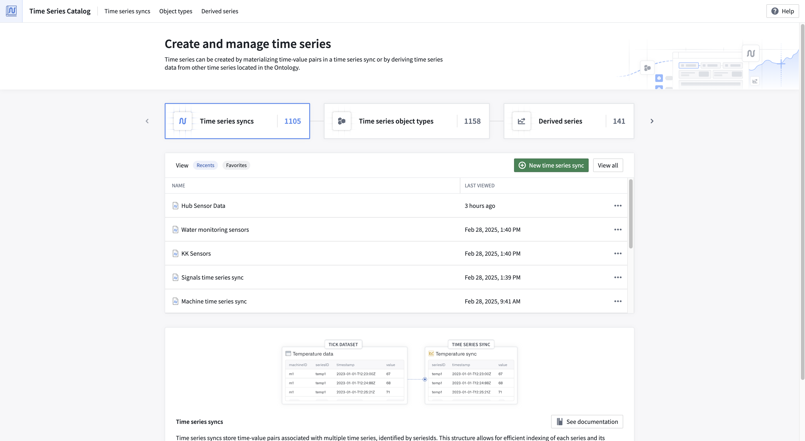

<!-- source: https://palantir.com/docs/foundry/time-series/time-series-time-series-catalog/ · mirrored 2026-08-07 from Palantir Foundry docs -->

# Time Series Catalog

The Time Series Catalog is your starting point and home for creating, managing, and discovering time series in the Palantir platform. Specifically, the Time Series Catalog was designed to facilitate your work with the following resource types:

* [Time series syncs](/docs/foundry/time-series/time-series-concepts-glossary/#time-series-sync)
* [Time series object types](/docs/foundry/time-series/time-series-concepts-glossary/#time-series-object-type)
* [Derived series](/docs/foundry/time-series/time-series-concepts-glossary/#derived-series)

From the Time Series Catalog, you can view recently accessed time series syncs and derived series, your saved "favorite" time series syncs and derived series, and your "most viewed" time series object types. Navigate to each resource type's associated tab to explore all resources of that type.

