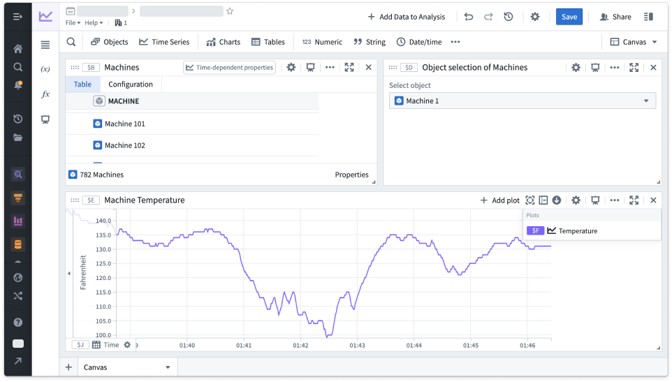
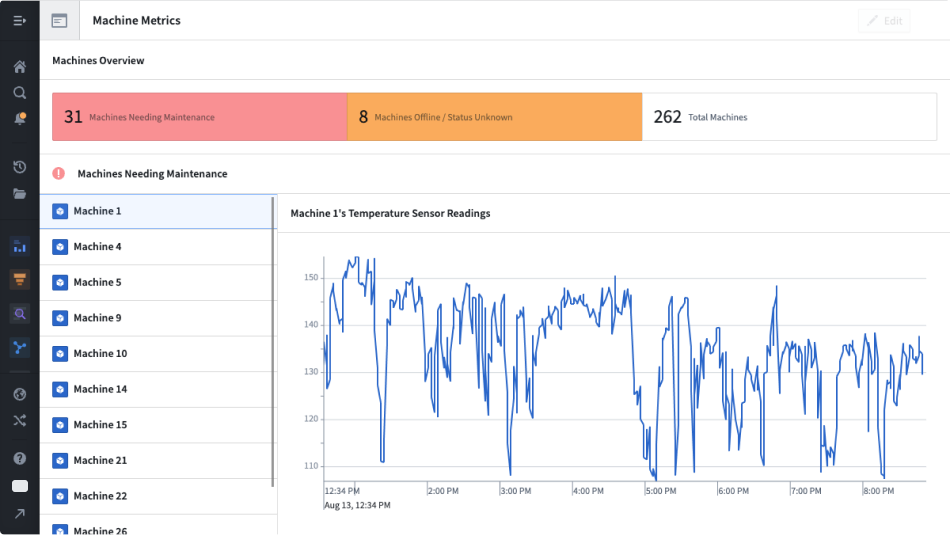
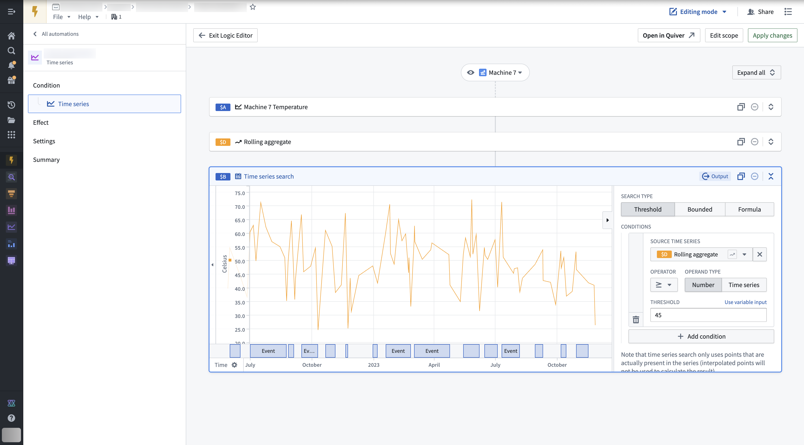
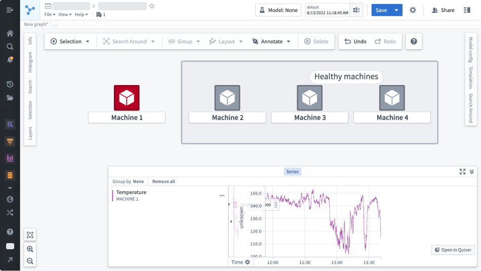
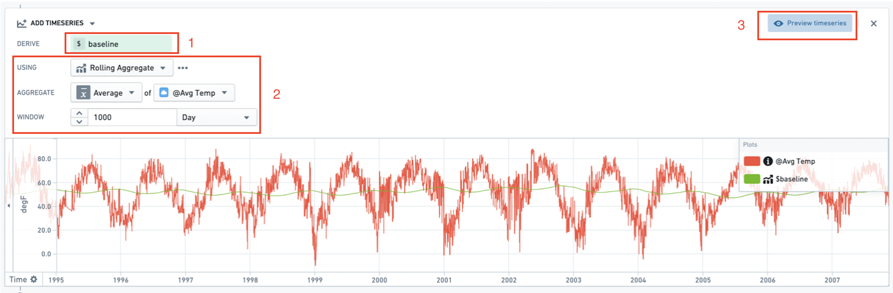

<!-- source: https://palantir.com/docs/foundry/time-series/time-series-usage/ · mirrored 2026-08-07 from Palantir Foundry docs -->

# Use time series in Foundry

Once your [time series setup](/docs/foundry/time-series/time-series-setup/) is complete, use time series object types to create visualizations and analyses in the Foundry applications listed below.

[Quiver](/docs/foundry/quiver/timeseries-overview/): Create interactive time series dashboards and analyses. The example below shows an analysis of machine temperature readings over time.

[Workshop](/docs/foundry/workshop/time-series-properties/): Build high-quality, interactive applications with time series maps, charts, and metric cards.

[Automate](/docs/foundry/time-series/alerting-overview/): Create automations that generate alerts when time series data meets user-specified criteria.

[Derived series](/docs/foundry/time-series/derived-series-overview/): Create new time series by applying calculations and transformations to existing time series within the Ontology. These derived series can be referenced and consumed in the same way as any standard time series in the Ontology.

[Vertex](/docs/foundry/vertex/explore-time-series/): Interact with time series to visualize changes across your system, and perform deep analyses to view the impact of past decisions, explore the current state, and recognize future potential.

[Foundry Rules](/docs/foundry/foundry-rules/timeseries-concepts/): Write rules that identify time periods of interest within your data.

[Map](/docs/foundry/map/time-series/): View and analyze time series data associated with geospatial objects. In the example below, aircraft sensor readings are reported alongside a map showing where the reading occurred.

