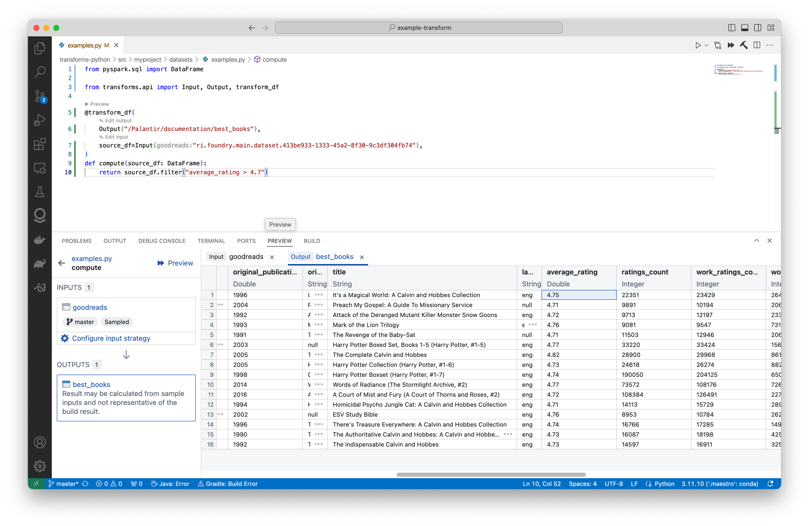
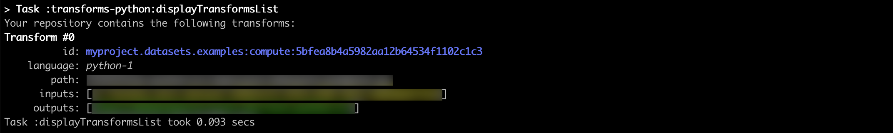
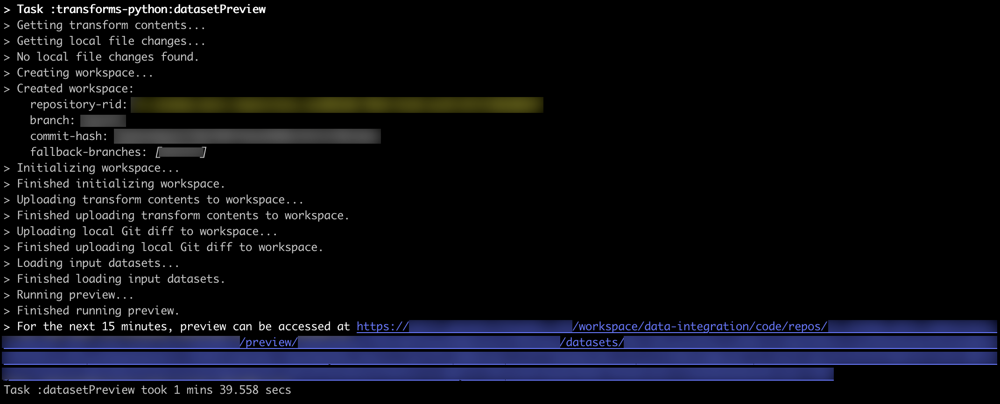
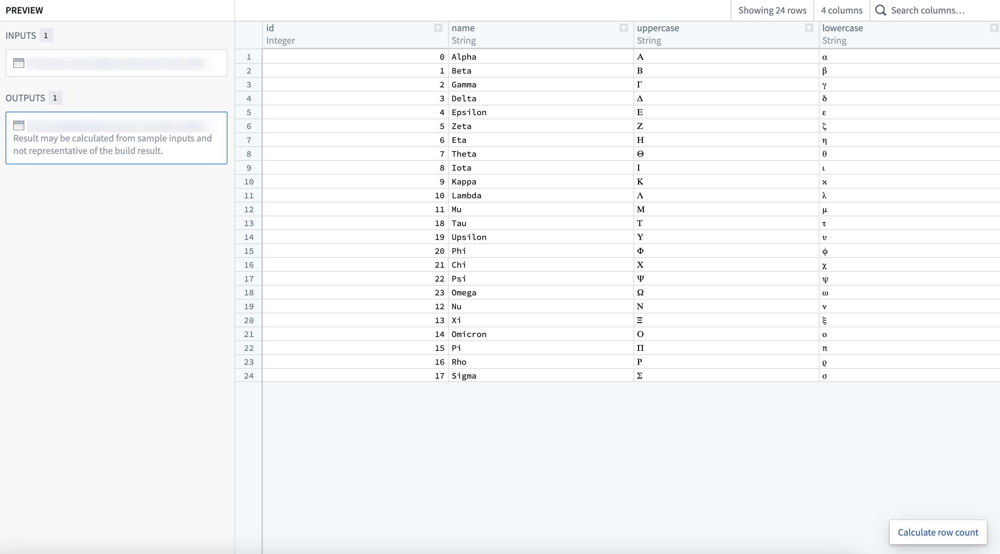
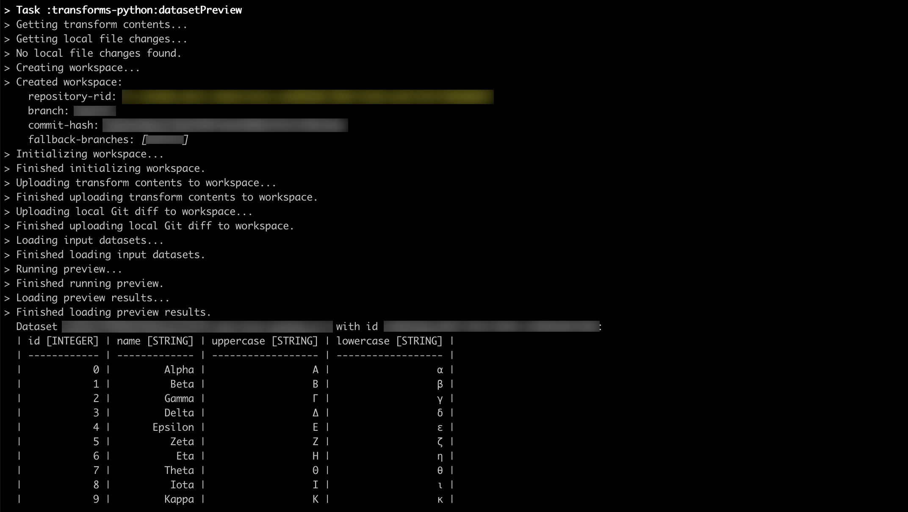
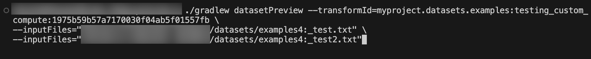
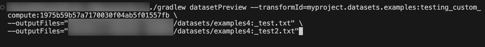

<!-- source: https://palantir.com/docs/foundry/transforms-common/ · mirrored 2026-08-14 from Palantir Foundry docs -->

# Preview transforms in local development

There are two main ways to preview transforms in local development with VS Code:

* [Preview transforms with the Palantir extension for Visual Studio Code for Python](#preview-with-the-palantir-extension-for-visual-studio-code-python-only)
* [Preview transforms with Gradle-based local preview for Java](#gradle-based-local-preview-for-java)

## Preview with the Palantir extension for Visual Studio Code (Python only)

The Palantir extension for Visual Studio Code supports local preview functionality. Refer to the [extension documentation](/docs/foundry/palantir-extension-for-visual-studio-code/overview/) for installation instructions. Once the extension has been installed and the environment is ready for preview, your transforms should be automatically discovered in the **Preview** tab as shown below.

You can also run local preview for Python transforms. When running preview locally, parts of the datasets are streamed to your machine. For more information, review the [documentation for transforms preview](/docs/foundry/palantir-extension-for-visual-studio-code/transforms-preview/).

## Gradle-based local preview for Java

This section details the steps required to preview Python and Java transforms in local development. For additional context, review our documentation for [Java local development](/docs/foundry/transforms-java/local-development/). You can also learn more about [how to preview transforms](/docs/foundry/code-repositories/preview-transforms/). Gradle-based local preview executes the preview remotely, inside of Foundry.

### Prerequisites and limitations

Local preview support requires that the local branch must be tracking a remote branch such that the local branch needs to be pushed at least once, on top of existing prerequisites for local development. Note the following additional limitations:

* The preview URI can only be accessed by the user who ran the preview and is available on a temporary basis.

### Run dataset preview

Before running the preview, you must set up the environment for local development and ensure that your repository is [upgraded to the latest template version](/docs/foundry/code-repositories/repository-upgrades/#manual-branch-upgrade).

1. Run `./gradlew displayTransformsList` which will return a list of all available transforms.
   

2. Run `./gradlew datasetPreview --transformId=<transformId>` with `<transformId>` replaced by one of the transform ids (blue text on the screenshot above), which will return a link to Foundry where the already-computed preview can be accessed.
   
   

3. (Optional) Add `--printMode=table` flag to the command above to print the first 10 rows of all previewed datasets directly in your terminal instead of being provided a link to the preview.
   

4. (Optional) To include input files in the preview, add `--inputFiles=<datasetAlias>:<path>` where `<datasetAlias>` is one of the input datasets from the selected transform function and `<path>` is the file path within the input dataset.
   

5. (Optional) To include output files in the preview, add `--outputFiles=<datasetAlias>:<path>` where `<datasetAlias>` is one of the output datasets from the selected transform function and `<path>` is the file path within the output dataset.
   
