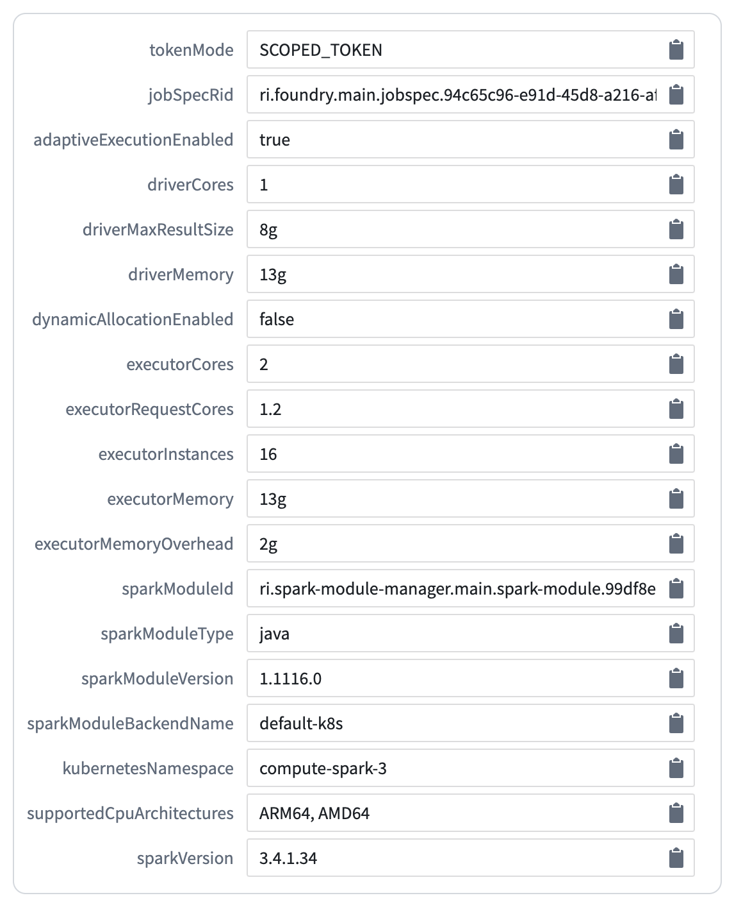
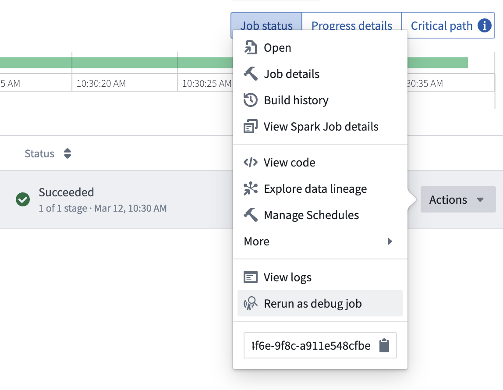

<!-- source: https://palantir.com/docs/foundry/transforms-common/transforms-versions/ · mirrored 2026-08-14 from Palantir Foundry docs -->

# Transforms versions

In transforms, the Spark and Java version used depends on the transforms version during the build. Transforms are upgraded automatically in the background to ensure that jobs stay up to date with the latest security and performance improvements. As per the [Spark versioning policy ↗](https://spark.apache.org/versioning-policy.html), the API is kept consistent between versions and legacy configs are enabled to prevent behavior changes. These configs are documented in the [Spark migration guide ↗](https://spark.apache.org/docs/latest/sql-migration-guide.html).

## Releases

The versions used are indicated in the tables listed below.

### Python

| Transforms version	 | Spark version	 | Java version	 |
|---------------------|----------------|---------------|
| 1.1048.0+	          | 3.4.1	         | 17	           |
| 2.0.0+	             | 3.5.1	         | 17	           |
| 3.0.0+	             | 3.5.5	         | 17	           |

### Java

| Transforms version	 | Spark version	 | Java version	 |
|---------------------|----------------|---------------|
| 1.1015.0+	          | 3.4.1	         | 17	           |
| 2.0.0+	             | 3.5.1	         | 17	           |
| 3.0.0+	             | 3.5.5	         | 17	           |

### SQL

| Transforms version	 | Spark version	 | Java version	 |
|---------------------|----------------|---------------|
| 1.861.0+	           | 3.4.1	         | 17	           |
| 2.0.0+	             | 3.5.1	         | 17	           |
| 3.0.0+	             | 3.5.5	         | 17	           |

## Environment page

The Environment page is accessible from the job tracker by selecting **Spark Details > Environment**. Here, you will see the key configuration details of your build, including the transforms and Spark versions.

The `sparkModuleVersion` corresponds to the transform version and the `sparkVersion` corresponds to the version of Spark used in the build.

## Runtime versioning

A transforms runtime version is selected every time a build is run. A system called “adjudication” is used to ensure that your build does not upgrade to a version that no longer works; the adjudication process selectively tests upgrades and falls back to old versions when necessary. When a new Spark version comes out, it will be automatically tested and implemented in your pipelines without any user intervention if feasible. If the upgrade is unsuccessful, your pipeline will continue to run on the old Spark version. Each Spark version upgrade will be paired with an [announcement](/docs/foundry/announcements/). To temporarily stay on an existing version of Spark, use [module pinning](/docs/foundry/code-repositories/module-pinning/) to pin the pipeline to a fixed version.

Around one month after runtime versions are released, repository upgrade prompts will be sent to inform users of issues where automatic upgrades were not possible. You should be able to debug these cases based on the checks errors in the repository.

## Debug jobs

If you suspect that a transforms upgrade has introduced a break to your pipeline, use a debug job to diagnose the issue. On failed jobs, select **Actions** and **Rerun as debug job** to specify a previously successful version and confirm that the change in transform version is responsible for the break. If you encounter a situation where a transforms upgrade has broken your pipeline, contact Palantir support for further assistance.

:::callout{theme="neutral"}
Running debug jobs is not currently supported for the following:

* [External transforms](/docs/foundry/data-connection/external-transforms/) that use sources with secrets.
* [Legacy external transforms](/docs/foundry/data-connection/external-transforms-legacy/) that use credentials.

For both of the above, debug jobs are expected to fail with a `OneTimeAccessKeyService:OneTimeAccessKeyNotFound` error.
:::
