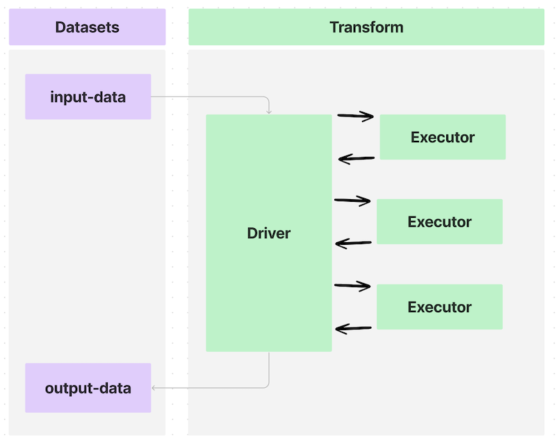
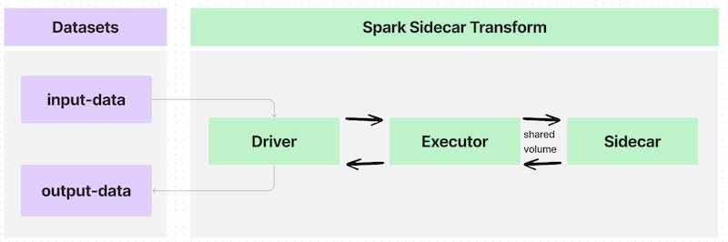
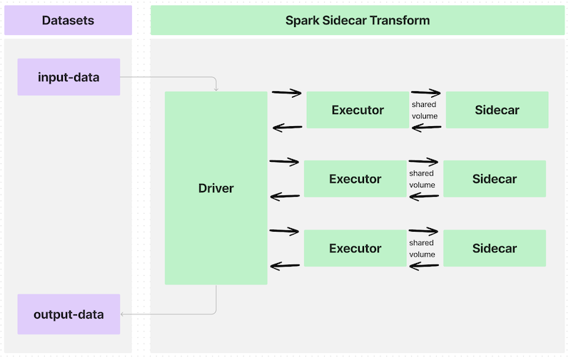
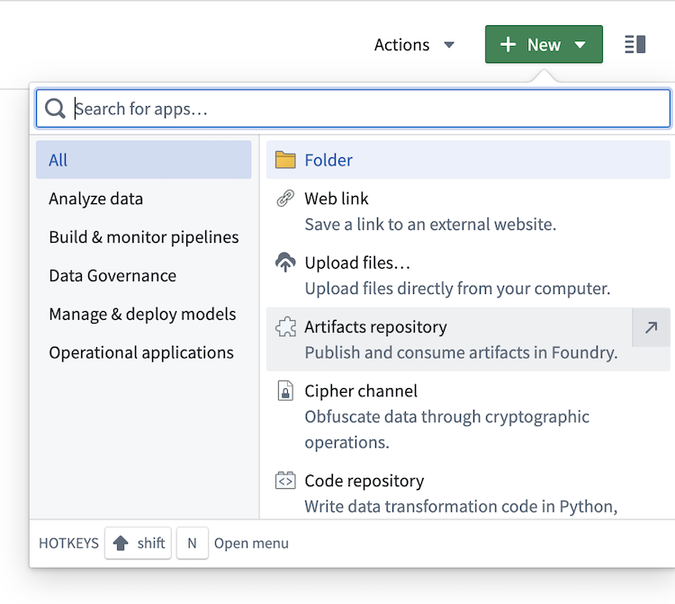
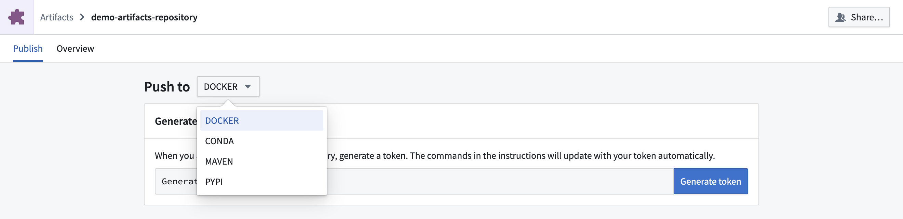

<!-- source: https://palantir.com/docs/foundry/transforms-container/transforms-sidecar/ · mirrored 2026-08-14 from Palantir Foundry docs -->

# Spark sidecar transforms

:::callout{theme="warning" title="Prerequisites"}
The following documentation assumes the following prerequisite working knowledge:

1. [Containerized infrastructure and concepts like container images ↗](https://docs.docker.com/get-started/)
2. [PySpark transforms](/docs/foundry/transforms-python-spark/pyspark-overview/)
:::

Spark sidecar transforms allows you to deploy containerized code while leveraging the existing infrastructure provided by Spark and transforms.

Containerizing code allows you to package any code and any dependencies to run in Foundry. The containerization workflow is integrated with transforms, meaning scheduling, branching, and data health are all seamlessly integrated. Since containerized logic runs alongside Spark executors, you can scale your containerized logic with your input data.

In short, any logic that [can run in a container](/docs/foundry/transforms-container/container-overview/#image-requirements) can be used to process, generate, or consume data in Foundry.

If you are familiar with containerization concepts, use the sections below to learn more about using the Spark sidecar transforms:

* [Architecture](#architecture)
* [Build an image](#build-an-image)
* [Push an image](#push-an-image)
* [Write a Spark sidecar transform](#write-a-spark-sidecar-transform)

[Learn more about containerization in Foundry.](/docs/foundry/transforms-container/container-overview/)

## Architecture

Transforms in Foundry can send data to and from datasets using a Spark driver to distribute processing across multiple executors, as shown in the diagram below:



Annotating a transform using the `@sidecar` decorator (provided in the `transforms-sidecar` library) allows you to specify exactly one container that launches alongside each executor in a PySpark transform. The user-provided container, made with custom logic and running with each executor, is called the sidecar container.

In a simple use case with one executor, the data flow would look like the following:



If you write a transform that partitions an input dataset across many executors, the data flow would look like this:



The interface between each executor and the sidecar container is a shared volume, or a directory, to communicate information such as the following:

* When to begin execution of containerized logic
* What input data to process in the container
* What output data to pull out of the container
* When to end execution of the containerized logic

These shared volumes are specified using the `Volume` argument to the `@sidecar` decorator and will be subfolders within the path `/opt/palantir/sidecars/shared-volumes/`.

The next sections will guide you through preparing for and writing your Spark sidecar transforms.

## Build an image

To build an image compatible with Spark sidecar transforms, the image must meet the [image requirements](/docs/foundry/transforms-container/container-overview/#image-requirements). The image must also include the critical components described below and included in the example Docker image. To build this example image, you will need the Python script [`entrypoint.py`](#entrypoint).

You will need Docker installed on your local computer and must have access to the `docker` CLI command ([official documentation ↗](https://docs.docker.com/engine/reference/commandline/cli/)).

## Push an image

To push an image, create a new Artifacts repository and follow the instructions to tag and push your image to the relevant Docker repository.

1. [Create an Artifacts repository.](/docs/foundry/code-repositories/create-artifact-repository/)



2. Change the type to `Docker`.



3. Follow the on-screen instructions to generate a token.
4. Build your example image with the following command pattern: `docker build . --tag <container_registry>/<image_name>:<image_tag> --platform linux/amd64` where the following is true:
   * `container_registry` represents the address of your Foundry instance container registry, which you can locate as part of the last command in the instructions for pushing a Docker image to an Artifact repository.
   * `image_name` and `image_tag` are at your discretion. This example uses `simple_example:0.0.1`.
5. Copy and paste the instructions from the Artifacts repository to push the locally built image. Ensure that you replace the `<image_name>:<image_version>` in the last command with the `image_name` and `image_version` used in the image building step above.

## Write a Spark sidecar transform

1. [Create a Python data transform repository](/docs/foundry/transforms-python/getting-started/#set-up-a-python-code-repository) in the Code Repositories application.
2. Under the **Libraries** tab on the left, add `transforms-sidecar` and commit the change.
3. Under **Settings > Libraries**, add your Artifact repository.
4. Author the transform.

## Example 1: Sidecar running as a server

### Dockerfile

In a folder on your local computer, add the following contents to a file called `Dockerfile`:

```dockerfile
# Use the official Python image from the Docker Hub
FROM python:3.8-slim

# Set the working directory
WORKDIR /usr/src/app

# Copy application dependency manifest
COPY requirements.txt ./

# Install application dependencies
RUN pip install --no-cache-dir -r requirements.txt

# Copy the application code
COPY . .

# Expose the port the app runs on
EXPOSE 1234

# Run the application
CMD ["python", "app.py"]

USER 1234
```

In the same folder, add a new file called `requirements.txt` and list the required Python dependencies:

```
flask
```

### Server logic

In the same local folder as your `Dockerfile`, copy the following code snippet into a file named `app.py`.

```python
from flask import Flask

app = Flask(__name__)

@app.route('/hello')
def hello():
    return 'Hello World'

if __name__ == '__main__':
    app.run(host='0.0.0.0', port=1234)
```

### Server logic

In your Foundry Python code repository, write the following example transform to call the `/hello` endpoint on the sidecar and save the response to the output:

```python
import requests

from transforms.api import Output, transform_df
from transforms.sidecar import sidecar


@sidecar(image='simple-example', tag='0.0.1')
@transform_df(
    Output("<output dataset rid>"),
)
def compute(ctx):
    response = requests.get('http://localhost:1234/hello')

    data = [(response.text,)]

    columns = ["response_text"]
    return ctx.spark_session.createDataFrame(data, columns)

```

## Example 2: Sidecar wrapping a CLI

### Dockerfile

In a folder on your local computer, add the following contents to a file called `Dockerfile`:

```dockerfile
FROM fedora:38

ADD entrypoint.py /usr/bin/entrypoint
RUN chmod +x /usr/bin/entrypoint

RUN mkdir -p /opt/palantir/sidecars/shared-volumes/shared/
RUN chown 5001 /opt/palantir/sidecars/shared-volumes/shared/
ENV SHARED_DIR=/opt/palantir/sidecars/shared-volumes/shared

USER 5001

ENTRYPOINT entrypoint -c "dd if=$SHARED_DIR/infile.csv of=$SHARED_DIR/outfile.csv"
```

#### Customized Dockerfile

You can build your own Dockerfile, as above, but make sure to cover the following:

* Specify a **numeric non-root user** on line 10. This is one of the [image requirements](/docs/foundry/transforms-container/container-overview/#image-requirements) and helps to maintain a proper security posture where containers are not given privileged execution.

* Place the **creation of a shared volume** on lines 6-8. As discussed in the [architecture section](#architecture) above, shared volumes that are subdirectories within `/opt/palantir/sidecars/shared-volumes/` are the primary method in which the input data and output data are shared from the PySpark transform to the sidecar container.

  * Line 6 creates the directory.
  * Line 7 ensures the directory is permissioned to the created user.
  * Line 8 stores the path to this shared directory as an environment variable for reference elsewhere.

* **Add a simple `entrypoint` script to the container** on line 3 and set as the `ENTRYPOINT` on line 12. This step is critical, as Spark sidecar transforms do not natively instruct the sidecar container to wait for input data to be available before the container launches. Additionally, sidecar transforms do not tell the container to stay alive and wait for the output data to be copied off. The provided `entrypoint` script uses Python to tell the container to wait for a `start_flag` file to be written to the shared volume before the specified logic executes. When the specified logic finishes, it writes a `done_flag` to the same directory. The container will wait for a `close_flag` to be written to the shared volume before it will stop itself and be automatically cleaned up.

As shown in the example above, the containerized logic uses the POSIX Disk Dump (dd) utility to copy and input CSV files from the shared directory to an output file stored in the same directory. This “command”, which is passed into the `entrypoint` script, could be any logic that can execute in the container.

### Entrypoint

In the same local folder as your `Dockerfile`, copy the following code snippet into a file named `entrypoint.py`.

```python
#!/usr/bin/env python3

import os
import time
import subprocess
from datetime import datetime

import argparse

parser = argparse.ArgumentParser()
parser.add_argument("-c", "--command", type=str, help="model command to execute")
args = parser.parse_args()
the_command = args.command.split(" ")


def run_process(exe):
    "Define a function for running commands and capturing stdout line by line"
    p = subprocess.Popen(exe, stdout=subprocess.PIPE, stderr=subprocess.STDOUT)
    return iter(p.stdout.readline, b"")


start_flag_fname = "/opt/palantir/sidecars/shared-volumes/shared/start_flag"
done_flag_fname = "/opt/palantir/sidecars/shared-volumes/shared/done_flag"
close_flag_fname = "/opt/palantir/sidecars/shared-volumes/shared/close_flag"

# Wait for start flag
print(f"{datetime.utcnow().isoformat()}: waiting for start flag")
while not os.path.exists(start_flag_fname):
    time.sleep(1)
print(f"{datetime.utcnow().isoformat()}: start flag detected")

# Execute model, logging output to file
with open("/opt/palantir/sidecars/shared-volumes/shared/logfile", "w") as logfile:
    for item in run_process(the_command):
        my_string = f"{datetime.utcnow().isoformat()}: {item}"
        print(my_string)
        logfile.write(my_string)
        logfile.flush()
print(f"{datetime.utcnow().isoformat()}: execution finished writing output file")

# Write out the done flag
open(done_flag_fname, "w")
print(f"{datetime.utcnow().isoformat()}: done flag file written")

# Wait for close flag before allowing the script to finish
while not os.path.exists(close_flag_fname):
    time.sleep(1)
print(f"{datetime.utcnow().isoformat()}: close flag detected. shutting down")

```

The following examples will review the key information required to get started with sidecar transforms. Both examples use the same utilities file found [here](#example-utilities) that you can add to your code repository and import as shown below.

### Example 1: Single execution

The transform below imports the `@sidecar` decorator and the `Volume` primitive from the `transforms-sidecar` library.
The transform uses both items for annotation so that one instance of the `simple-example:0.0.1` container is launched with each executor. Each executor/sidecar pair will have a shared volume at `/opt/palantir/sidecars/shared-volumes/shared`.

This first example launches one instance of the container with one executor and follows the architecture shown in the image below:


The transform then uses the utility function `lanch_udf_once` to launch one instance of the `user_defined_function`. That user-defined function will run on one executor and communicate with one instance of the sidecar container. The user-defined function will invoke the imported utility functions to do the following:

* Copy the input files to the shared directory so they are accessible to the sidecar container.
* Copy the start flag so the sidecar container knows to execute.
* Wait for the containerized logic to finish.
* Copy out the files created by the containerized logic.
* Copy a close flag so the container can stop and be cleaned up.

```python
from transforms.api import transform, Input, Output
from transforms.sidecar import sidecar, Volume
from myproject.datasets.utils import copy_files_to_shared_directory, copy_start_flag, wait_for_done_flag
from myproject.datasets.utils import copy_output_files, copy_close_flag, launch_udf_once


@sidecar(image='simple-example', tag='0.0.1', volumes=[Volume("shared")])
@transform(
    output=Output("<output dataset rid>"),
    source=Input("<input dataset rid>"),
)
def compute(output, source, ctx):
    def user_defined_function(row):
        # Copy files from source to shared directory.
        copy_files_to_shared_directory(source)
        # Send the start flag so the container knows it has all the input files
        copy_start_flag()
        # Iterate till the stop flag is written or we hit the max time limit
        wait_for_done_flag()
        # Copy out output files from the container to an output dataset
        output_fnames = [
            "start_flag",
            "outfile.csv",
            "logfile",
            "done_flag",
        ]
        copy_output_files(output, output_fnames)
        # Write the close flag so the container knows you have extracted the data
        copy_close_flag()
        # The user defined function must return something
        return (row.ExecutionID, "success")
    # This spawns one task, which maps to one executor, and launches one "sidecar container"
    launch_udf_once(ctx, user_defined_function)

```

### Example 2: Parallel execution

This example launches many instances of the sidecar container, each processing a subset of the input data. The information is then collected and saved to output datasets. This example more closely resembles the architecture shown below:


The following transform uses different utility functions to partition the input data and send individual files to each container, performing the same execution on different chunks of input data. The utility functions are written to save the output files as both individual files and as a tabular output dataset.

You will see the same parameters configured for the `@sidecar` decorator and `Volume` specification, as in Example 1.

An `@configure` flag is set to ensure that only one task launches per executor and that exactly four total executors can launch. This configuration, combined with the fact that the input dataset has exactly four rows of data and the input repartition is set to `4`, means that four instances of the user-defined function will launch on four executors. Therefore, exactly four instances of the sidecar container will launch and process their segment of the input data.

Ensure that your repository has the two Spark profiles imported under **Settings > Spark**.

```python
from transforms.api import transform, Input, Output, configure
from transforms.sidecar import sidecar, Volume
import uuid
from myproject.datasets.utils import copy_start_flag, wait_for_done_flag, copy_close_flag
from myproject.datasets.utils import write_this_row_as_a_csv_with_one_row
from myproject.datasets.utils import copy_output_files_with_prefix, copy_out_a_row_from_the_output_csv


@configure(["EXECUTOR_CORES_EXTRA_SMALL", "NUM_EXECUTORS_4"])
@sidecar(image='simple-example', tag='0.0.1', volumes=[Volume("shared")])
@transform(
    output=Output("<first output dataset rid>"),
    output_rows=Output("<second output dataset rid>"),
    source=Input("<input dataset rid>"),
)
def compute(output, output_rows, source, ctx):

    def user_defined_function(row):
        # Copy files from source to shared directory
        write_this_row_as_a_csv_with_one_row(row)

        # Send the start flag so the container knows it has all the input files.
        copy_start_flag()

        # Iterate until the stop flag is written or you hit the maximum time limit.
        wait_for_done_flag()

        # Copy output files from the container to the output datasets
        output_fnames = [
            "start_flag",
            "infile.csv",
            "outfile.csv",
            "logfile",
            "done_flag",
        ]
        random_unique_prefix = f'{uuid.uuid4()}'[:8]
        copy_output_files_with_prefix(output, output_fnames, random_unique_prefix)

        outdata1, outdata2, outdata3 = copy_out_a_row_from_the_output_csv()

        # Write the close flag so the container knows you have extracted the data.
        copy_close_flag()

        # The user-defined function must return something.
        return (row.data1, row.data2, row.data3, "success", outdata1, outdata2, outdata3)

    results = source.dataframe().repartition(4).rdd.map(user_defined_function)
    columns = ["data1", "data2", "data3", "success", "outdata1", "outdata2", "outdata3"]
    output_rows.write_dataframe(results.toDF(columns))
```

### Example utilities

utils.py

```python
import os
import shutil
import time
import csv
import pyspark.sql.types as T

VOLUME_PATH = "/opt/palantir/sidecars/shared-volumes/shared"
MAX_RUN_MINUTES = 10


def write_this_row_as_a_csv_with_one_row(row):
    in_path = "/opt/palantir/sidecars/shared-volumes/shared/infile.csv"
    with open(in_path, 'w', newline='') as csvfile:
        writer = csv.writer(csvfile, delimiter=',')
        writer.writerow(['data1', 'data2', 'data3'])
        writer.writerow([row.data1, row.data2, row.data3])


def copy_out_a_row_from_the_output_csv():
    out_path = "/opt/palantir/sidecars/shared-volumes/shared/outfile.csv"
    with open(out_path, newline='') as csvfile:
        reader = csv.reader(csvfile, delimiter=',', quotechar='|')
        values = "", "", ""
        for myrow in reader:
            values = myrow[0], myrow[1], myrow[2]
        return values


def copy_output_files_with_prefix(output, output_fnames, prefix):
    for file_path in output_fnames:
        output_fs = output.filesystem()
        out_path = os.path.join(VOLUME_PATH, file_path)
        try:
            with open(out_path, "rb") as shared_file:
                with output_fs.open(f'{prefix}_{file_path}', "wb") as output_file:
                    shutil.copyfileobj(shared_file, output_file)
        except FileNotFoundError as err:
            print(err)


def copy_files_to_shared_directory(source):
    source_fs = source.filesystem()
    for item in source_fs.ls():
        file_path = item.path
        with source_fs.open(file_path, "rb") as source_file:
            dest_path = os.path.join(VOLUME_PATH, file_path)
            with open(dest_path, "wb") as shared_file:
                shutil.copyfileobj(source_file, shared_file)


def copy_start_flag():
    open(os.path.join(VOLUME_PATH, 'start_flag'), 'w')
    time.sleep(1)


def wait_for_done_flag():
    i = 0
    while i < 60 * MAX_RUN_MINUTES and not os.path.exists(os.path.join(VOLUME_PATH, 'done_flag')):
        i += 1
        time.sleep(1)


def copy_output_files(output, output_fnames):
    for file_path in output_fnames:
        output_fs = output.filesystem()
        out_path = os.path.join(VOLUME_PATH, file_path)
        try:
            with open(out_path, "rb") as shared_file:
                with output_fs.open(file_path, "wb") as output_file:
                    shutil.copyfileobj(shared_file, output_file)
        except FileNotFoundError as err:
            print(err)


def copy_close_flag():
    time.sleep(5)
    open(os.path.join(VOLUME_PATH, 'close_flag'), 'w')  # send the close flag


def launch_udf_once(ctx, user_defined_function):
    # Using a dataframe with a single row, launch user_defined_function once on that row
    schema = T.StructType([T.StructField("ExecutionID", T.IntegerType())])
    ctx.spark_session.createDataFrame([{"ExecutionID": 1}], schema=schema).rdd.foreach(user_defined_function)

```

## Resource profiles

The `@sidecar` decorator supports a `resource_profile` parameter that allows you to specify the computational resources allocated to each sidecar container. This parameter controls the CPU, memory, and GPU resources available to your containerized workload.

### Available resource profiles

The following resource profiles are available:

| Profile                                        | CPU Cores | Memory | GPU       | Shared Memory |
| ---------------------------------------------- | --------- | ------ | --------- | ------------- |
| `SMALL_CPU_SMALL_MEMORY`                       | 1         | 3GB    | None      | None          |
| `MEDIUM_CPU_MEDIUM_MEMORY`                     | 2         | 6GB    | None      | None          |
| `MEDIUM_CPU_MEDIUM_MEMORY_SMALL_SHARED_MEMORY` | 2         | 6GB    | None      | 2GB           |
| `LARGE_CPU_LARGE_MEMORY`                       | 4         | 13GB   | None      | None          |
| `LARGE_CPU_LARGE_MEMORY_GPU_ENABLED`           | 4         | 13GB   | 1x NVIDIA | None          |
| `X_LARGE_CPU_X_LARGE_MEMORY`                   | 8         | 27GB   | None      | None          |
| `X_LARGE_CPU_X_LARGE_MEMORY_GPU_ENABLED`       | 8         | 27GB   | 1x NVIDIA | None          |
| `XX_LARGE_CPU_XX_LARGE_MEMORY`                 | 16        | 54GB   | None      | None          |
