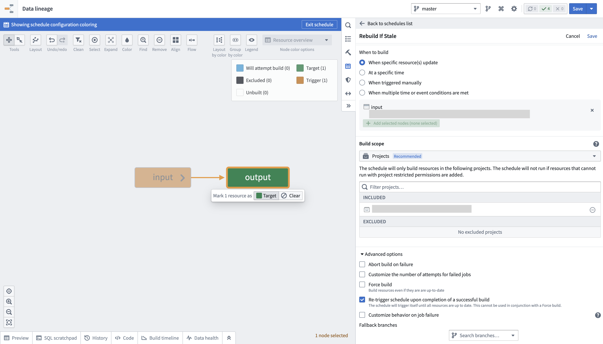
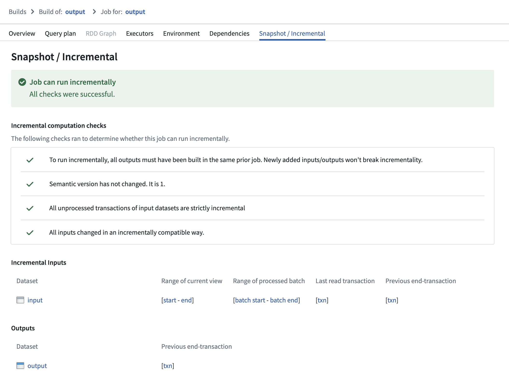
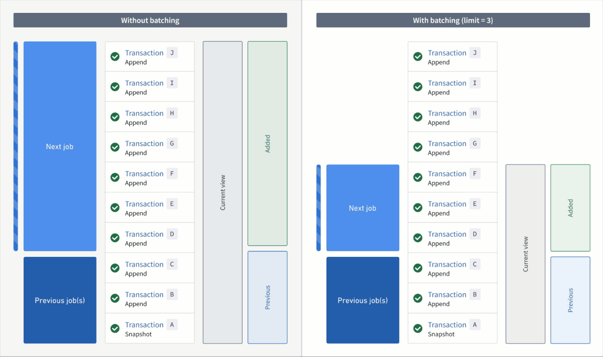
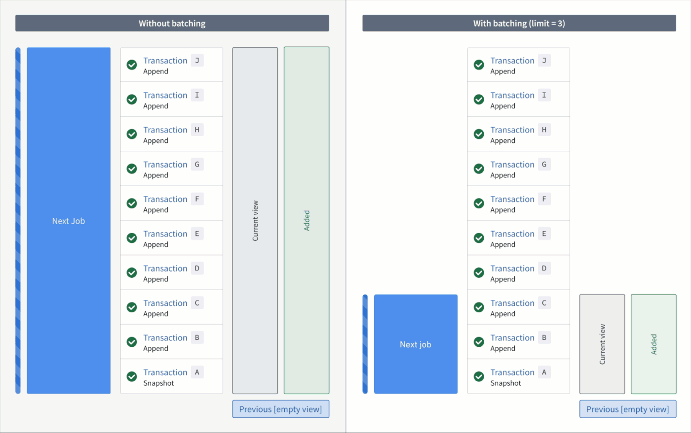

<!-- source: https://palantir.com/docs/foundry/transforms-python-spark/incremental-transaction-limits/ · mirrored 2026-08-13 from Palantir Foundry docs -->

# Limit batch size of incremental inputs

Typically, when an output dataset is built incrementally, all unprocessed transactions of each input dataset are processed in the same [job](/docs/foundry/data-integration/builds/#jobs-and-jobspecs). However, in some situations, the number of transactions processed by a job can vary significantly:

* An incremental transform is built in `SNAPSHOT` mode and the entire input is read from the beginning (for example, the [semantic version](/docs/foundry/transforms-python/incremental-usage/#incremental-decorator) of the transform was increased).
* An input dataset has accumulated many [transactions](/docs/foundry/data-integration/datasets/#transactions) of data, so a downstream incremental transform now has to process many transactions in a single job.

You can configure a **transaction limit** on each incremental input of a transform to constrain the amount of data read in each job.

The example below configures an incremental transform to use the following:

* Two incremental inputs, each with a different transaction limit
* An incremental input that does not use a transaction limit
* A snapshot input

```python
from transforms.api import transform, Input, Output, incremental

@incremental(
    v2_semantics=True,
    strict_append=True,
    snapshot_inputs=["snapshot_input"]
)
@transform(
    # Incremental input configured to read a maximum of 3 transactions
    input_1=Input("/examples/input_1", transaction_limit=3),

    # Incremental input configured to read a maximum of 2 transactions
    input_2=Input("/examples/input_2", transaction_limit=2),

    # Incremental input without a transaction limit
    input_3=Input("/examples/input_3"),

    # Snapshot input whose entire view is read each time
    snapshot_input=Input("/examples/input_4"),

    output=Output("/examples/output")
)
def compute(input_1, input_2, input_3, snapshot_input, output):
    ...
```

## Create a build schedule to keep outputs up to date

When transaction limits are enabled, a dataset may still be out of date with the latest upstream data after a successful build since only a portion of the data would have been processed. You can configure a schedule to keep building the output dataset until it is up to date with its inputs by following the below steps:

1. Navigate to [Data Lineage](/docs/foundry/data-lineage/overview/).
2. Open the **Manage schedule** tab in the panel to the right and choose to **[Create new schedule](/docs/foundry/building-pipelines/create-schedule/#create-a-schedule)**.
3. Set the **target resource** as the output dataset of the incremental transform configured with transaction limits.
4. In the **When to build** section, choose an option and configure any additional frequency details:

* When specific resource(s) update
* At a specific time
* When triggered manually
* When multiple time or event conditions are met

5. Scroll down to and expand the **Advanced options** section at the bottom of the panel.
6. Enable the option to **Re-trigger schedule upon completion of a successful build**.
7. Select **Save** at the top right of your screen to save the schedule configuration.

:::callout{neutral}
* It is not possible to configure a schedule with both the **Re-trigger schedule upon completion of a successful build** and **Force build** options enabled, as the logic of one option will contradict the other. A re-triggered build only occurs until the dataset is no longer stale, while a forced build will occur whether or not the data is stale. Consequently, the schedule will never stop prompting rebuilds if both options are enabled.
* If new transactions arrive at a high frequency on the input dataset, the schedule will prompt continuous rebuilding.
* The **Re-trigger schedule upon completion of a successful build** option will only be visible in a schedule's configuration when at least one of its target resources is configured to use a transaction limit.
:::



## View job transaction ranges

You can verify the ranges of transactions read per input in an incremental job by following the steps below:

1. Navigate to the [**Spark details**](/docs/foundry/optimizing-pipelines/understand-spark-details/#getting-to-spark-details) page of the job you want to inspect.
2. Select the **Snapshot/Incremental** tab.



On this page, ranges of transactions are reported per input, displaying which part of each input was processed in both the current and previous job:

* **Range of current view:** This range represents the start and end transactions of the input’s view that were read in the current job.
* **Range of processed batch:** This range represents the start and end transactions of the batch within the "range of current view" that was processed in the current job.
* **Previous end transaction:** This transaction indicates the final transaction of the input’s view from the previous job.
* **Last read transaction:** This transaction indicates the last transaction of the input that was processed in the previous job. This transaction will be one of the following:
  * The same as the "previous end transaction", if one of the following is true:
    * The input was processed without a transaction limit in the previous job.
    * The input was a configured to use a transaction limit in the previous job, and the processed batch was the final batch of the input.
  * A transaction before the "previous end transaction"; this happens when the input used a transaction limit, and the batch that was processed was *not* the final batch of the input.

Select a transaction to navigate to the [**History** page](/docs/foundry/dataset-preview/overview/#history) of the input, where the corresponding transaction will be highlighted.

## Understand read ranges for inputs with transaction limits

Though the same `added`, `current`, and `previous` read ranges are offered when the input is configured with or [without transaction limits](/docs/foundry/transforms-python/incremental-usage/#incrementaltransforminput), they behave slightly differently.

In the example below, consider an incremental transform where you already processed transactions `A` to `C`. Now, assume that a relatively large number of transactions, `D` to `J`, are added to the input.

If you read the input **without a transaction limit**, the range of transactions for each read mode in the next job would be as follows:

* **Added:** `D` to `J`
* **Previous:** `A` to `C`
* **Current:** `A` to `J`

However, if you read the input **with a transaction limit of three**, you would need *three* jobs to catch up to the input. The range of transactions for each read mode per job would be as follows:

First job:

* **Added:** `D` to `F` (the next three unprocessed transactions)
* **Previous:** `A` to `C` (all transactions that were processed in the previous job)
* **Current:** `A` to `F` (all transactions that were processed up to and including this batch)

Second job:

* **Added:** `G` to `I`
* **Previous:** `A` to `F`
* **Current:** `A` to `I`

Third job:

* **Added:** `J`
* **Previous:** `A` to `I`
* **Current:** `A` to `J`



Now, if the output was snapshotted (for example, if the semantic version was changed), transactions would be processed again from the start transaction of the input and result in the resolved ranges below:

Without a transaction limit:

* **Added:** `A` to `J` (all transactions are now "unprocessed")
* **Previous:** none
* **Current:** `A` to `J`

With a incremental input:

First job:

* **Added:** `A` to `C`
* **Previous:** none
* **Current:** `A` to `C` (all transactions that were processed up to and including this batch)

Second job:

* **Added:** `D` to `F`
* **Previous:** `A` to `C`
* **Current:** `A` to `F`

Third job:

* **Added:** `G` to `I`
* **Previous:** `A` to `F`
* **Current:** `A` to `I`

Fourth job:

* **Added:** `J`
* **Previous:** `A` to `I`
* **Current:** `A` to `J`



## Requirements and limitations

To use transaction limits in an incremental transform, ensure you have access to the necessary tools and services and that the transforms and datasets meet the requirements below.

The transform must meet the following conditions:

* The [incremental](/docs/foundry/transforms-python/incremental-usage/#incremental-decorator) decorator is used and the `v2_semantics` argument is set to `True`.
* It is configured to use Python transforms version `3.25.0` or higher. Configure a job with [module pinning](/docs/foundry/code-repositories/module-pinning/) to use a specific version of Python transforms.
* It cannot be a [lightweight transform](/docs/foundry/transforms-python/compute-engines/).

:::callout{theme="warning"}
Enabling `v2_semantics` on an existing incremental transform will cause the subsequent build to run as `SNAPSHOT`. **This only happens once.**
:::

Input datasets must meet the following conditions to be configured with a transaction limit:

* It must be a [transactional dataset](/docs/foundry/data-integration/datasets/#transactions) input.
* In the [current view of the dataset](/docs/foundry/data-integration/datasets/#dataset-views), it must have only [`APPEND`](/docs/foundry/data-integration/datasets/#append) transactions; however, the starting transaction can be a [`SNAPSHOT`](/docs/foundry/data-integration/datasets/#snapshot).
* It cannot be a [snapshot input](/docs/foundry/transforms-python/incremental-usage/#snapshot-inputs).

:::callout{theme="warning"}
If *any* transaction in the current view is a `DELETE` or `UPDATE` transaction, the job **will fail** with a `Build2:InvalidTransactionTypeForBatchInputResolution` error.
:::
