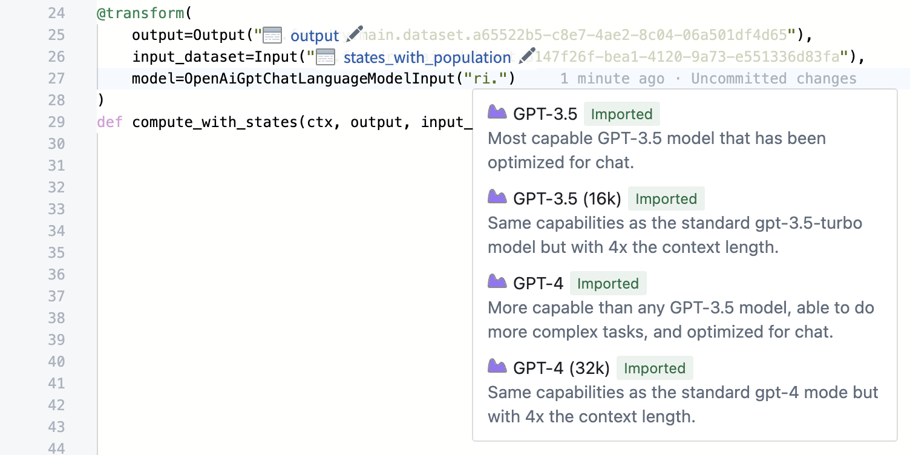

<!-- source: https://palantir.com/docs/foundry/transforms-python-spark/palantir-provided-models/ · mirrored 2026-08-13 from Palantir Foundry docs -->

# Use Palantir-provided language models within transforms

:::callout{title="Prerequisites" theme="neutral"}
To use Palantir-provided language models, [AIP must first be enabled on your enrollment](/docs/foundry/aip/enable-aip-features/).
:::

Palantir provides a [set of language and embedding models](/docs/foundry/aip/supported-llms/) which can be used within Python transforms, including both Spark and [lightweight transforms](/docs/foundry/transforms-python/overview/). The models can be used through the `palantir_models` library. This library provides a set of input params that can be used with the [`transforms.api.transform`](/docs/foundry/api-reference/transforms-python-library/api-transform/#transforms.api.transform) decorator.

### Repository setup

To add language model support to your transforms, open the library search panel on the left side of your Code Repository. Search for `palantir_models` and choose **Add and install library** within the **Library** tab. Repeat this process with `language-model-service-api` to add that library as well.

Your Code Repository will then resolve all dependencies and run checks again. Checks may take a moment to complete, after which you will be able to start using the library in your transforms.

### Transform setup

:::callout{title="Prerequisites" theme="neutral"}
The `palantir_model` classes can only be used with the [`transforms.api.transform`](/docs/foundry/api-reference/transforms-python-library/api-transform/#transforms.api.transform) decorator.
:::

In this example, we will use the `palantir_models.transforms.OpenAiGptChatLanguageModelInput`. First, import `OpenAiGptChatLanguageModelInput` into your Python file. This class can now be used to create our transform. Then, follow the prompts to specify and import the model and dataset that you wish to use as input.

```python
from transforms.api import transform, Input, Output
from palantir_models.transforms import OpenAiGptChatLanguageModelInput
from palantir_models.models import OpenAiGptChatLanguageModel

@transform(
    source_df=Input("/path/to/input/dataset")
    model=OpenAiGptChatLanguageModelInput("ri.language-model-service..language-model.gpt-4_azure"),
    output=Output("/path/to/output/dataset"),
)
def compute_generic(ctx, source_df, model: OpenAiGptChatLanguageModel, output):
    ...
```

As you begin typing the resource identifier, a dropdown menu will automatically appear to indicate models available for use. You may choose your desired option from the dropdown.



### Use language models to generate completions

For this example, we will be using the language model to determine the sentiment for each review in the input dataset. The `OpenAiGptChatLanguageModelInput` provides an `OpenAiGptChatLanguageModel` to the transform at runtime which can then be used to generate completions for reviews.

```python
from transforms.api import transform, Input, Output
from palantir_models.transforms import OpenAiGptChatLanguageModelInput
from palantir_models.models import OpenAiGptChatLanguageModel
from language_model_service_api.languagemodelservice_api_completion_v3 import GptChatCompletionRequest
from language_model_service_api.languagemodelservice_api import ChatMessage, ChatMessageRole


@transform(
    reviews=Input("/path/to/reviews/dataset"),
    model=OpenAiGptChatLanguageModelInput("ri.language-model-service..language-model.gpt-4_azure"),
    output=Output("/output/path"),
)
def compute_sentiment(ctx, reviews, model: OpenAiGptChatLanguageModel, output):
    def get_completions(review_content: str) -> str:
        system_prompt = "Take the following review determine the sentiment of the review"
        request = GptChatCompletionRequest(
            [ChatMessage(ChatMessageRole.SYSTEM, system_prompt), ChatMessage(ChatMessageRole.USER, review_content)]
        )
        resp = model.create_chat_completion(request)
        return resp.choices[0].message.content

    reviews_df = reviews.pandas()
    reviews_df['sentiment'] = reviews_df['review_content'].apply(get_completions)
    out_df = ctx.spark_session.createDataFrame(reviews_df)
    return output.write_dataframe(out_df)
```

### Embeddings

Along with generative language models, Palantir also provides an embedding model. The following example shows how we can use the `palantir_models.transforms.GenericEmbeddingModelInput` to calculate embeddings on the same `reviews` dataset. The `GenericEmbeddingModelInput` provides a `GenericEmbeddingModel` to the transform at runtime which can be used to calculate embeddings for each review. The embeddings are explicitly cast to floats because the ontology vector property requires this.

```python
from transforms.api import transform, Input, Output
from language_model_service_api.languagemodelservice_api_embeddings_v3 import GenericEmbeddingsRequest
from palantir_models.models import GenericEmbeddingModel
from palantir_models.transforms import GenericEmbeddingModelInput
from pyspark.sql.types import ArrayType, FloatType


@transform(
    reviews=Input("/path/to/reviews/dataset"),
    embedding_model=GenericEmbeddingModelInput("ri.language-model-service..language-model.text-embedding-ada-002_azure"),
    output=Output("/path/to/embedding/output")
)
def compute_embeddings(ctx, reviews, embedding_model: GenericEmbeddingModel, output):

    def internal_create_embeddings(val: str):
        return embedding_model.create_embeddings(GenericEmbeddingsRequest(inputs=[val])).embeddings[0]

    reviews_df = reviews.pandas()
    reviews_df['embedding'] = reviews_df['review_content'].apply(internal_create_embeddings)
    spark_df = ctx.spark_session.createDataFrame(reviews_df)
    out_df = spark_df.withColumn('embedding', spark_df['embedding'].cast(ArrayType(FloatType())))
    return output.write_dataframe(out_df)
```

### Lightweight transforms

Language model inputs are also supported in [lightweight transforms](/docs/foundry/transforms-python/overview/), which run without Spark on a single node. Lightweight transforms are faster and more cost-effective when you do not need Spark's distributed processing. Use [`transforms.api.transform.using()`](/docs/foundry/api-reference/transforms-python-library/api-transform/) and work with pandas DataFrames directly instead of PySpark.

The following example uses a language model to classify sentiment in a lightweight transform:

```python
import pandas as pd
from transforms.api import transform, Output
from palantir_models.transforms import OpenAiGptChatLanguageModelInput
from palantir_models.models import OpenAiGptChatLanguageModel
from language_model_service_api.languagemodelservice_api_completion_v3 import GptChatCompletionRequest
from language_model_service_api.languagemodelservice_api import ChatMessage, ChatMessageRole


@transform.using(
    model=OpenAiGptChatLanguageModelInput("ri.language-model-service..language-model.gpt-4-1-nano"),
    output=Output("/path/to/output/dataset"),
)
def compute_sentiment(model: OpenAiGptChatLanguageModel, output):
    items = ["I love this product!", "This is terrible.", "It was okay, nothing special."]

    def get_sentiment(text):
        request = GptChatCompletionRequest(
            [
                ChatMessage(ChatMessageRole.SYSTEM, "Respond with one word: positive, negative, or neutral."),
                ChatMessage(ChatMessageRole.USER, text),
            ]
        )
        resp = model.create_chat_completion(request)
        return resp.choices[0].message.content

    df = pd.DataFrame({"text": items})
    df["sentiment"] = df["text"].apply(get_sentiment)
    output.write_table(df)
```

All language model input types are supported in lightweight transforms, including `OpenAiGptChatLanguageModelInput`, `GenericChatCompletionLanguageModelInput`, `GenericEmbeddingModelInput`, `AnthropicClaudeLanguageModelInput`, and others.

### Use vision language models to extract PDF document content

For PDF document extraction workflows using vision language models, we recommend using [AIP Document Intelligence](/docs/foundry/document-intelligence/overview/). AIP Document Intelligence provides an intuitive interface to test different extraction strategies on your documents, compare results, and evaluate extraction quality before deploying to production.

After you deploy a configuration, a Python transform code repository is created and automatically configured with your selected extraction method, model, and any custom prompts. You do not need to manually write transform code for document extraction. Learn more about [deploying to Python transforms](/docs/foundry/document-intelligence/deploy-to-python-transforms/).
