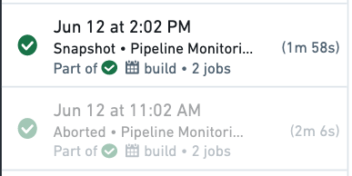
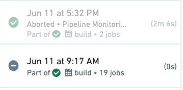

<!-- source: https://palantir.com/docs/foundry/transforms-python/abort-transactions/ · mirrored 2026-08-14 from Palantir Foundry docs -->

# Abort transactions

Python transforms provides support for aborting a [transaction](/docs/foundry/data-integration/datasets/#transactions) to allow a job to successfully complete if the output dataset is unchanged (where no new data is written to the dataset). This is achieved through using the [`transform` decorator](/docs/foundry/transforms-python/transforms/#define-transforms) and calling `.abort_job()` on the `ctx` object available in the transform.

Aborting transactions can be used if you need to prevent the output datasets and downstream datasets from updating under certain conditions. As soon as your output datasets updates, the downstream datasets will be considered out-of-date ([stale](/docs/foundry/data-integration/builds/#staleness)), and they will update when they are next built (either manually or through a scheduled build). It provides an alternative to failing the build. This makes it easier to identify when something is actually failing.

Aborted transactions will appear as grayed-out, successful jobs in your dataset [transaction history](/docs/foundry/dataset-preview/overview/#history). This enables you to differentiate at a glance whether a successful build resulted in a committed transaction or not.



Below are examples of when you may want to abort a transaction:

* You have a custom condition for updating your datasets that is based on the contents of the input datasets.
* Your datasets requires force building because it does not become stale. An example is datasets that fetch data from making API calls instead of input datasets.
* You have a writeback dataset which always updates when it is scheduled (see further below for detailed example).

:::callout{theme="neutral"}
Adding a validation with `abort_job()` with a dataset that always updates but does not always result in changed output saves compute resources by avoiding unnecessary updates downstream.
:::

## Example: Notional custom condition

Below is a basic notional example, where we want to make sure that output datasets are only updated if data for today has arrived in our input dataset.

```python tab="Polars"
from transforms.api import transform, Input, Output
from datetime import date
import polars as pl

@transform.using(
    holiday_trips=Input('/examples/trips'),
    processed=Output('/examples/trips_processed')
)
def update_daily_trips(ctx, holiday_trips, processed):
    holiday_trips_df = holiday_trips.polars()
    todays_trips_df = holiday_trips_df.filter(
        pl.col("trip_date") == date.today()
    )
    if (todays_trips_df.height == 0):
      ctx.abort_job()
    else:
      processed.write_table(todays_trips_df)
```

```python tab="DuckDB"
from transforms.api import transform, Input, Output
from datetime import date

@transform.using(
    holiday_trips=Input('/examples/trips'),
    processed=Output('/examples/trips_processed')
)
def update_daily_trips(ctx, holiday_trips, processed):
    conn = ctx.duckdb().conn
    todays_trips_df = conn.sql("SELECT * FROM holiday_trips WHERE trip_date = DATE '{}'".format(date.today())).fetchdf()
    if (todays_trips_df.height == 0):
      ctx.abort_job()
    else:
      processed.write_table(todays_trips_df)
```

```python tab="Pandas"
from transforms.api import transform, Input, Output
from datetime import date

@transform.using(
    holiday_trips=Input('/examples/trips'),
    processed=Output('/examples/trips_processed')
)
def update_daily_trips(ctx, holiday_trips, processed):
    holiday_trips_df = holiday_trips.pandas()
    todays_trips_df = holiday_trips_df[holiday_trips_df['trip_date'] == date.today()]
    if (todays_trips_df.shape[0] == 0):
      ctx.abort_job()
    else:
      processed.write_table(todays_trips_df)
```

```python tab="PySpark"
from transforms.api import transform, Input, Output
from datetime import date

@transform.spark.using(
    holiday_trips=Input('/examples/trips'),
    processed=Output('/examples/trips_processed')
)
def update_daily_trips(ctx, holiday_trips, processed):
    holiday_trips_df = holiday_trips.dataframe()
    todays_trips_df = holiday_trips_df.filter(holiday_trips_df.trip_date == date.today())
    if (todays_trips_df.count() == 0):
      ctx.abort_job()
    else:
      processed.write_dataframe(todays_trips_df)
```

:::callout{theme="success" title="Tip"}
Using `if (len(todays_trips_df.head(1)) == 0)` will usually return a faster result than `if (todays_trips_df.count() == 0)` as it will only check the existence of at least one row, rather than counting all rows unnecessarily.
:::

## How does an aborted transaction differ from an ignored job?

When a job is marked as "ignored" the computation does not run as Foundry determines that the JobSpecs are not stale. When a transaction is aborted, the job does run and it completes successfully, however the output dataset is left unchanged and no transaction is committed.



## How do aborted transactions relate to incremental transactions?

Incremental transforms read the dataset view of both the inputs and outputs only using committed transactions. This means they will ignore aborted transactions when performing incremental computation.

When a transaction is explicitly aborted on the whole job for an incremental transform, the next build will read (and therefore reprocess) the inputs as if the aborted transaction never occurred, and thus be able to run incrementally.

:::callout{theme="warning" title="Warning"}
When using PySpark, it is possible to call `abort()` on individual datasets rather than on the whole job. However, this approach is not recommended practice as it can cause problems with incremental computations. <br><br>
In particular, if a transaction is only aborted on a subset of the outputs, the build will not be able to run incrementally. For the outputs with aborted transactions, the output job specs will be using a previous input transaction range as aborted transactions are ignored. For the outputs with committed transactions, the output job specs will be using the current input transaction range. This mismatch in input transaction range means the transform can no longer run incrementally. <br><br>
In a multi-output incremental transform, if a transaction is explicitly aborted on a subset of the outputs, the next build will run as a snapshot, with the failed incremental computation check `Provenance records for the previous build are inconsistent`. If `require_incremental=True` is set, the build will fail with the error `InconsistentProvenanceRecords`. This is because the current view of the outputs will now have been produced by different input transactions. <br><br>
You should use the [`.abort_job()`](/docs/foundry/api-reference/transforms-python-library/api-transformcontext/#transforms.api.TransformContext) method on the `TransformContext` to abort the entire job rather than aborting individual outputs if running incremental builds. This will abort *all* outputs from the build. If using `v2_semantics`, then this is the only way to abort outputs while allowing subsequent builds to run incrementally.
:::
