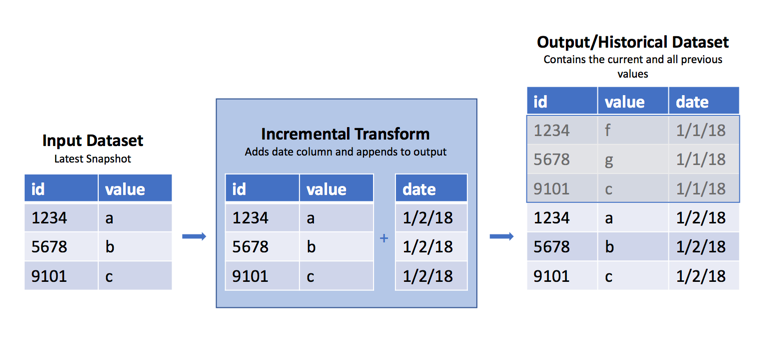

<!-- source: https://palantir.com/docs/foundry/transforms-python/create-historical-dataset/ · mirrored 2026-08-14 from Palantir Foundry docs -->

# Create a historical dataset from snapshots

:::callout{theme="warning" title="Warning"}
If possible, it is best practice for historical datasets to be [ingested as `APPEND` transactions](/docs/foundry/data-connection/file-based-syncs/). See the [warnings](#warnings) below for additional details.
:::

## Workflow overview

Occasionally, you may encounter a raw dataset where a new `SNAPSHOT` import replaces the previous view with the dataset's current data each day, week, or hour. However, it is often useful to have the previous data available to determine what has changed from the previous view. As mentioned above, it is best practice to handle this as part of ingestion by using `APPEND` transactions and adding a column with the import date. However, in cases where this is not possible, you can use the `incremental` decorator in Python transforms to append these regular snapshots into a **historical** version of that dataset. See the warnings below for caveats and the potential fragility of this approach.



### Sample code

Below are examples of how to create historical datasets using the `incremental` decorator.

```python tab="Polars"
import polars as pl
from transforms.api import transform, incremental, Input, Output

@incremental(snapshot_inputs=['input_data'])
@transform.using(
    input_data=Input("/path/to/snapshot/input"),
    history=Output("/path/to/historical/dataset"),
)
def my_compute_function(input_data, history):
    input_df = input_data.polars()

    # Note that you can also use current_timestamp() below
    # if the input will change > 1x/day
    input_df = input_df.with_columns(pl.lit(pl.date.today()).alias('date'))

    history.write_table(input_df)
```

```python tab="DuckDB"
from transforms.api import transform, incremental, Input, Output

@incremental(snapshot_inputs=['input_data'])
@transform.using(
    input_data=Input("/path/to/snapshot/input"),
    history=Output("/path/to/historical/dataset"),
)
def my_compute_function(ctx, input_data, history):
    duckdb = ctx.duckdb()

    # Note that you can also use current_timestamp() below
    # if the input will change > 1x/day
    query = duckdb.conn.sql(f"""
        SELECT *, CURRENT_DATE AS date
        FROM input_data
    """)

    history.write_table(query)
```

```python tab="Pandas"
import pandas as pd
from transforms.api import transform, incremental, Input, Output

@incremental(snapshot_inputs=['input_data'])
@transform.using(
    input_data=Input("/path/to/snapshot/input"),
    history=Output("/path/to/historical/dataset"),
)
def my_compute_function(input_data, history):
    input_df = input_data.pandas()

    # Note that you can also use current_timestamp() below
    # if the input will change > 1x/day
    input_df['date'] = pd.Timestamp.now().date()

    history.write_table(input_df)
```

```python tab="PySpark"
from transforms.api import transform, incremental, Input, Output

@incremental(snapshot_inputs=['input_data'])
@transform.spark.using(
    input_data=Input("/path/to/snapshot/input"),
    history=Output("/path/to/historical/dataset"),
)
def my_compute_function(input_data, history):
    input_df = input_data.dataframe()

    # Note that you can also use current_timestamp() below
    # if the input will change > 1x/day
    input_df = input_df.withColumn('date', current_date())

    history.write_dataframe(input_df)
```

### Why this works

The incremental decorator applies additional logic to the read/write modes on the inputs and output. In the example above, we use the **default** read/write modes for the input and output.

#### Read mode

When using a `SNAPSHOT` input, the default read mode is `current`, which means it takes the entire input DataFrame, and not just the rows added since the last transaction. If the input dataset was created from an `APPEND` transaction, we could use the `incremental` decorator to use the `added` read mode to only access rows added since the last build. The transform obtains schema information from the `current` output, so there is no need to pass schema information like you would if you were reading a `previous` version of the DataFrame, for example, `dataframe('previous', schema=input.schema)`.

#### Write mode

When we say a transform is run incrementally, it means that the default write mode for the output is set to `modify`. This mode modifies the existing output with data written during the build. For example, calling `write_dataframe()` when the output is in `modify` mode will append the written DataFrame to the existing output. This is exactly what is happening in this case.

## Warnings

Because this transform uses `SNAPSHOT` datasets as inputs, there is no way to recover a snapshot that your build may have missed due to build failures or other reasons. If this is a concern, do not use this method. Instead, contact the owner of the input datasets to see if it is possible to convert it to an `APPEND` dataset so you can access the dataset's previous transaction. This is the way incremental computation was designed to work.

This approach will fail under the following conditions:

* Columns are added to the input dataset
* The column number of the existing table doesn't match the input data schema
* Columns on the input datasets change datatype, for example from `integer` to `decimal`
* You change the input dataset, even if that dataset has an identical schema. In this case, it will completely replace the output with the input rather than append.

### Increased resource consumption

Using this pattern can cause an accumulation of small files in the historical dataset. [File accumulation](/docs/foundry/contour/performance-optimize/#partitioning) is not a desired outcome and will lead to increased build times and [resource consumption in downstream transforms or analyses](/docs/foundry/resource-management/usage-types/#usage-types) that use this historical dataset. Batch and interactive compute time may increase, as there is an overhead associated with reading each file. Disk usage may increase because compression is done on a per-file basis, and not across files within a dataset. It is possible to build logic to periodically cause a re-snapshot of the data and prevent this behavior from happening.

By inspecting the number of output files, we can determine an optimal [incremental write mode](/docs/foundry/transforms-python/incremental-usage/#incremental-modes-of-inputs-and-outputs). This mode allows us to read in the previous transaction's output as a DataFrame, union it to the incoming data, and coalesce the data files together. This turns many small files into one larger file.

Inspect the number of files in the output dataset's file system and use an if statement to set the `write_mode`, as in the following example:

```python tab="Polars"
import polars as pl
from transforms.api import transform, Input, Output, incremental

FILE_COUNT_LIMIT = 100

# Be sure to insert your desired output schema here
schema = {
    'Value': pl.Float64,
    'Time': pl.Datetime,
    'DataGroup': pl.Utf8
}

def compute_logic(df):
    """
    This is your transforms logic
    """
    return df.filter(pl.lit(True))

@incremental(semantic_version=1)
@transform.using(
    output=Output("/Org/Project/Folder1/Output_dataset_incremental"),
    input_df=Input("/Org/Project/Folder1/Input_dataset_incremental"),
)
def compute(input_df, output):
    df = input_df.polars('added')
    df = compute_logic(df)

    # Fetches a list of the files that are in the dataset
    files = list(output.filesystem(mode='previous').ls())

    if (len(files) > FILE_COUNT_LIMIT):
        # Incremental merge and replace
        previous_df = output.polars('previous', schema)
        df = pl.concat([df, previous_df])
        mode = 'replace'
    else:
        # Standard incremental mode
        mode = 'modify'

    output.set_mode(mode)
    output.write_table(df)
```

```python tab="DuckDB"
import polars as pl
from transforms.api import transform, Input, Output, incremental

FILE_COUNT_LIMIT = 100

# Be sure to insert your desired output schema here
schema = {
    'Value': pl.Float64,
    'Time': pl.Datetime,
    'DataGroup': pl.Utf8
}

def compute_logic(conn):
    """
    This is your transforms logic
    """
    return conn.sql("SELECT * FROM input_df")

@incremental(semantic_version=1)
@transform.using(
    output=Output("/Org/Project/Folder1/Output_dataset_incremental"),
    input_df=Input("/Org/Project/Folder1/Input_dataset_incremental"),
)
def compute(ctx, input_df, output):
    conn = ctx.duckdb().conn
    df = compute_logic(conn).pl()

    # Fetches a list of the files that are in the dataset
    files = list(output.filesystem(mode='previous').ls())

    if (len(files) > FILE_COUNT_LIMIT):
        # Incremental merge and replace
        previous_df = output.polars('previous', schema)
        df = pl.concat([df, previous_df])
        mode = 'replace'
    else:
        # Standard incremental mode
        mode = 'modify'

    output.set_mode(mode)
    output.write_table(df)
```

```python tab="Pandas"
import pandas as pd
from transforms.api import transform, Input, Output, incremental

FILE_COUNT_LIMIT = 100

# Be sure to insert your desired output schema here
schema = {
    'Value': 'float64',
    'Time': 'datetime64[ns]',
    'DataGroup': 'object'
}

def compute_logic(df):
    """
    This is your transforms logic
    """
    return df[df.index >= 0]  # Equivalent to filter(True)

@incremental()
@transform.using(
    output=Output("/Org/Project/Folder1/Output_dataset_incremental"),
    input_df=Input("/Org/Project/Folder1/Input_dataset_incremental"),
)
def compute(input_df, output):
    df = input_df.pandas('added')
    df = compute_logic(df)

    # Fetches a list of the files that are in the dataset
    files = list(output.filesystem(mode='previous').ls())

    if (len(files) > FILE_COUNT_LIMIT):
        # Incremental merge and replace
        previous_df = output.pandas('previous', schema)
        df = pd.concat([df, previous_df], ignore_index=True)
        mode = 'replace'
    else:
        # Standard incremental mode
        mode = 'modify'

    output.set_mode(mode)
    output.write_table(df)
```

```python tab="PySpark"
from pyspark.sql import types as T
from transforms.api import transform, Input, Output, incremental

FILE_COUNT_LIMIT = 100

# Be sure to insert your desired output schema here
schema = T.StructType([
    T.StructField('Value', T.DoubleType()),
    T.StructField('Time', T.TimestampType()),
    T.StructField('DataGroup', T.StringType())
])


def compute_logic(df):
    """
    This is your transforms logic
    """
    return df.filter(True)

@incremental()
@transform.spark.using(
    output=Output("/Org/Project/Folder1/Output_dataset_incremental"),
    input_df=Input("/Org/Project/Folder1/Input_dataset_incremental"),
)
def compute(input, output):
    df = input.dataframe('added')
    df = compute_logic(df)

    # Fetches a list of the files that are in the dataset
    files = list(output.filesystem(mode='previous').ls())

    if (len(files) > FILE_COUNT_LIMIT):
        # Incremental merge and replace
        previous_df = output.dataframe('previous', schema)
        df = df.unionByName(previous_df)
        mode = 'replace'
    else:
        # Standard incremental mode
        mode = 'modify'

    output.set_mode(mode)
    output.write_dataframe(df.coalesce(1))
```
