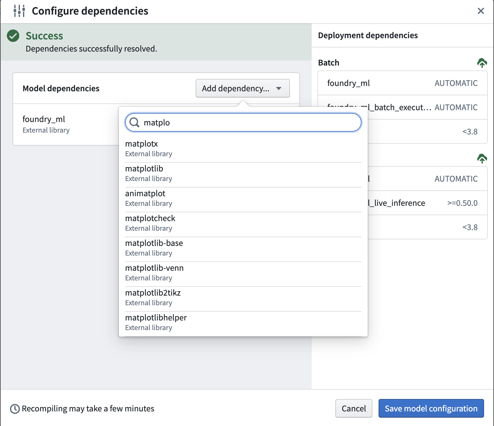
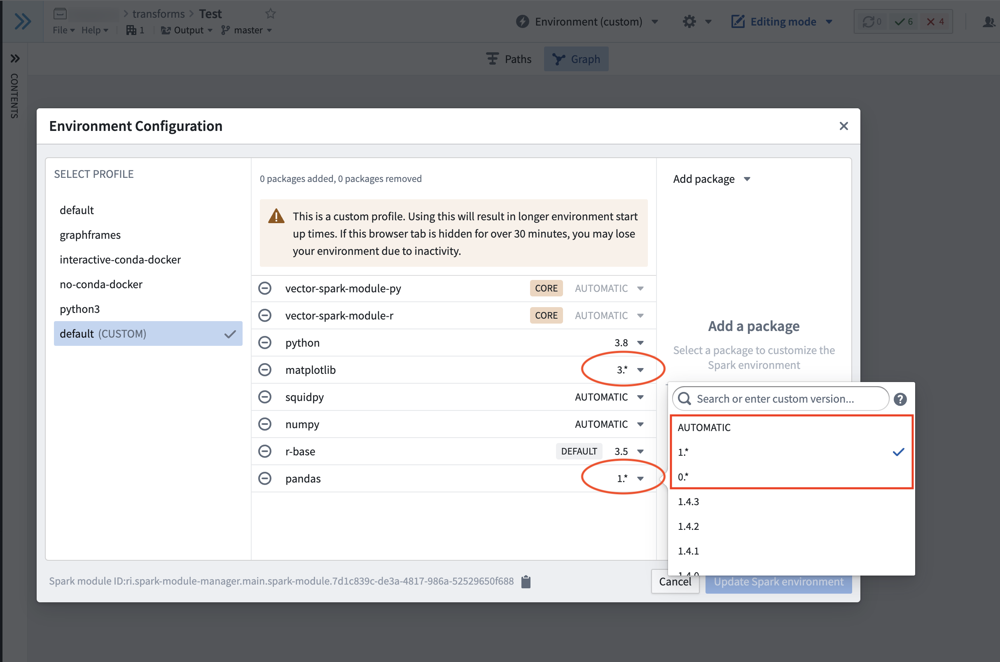
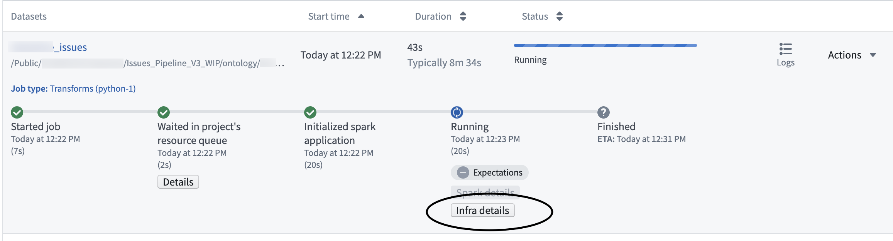
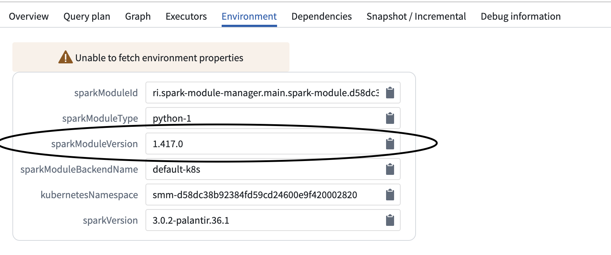
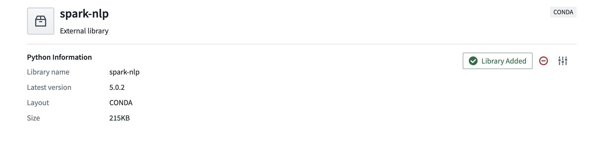
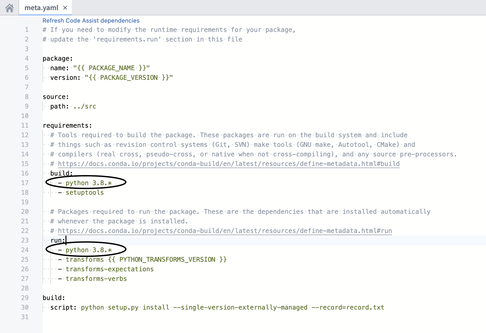
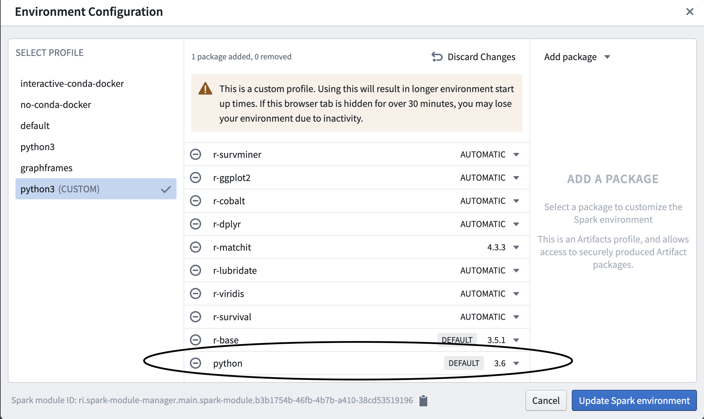

<!-- source: https://palantir.com/docs/foundry/transforms-python/environment-troubleshooting/ · mirrored 2026-08-14 from Palantir Foundry docs -->

# Troubleshooting guide

Follow the steps in this guide to debug the most common Python environment creation issues:

* [Troubleshooting guide](#troubleshooting-guide)
  * [Checks fail during package resolution](#checks-fail-during-package-resolution)
    * [New Mamba error messages](#new-mamba-error-messages)
      * [Dependency trees](#dependency-trees)
      * [Direct conflicts](#direct-conflicts)
      * [Direct dependency conflicts](#direct-dependency-conflicts)
      * [Transitive dependency conflicts](#transitive-dependency-conflicts)
      * [Interpreting the new error messages](#interpreting-the-new-error-messages)
    * [Legacy Mamba error messages](#legacy-mamba-error-messages)
      * [Package not found](#package-not-found)
      * [Dependency not found](#dependency-not-found)
      * [Duplicate package error](#duplicate-package-error)
      * [Debugging permission errors](#debugging-permission-errors)
      * [Package conflict](#package-conflict)
        * [Debugging a package conflict](#debugging-a-package-conflict)
        * [Why is unpinning versions not fixing resolve failures?](#why-is-unpinning-versions-not-fixing-resolve-failures)
      * [Failure with no changes to requested packages](#failure-with-no-changes-to-requested-packages)
  * [Debugging slowness if there was no change to your `meta.yml`](#debugging-slowness-if-there-was-no-change-to-your-metayml)
  * [Jobs timing out if there was a change to your `meta.yml`](#jobs-timing-out-if-there-was-a-change-to-your-metayml)
  * [Build failures with Conda errors](#build-failures-with-conda-errors)
    * [Multi-download failures](#multi-download-failures)
  * [Build failure with Entry Point Error](#build-failure-with-entry-point-error)
  * [Packages which require both a Conda package and a JAR](#packages-which-require-both-a-conda-package-and-a-jar)
  * [Best practices for avoiding dependency conflicts](#best-practices-for-avoiding-dependency-conflicts)
    * [Best practices for avoiding dependency conflicts: Python](#best-practices-for-avoiding-dependency-conflicts-python)
      * [Python version support](#python-version-support)
    * [Best practices for avoiding dependency conflicts: Packages other than Python](#best-practices-for-avoiding-dependency-conflicts-packages-other-than-python)
  * [Other issues](#other-issues)

## Checks fail during package resolution

For the following check failures, you can view the check logs in the 'Checks' tab within code repositories. Using these logs, you can discover why checks failed.

### New Mamba error messages

Palantir [contributed ↗](https://medium.com/@AntoineProuvost/managing-conflicts-with-mamba-6a5fa10ed6a) to the open-source Mamba community by providing better formatting of environment initialization error messages. As of February 2023, Foundry services benefit from errors that more closely represent the dependency tree being infringed by environment failures.

#### Dependency trees

In the following example:

```
packageA
   ├─ packageB
   └─ packageC
        └─ packageD
```

the packages `packageB` and `packageC` are **direct dependencies** of `packageA`. `packageD` is a direct dependency of `packageC`, but a **transitive dependency** of `packageA`. While `packageA` does not have direct constraints on `packageD`, `packageA`’s direct requirements on `packageC` indirectly forces constraints on `packageD`. Find below a real example of such a concept:

```
statsmodels
├─ numpy
├─ scipy
├─ matplotlib
│  │  ├─ libpng
│  │  ├─ setuptools
│  │  ├─ cycler
│  │  ├─ dateutil
│  │  └─ kiwisolver
```

While it may not be at first apparent that `statsmodels` enforces constraints on `libpng`, it does so transitively by having constraints on `matplotlib`.

#### Direct conflicts

Direct conflicts occur when different versions of the same package are requested in the same environment. Imagine requesting a simple environment with both `python 3.7` and `python 3.8`. This is a **direct conflict** that will cause the environment to fail. The new error messages will provide the following information:

```
  Could not solve for environment specs
  The following packages are incompatible
  ├─ python 3.7**  is requested and can be installed;
  └─ python 3.8**  is uninstallable because it conflicts with any installable
   versions previously reported.
```

The message above correctly explains that `python 3.7` can indeed be installed. However, if that version were to be installed, any attempt to install an additional, different version will cause a conflict. This environment can be solved by removing either version constraint of python from the environment.

Direct conflicts are however quite rare, as opposed to conflicts created by dependencies and transitive dependencies.

#### Direct dependency conflicts

[NumPy documentation ↗](https://numpy.org/devdocs/release/1.22.0-notes.html#python-3-7-is-no-longer-supp) specifically mentions that `numpy >=1.22.0` requires `python >=3.8`. As a result, attempting to create an environment requesting both `python 3.7.*` and `numpy 1.22.0` would lead to a **direct dependency conflict**. The following error message would ensue:

```
Could not solve for environment specs
The following packages are incompatible
├─ numpy 1.22.0**  is installable with the potential options
│  ├─ numpy 1.22.0 would require
│  │  ├─ python >=3.9,<3.10.0a0 , which can be installed;
│  │  └─ python_abi 3.9.* *_cp39, which can be installed;
│  ├─ numpy 1.22.0 would require
│  │  ├─ python >=3.10,<3.11.0a0 , which can be installed;
│  │  └─ python_abi 3.10.* *_cp310, which can be installed;
│  └─ numpy 1.22.0 would require
│     ├─ python >=3.8,<3.9.0a0 , which can be installed;
│     └─ python_abi 3.8.* *_cp38, which can be installed;
└─ python 3.7**  is uninstallable because there are no viable options
   ├─ python [3.7.10|3.7.11|...|3.7.9] conflicts with any installable versions previously reported;
   ├─ python [3.7.0|3.7.1|3.7.2|3.7.3|3.7.6] would require
   │  └─ python_abi * *_cp37m, which conflicts with any installable versions previously reported;
   └─ python [3.7.10|3.7.12|...|3.7.9] would require
      └─ python_abi 3.7.* *_cp37m, which conflicts with any installable versions previously reported.
```

This error message informs that numpy 1.22.0 would be installable with either Python 3.8, 3.9, or 3.10, which conflicts with the requested 3.7.\* version. This environment can be solved by relaxing the constraint either on Python or NumPy. For example, `python 3.8.*` and `numpy 1.22.0`, or `python 3.7.*` and `numpy 1.*` would both lead to successful environments.

:::callout{theme="neutral"}
You may assume, for the sake of troubleshooting environments, that `python` and `python_abi` versions go hand-in-hand. You can adjust your `python_abi` version by adjusting your `python` version instead of specifying `python_abi` in your environment.
:::

#### Transitive dependency conflicts

Similarly, package conflicts could occur because of a transitive dependency. Due to the nature of transitive dependencies, requesting only a handful of packages could lead to hundreds of constraints added to the environment solving operation. Consider the `statsmodels` package:

```
statsmodels
├─ numpy
├─ scipy
├─ matplotlib
│  │  ├─ libpng
│  │  ├─ setuptools
│  │  ├─ cycler
│  │  ├─ dateutil
│  │  └─ kiwisolver
```

Requesting a specific `statsmodels` version would put constraints on the allowed version of `setuptools` due to the package’s dependency on `matplotlib`. As a result, a transitive dependency conflict could occur if an environment requests incompatible versions of `statsmodels` and `setuptools`, due to how `statsmodels` itself imposes restrictions on `setuptools`.

For example, take the following environment requesting `huggingface-adapter 0.1.1*` and `transforms 1.645.0`:

```
The following packages are incompatible
  ├─ huggingface-adapter 0.1.1** * is installable and it requires
  │  └─ palantir_models >=0.551.0 *, which requires
  │     └─ pyspark-src >=3.2.1,<3.3.0a0 *, which can be installed;
  └─ transforms 1.645.0 * is uninstallable because it requires
     └─ pyspark-src 3.2.1_palantir.36 *, which conflicts with any installable versions previously reported
```

It may not be obvious at first why those two packages are incompatible. The error message helps identify that the problem comes from `huggingface-adapter`’s transitive dependency conflicting with `transforms`’ direct dependency on `pyspark-src`. This environment can be resolved by relaxing the constraints on either `transforms` or `huggingface-adapter` so that Mamba can identify a pair of versions that lead to compatible `pyspark-src` requirements.

#### Interpreting the new error messages

Find below a list of all the possible wordings that the new mamba error messages could provide, how to interpret them, and some guidance on how to remediate them:

* `The following packages are incompatible` or `The following package could not be installed`: Either of these will usually be the first sentence of the detailed error message. This indicates whether the overall issue is a package *conflict* caused by incompatible versions or an issue in the installation itself of the necessary packages.
  * How to remediate: Read the necessary information directly below the statement.
* `can be installed`: This sentence will typically appear at the top of a tree dependency and means that the package itself can be installed with no additional constraints. However, assuming that this specific version was installed, a set of conflicts could arise due to other package dependencies conflicting with that installed version. For example, `python 3.7** is requested and can be installed` means that Python 3.7 could be installed on the environment. Every other conflict listed directly under this statement assumes that Python 3.7 is installed in the environment.
* `no viable options`: None of the versions that are installable can fit within the constraints imposed by other specifications in the requested environment. For example, the message `python 3.7**  is uninstallable because there are no viable options` indicates that versions of `python 3.7.*` could be installed if not for another package or constraint specifically requesting a different Python version.
  * How to remediate: Relax the constraints of the package causing an allowable version range outside of this package’s viable options.
* `does not exist, perhaps a (typo or a) missing channel`: The package to install was not found. This likely means that either the package was incorrectly specified, or none of the configured channels (**Settings > Libraries** in Code Repositories or [environment configuration](/docs/foundry/administration/configure-code-workbook-profiles/#configuring-code-workbook-profiles) in Code Workbook) contain the package. For example, requesting an environment with `python 3.423.*` (a version that does not exist) and `pthon 3.8.*` (an obvious typographical error) would lead to the following error message:

```
 Could not solve for environment specs
  The following packages are incompatible
  ├─ pthon 3.8**  does not exist (perhaps a typo or a missing channel);
  └─ python 3.423** does not exist (perhaps a typo or a missing channel).
```

* How to remediate: Ensure that packages do not contain any typographical errors, or ensure that all the requested packages are available for the environment to use. See [Discover Python libraries](/docs/foundry/transforms-python/use-python-libraries/#discover-python-libraries) for advice on how you can search for the existence of a package in Foundry.

* `is installable and it requires`: The package and its attached version could be installed on the environment, but it would introduce a set of additional constraints to the environment.

* `is uninstallable because it requires`: The package and its attached version could not be installed, because some of its dependencies generate a conflict in the environment.
  * How to remediate: Inspect the offending requirements of the dependencies listed below the message and relax either their constraints, or the constraints of this specific package.

* `is installable with the potential options`: The package has a series of available, non-conflicting versions that could be installed on the environment. Choosing one of these versions could lead to further constraints.

* `conflicts with any installable versions previously reported`: Usually contrasted with the versions mentioned in lines above, this states that an already assumed version that `can be installed` of that package has been determined elsewhere and this version will therefore not be satisfiable.

  * How to remediate: Ensure that the same environment does not request two different versions of the same package, either directly or transitively.

* `is missing on the system`: This refers specifically to a missing [virtual package ↗](https://docs.conda.io/projects/conda/en/latest/user-guide/tasks/manage-virtual.html). Some packages can only run on specific OS environments. For example, the [cudatoolkit ↗](https://github.com/conda-forge/cudatoolkit-feedstock/blob/main/recipe/meta.yaml#L578) package requires specific versions of `__cuda`, a system-level feature, to be present on the environment as a virtual package to ensure that the package can run on the existing architecture.

* `which cannot be installed (as previously explained)`: The package cannot be installed either because of conflicts that have already been described earlier, or because another package contains the exact same constraints which have been described earlier.

### Legacy Mamba error messages

Find below a list of common error messages from the legacy error messages, before the [new Mamba error messages](#new-mamba-error-messages) were introduced.

#### Package not found

In this case, no configured channel provides the package `A` dependency.

```javascript
Problem: nothing provides requested A.a.a.a
```

This can happen if the pinned version of your package does not exist. If this is the case, try relaxing or removing the versioning from your package within the `meta.yml`; for example, `matplotlib 1.1.1` could become `matplotlib`.

:::callout{theme="neutral"}
Conda [labels ↗](https://docs.anaconda.com/anacondaorg/user-guide/work-with-labels/) are not supported in [external repositories](/docs/foundry/code-repositories/artifact-settings/). Packages found in labels are not discoverable by Palantir repositories.
:::

If you receive this error, then you can add your package by following the application-specific instructions below:

* [Learn more about how to add a package in **Code Repositories**.](/docs/foundry/transforms-python/use-python-libraries/#discover-and-use-python-libraries)
* [Learn more about how to add a package in **Code Workbook**.](/docs/foundry/transforms-python/environment-creation-overview/)



#### Dependency not found

In this case, package `A` contains a required dependency `B` which was not provided by any channel.

```javascript
Problem: nothing provides B-b.b.b needed by A-a.a.a:
```

Note that `B` can be a package the user requested explicitly (in `meta.yml/foundry-ml/vector` profiles) or it can be a transitive dependency.

This may occur if `B` is not available for installation on your enrollment; for example, `B` may have been recalled and therefore is not available for install.

If this is the case, try removing the pinned version of `A` in case there is a version of `A` that has all its dependencies available, or contact your Palantir representative to import the necessary package into Foundry.

#### Duplicate package error

```javascript
cannot install both X.a.b.c and X.d.e.f
```

This error occurs if you try to install the same package `X` and have two different version pinnings for both. For example, you might receive this error if you try to pin both `python 3.9.*` and `python 3.10.*` in your `meta.yml`. You can resolve this issue by removing one of the duplicate package pinnings.

#### Debugging permission errors

```javascript
CondaService:ReadRepositoryPermissionDenied
```

If you receive this error, it may be because all the assets and packages you need are not available in your enrollment. Once they are all installed on your enrollment, make sure to redeploy.

#### Package conflict

In this case, package `A` has a requirement on the version of package `B` but this version of `B` conflicts with other packages:

```javascript
Problem: package A-a.a.a requires B >=2.2.5,<2.3.0a0, but none of the providers can be installed
```

Note that the package `B` could refer to a transitive dependency of `A`, which you have not explicitly listed as a requirement in your `meta.yaml` file. See [Introduction to Environment Creation](/docs/foundry/transforms-python/environment-creation-overview/) for more on transitive dependencies.

##### Debugging a package conflict

* Create a minimal example of a failing solve. Remove packages until the environment successfully solves, and then add packages back in until you have determined which packages are the blockers.
* Try relaxing constraints (remove package pins).
  * You can open up multiple repositories or multiple branches of the same repository in different windows to make this process faster (in Code Repositories) or profiles (in Code Workbook).
  :::callout
  In Code Workbook you can add minimum versioning for `pandas`, `matplotlib`, and `numpy` to prevent it from defaulting to `pandas=0`, `matplotlib=2`, and `numpy<1.20`. If you need higher versions than these defaults, navigate to **Environment > Customize Spark environment > Customize Profile**, and choose a version from the dropdown menu for each package to satisfy your version requirements.
  :::

<br><br>
 <br><br>

```
* We recommend using binary search to discover issues. Try removing all constraints in one repository, removing half of the constraints in another repository, then the other half in another repository, and so on.
```

* You can also add extra verbosity to logs produced by Mamba, which can be helpful in tracking down transitive dependencies further down the tree (***note: this will cause a slow down in checks***). To add verbosity, find the task during which checks fail in the CI logs for the line `Execution failed for task ':transforms-python:<task-name>'.`. If the task which failed for example was `condaPackRun`, add the following block to the bottom of the inner `transforms-python/build.gradle` file:

```javascript
tasks.condaPackRun {
    additionalArguments "-vvv"
}
```

##### Why is unpinning versions not fixing resolve failures?

It may be the case that even with completely relaxed constraints, the packages or package versions required for the list of requirements are either:

* Not available. You can check the packages and versions available using the [package tab](/docs/foundry/transforms-python/use-python-libraries/#discover-and-use-python-libraries). If necessary, you can request these packages are added by contacting your Palantir representative.
* Not compatible. These package definitions may never be compatible, even if we had access to all the possible published versions. For example, one of the Conda packages you rely on may have upgraded ([see upgrade PRs](/docs/foundry/code-repositories/repository-settings/#repository-upgrades)) to a new version which is broken.
* Are incompatible with the version of Python in your `meta.yml`.

In order to check for this scenario you can compare the [Conda lock files](/docs/foundry/transforms-python/use-python-libraries/#conda-lock-files) associated with the successful checks against those of the failed checks. To access Conda lock files, select the option to `Show hidden files and folders` in the Settings cog, and navigate to `transforms-python/conda-versions.run.linux-64.lock`. Pin the versions of the libraries that changed between the successful and failing runs to different versions in the `meta.yaml` file.

#### Failure with no changes to requested packages

There are two main reasons why this may happen:

1. As your transform may rely on external packages (see [publicly managed Conda channels](/docs/foundry/transforms-python/use-python-libraries/#conda-resolution-of-python-packages)), unfortunately it can be susceptible to failures if something upstream has broken.
2. Merging in an upgrade PR will trigger a re-resolution of the environment when Checks run and in rare cases could cause package resolution to fail, especially if you have an over-constrained environment. This is because upgrade PRs can bring in new dependencies, causing the environment to require recalculation. You can confirm that the upgrade PR was the cause by testing whether Checks pass if you revert the Commit on which the upgrade PR was applied. You can then work through [the section above](#checks-fail-during-package-resolution) to reapply the upgrade PR.

## Debugging slowness if there was no change to your `meta.yml`

In ***Code Repositories***:

1. Upgrade your branch ([see manual branch upgrade](/docs/foundry/code-repositories/repository-settings/#repository-upgrades) for more information).
2. ***If you are still experiencing slowness and you have made a code change that is outside of the `@transform_df` tag***, then this code may have slowed down the checks. Evaluate the performance of this code (if applicable).

## Jobs timing out if there was a change to your `meta.yml`

If you are receiving out of memory (OOM) errors on long-running jobs, this may be caused by incompatible versioning of packages leading to unsolvable environments. To resolve this, first upgrade your branch and then proceed to perform the [debugging steps listed above](#debugging-a-package-conflict).

## Build failures with Conda errors

```javascript
CondaEnvironmentSetupError
```

If you get a build error, the solution steps are as follows:

1. Check your [driver logs](/docs/foundry/transforms-python/debugging/) for errors.
2. ***If you made changes to your code/`meta.yml`*** (to observe this use the [job comparison](/docs/foundry/optimizing-pipelines/debug-job/#compare-jobs) tool) then revert them to see if that fixes the build. If a reverted `meta.yml` change fixes the issue, then there is probably a package conflict which can be debugged as described [above](#debugging-a-package-conflict). If you didn't change your meta.yml, then check the Python module versions of your builds (as mentioned in the following step). If that doesn't resolve the build, then a resolution due to a branch upgrade or underlying upgrade ([see upgrade PRs](/docs/foundry/code-repositories/repository-settings/#repository-upgrades)) may have caused an insolvable environment. In which case you should check the debugging steps mentioned [above](#debugging-a-package-conflict).
3. ***If you made no changes***, is there a different Python module version that ran the successful build when compared to the failed build? Check *"Infra details"*, *"Environment"* then *"SparkModuleVersion"*. Contact your Palantir representative about reverting to this version.




### Multi-download failures

```javascript
RuntimeError: Multi-download failed
```

This error means either that you do not have access to the [artifacts channel](/docs/foundry/transforms-python/environment-creation-overview/#channel) from which packages are downloaded, or that the artifact is not available on the enrollment. The actual failure can be seen in the [driver logs](/docs/foundry/transforms-python/debugging/).

If you are trying to template this repository, navigate to your list of [Conda channels](/docs/foundry/transforms-python/use-python-libraries/#discover-and-use-python-libraries) and check to see if there are any warnings on the listed channels. If there are warnings on a listed channel, follow these steps:

1. Remove the broken channel (ask your Palantir representative for permissions if applicable).
2. Retrigger the checks.
3. Retrigger the build.

## Build failure with Entry Point Error

```javascript
transforms._errors.EntryPointError: "Key {name} was not found, please check your repo's meta.yaml and setup.py files"
```

This error means something is missing from the root files that are required to trigger builds. You might be able to use Dataset Preview, but the builds will fail.

To debug this issue, check if any essential information is missing from `meta.yaml` or `setup.py`. As a reference, you can create a new Python code repository and examine the `meta.yaml` and the `setup.py` files in the new repository.

After adding any missing information to `meta.yaml` and/or `setup.py`, commit the changes, wait for the checks to be successful, and retrigger the build.

## Packages which require both a Conda package and a JAR

Some packages require both a Conda package and a JAR in order to be available. A common example is the graphframes package (where the Conda package contains the Python API and the JAR contains the actual implementation). If you only add the Conda package, but you do not add the necessary JAR, you may run into the following error:

```
o257.loadClass.: java.lang.ClassNotFoundException:<Class>
```

Alternatively, you may encounter this error:

> **Java classpath reference error** -
> A Python dependency you are using is attempting to reference a Java jar not in the classpath. Check recently added Python dependencies, and add a dependency on the necessary Java packages (JARs) in the build.gradle file.

Such packages require a two-step process to be added:

1. Add the Conda package to the repository in the normal way through the [package tab](/docs/foundry/transforms-python/use-python-libraries/#discover-and-use-python-libraries).
2. Select the option to `Show hidden files and folders` in the Settings cog, and select the inner `transforms-python/build.gradle` file. At the bottom of the file, add the following block:

```gradle
dependencies {
    condaJars '<group_name>:<name>:<version>'
}
```

If these packages are also required for unit testing, they will need to be made available at test time. To do so, add the following block to your gradle file (note that the testing plugin must be declared before the sparkJars dependencies):

```gradle
// Apply the testing plugin
apply plugin: 'com.palantir.transforms.lang.pytest-defaults'

dependencies {
    condaJars '<group_name>:<name>:<version>'
    sparkJars '<group_name>:<name>:<version>'
}
```

Another example of an external library that requires both a Conda Package and a JAR is the [Spark-NLP ↗](https://github.com/JohnSnowLabs/spark-nlp) package. Note that Spark-NLP's JAR dependency needs to be added in the build.gradle file.

To start, [add Spark-NLP as an external library](/docs/foundry/transforms-python/use-python-libraries/#discover-python-libraries).



Add the JAR compatible with the library version you added above into the build.gradle file inside the subproject, usually `transforms-python/build.gradle`. For example, the library version of Spark-NLP above is 5.0.2 so in the step below, we will add a JAR that meets version expectations. By using the format `<group_name>:<name>:<version>`, we can add the JAR to our build.gradle script with the following code:

```
dependencies {
     condaJars 'com.johnsnowlabs.nlp:spark-nlp_2.12:5.0.2'
 }
```

If you are unsure about the target version specified in the name, visit [Maven ↗](https://mvnrepository.com/), search for the desired library and find the compatible target version for the library version you observe in Foundry.

## Best practices for avoiding dependency conflicts

From the errors mentioned above, the most frequent cause of errors are dependency conflicts. To reduce dependency conflicts, follow these best practices.

### Best practices for avoiding dependency conflicts: Python

Uphold a ***major.minor*** versioning for Python.

* In **Code Repositories**, Python `3.9.*`, `3.10.*`, and `3.11.*` are available. It is preferred that you leave the Python version unpinned and simply specify the package name `python`. However, if your code needs to run on a specific version of Python, the chosen version should be pinned for both the build and run sections. Python `3.8.*` is now deprecated; it can still be used, but it will not be supported after January 2025. Python `3.6.*` and `3.7.*` are no longer supported.



:::callout{theme="neutral"}
Be sure that the Python dependencies in the build and run sections are identical. Mismatches between the Python dependencies can lead to undesired outcomes and failures.

Ranges such as `python >=3.9` or `python >3.9,<=3.10.11` are not supported for Python versions. If an unsupported Python version is used, we will default to Python `3.6.*`. Note that Python `3.6.*` is deprecated, so make sure you have a valid pin in your `meta.yaml` for a supported Python version.
:::

* In **Code Workbook**, you can toggle the versioning by changing **automatic** to the versioning you require.



#### Python version support

Starting from Python 3.9, Foundry will follow the timelines defined by [Python End Of Life ↗](https://devguide.python.org/versions/), meaning that a python version won't be supported in platform if it's declared as end of life. Check out the [Python versions](/docs/foundry/transforms-python/python-versions/) page for more details.

### Best practices for avoiding dependency conflicts: Packages other than Python

Avoid explicitly pinning versions as this can cause dependency conflicts. Even *major.minor* versions can cause conflicts.

:::callout
Note that in Code Workbook, you can add minimum versioning for `pandas`, `matplotlib`, and `numpy` as Code Workbook will default to `pandas=0`, `matplotlib=2`, and `numpy<1.20` on the automatic setting.
:::

## Other issues

If the guidance above is insufficient to resolve your issue, or if you encounter an issue outside the scope of this guide, contact your Palantir representative and include details of any debugging steps you tried.
