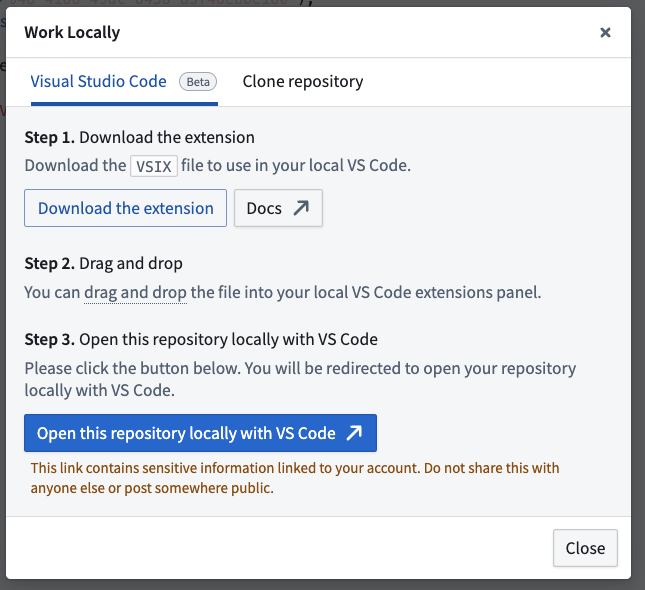
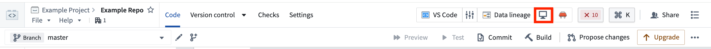
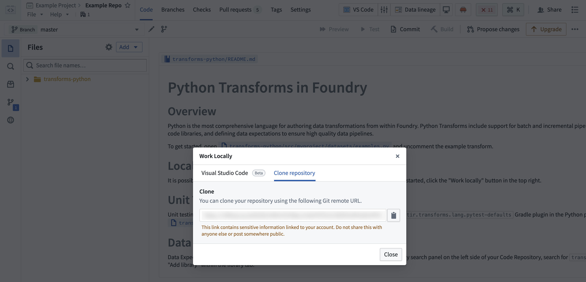

<!-- source: https://palantir.com/docs/foundry/transforms-python/local-development/ · mirrored 2026-08-14 from Palantir Foundry docs -->

# Set up Python local development

It is possible to carry out local development of Python transforms repositories, allowing for high-speed iterative development.

## Work with your Python transforms repository locally

There are two options for developing locally in your Python transforms repository:

* **Option 1:** [Use the Palantir extension for Visual Studio Code \[Recommended\]](#option-1-use-the-palantir-extension-for-visual-studio-code-recommended)
* **Option 2:** [Clone the repository and use Gradle commands](#option-2-clone-the-repository-and-use-gradle-commands)

## Option 1: Use the Palantir extension for Visual Studio Code \[Recommended]

:::callout{theme="neutral"}
To enable the extension and local preview capabilities, contact your platform administrator to modify [Code Repositories settings](/docs/foundry/code-repositories/configure-repositories-in-control-panel/) in Control Panel. The Palantir extension for Visual Studio Code is **enabled by default** when using [VS Code workspaces](/docs/foundry/vs-code/overview/).
:::

### Prerequisites

* Ensure you have [Visual Studio Code ↗](https://code.visualstudio.com/) installed.
* Download the [Palantir extension](/docs/foundry/palantir-extension-for-visual-studio-code/overview/#1-download-the-palantir-extension) for Visual Studio Code if it is enabled for your enrollment.

### Benefits

* **[Preview your Python transforms](/docs/foundry/palantir-extension-for-visual-studio-code/transforms-preview/)** directly from your local Visual Studio Code environment. The Palantir extension for Visual Studio Code supports full datasets (sample-less preview), so you can preview full datasets without losing precision. Note that to run previews locally, you will need your platform administrators to enable local preview through Control Panel.
* **[Initiate a build](/docs/foundry/palantir-extension-for-visual-studio-code/transforms-build/)** directly from your own code editor.
* **Debug your code** and run tests directly from the editor.
* **Leverage the [library panel](/docs/foundry/palantir-extension-for-visual-studio-code/python-libraries/)** to add libraries.

### Troubleshooting

If you experience unexpected language server errors such as broken imports, the Python interpreter's automatic set up may have failed. To fix this, you can manually set up the interpreter by navigating to the [Command Palette ↗](https://code.visualstudio.com/docs/getstarted/userinterface#_commandpalette), then typing `Python: Select interpreter` and choosing a Python interpreter matching the path `./maestro/bin/python`. The `.maestro` folder should be present if the Palantir extension successfully ran the `Palantir: Install Python environment` command.

## Option 2: Clone the repository and use Gradle commands

### Prerequisites

* Ensure your repository is upgraded to the latest template version by following the steps outlined [here](/docs/foundry/code-repositories/repository-upgrades/#manual-branch-upgrade).
* Ensure that the environment variables `CI`, `JEMMA`, and `CA` are not set.
* If running on an Apple silicon Mac, ensure that [Rosetta 2 ↗](https://developer.apple.com/documentation/apple-silicon/about-the-rosetta-translation-environment) is installed. You can install Rosetta 2 by running `/usr/sbin/softwareupdate --install-rosetta --agree-to-license` in the terminal.

### Clone the repository locally

1. In the menu bar of your repository, select the desktop icon to the right of **Data lineage** to open the dialog and copy the given repository URL.

2. Using the command line, run `git clone <URL>` on your local machine in a directory of your choice. Then, use the `cd` command to navigate to the repository.

### Limitations

* The token granted for cloning is short-lived and needs to be refreshed every 7 days.
* You will still need to push your changes to Foundry to publish job specs or artifacts, or if you wish to run checks or builds.

## Preview

Dataset previews are supported in local development. Refer to [local preview](/docs/foundry/transforms-common/local-preview/) for more details.
