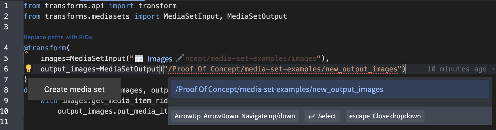
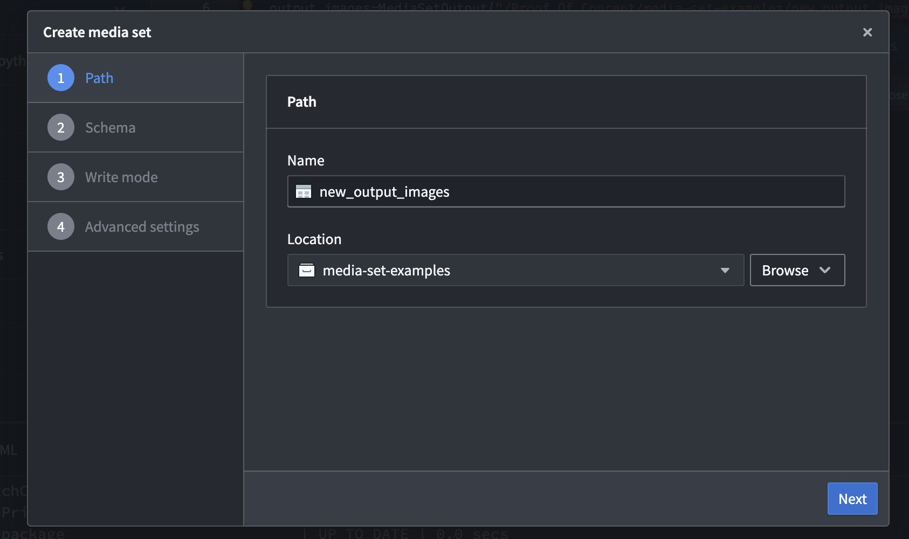
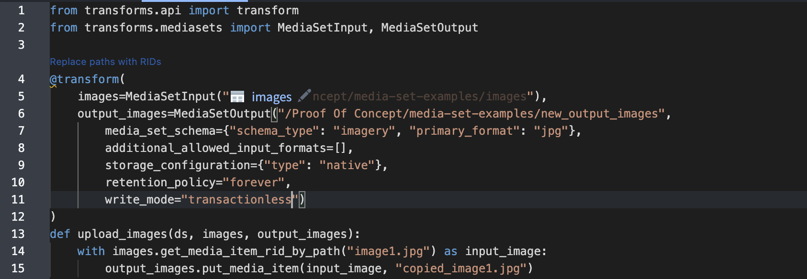

<!-- source: https://palantir.com/docs/foundry/transforms-python/media-sets/ · mirrored 2026-08-14 from Palantir Foundry docs -->

# Use media sets with Python transforms

You can use [media sets](/docs/foundry/data-integration/media-sets/) in Python transforms for PDF text extraction, optical character recognition (OCR), image tiling, metadata parsing, and more. The following sections explain how to set up media sets in your Python repository and how to read to and write from media sets with Python transforms.

Here is  a step-by-step example of how to [create a media set batch pipeline with Code Repositories](/docs/foundry/building-pipelines/create-batch-pipeline-cr-media-sets/).

You can also learn how to [write incremental transforms with media sets](/docs/foundry/transforms-python-spark/incremental-media-sets/).

:::callout{theme="neutral"}
Media transformations are currently not supported in [Code Repository's Preview](/docs/foundry/code-repositories/preview-transforms/) functionality. Any transforms utilizing media sets can be built but not previewed.
:::

## Import the transforms-media library into your repository

To use decorators specific to media sets, you first need to import the `transforms-media` library into your repository. You can do this by navigating to the **Libraries** file drawer on the left side of the Code Repositories interface. Search for `transforms-media`, then install the library.

## Add a dependency on `transforms-media` in your code repository.

You must use the [`@transform`](/docs/foundry/transforms-python/transforms/#define-pyspark-transforms) decorator when working with media sets. Media set inputs and outputs can be passed in using `transforms.mediasets.MediaSetInput` and `transforms.mediasets.MediaSetOutput` specifications. During a build, these specifications are resolved into `transforms.mediasets.MediaSetInputParam` and `transforms.mediasets.MediaSetOutputParam` objects, respectively. These `MediaSetInputParam` and `MediaSetOutputParam` objects provide access to the media set within the compute function. Any number of media set inputs or outputs can be used in combination with any other valid transform inputs and outputs (such as tabular datasets). For example:

```python
from transforms.api import transform
from transforms.mediasets import MediaSetInput, MediaSetOutput


@transform.spark.using(
    images=MediaSetInput('/examples/images'),
    output_images=MediaSetOutput('/examples/output_images')
)
def translate_images(images, output_images):
    ...
```

## Read from media sets

You can access individual media items either by the file path or RID:

```python
from transforms.api import transform
from transforms.mediasets import MediaSetInput, MediaSetOutput


@transform.spark.using(
    images=MediaSetInput('/examples/images'),
    output_images=MediaSetOutput('/examples/output_images')
)
def translate_images(images, output_images):
    image1 = images.get_media_item_by_path("image1")
    image2 = images.get_media_item("ri.mio.main.media-item.123")
    ...
```

However, you will likely want to transform all the items in your media set. To do this, you must first pull the items into a dataframe using a *listing* method. In the example below, we list all items in the input media set and write the resulting dataframe to a tabular output:

```python
from transforms.api import transform, Output
from transforms.mediasets import MediaSetInput


@transform.spark.using(
    images=MediaSetInput('/examples/images'),
    listing_output=Output('/examples/listed_images')
)
def translate_images(ctx, images, listing_output):
    media_items_listing = images.list_media_items_by_path_with_media_reference(ctx)

    # You can perform regular PySpark transformations on media_items_listing

    column_typeclasses = {'mediaReference': [{'kind': 'reference', 'name': 'media_reference'}]}
    listing_output.write_dataframe(media_items_listing, column_typeclasses=column_typeclasses)
```

If multiple items in the media set are at a particular path, only the most recent will be included in the listing. The listing will have the following schema:

```
+--------------------------+-----------+-------------------+
|        mediaItemRid      |    path   |  mediaReference   |
+--------------------------+-----------+-------------------+
| ri.mio.main.media-item.1 | item1.jpg |  {{reference1}}   |
| ri.mio.main.media-item.2 | item2.jpg |  {{reference2}}   |
| ri.mio.main.media-item.3 | item3.jpg |  {{reference3}}   |
+--------------------------+-----------+-------------------+
```

Note that the above example only shows the top three rows of the listing.

Setting the typeclass of the `mediaReference` column allows the column to be read as a [media reference](/docs/foundry/media-sets-advanced-formats/media-overview/#media-references).

Calls to `get_media_item()`, `get_media_item_by_path()`, and so on return a Python file-like stream object. All options accepted by [`io.open()` ↗](https://docs.python.org/3/library/io.html#io.open) are also supported. Note that items are read as streams, meaning that random access is not supported.

You can also return metadata about individual media items without downloading the full item. The metadata will include information such as the dimensions for images, length for audio, and more. For a full reference of available metadata, see the appendix below. The example below adds a column to the media item listing with the metadata for each image.

```python
from transforms.api import transform, Output
from transforms.mediasets import MediaSetInput
from pyspark.sql import functions as F
from pyspark.sql.types import StringType
from conjure_python_client import ConjureEncoder


@transform.spark.using(
    images=MediaSetInput('/examples/images'),
    listing_output_with_metadata=Output('/examples/listed_images_with_metadata')
)
def translate_images(ctx, images, listing_output_with_metadata):

    def get_metadata(media_item_rid):
        metadata = images.get_media_item_metadata(media_item_rid)
        return ConjureEncoder().default(metadata)

    metadata_udf = F.udf(get_metadata, StringType())

    media_items_listing = images.list_media_items_by_path_with_media_reference(ctx)
    listing_with_metadata = media_items_listing.withColumn('metadata', metadata_udf(F.col('mediaItemRid')))
    column_typeclasses = {'mediaReference': [{'kind': 'reference', 'name': 'media_reference'}]}
    listing_output_with_metadata.write_dataframe(listing_with_metadata, column_typeclasses=column_typeclasses)
```

Media sets support a certain number of built-in transformations out of the box. See the appendix below for the API and list of supported transformations. Calls to these transformations will also return a Python file-like stream object. To use these built-in transformations, call the appropriate method on the media set input. For example:

```python
@transform.spark.using(
    images=MediaSetInput('/examples/images'),
    image_text_output=Output('/examples/listed_images_with_text')
)
def translate_images(ctx, images, image_text_output):

    def get_ocr_on_image(media_item_rid):
        return images.transform_image_to_text_ocr_output_text(media_item_rid).read().decode('utf-8')

    ocr_on_image_udf = F.udf(get_ocr_on_image, StringType())

    media_items_listing = images.list_media_items_by_path_with_media_reference(ctx)
    listing_with_ocr = media_items_listing.withColumn('text', ocr_on_image_udf(F.col('mediaItemRid')))
    column_typeclasses = {'mediaReference': [{'kind': 'reference', 'name': 'media_reference'}]}
    image_text_output.write_dataframe(listing_with_ocr, column_typeclasses=column_typeclasses)
```

## Create a media set

In addition to creating a media set within a project or folder using the media set creation dialog, you can also create a media set directly within Code Repositories to be used as an output of your Python transform.

First, choose an output location and a name for the new media set in the `MediaSetOutput` specification.

Select the path you have just defined, which at this point should be underlined in red; on hover, you should see an error message indicating the media set does not exist.

From the lightbulb icon on the left side of the line, select **Create media set**.



Go through the dialog steps to choose the desired [media set schema](/docs/foundry/media-sets-advanced-formats/media-overview/#supported-media-set-schemas) and complete any other required configuration on your new media set.



After selecting **Create**, the `MediaSetOutput` specification will be populated with the details you've provided. These annotation fields define how the media set will be created.



The new media set will be created after the Python transform has been built for the first time, after which the annotation fields should not be edited.

## Write to media sets

Media sets can be used as outputs to transformations by using the `MediaSetOutput` specification.

To upload an item, call the `put_media_item()` endpoint on the output media set. This endpoint accepts any file-like object and a path which will be used to identify the item in the output media set. The following is a basic example:

```python
from transforms.api import transform
from transforms.mediasets import MediaSetInput, MediaSetOutput


@transform.spark.using(
    images=MediaSetInput('/examples/images'),
    output_images=MediaSetOutput('/examples/output_images')
)
def upload_images(images, output_images):
    with images.get_media_item_by_path("image1.jpg") as input_image:
        output_images.put_media_item(input_image, "copied_image1.jpg")
```

When copying items from one media set to another, you can use the `fast_copy_media_item()` method on the output. This is a faster and more efficient option than downloading and re-uploading the media item:

```python
@transform.spark.using(
    images=MediaSetInput('/examples/images'),
    output_images=MediaSetOutput('/examples/output_images')
)
def upload_images(images, output_images):
    origin_media_item_rid = images.get_media_item_rid_by_path("image1.jpg").item
    output_images.fast_copy_media_item(images, origin_media_item_rid, "fast_copied_image1.jpg")
```

Items can be uploaded to media sets in user-defined functions (UDFs) for higher parallelism. In the example below, we transform the PDFs in the input media set into JPEGs using the built-in PDF to JPEG transformation and upload those JPEGs to a new output media set. We then write out a tabular dataset containing the media references of those uploaded JPEGs:

```python
from transforms.api import transform, Output
from transforms.mediasets import MediaSetInput, MediaSetOutput
from pyspark.sql import functions as F
from pyspark.sql.types import StringType


@transform.spark.using(
    pdfs=MediaSetInput('/examples/PDFs'),
    output_images=MediaSetOutput('/examples/JPEGs'),
    output_references=Output('/examples/JPEG listing')
)
def upload_images(ctx, pdfs, output_images, output_references):

    def upload_jpg(media_item_rid, path):
        with pdfs.transform_document_to_jpg(media_item_rid, 0) as jpeg:
            response = output_images.put_media_item(jpeg, path)
        return response.media_item_rid

    upload_udf = F.udf(upload_jpg, StringType())

    listed_pdfs = pdfs.list_media_items_by_path(ctx)
    media_reference_template = output_images.media_reference_template()
    uploaded_jpegs = listed_pdfs\
        .withColumn('uploaded_media_item_rid', upload_udf(F.col('mediaItemRid'), F.col('path')))\
        .select('path', 'uploaded_media_item_rid')\
        .withColumn("mediaReference", F.format_string(media_reference_template,
                                                      'uploaded_media_item_rid'))

    column_typeclasses = {'mediaReference': [{'kind': 'reference', 'name': 'media_reference'}]}
    output_references.write_dataframe(uploaded_jpegs, column_typeclasses=column_typeclasses)
```

### Media set write modes

Media sets can be written to using one of two write modes:

* `modify`: Uploaded items will be added in addition to the existing items in the media set branch.
* `replace`: Uploaded items will fully replace the media set branch.

The default write mode depends on the [transaction policy](/docs/foundry/media-sets-advanced-formats/media-set-settings/#transaction-policies) of the media set. Transactional media sets default to `replace`. Transactionless media sets use the `modify` write mode and this cannot be changed as branches in transactionless media sets cannot be reset to empty.

The write mode of a media set output can be changed dynamically at runtime. This can be helpful in scenarios where the decision to fully replace an output is based on custom criteria in your pipeline.

To change the write mode of a media set, you can use the `.set_write_mode()` method on the media set output. The write mode can be changed at any point up until an item is uploaded to the output. For example:

```python
from transforms.api import transform, Input
from transforms.mediasets import MediaSetOutput

@transform.spark.using(
    input_PNGs=Input('/examples/input_PNGs'),
    output_PNGs=MediaSetOutput('/examples/output_PNGs'),
)
def upload_pngs(input_PNGs, output_PNGs):
    if should_replace(input_PNGs):
        output_PNGs.set_write_mode("replace")
    else:
        output_PNGs.set_write_mode("modify")

    output_PNGs.put_dataset_files(input_PNGs)
```

## Upload from a filesystem (Catalog) dataset

### Using `put_dataset_files`

The Python media set SDK has built-in tooling to upload the files from a conventional dataset in the Palantir filesystem (known as the Catalog) into a media set. For example:

```python
from transforms.api import transform, Input
from transforms.mediasets import MediaSetOutput


@transform.spark.using(
    pdfs_dataset=Input('/examples/PDFs'),
    pdfs_media_set=MediaSetOutput('/examples/PDFs media set')
)
def upload_to_media_set(pdfs_dataset, pdfs_media_set):
    pdfs_media_set.put_dataset_files(pdfs_dataset, ignore_items_not_matching_schema=False)
```

This transform will upload all items from the dataset into the media set. If any items do not match the schema of the media set (for example, if there is a JPEG in the dataset), then the build will fail. By setting `ignore_items_not_matching_schema=True` any such mismatches will instead be ignored.

### Using `put_media_item`

Files can alternatively be uploaded one by one. For example:

```python
from transforms.api import transform, Input, Output, incremental
from transforms.mediasets import MediaSetInput, MediaSetOutput
import os


@transform.spark.using(
    output_media_set=MediaSetOutput("/path/media_set_output", should_snapshot=False),
    input_dataset=Input("/path/dataset_of_raw_files"),
)
def compute(input_dataset, output_media_set):
    all_files = list(input_dataset.filesystem().ls())
    for current_file in all_files:
        with input_dataset.filesystem().open(current_file.path, 'rb') as f:
            filename = os.path.basename(current_file.path)
            output_media_set.put_media_item(f, filename)
```

## Lightweight support

Media sets can be transformed using [lightweight transforms](/docs/foundry/transforms-python/lightweight-api-evolution/). The API is the same as standard Python transforms, but uses single-node libraries like pandas for dataframe operations when listing media items. The following example shows a lightweight transform that lists all items in the input media set and writes the resulting dataframe to a tabular output:

```python
from transforms.api import transform, Output, lightweight, LightweightOutput
from transforms.mediasets import MediaSetInput, LightweightMediaSetInputParam

@transform.using(
    images=MediaSetInput('/examples/images'),
    listing_output=Output('/examples/listed_images')
)
def translate_images(images: LightweightMediaSetInputParam, listing_output: LightweightOutput):
    media_items_listing = images.list_media_items_by_path_with_media_reference().pandas()

    # You can perform regular pandas transformations on media_items_listing

    listing_output.write_table(media_items_listing)
```

:::callout{theme="neutral"}
Some operations are not supported in lightweight transforms. In particular, `put_dataset_files` is not supported as it specifically relies on Spark's distributed processing to upload files in parallel.
:::

## Extract layout-aware content from a document

When working with media sets, you can use a transform to extract content from a document, such as paragraphs, headers, and tables, along with additional metadata about the layout of this content. This extraction transform can be run on both PDF and image media sets.

Using the model to extract bounding boxes and passing to a vision model may yield better results for particularly complex or obscure documents.

:::callout{theme="neutral"}
To run this extraction in your transform, the Document Information Extraction model must be available on your enrollment. You can check whether the Document Information Extraction model is available by searching for it in the Model Catalog. Contact a Palantir representative if the Document Information Extraction model is unavailable and you would like to use it.
:::

The output will be an array of "block" structs, which correspond to areas of the document. Each "block" will have a type, confidence, ID, bounding box, extracted text, extracted table in HTML (if applicable), the page number, and language information.

The following is an example Python transform that extracts layout-aware content from a PDF media set:

```python
from transforms.api import transform, Output
from transforms.mediasets import MediaSetInput, MediaSetInputParam
from pyspark.sql.functions import udf


@transform.spark.using(
    output=Output('ri.foundry.main.dataset.0-1-2-3-4'),
    media_input=MediaSetInput('/examples/input_pdfs'),
)
def compute(media_input: MediaSetInputParam, output):

    def extract_all_text(media_item_rid):
        metadata = media_input.get_media_item_metadata(media_item_rid)
        pages = metadata.document.pages
        if pages is None:
            return ""

        text = ""
        for page in range(pages):
            response = media_input.transform_media_item(media_item_rid, str(page), {
                "type": "documentToText",
                "documentToText": {
                    "operation": {
                        "type": "extractLayoutAwareContent",
                        "extractLayoutAwareContent": {
                            "parameters": {
                                "languages": ["ENG"]
                            }
                        }
                    }
                }
            })
            text += str(response.json())
        return text

    extract_text_udf = udf(extract_all_text)

    result = media_input.dataframe().withColumn("text", extract_text_udf("mediaItemRid"))

    column_typeclasses = {
        "mediaReference": [{"kind": "reference", "name": "media_reference"}]
    }

    output.write_dataframe(result, column_typeclasses=column_typeclasses)
```

We recommend using parallelism for optimal performance if you are running this extraction transform on many documents or on documents with many pages.

More information can be found regarding [rate limits](/docs/foundry/aip/llm-capacity-management/), [regional availability](/docs/foundry/aip/supported-llms/#llm-availability-by-geography) and [usage rates](/docs/foundry/aip/aip-compute-usage/#measuring-compute-with-aip) in the documentation.

## Reference: Built-in transformations

For a complete reference of all available transformation methods, parameters, and examples, refer to the [media set transforms API documentation](/docs/foundry/transforms-python/media-set-transforms-api/).

### Convert a PDF document to JPEG images

Converts document pages to images with the specified dimensions.

**Parameters:**

* **media\_item\_rid** (*Optional\[str]*): If specified, will run the transformation on the specified item instead of the entire media set. Defaults to `None`.
* **start\_page** (*Optional\[int]*): The zero-indexed start page for conversion. Defaults to 0 (the first page).
* **end\_page** (*Optional\[int]*): The zero-indexed end page for conversion (exclusive). Defaults to `None` (the last page).
* **width** (*Optional\[int]*): The width of the output images. Defaults to 1024.
* **height** (*Optional\[int]*): The height of the output images. Defaults to 1024.
* **output\_format** (*str*): The format of the output images, for example PNG or JPEG. Defaults to PNG.

**Returns:**

* An instance of `MediaSetInputTransform` containing the document to images transformation, allowing for further transformations.

**Example:**

```python
transform = pdf_input.transform().convert_document_to_images("ri.mio.main.media-item.1", 0, 5, 600, 900, output_format="jpg")
image_output.write(transform)
```

### Transform a PDF document set into text with OCR

This transform uses traditional optical character recognition (OCR) to extract text from PDF documents. Note that this is not AI-powered OCR, which uses a vision language model to perform the extraction. [Learn more about using a vision language model to extract PDF document content.](/docs/foundry/transforms-python-spark/palantir-provided-models/#use-vision-language-models-to-extract-pdf-document-content).

**Parameters:**

* **languages** (*list\[str]*): List of languages to be used for OCR. Defaults to English. All valid codes can be found in the [Tesseract documentation ↗](https://tesseract-ocr.github.io/tessdoc/Data-Files-in-different-versions.html) under languages.
* **scripts** (*Optional\[list\[str]]*): List of scripts to be used for OCR. Defaults to `None`. All valid codes can be found in the [Tesseract documentation ↗](https://tesseract-ocr.github.io/tessdoc/Data-Files-in-different-versions.html) under scripts.
* **media\_item\_rid** (*Optional\[str]*): If specified, will run the transformation on the specified item instead of the entire media set. Defaults to `None`.
* **start\_page** (*Optional\[int]*): The zero-indexed start page for OCR. Only applicable for PDF media sets. Defaults to `0` (the first page).
* **end\_page** (*Optional\[int]*): The zero-indexed end page for OCR (exclusive). Only applicable for PDF media sets. Defaults to `None` (the final page).
* **return\_structure** (*str*): `item_per_row` or `page_per_row`. Only applicable to transformations on an entire PDF media set. Defaults to `item_per_row`.
* **suppress\_errors** (*bool*): Specifies error handling behavior. If `True`, errors are caught and the error message will be returned in the output. If `False`, any errors will not be caught and the build will fail. Defaults to `True`. Only applicable to transformations on the entire media set.

**Returns:**

* A DataFrame, list of strings, or a single string.
  * `str`: Transformations on a single image.
  * `list[str]`: Transformations on a single PDF.
  * `DataFrame`: Transformations on the entire media set.
    * For PDF (`item_per_row`): Columns are `media_item_rid`, `path`, `media_reference`, `extracted_text` (list\[str]).
    * For PDF (`page_per_row`) or image sets: Columns are `media_item_rid`, `path`, `media_reference`, `page_number`, `extracted_text` (str).

**Example:**

```python
df = media_set.transform().ocr()
dataset_output.write_dataframe(df)
```

### Transcribe audio to text

Transcribe an audio file that contains speech into text.

**Parameters:**

* **media\_item\_rid** (*Optional\[str]*): If specified, will run the transformation on the specified item instead of the entire media set. Defaults to `None`.
* **language** (*Optional\[str]*): The language to use for transcription. Defaults to `None`, in which case it will be auto-detected. Valid languages can be found in the [Whisper GitHub repo ↗](https://github.com/openai/whisper/blob/main/whisper/tokenizer.py) under `LANGUAGES`.
* **performance\_mode** (*Literal\["more\_economical", "more\_performant"]*): The performance mode to use for transcription. Defaults to `more_economical`.
* **output\_format** (*Literal\["text", "segments"]*): The format of the output. Defaults to `text`.
* **add\_timestamps** (*Optional\[bool]*): Control whether timestamps are added to the transcription. Defaults to `False`. Only applicable when output\_format is `text`.
* **suppress\_errors** (*bool*): Specifies error handling behavior. If `True`, errors are caught and the error message will be returned in the output. If `False`, any errors will not be caught and the build will fail. Defaults to `True`. Only applicable to transformations on the entire media set.

**Returns:**

* A DataFrame or a single string.
  * `str`: Applicable for transformations on a single item.
    * `text`: The transcribed text.
    * `segments`: JSON object containing the transcribed segments including timestamps, segment confidence and more details.
  * `DataFrame`: Columns are `media_item_rid`, `path`, `media_reference`, `transcription` (str). Applicable for transformations on the entire media set.

**Example:**

```python
df = media_set.transform().transcribe("ri.mio.main.media-item.1", language="english")
dataset_output.write_dataframe(df)
```
