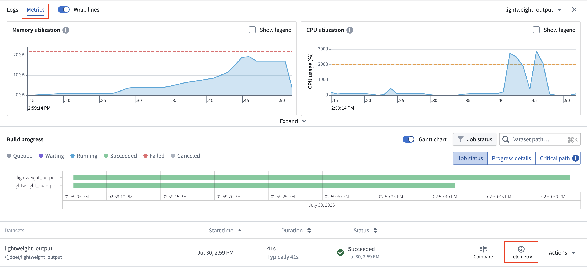
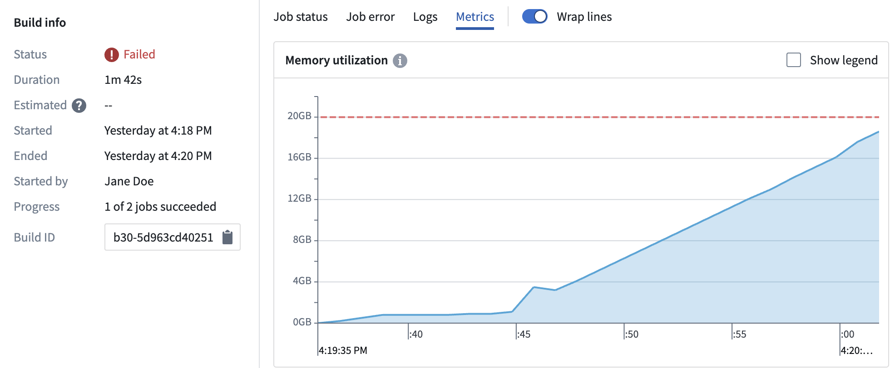
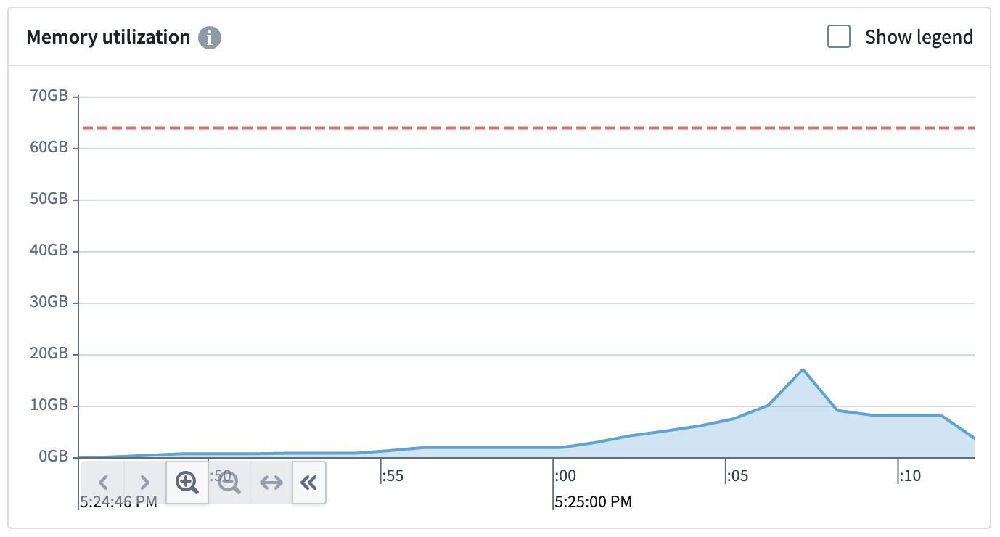
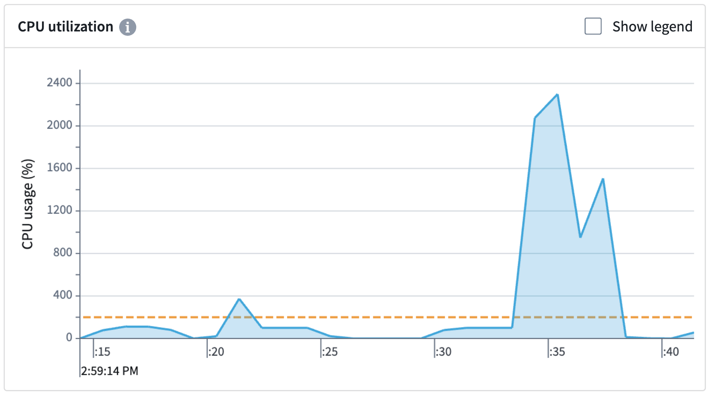

<!-- source: https://palantir.com/docs/foundry/transforms-python/metrics/ · mirrored 2026-08-14 from Palantir Foundry docs -->

# Metrics

Use the **Metrics** telemetry tab to debug and monitor your builds.

## Access metrics

Follow the steps below to view metric details. Note that the **Metrics** tab will only display if the job has emitted metrics.

1. **View the build report:**
   * From a [Dataset Preview](/docs/foundry/dataset-preview/overview/) or from [Data Lineage](/docs/foundry/data-lineage/overview/), select the **History** tab, select an individual build from the list, then select **View build report**.
   * Select a build from the list of [all builds](/docs/foundry/data-integration/application-reference/#builds).
2. **Select a job:** A build consists of one or more jobs, which are visible in the list below the Gantt chart. Choose a job from the list, select the **Telemetry** option, and select the **Metrics** tab to see metrics emitted by the build container plotted on time-series charts.

## Memory utilization

The **Memory utilization** graph shows your build's memory usage. The red dashed line signifies the memory limit requested from the build. Any build that exceeds this will cause the container to throw an out-of-memory (OOM) error.

The following example shows a build that has thrown an OOM error, which means that the build is memory-bound. Memory usage rises, and eventually leads to an OOM. If you encounter an OOM error, [increase the container's memory limits](/docs/foundry/transforms-python/configure-resources/) by setting container memory to 32 GB or another appropriate value.

The example below shows a build that underutilizes the requested memory. This build does not come close to reaching memory limits, so [setting the memory request](/docs/foundry/transforms-python/configure-resources/) to 32 GB would reduce resource consumption for this particular build.

## CPU utilization

The **CPU utilization** graph shows your build's CPU usage. The orange dashed line shows your build's requested CPUs. [Two cores are requested by default](/docs/foundry/transforms-python/configure-resources/). The build scheduler will wait until it can allocate your job on a host that has sufficient cores available to fill your request. Any extra unused cores on the host will automatically be provisioned to help run the build.

In the example above, two CPUs were requested, but 22 were used to help speed up the build. Be aware that the host is not guaranteed to always have additional CPUs to allocate during the build.

| Request | Result |
|-----------------------------|-------------------|
| `1 CPU core` | Builds will start up faster as the scheduler will be able to find free hosts easier. Build times may be inconsistent as available CPU resources may vary. |
| `8 CPU cores` | Builds will take longer on average to start as the scheduler may struggle to find hosts with free cores. Build times may be more consistent as 8-core availability will be guaranteed during the build. |
