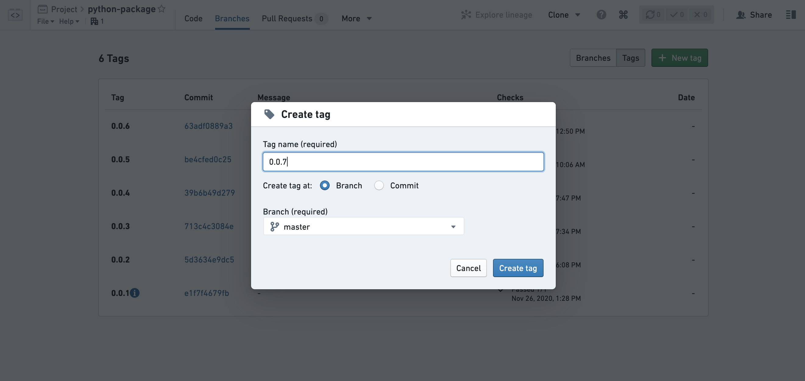
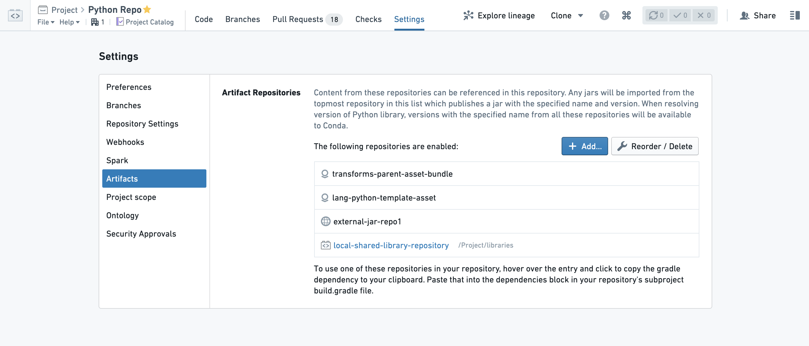

<!-- source: https://palantir.com/docs/foundry/transforms-python/share-python-libraries/ · mirrored 2026-08-14 from Palantir Foundry docs -->

# Share Python libraries

The recommended workflow for sharing code across multiple Python transforms repositories is publishing a Python library package—specifically, a [Conda ↗](https://conda.io/docs/) library. Publishing Python libraries is supported in Python transforms repositories with version 1.23.1 and higher.

## Publish a Python library

Here are the required steps for publishing a Python library:

1. **Create a new repository** that will contain the Python code for your shared library.

2. **Name your repository.** Your library will be named after the repository name when initialized. Other code repositories will use this name to discover and use your library. You can rename it later by accessing the `gradle.properties` file and editing the `condaPackageName` parameter (this file is hidden, so you may need to select "Show hidden files" in the file editor first).

:::callout{title="Library naming"}
Note that the `condaPackageName` can only contain ASCII lowercase letters, numbers, or hyphens. Any sequence of non-alphanumeric/non-hyphen characters will be replaced by a single hyphen (for example `my_library repo` will be published as `my-library-repo`, and `Foobar _baz$$$` will be published as `foobar-baz-`).
:::

3. Select the **Create** button in the **Python Library** template section.

4. **Create a package:** Any folder in your library containing an `__init__.py` file will be published as a package. Your repository will be initialized with such a folder - rename it and add additional packages if needed.

5. **Create modules:** Within your package folder, you can add Python files that contain your code. These modules will later be imported by other repositories.

6. **Tag your repository:** When you are ready to make a release, navigate to the "Branches" tab, select "Tags" and create a new tag. By default, your Python library will only get published for commits that are tagged. To change this default behavior, you must modify the `build.gradle` file.

:::callout{theme="warning" title="Warning"}
Note that tag names must conform to SLS versioning, as specified in the [SLS Versions documentation ↗](https://github.com/palantir/sls-version-java).
:::

7. Your library version will be published once the checks finish successfully. You can view the status of checks in the Tags list and in the Checks tab of your repository.

:::callout{theme="neutral"}
By default, changes to your library will only be published when you create a tag. You can create a tag for the current state of one of your branches, or for a specific commit. Once checks pass your library will be published and users will be able to upgrade to the newest version.
:::

:::callout{theme="neutral"}
Consuming repositories do not automatically upgrade to use the newest version when a new version is published.
To manually upgrade your repository to use the newest version, see the documentation on [discovering and using Python libraries](/docs/foundry/transforms-python/use-python-libraries/) and on [Conda lock files](/docs/foundry/transforms-python/use-python-libraries/#conda-lock-files) for re-resolving the Conda environment.
:::

8. Ensure that you give permissions to your library consumers. By default, users should have "Viewer" role on your shared repository. Add a reference to the library repository under the transform repository settings Artifacts tab.

Your library at this point should be available for other apps and repositories to consume. Read more about [discovering and using Python packages](/docs/foundry/transforms-python/use-python-libraries/).

## Find consumers of a Python library

To see which repositories are consuming your published library, navigate to the [Artifact Repositories interface](/docs/foundry/code-repositories/publish-artifact/#find-consumers-of-a-conda-artifact) and use the **Search** tab to locate your library. Find the version you are interested in and expand the **Downloads** column to view the **\</> Consumers** section.
