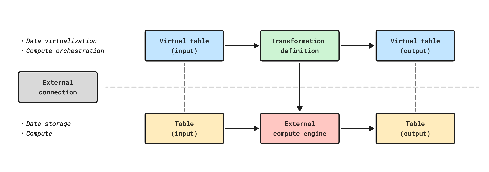

<!-- source: https://palantir.com/docs/foundry/transforms-python/tables-compute-pushdown/ · mirrored 2026-08-14 from Palantir Foundry docs -->

# Compute pushdown

Tables backed by a [BigQuery](/docs/foundry/available-connectors/bigquery/), [Databricks](/docs/foundry/available-connectors/databricks/), or [Snowflake](/docs/foundry/available-connectors/snowflake/) connection can push Foundry authored transforms to BigQuery, Databricks, or Snowflake. This is known as "compute pushdown", and allows Foundry's pipeline management, data lineage, and security functionality to be used on top of data warehouse compute. Use [virtual table](/docs/foundry/data-integration/virtual-tables/) inputs and outputs to push down compute.

For more information and code examples, refer to the following source-specific compute pushdown documentation:

* [BigQuery compute pushdown](/docs/foundry/transforms-python/tables-bigquery/)
* [Databricks compute pushdown](/docs/foundry/transforms-python/tables-databricks/)
* [Snowflake compute pushdown](/docs/foundry/transforms-python/tables-snowflake/)
