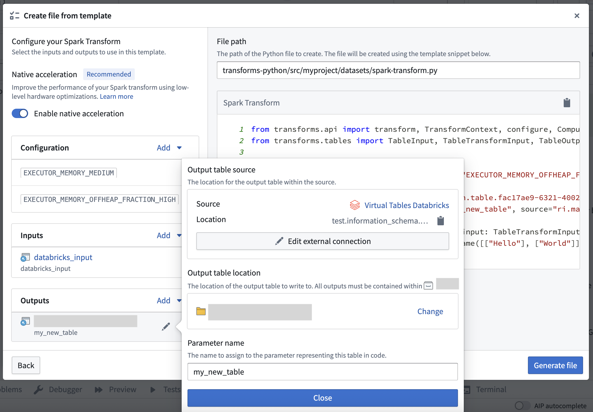

<!-- source: https://palantir.com/docs/foundry/transforms-python/tables-overview/ · mirrored 2026-08-14 from Palantir Foundry docs -->

# Python transforms on virtual tables

[Virtual tables](/docs/foundry/data-integration/virtual-tables/) allow you to query and write to tables in supported data platforms without storing the data in Foundry. You can interact with virtual tables in Python transforms using the `transforms-tables` library.

Foundry supports two compute modes on virtual tables:

1. **Foundry-native Spark compute:** This can be used with virtual table inputs or outputs from one or multiple sources, and composed together with Foundry-native dataset inputs and outputs. Note that virtual tables do not support [lightweight compute engines](/docs/foundry/transforms-python/compute-engines/) such as Polars and Pandas in Foundry.
2. **Compute pushdown:** In this mode, through lightweight, Foundry orchestrates external compute in the source system. In order to use compute pushdown, all inputs and outputs must be virtual tables associated with the same source, and the source must be compute pushdown compatible.

:::callout{theme="neutral"}
Incremental computation using the `@incremental` decorator is not currently supported when using compute pushdown.
:::

## Prerequisites

To use virtual tables in a Python transform, you must:

1. [Upgrade your Python repository](/docs/foundry/code-repositories/repository-upgrades/) to the latest version.
2. Install `transforms-tables` from the [Libraries tab](/docs/foundry/transforms-python/use-python-libraries/).

:::callout{theme="warning"}
Transforms that use the `use_external_systems` decorator are not compatible with virtual tables. Switch to [source-based external transforms](/docs/foundry/data-connection/external-transforms/) or split your transform into multiple transforms, one that uses virtual tables and one that uses the `use_external_systems` decorator.
:::

When virtual tables are used in Code Repositories, the transforms consuming them will automatically obtain network egress based on the [egress policies](/docs/foundry/data-connection/set-up-direct-connection/#configure-a-network-policy) configured on the source.

The following settings must be enabled on the source:

* **Code imports:** This allows the source to be imported and used in a code repository. More information on this setting can be found in the documentation on [importing a source into code](/docs/foundry/data-connection/external-transforms/#prerequisite-import-a-source-into-code).
* **Export controls:** This controls which [security markings](/docs/foundry/security/markings/) and organizations will be allowed on inputs to a Python transform using a virtual table. Review the documentation on [configuring export controls on the source](/docs/foundry/data-connection/external-transforms/#configure-export-controls-on-the-source) for more information.

:::callout{theme="neutral"}
Tables used as inputs and outputs in a Python transform do not need to come from the same source, or even the same platform. By default, Python transforms will use Foundry's compute to read and write tables, which allows querying across different external systems. Refer to the [Compute pushdown](/docs/foundry/transforms-python/tables-compute-pushdown/) section for details on fully federating compute to an external system.
:::

## Quick start examples

:::callout{theme="neutral"}
Remember to import the output source into your repository using the sidebar.
:::

Below is an example using a Snowflake source that takes a virtual table input and generates a virtual table output using Foundry-native Spark compute.

```python
from transforms.api import transform
from transforms.tables import TableInput, TableOutput, TableTransformInput, TableTransformOutput, SnowflakeTable


@transform.spark.using(
    input_table=TableInput('/path/input_table_name'),
    output_table=TableOutput(
        '/path/output_table_name',  # Virtual table output in Foundry
        'ri.magritte..source.123...',  # The output source RID
        SnowflakeTable('DATABASE', 'SCHEMA', 'TABLE'),  # The output storage location
    ),
)
def compute(input_table: TableTransformInput, output_table: TableTransformOutput):
    output_table.write_dataframe(input_table.dataframe())
```

Foundry datasets can also be used in combination with virtual tables. The example below takes a Foundry dataset input and writes a virtual table output to the external source.

```python
from transforms.api import transform, Input, TransformInput
from transforms.tables import TableOutput, TableTransformOutput, SnowflakeTable


@transform.spark.using(
    input_dataset=Input('/path/input_dataset_name'),
    output_table=TableOutput(
        '/path/output_table_name',  # Virtual table output in Foundry
        'ri.magritte..source.123...',  # Output source RID
        SnowflakeTable('DATABASE', 'SCHEMA', 'TABLE'),  # Output storage location
    ),
)
def compute(input_dataset: TransformInput, output_table: TableTransformOutput):
    output_table.write_dataframe(input_dataset.dataframe())
```

Lastly, below is an example with virtual table inputs and outputs using compute pushdown.

```python
from snowflake.snowpark.functions import lit
import snowflake.snowpark as snow
from transforms.api import transform
from transforms.tables import (
    SnowflakeTable,
    TableInput,
    TableOutput,
    SnowflakeInput,
    SnowflakeOutput,
)

@transform.snowflake.using(
    input_table=TableInput('/path/input_table_name'),
    output_table=TableOutput(
        '/path/output_table_name',  # Virtual table output in Foundry
        'ri.magritte..source.123...',  # Output source RID
        SnowflakeTable('DATABASE', 'SCHEMA', 'TABLE'),  # Output storage location
    ),
)
def compute_in_snowflake(input_table: SnowflakeInput, output_table: SnowflakeOutput):

    # Get a Snowpark DataFrame instance
    df: snow.DataFrame = input_table.dataframe()

    # Example data transformation - create a new column
    df = df.with_column("NEW_COLUMN", lit("ABC"))

    # Write back to the new table
    output_table.write(df)
```

## JDBC partitioning

When reading a virtual table data using JDBC connectivity, you can configure partitioning in Python transforms to parallelize the read and improve the performance of loading the table.

Below is an example that adds partitioning when loading `input_table`. This will be based on `column_name` which will be divided into three equal sized partitions between a lower bound of 1 and an upper bound of 100.

```python
@transform(
    input_table=TableInput("/path/input_table_name"),
    output_df=Output("/path/output_dataset_name")
)
def compute(input_table: TableTransformInput, output_df: TransformOutput):
    input_df = input_table.dataframe(
        options={
            "numPartitions": "3",
            "partitionColumn": "column_name",
            "lowerBound": "1",
            "upperBound": "100"
        }
    )

    output_df.write_dataframe(input_df)
```

Partitioning configuration should be passed via the `options` parameter when calling `.dataframe()` to load the virtual table input. `partitionColumn` must be a numeric, date, or timestamp column. The data will be distributed into a number of partitions specified by `numPartitions`. These will be evenly sized ranges between the `lowerBound` and `upperBound` options.

Note that `lowerBound` and `upperBound` are used only to calculate the partition stride, not to filter rows. All rows in the table will be returned, including those with values outside the specified bounds.

For more details about the available partitioning options, see the [Spark JDBC documentation ↗](https://spark.apache.org/docs/latest/sql-data-sources-jdbc.html).

## File template configuration wizard \[Beta]

:::callout{theme="neutral" title="Beta"}
Virtual table outputs in the file template configuration wizard are in the [beta](/docs/foundry/platform-overview/development-life-cycle/) phase of development. Functionality may change during active development.
:::

Virtual table inputs and outputs can be configured in the [Code Repositories file template configuration wizard](/docs/foundry/code-repositories/create-transforms/) using the `virtual table` template variable type. When creating virtual table outputs, the wizard will walk you through selecting an output [source](/docs/foundry/data-connection/core-concepts/#sources) to write to, along with a Foundry location for the virtual table.


