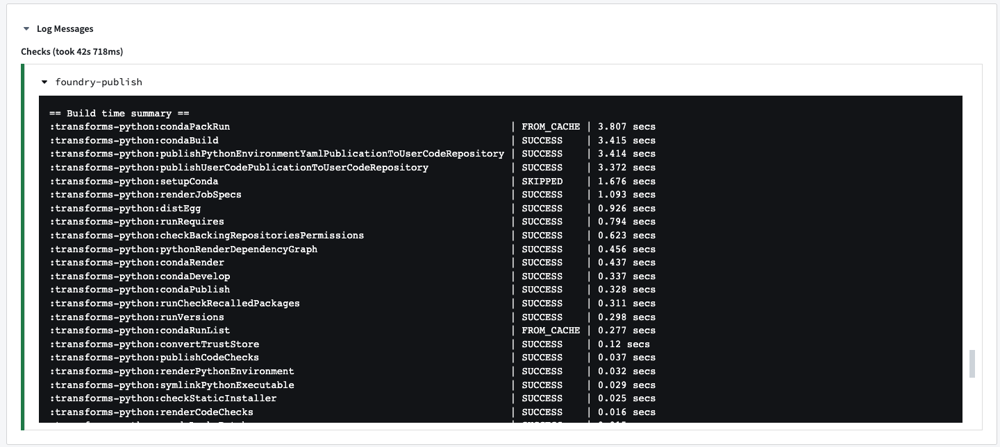
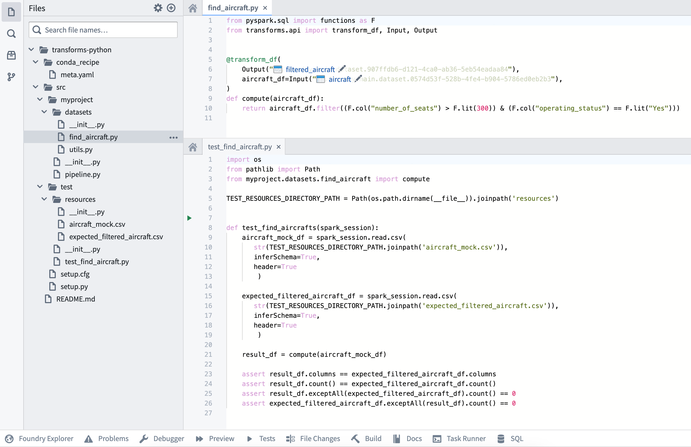
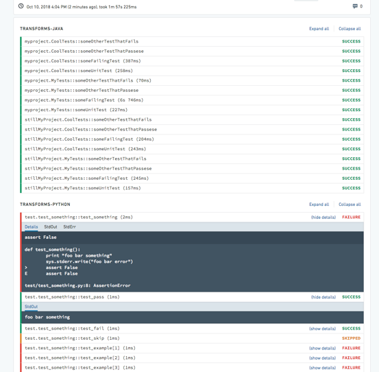
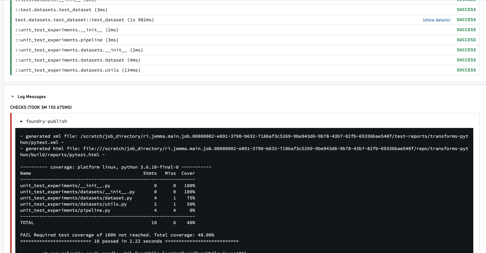

<!-- source: https://palantir.com/docs/foundry/transforms-python/unit-tests/ · mirrored 2026-08-14 from Palantir Foundry docs -->

# Unit tests

:::callout{theme="neutral"}
The Python repository unit tests described on this page are only applicable to batch pipelines, and are not supported for streaming pipelines.
:::

Python repositories have the option of running tests as part of checks. These tests are run using the popular Python testing framework, [pytest ↗](https://docs.pytest.org/).

## CI tasks: condaPackRun

All CI checks contain `condaPackRun`, among other tasks.



The `condaPackRun` task is responsible for installing the environment. Each artifact is retrieved from the proper channel, and conda uses these artifacts to construct the environment.

This task contains the following three stages:

1. Download and extract all packages in the solved environment.
2. Verify package contents. Depending on configuration, conda will either use a checksum or verify that the file size is correct.
3. Link packages into the environment.

Environment specifications are stored as a cache for following builds in the hidden files listed below.

* `conda-version-run.linux-64.lock`
* `conda-version-test.linux-64.lock`

:::callout{theme="neutral"}
The cache is stored for 7 days. It is re-cached if any change happens in the [meta.yaml file](/docs/foundry/transforms-python/use-python-libraries/#the-metayaml-file).

This task is heavily dependent on how many packages are added to the repository. The more packages added, the slower the task will run.
:::

## Enable style checks

PEP8 and Pylint style checks can be enabled by applying the `com.palantir.conda.pep8` and `com.palantir.conda.pylint` Gradle plugins in your Python project's `build.gradle` file. For transforms repositories, this can be found in the Python sub-project. For library repositories, this can be found in the root folder.

Below is an example of a transforms `build.gradle` file:

```gradle
apply plugin: 'com.palantir.transforms.lang.python'
apply plugin: 'com.palantir.transforms.lang.python-defaults'

// Apply the pep8 linting plugin
apply plugin: 'com.palantir.conda.pep8'
apply plugin: 'com.palantir.conda.pylint'
```

Pylint can be configured in the `src/.pylintrc` file in your Python project. For
example, specific messages can be disabled as shown below:

```
[MESSAGES CONTROL]
disable =
    missing-module-docstring,
    missing-function-docstring
```

:::callout{theme="neutral" title="Pylint limitations"}
Not all configurations of Pylint are guaranteed to work in Foundry. If a feature in `src/.pylintrc` is not displayed in checks, this indicates that the feature is not supported.
:::

## Enable tests

Tests can be enabled by applying the `com.palantir.transforms.lang.pytest-defaults` Gradle plugin in your Python project’s `build.gradle` file. For transforms repositories, this can be found in the Python subproject. For library repositories, this can be found in the root folder.

Below is an example of a transforms `build.gradle` file:

```gradle
apply plugin: 'com.palantir.transforms.lang.python'
apply plugin: 'com.palantir.transforms.lang.python-defaults'

// Apply the testing plugin
apply plugin: 'com.palantir.transforms.lang.pytest-defaults'
```

A library `build.gradle` file may look as follows:

```gradle
apply plugin: 'com.palantir.transforms.lang.python-library'
apply plugin: 'com.palantir.transforms.lang.python-library-defaults'

// Apply the testing plugin
apply plugin: 'com.palantir.transforms.lang.pytest-defaults'

// Publish only for tagged releases (zero commits ahead of last git tag)
condaLibraryPublish.onlyIf { versionDetails().commitDistance == 0 }
```

:::callout{theme="neutral"}
Runtime requirements defined in the [meta.yaml](/docs/foundry/transforms-python/project-structure/#metayaml) file will be available in your tests. Additional requirements can also be specified in the [conda test section ↗](https://docs.conda.io/projects/conda-build/en/latest/resources/define-metadata.html#test-section).
:::

## Write tests

Pytest identifies tests in Python files that begin with `test_` or end with `_test.py`. We recommend putting all tests in a `test` package under your project's `src` directory. Tests are Python functions that are named with the `test_` prefix, and contain assertions made using Python’s `assert` statement. Pytest will also run tests written using Python’s built-in [`unittest` ↗](https://docs.python.org/3/library/unittest.html) module. Refer to the [pytest documentation ↗](https://docs.pytest.org/) for detailed information on writing tests.

### Simple test example

The following is an example of a simple test that could be found at `transforms-python/src/test/test_increment.py`. Note that this test is designed to fail for the purposes of this example.

```python
def increment(num):
    return num + 1

def test_increment():
    assert increment(3) == 5
```

Running this test will cause checks to fail with the following message:

```
============================= test session starts =============================
collected 1 item

test_increment.py F                                                       [100%]

================================== FAILURES ===================================
_______________________________ test_increment ________________________________

    def test_increment():
>       assert increment(3) == 5
E       assert 4 == 5
E        +  where 4 = increment(3)

test_increment.py:5: AssertionError
========================== 1 failed in 0.08 seconds ===========================
```

### DataFrame test example

You can also write tests using DataFrames, as shown in the example below:

```python tab="Polars"
import polars as pl

def test_dataframe():
    df = pl.DataFrame(
        [["a", 1], ["b", 2]],
        schema=["letter", "number"],
        orient="row"
    )
    assert df.columns == ['letter', 'number']
```

```python tab="DuckDB"
import duckdb

def test_dataframe():
    conn = duckdb.connect()
    df = conn.sql("""SELECT * FROM VALUES
                    ('a', 1), ('b', 2)
                    AS t(letter, number)""").fetchdf()
    assert list(df.columns) == ['letter', 'number']
```

```python tab="Pandas"
import pandas as pd

def test_dataframe():
    df = pd.DataFrame([['a', 1], ['b', 2]], columns=['letter', 'number'])
    assert list(df.columns) == ['letter', 'number']
```

```python tab="PySpark"
def test_dataframe(spark_session):
    df = spark_session.createDataFrame([['a', 1], ['b', 2]], ['letter', 'number'])
    assert df.schema.names == ['letter', 'number']
```

:::callout{theme="neutral"}
In the Spark example above, note the usage of [Pytest fixtures ↗](https://docs.pytest.org/en/latest/fixture.html#fixture), a powerful feature that enables injecting values into test functions by adding a parameter of the same name. This feature is used to provide a `spark_session` fixture for use in your test function.
:::

## Create test inputs and expected outputs from a CSV

CSV files can be stored in a code repository and used as inputs and expected outputs for testing data transformations. In the example below, we will provide a sample data transformation and demonstrate how CSV files can be used in tests as inputs and expected outputs.

### Example data transform

The following transformation is in a file named `find_aircraft.py` in the `transforms-python/src/myproject/datasets/` folder.

```python tab="Polars"
from transforms.api import transform, Input, Output
import polars as pl


@transform.using(
    output=Output("<output_dataset_rid>"),
    aircraft=Input("<input_dataset_rid>"),
)
def compute(output, aircraft):
    aircraft_df = aircraft.polars()
    filtered_df = aircraft_df.filter(
        (pl.col("number_of_seats") > 300) &
        (pl.col("operating_status") == "Yes")
    )
    output.write_table(filtered_df)
```

```python tab="DuckDB"
from transforms.api import transform, Input, Output


@transform.using(
    output=Output("<output_dataset_rid>"),
    aircraft=Input("<input_dataset_rid>"),
)
def compute(ctx, output, aircraft):
    conn = ctx.duckdb().conn
    filtered_query = conn.sql("""
        SELECT * FROM aircraft
        WHERE number_of_seats > 300
        AND operating_status = 'Yes'
    """)
    output.write_table(filtered_query)
```

```python tab="Pandas"
from transforms.api import transform, Input, Output
import pandas as pd


@transform.using(
    output=Output("<output_dataset_rid>"),
    aircraft=Input("<input_dataset_rid>"),
)
def compute(output, aircraft):
    aircraft_df = aircraft.pandas()
    filtered_df = aircraft_df[
        (aircraft_df["number_of_seats"] > 300) &
        (aircraft_df["operating_status"] == "Yes")
    ]
    output.write_table(filtered_df)
```

```python tab="PySpark"
from pyspark.sql import functions as F
from transforms.api import transform, Input, Output


@transform.spark.using(
    output=Output("<output_dataset_rid>"),
    aircraft=Input("<input_dataset_rid>"),
)
def compute(output, aircraft):
    aircraft_df = aircraft.dataframe()
    filtered_df = aircraft_df.filter((F.col("number_of_seats") > F.lit(300)) & (F.col("operating_status") == F.lit("Yes")))

    output.write_dataframe(filtered_df)
```

### Example CSV files for validation

The following two CSV files and their respective contents would be in the `transforms-python/src/test/resources/` folder.

Test inputs in `aircraft_mock.csv`:

```csv
tail_number,serial_number,manufacture_year,manufacturer,model,number_of_seats,capacity_in_pounds,operating_status,aircraft_status,acquisition_date,model_type
AAA1,20809,1990,Manufacturer_1,M1-100,1,3500,Yes,Owned,13/8/90,208
BBB1,46970,2013,Manufacturer_2,M2-300,310,108500,No,Owned,10/15/14,777
CCC1,44662,2013,Manufacturer_2,M2-300,310,108500,Yes,Owned,6/23/13,777
DDD1,58340,2014,Manufacturer_3,M3-200,294,100000,Yes,Leased,11/21/13,330
EEE1,58600,2013,Manufacturer_2,M2-300,300,47200,Yes,Leased,12/2/13,777
```

Expected outputs in `expected_filtered_aircraft.csv`:

```text
tail_number,serial_number,manufacture_year,manufacturer,model,number_of_seats,capacity_in_pounds,operating_status,aircraft_status,acquisition_date,model_type
CCC1,44662,2013,Manufacturer_2,M2-300,310,108500,Yes,Owned,6/23/13,777
```

### Example test with validation against CSV files

The following test is in a file named `test_find_aircraft.py` in the `transforms-python/src/test/` folder.

:::callout{theme="neutral"}
Note the use of [MagicMock ↗](https://docs.python.org/3/library/unittest.mock.html) to intercept and capture the data that our transformation function writes to its output. This allows us to inspect and verify the results directly in our test without actually writing data to the output dataset. This approach keeps our test isolated and lets us test what *would* be written, without side effects on our data.
:::

```python tab="Polars"
import os
from pathlib import Path
import polars as pl
from polars.testing import assert_frame_equal
from unittest.mock import MagicMock, patch
from myproject.datasets.find_aircraft import compute

TEST_RESOURCES_DIRECTORY_PATH = Path(os.path.dirname(__file__)).joinpath('resources')


def test_find_aircrafts():
    aircraft_mock_df = pl.read_csv(TEST_RESOURCES_DIRECTORY_PATH / 'aircraft_mock.csv')
    expected_filtered_aircraft_df = pl.read_csv(TEST_RESOURCES_DIRECTORY_PATH / 'expected_filtered_aircraft.csv')

    # Creating mock objects for inputs and outputs
    results_output_mock = MagicMock()
    aircraft_mock_input = MagicMock()
    aircraft_mock_input.polars = MagicMock(return_value=aircraft_mock_df)
    aircraft_mock_input.read_table = MagicMock(return_value=aircraft_mock_df)

    # Mock datasets io
    datasets = {"results_output": results_output_mock, "aircraft_input": aircraft_mock_input}
    module = MagicMock()
    with patch.dict("sys.modules", {"foundry": MagicMock(), "foundry.transforms": module}):
        module.Dataset.get.side_effect = datasets.get
        compute()

    result_df = results_output_mock.write_polars.call_args[0][0]

    assert result_df.columns == expected_filtered_aircraft_df.columns
    assert result_df.height == expected_filtered_aircraft_df.height

    result_sorted = result_df.sort(result_df.columns)
    expected_sorted = expected_filtered_aircraft_df.sort(expected_filtered_aircraft_df.columns)
    assert_frame_equal(result_sorted, expected_sorted)
```

```python tab="DuckDB"
import os
from pathlib import Path
import duckdb
import pandas as pd
from unittest.mock import MagicMock, patch
from myproject.datasets.find_aircraft import compute

TEST_RESOURCES_DIRECTORY_PATH = Path(os.path.dirname(__file__)).joinpath('resources')


def test_find_aircrafts():
    conn = duckdb.connect()

    # Load CSV data using DuckDB
    aircraft_mock_df = conn.sql(f"SELECT * FROM read_csv('{TEST_RESOURCES_DIRECTORY_PATH / 'aircraft_mock.csv'}', header=true)").fetchdf()
    expected_filtered_aircraft_df = conn.sql(f"SELECT * FROM read_csv('{TEST_RESOURCES_DIRECTORY_PATH / 'expected_filtered_aircraft.csv'}', header=true)").fetchdf()

    # Creating mock objects for inputs and outputs
    results_output_mock = MagicMock()
    aircraft_mock_input = MagicMock()

    # Create mock context with DuckDB connection
    ctx_mock = MagicMock()
    duckdb_mock = MagicMock()
    duckdb_mock.conn = conn
    ctx_mock.duckdb = MagicMock(return_value=duckdb_mock)

    # Register the test data in DuckDB connection
    conn.register('aircraft', aircraft_mock_df)

    # Mock datasets io
    datasets = {"results_output": results_output_mock, "aircraft_input": aircraft_mock_input}
    module = MagicMock()
    with patch.dict("sys.modules", {"foundry": MagicMock(), "foundry.transforms": module}):
        module.Dataset.get.side_effect = datasets.get
        compute(ctx_mock, results_output_mock, aircraft_mock_input)

    # Get the result from the mocked write_table call
    result_query = results_output_mock.write_table.call_args[0][0]
    result_df = result_query.fetchdf()

    assert list(result_df.columns) == list(expected_filtered_aircraft_df.columns)
    assert len(result_df) == len(expected_filtered_aircraft_df)
    pd.testing.assert_frame_equal(
        result_df.sort_values(by=list(result_df.columns)).reset_index(drop=True),
        expected_filtered_aircraft_df.sort_values(by=list(expected_filtered_aircraft_df.columns)).reset_index(drop=True),
        check_dtype=False
    )
```

```python tab="Pandas"
import os
from pathlib import Path
import pandas as pd
from myproject.datasets.find_aircraft import compute

TEST_RESOURCES_DIRECTORY_PATH = Path(os.path.dirname(__file__)).joinpath('resources')


def test_find_aircrafts():
    aircraft_mock_df = pd.read_csv(TEST_RESOURCES_DIRECTORY_PATH / 'aircraft_mock.csv')
    expected_filtered_aircraft_df = pd.read_csv(TEST_RESOURCES_DIRECTORY_PATH / 'expected_filtered_aircraft.csv')

    # Creating mock objects for inputs and outputs
    results_output_mock = MagicMock()
    aircraft_mock_input = MagicMock()
    aircraft_mock_input.pandas = MagicMock(return_value=aircraft_mock_df)
    aircraft_mock_input.read_table = MagicMock(return_value=aircraft_mock_df)

    # Mock datasets io
    datasets = {"results_output": results_output_mock, "aircraft_input": aircraft_mock_input}
    module = MagicMock()
    with patch.dict("sys.modules", {"foundry": MagicMock(), "foundry.transforms": module}):
        module.Dataset.get.side_effect = datasets.get
        compute()

    result_df = results_output_mock.write_pandas.call_args[0][0]

    assert list(result_df.columns) == list(expected_filtered_aircraft_df.columns)
    assert len(result_df) == len(expected_filtered_aircraft_df)
    pd.testing.assert_frame_equal(
        result_df.sort_values(by=list(result_df.columns)).reset_index(drop=True),
        expected_filtered_aircraft_df.sort_values(by=list(expected_filtered_aircraft_df.columns)).reset_index(drop=True),
        check_dtype=False
    )
```

```python tab="PySpark"
import os
from pathlib import Path
from unittest.mock import MagicMock
from transforms.api import Input
from myproject.datasets.find_aircraft import compute

TEST_RESOURCES_DIRECTORY_PATH = Path(os.path.dirname(__file__)).joinpath('resources')


def test_find_aircrafts(spark_session):
    aircraft_mock_df = spark_session.read.csv(
       str(TEST_RESOURCES_DIRECTORY_PATH.joinpath('aircraft_mock.csv')),
       inferSchema=True,
       header=True
        )

    expected_filtered_aircraft_df = spark_session.read.csv(
       str(TEST_RESOURCES_DIRECTORY_PATH.joinpath('expected_filtered_aircraft.csv')),
       inferSchema=True,
       header=True
        )

    # Create a mock object for the output
    results_output_mock = MagicMock()

    # Create a wrapper for the input and configure the returned dataset
    aircraft_mock_input = Input()
    aircraft_mock_input.dataframe = MagicMock(return_value=aircraft_mock_df)

    # Run the transformation with the mock output object
    compute(
        results_output=results_output_mock,
        aircraft_input=aircraft_mock_input
    )

    # Intercept the arguments that write_dataframe was called with,
    # and extract the DataFrame that was sent to be written as a result of the transformation
    args, kwargs = results_output_mock.write_dataframe.call_args
    result_df = args[0]

    assert result_df.columns == expected_filtered_aircraft_df.columns
    assert result_df.count() == expected_filtered_aircraft_df.count()
    assert result_df.exceptAll(expected_filtered_aircraft_df).count() == 0
    assert expected_filtered_aircraft_df.exceptAll(result_df).count() == 0
```

The final repository structure should be as follows:



The test should be in the `transforms-python/src/test/test_find_aircraft.py` file, and the CSV resources containing the inputs and expected outputs should be in the `transforms-python/src/test/resources` folder.

## View test output

The output of configured tests will be displayed in the **Checks** tab with a separate output for each test. Test results will be collapsed by default, with the status `PASSED`, `FAILED`, or `SKIPPED`. Expanding each test or all tests will display the test output as well as the `StdOut` and `StdErr` logs.



## Test coverage

[Pytest coverage ↗](https://pytest-cov.readthedocs.io/en/latest/) can be used to compute coverage and enforce a minimum percentage on your repository.

To do so, add the following to the repository's `meta.yml` file.

```yaml
test:
  requires:
    - pytest-cov
```

Create a `pytest.ini` file at `/transforms-python/src/pytest.ini` with the following contents:

```ini
[pytest]
addopts = --cov=<<package name, e.g. myproject>> --cov-report term --cov-fail-under=100
```

:::callout{theme="neutral"}
The coverage required to fail checks is customizable. Select a percentage for the `--cov-fail-under` argument.
:::

Running tests that result in coverage less than the prescribed amount will now fail with this output:



## Parallelize tests

By default, pytest runs tests sequentially. To speed up test runs, you can send tests to multiple CPUs.

Edit the transforms `build.gradle` file and set `numProcesses` to the number of processes that should be used.

```gradle
apply plugin: 'com.palantir.transforms.lang.python'
apply plugin: 'com.palantir.transforms.lang.python-defaults'

// Apply the testing plugin
apply plugin: 'com.palantir.transforms.lang.pytest-defaults'

tasks.pytest {
    numProcesses "3"
}
```

Test parallelization is run using the [pytest-xdist ↗](https://github.com/pytest-dev/pytest-xdist) testing plugin.

:::callout{theme="neutral"}
Parallelizing tests involves sending pending tests to any available workers, without guaranteed orders. Any tests that require global/shared state and anticipate changes being made by other preceding tests should be adjusted accordingly.
:::

## Additional notes

1. After enabling tests, you should see the `:transforms-python:pytest` task running in the CI logs when you commit.
2. Tests are discovered based on the `test_` prefix at the beginning of both the file and function names. This is a pytest convention.
3. A quick way to get example records is to open a dataset in the [Code Workbook console](/docs/foundry/code-workbook/workbooks-console/) and call `.collect()`.
4. To obtain a Python-formatted schema, open the dataset preview, then open the **Columns** tab and select **Copy > Copy PySpark Schema**.

## Spark-specific test guidance

Below is some additional information that is relevant when using Foundry's Spark compute engine.

### Enable the Spark anti-pattern plugin

The Spark anti-pattern linter can be enabled by applying the `com.palantir.transforms.lang.antipattern-linter` Gradle plugin in your Python project's `build.gradle` file.

```gradle
// Apply the anti-pattern linter
apply plugin: 'com.palantir.transforms.lang.antipattern-linter'
```

The Spark anti-pattern plugin will warn against the usage of common anti-patterns in Spark such as correctness issues, poor Spark performance, and security implications.
