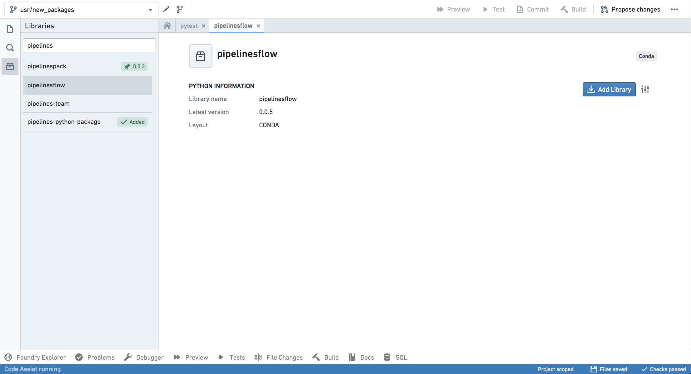
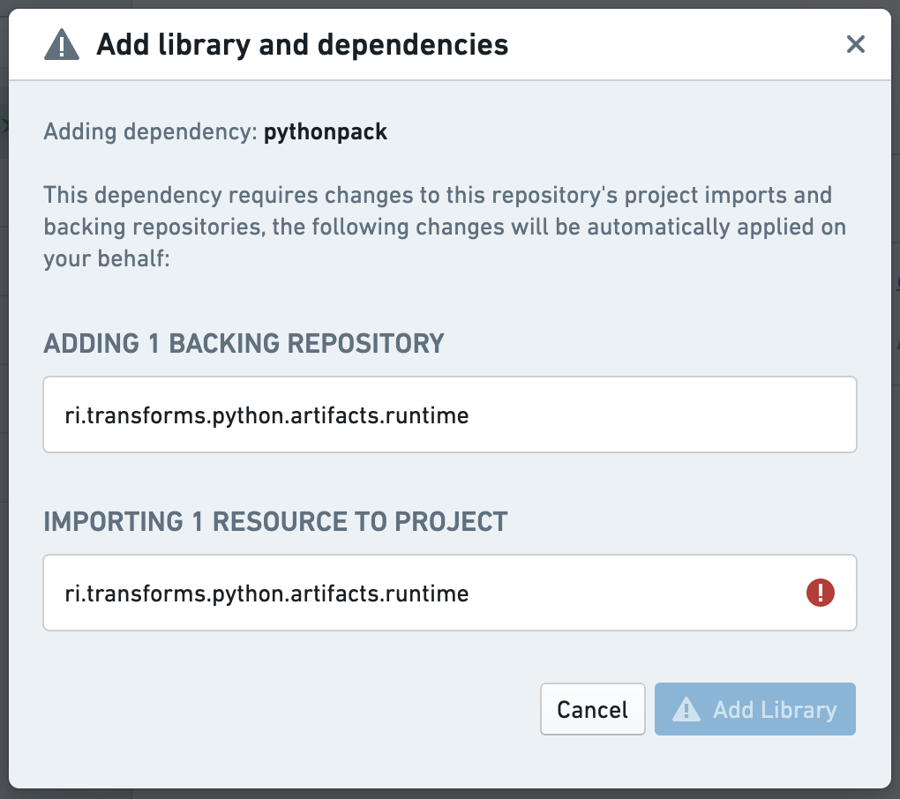
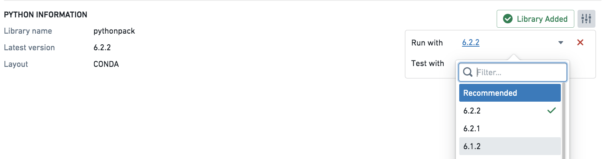
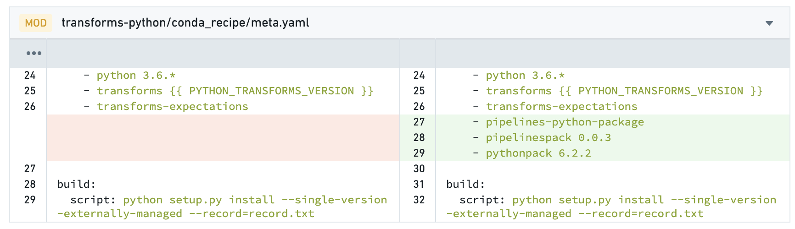
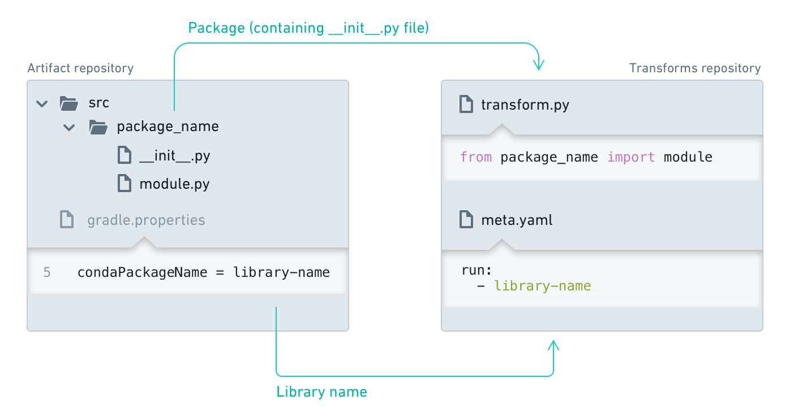

<!-- source: https://palantir.com/docs/foundry/transforms-python/use-python-libraries/ · mirrored 2026-08-14 from Palantir Foundry docs -->

# Discover and use Python libraries

Code Repositories allow you to import and use public libraries as well as Foundry-generated libraries. The information below only applies to **Python** libraries.

## Discover Python libraries

To search for Python libraries, click on the package tab on the left panel of your Code Repository environment. Use the search box to search for available libraries.

Click on the library name to expose the library details and the option to **Add Library**, which adds the recommended version of the library to your branch.



Once you add your library, Code Assist dependencies will be refreshed and you will be able to import modules from packages available in the library.

### Adding exceptional dependencies

Adding Python libraries will sometimes require essential artifact repositories to be added to your code repository and to be referenced in the Project. In this case, a dialog will appear requesting you to confirm this action.

The dependencies dialog will highlight any required repositories to which you don't have access. You will need to have access to these repositories to use the library.



Code Repositories will attempt to find available backing repositories for your library and automatically use them. In cases where you require a specific backing repository, you can set it directly in the repository's [Artifact Settings](/docs/foundry/code-repositories/artifact-settings/) page.

### Pinning specific library versions

If you require a specific version, you can *pin* it by clicking on the settings button and selecting the required version from the list. This lets you set different versions with which to run your transform and tests.

Note that after pinning a specific version of a library, it will be added to your `meta.yaml` file but it will not be installed using Task Runner. Verify that checks pass successfully and then restart Code Assist to apply the changes to your `meta.yaml` file. You can then begin using the selected version of the library in your repository.

:::callout{theme="warning" title="Warning"}
Be mindful when pinning specific versions. Having a pinned version can prevent your code from getting important updates. Always make sure you review and update your dependencies.
:::



### Reviewing library changes

The actions of adding and removing Python libraries from your repository behave like any other code change. You should commit your changes and merge them to protected branches. In pull requests, library changes will appear as changes in the `meta.yaml` file.

:::callout{theme="neutral"}
Occasionally, when you create a pull request you will see merge conflicts on files of type `.lock`. This happens when updates occur while you are working on your branch. In this case, accept both changes and proceed with your pull request.
:::



## Using libraries published to the shared channel \[Deprecated]

:::callout{theme="warning" title="Warning"}
This is a deprecated feature and may not be available in your environment.
:::

If your library is published to the shared channel (see [Publishing a Python Library](/docs/foundry/transforms-python/share-python-libraries/#publish-a-python-library)), you must edit the Python subproject's `build.gradle`. You will be modifying *hidden* files, so make sure to select "Show hidden files" before moving on. Your Python transforms project needs to have access to the channel where your shared library is published. In the `build.gradle` file in your Python transforms subproject folder, add the following:

```gradle
 transformsPython {
     sharedChannels  "libs"
}
```

:::callout
You must edit the `build.gradle` file that is in your Python subproject folder rather than the one at the root of your repository. Make sure to add to the end of the file so that `apply plugin:` has been executed before and processes it correctly.
:::

## Artifact repositories settings

:::callout{theme="neutral"}
Normally, there is no need to access the repository settings when working with Python libraries. The required artifact repositories will be added automatically when you add Python packages. You should avoid editing the list of referenced python repositories directly in the settings tab.
:::

When using shared libraries, a reference to the relevant repository is added to the Project. You can view the list of referenced repositories by accessing the "Artifacts" section of the repository settings tab.

If you added your shared library dependency manually and not via the artifacts package search, you will have to add the library repository to the backing repositories of your consuming repository via artifacts settings. Note that this is discouraged, as the package search will do this operation for you.

## Task Runner

:::callout{theme="neutral"}
Task Runner is only available on newer repositories. You can check the version of your repository by showing the hidden files and checking the `templateConfig.json` file.

* If your repository has a `parentTemplateId` that is `transforms`, ensure that `parentTemplateVersion` is on 8.220.0 or higher, and the Python child template is on 1.484.0 or higher.
* If your repository has a `parentTemplateId` that is `python-library`, ensure that `parentTemplateVersion` is on `1.497.0` or higher.

You can [upgrade your repository](/docs/foundry/code-repositories/repository-upgrades/#manual-branch-upgrade) to enable this feature.
:::

When the Task Runner is enabled, adding a package from the **Libraries** tab in the left panel will no longer provision a new Code Assist workspace, and will instead begin installing the package requested on top of your current environment as it sends back all the logs from the underlying process.

If the installation was successful, the lockfile will be updated with the new environment. If the installation was unsuccessful, an error message will be presented in the Task Runner bottom panel which can be used to dig further into the issue.

Task Runner will only update the `run` environment, and currently does not support installing test-only dependencies.

## Advanced settings

:::callout{theme="warning" title="Warning"}
The information below is aimed for administrators and advanced users only.
:::

### The `meta.yaml` file

:::callout{theme="warning" title="Warning"}
You should avoid editing the `meta.yaml` file, since this is prone to errors. Instead, bias towards adding libraries via the library search interface.
:::

For a Python library to be used in a code repository, it must be included in the `conda_recipe/meta.yaml` file. This occurs automatically when adding a library through the repository library search interface.

```yaml
requirements:
...
run:
    - python
    ...
    - {LIBRARY NAME} # Replace this with the name of your shared library.
```

After adding the library, click on "Refresh dependencies" at the top of the [meta.yaml](/docs/foundry/transforms-python/project-structure/#metayaml) file. This will ensure that Code Assist is updated with new dependencies, allowing you to proceed with importing the modules from available packages.

See more information on [meta.yaml file](/docs/foundry/transforms-python/project-structure/#metayaml).



#### Conda resolution of Python packages

Conda is an open-source language-agnostic package and environment manager and is used in Code Repositories to resolve package dependencies and install sets of packages into independent environments. For more information, consult the [official Conda documentation ↗](https://docs.conda.io/en/latest/) or the [Introduction to Environment Creation](/docs/foundry/transforms-python/environment-creation-overview/).

#### Conda lock files

When checks are run in Code Repositories, we resolve the Conda environment for the list of packages stated in the `meta.yaml` file and produce hidden Conda lock files with the `.lock` extension; these lock files save the Conda environment. This pre-resolved environment makes Conda resolution faster for subsequent checks when you commit your code.

We re-resolve the Conda environment and write new lock files in the following cases:

* There has been a change to the list of packages in the `meta.yaml` file.
* The repository has upgraded to a newer template version.
* A recalled package was found in your lock file.
* The hidden Conda lock files have been deleted or edited.

When we re-resolve the environment and write new lock files, the initial commit hash is `SUPERSEDED` followed by another commit hash, which re-writes the lock files. Checks may take longer to run when we need to re-resolve the environment.

### Downloading a published Python library outside of the platform

It is possible to download a [library published within Palantir Foundry](/docs/foundry/transforms-python/share-python-libraries/), from outside Foundry:

1. **Obtain a user token**. In Foundry, navigate to your user account settings and select **Tokens**. Select **Create token**, input a name and a description for your token, and select **Generate**. Copy your token.

:::callout{theme="warning" title="Warning"}
Do not share your token with other applications or users; a malicious actor could use it to impersonate you.
:::

2. **Find the `<identifier>` of your Python library**. Navigate to the Code Repository of the Python library of interest. The browser URL should now have a similar form to: `https://<my-foundry-url>/workspace/data-integration/code/repos/<identifier>/contents/refs%2Fheads%2F<branch>`. In the URL, locate the `<identifier>`, which looks like `ri.stemma.main.repository.XXXXXXXX-XXXX-XXXX-XXXX-XXXXXXXXXXXX`.
3. **Obtain the index of packages of the library**. Open a terminal on your local machine and run the following command:
   `curl -H "Authorization: Bearer $TOKEN" https://$STACK_URL/artifacts/api/repositories/$IDENTIFIER/contents/release/conda/$PLATFORM/repodata.json`
   where `$TOKEN` is your user token, `$STACK_URL` is the same as the `<stack-url>` in the previous step, `$IDENTIFIER` is the `<identifier>` from the previous step, and `$PLATFORM` is the repository platform (e.g. `noarch`, `linux-64`). The output of the above command is an index for the contents of the library (that is, the packages it has). Each package has the form `<name>-<version>-<build-string>.tar.bz2`.
4. **Download a specific package**. You can download a particular package from the Python library by running in your terminal:
   `curl -H "Authorization: Bearer $TOKEN" https://$STACK_URL/artifacts/api/repositories/$IDENTIFIER/contents/release/conda/$PLATFORM/$PACKAGE` where `$PLATFORM` is the package platform (e.g. `noarch`, `linux-64`) and `$PACKAGE` is of the form `<name>-<version>-<build-string>.tar.bz2`.

### Run tasks in the Task Runner

You can manually trigger package installations from the Task Runner by manually specifying the command.

For example, to install `pandas`, select the **Task Runner** tab in the bottom panel, then input the following command:

```
install --packageSpecs=pandas
```

Task Runner also supports the following commands:

* `uninstall`: Uninstalls packages from the run environment.
  * Note: This command will also uninstall any package that depends on the specified package. This command is only available on newer repositories. If your repository has a `parentTemplateId` that is `transforms`, ensure that the Python child template is on `1.525.0` or higher. Similarly, if your repository has a `parentTemplateId` that is `python-library`, ensure that `parentTemplateVersion` is on `1.525.0` or higher.
  * Usage: `uninstall --packageSpecs=<eg.numpy>` for Conda packages.
* `formatCode`: Formats the files in the repository. Uses *Black* to format the code and `pyproject.toml` for custom formatter configuration. See [the *Black* formatter configuration file documentation ↗](https://black.readthedocs.io/en/stable/usage_and_configuration/the_basics.html#configuration-via-a-file) for more information.
* `whoneeds`: Shows the tree of packages that require the installation of a package in the current run environment.
  * Note: This command is only available on newer repositories. If your repository has a `parentTemplateId` that is `transforms`, ensure that the Python child template is on `1.522.0` or higher. Similarly, if your repository has a `parentTemplateId` that is `python-library`, ensure that `parentTemplateVersion` is on `1.522.0` or higher.
  * Usage: `whoneeds --packageSpec=<eg.transforms>`
* `tasks`: Lists all the available tasks to run.
